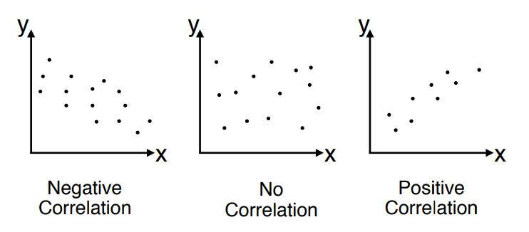
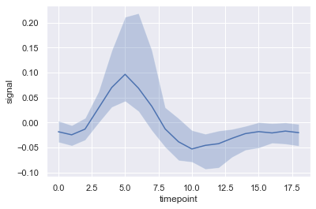

# Data Preprocessing

- 剛拿到手的資料會出現雜訊，缺失，髒亂等現象，我們需要對資料進行清洗與加工，從而方便進行後續的工作。

- 主要會分成以下幾個步驟
  1. Explore Data Analysis: 檢查欄位型態與資料內容，確認資料中是否存在離群值與遺漏值DA
  2. 資料清理: 遺漏值填補、離群資料處理。
  3. 特徵轉換: 離散化、常態化...等等
  4. 資料縮減: 挑選建模特徵、維度縮減...等等

## Explore Data Analysis

- 初步透過視覺化/統計⼯具進⾏分析，達到三個主要⽬的

  - 了解資料：獲取資料所包含的資訊、結構和特點
  - 發現 outliers 或異常數值：檢查資料是否有誤
  - 分析各變數間的關聯性：找出(對於預測目標變數有幫助的)重要變數

- 從 EDA 的過程中觀察現象，檢查資料是否符合分析前的假設

  - 可以在模型建立之前，先發現潛在的錯誤
  - 也可以根據 EDA 的結果來調整分析的⽅向


### 資料類型

- 實際上資料可以分為類別、順序、等距與等比這四種測量尺度，但實務上通常會將順序、等距與等比的資料都視為數值資料。

- 測量尺度

  - 類別變數(nominal): 如國家、縣市...等等。
  - 順序尺度(ordinal)：如滿意度分數
  - 等距尺度(interval):沒有絕對的0，如溫度
  - 等比尺度(ratio)：0 表示沒有，如收入、身高、體重。

- 其他類型特徵

  - **時間型特徵**

    - 時間型特徵最常⽤的是特徵分解 - 拆解成年/⽉/⽇/時/分/秒的分類值

    - 週期循環特徵是將時間"循環"特性改成特徵⽅式, 設計關鍵在於⾸尾相接, 因此我們需要使⽤ sin /cos 等週期函數轉換

    - 常⾒的週期循環特徵有 - 年週期(季節) / 周周期(例假⽇) / ⽇週期(⽇夜與⽣活作息), 要注意的是最⾼與最低點的設置

    - 雖然時間型特徵可當作數值型特徵或類別型特徵，但都不適合

      - 取總秒數雖可變為數值，但會失去週期性 (ex ⽉ / 星期)
      - 使⽤本⾝可以當作類別，但會失去排序資訊，類別數量也過⼤

    - 週期循環特徵

      - **年週期：**與春夏秋冬季節溫度相關（正：冷 / 負：熱）

        $cos((月/6 + 日/180) \pi)$

      - **月週期：**與薪⽔、繳費相關

      - **週週期：**與周休、消費習慣相關（正：精神飽滿 / 負：疲倦）

        $sin((星期幾/3.5 + 小時/84) \pi)$

      - **日週期：**與⽣理時鐘相關（正：精神飽滿 / 負：疲倦）

        $sin((小時/12 + 分/720 + 秒/43200) \pi)$

      - 前述的週期所需數值都可由時間欄位組成, 但還⾸尾相接
        因此週期特徵還需以正弦函數( sin )或餘弦函數( cos )加以組合

    - 時段特徵

      - 短暫時段內的事件計數，也可能影響事件發⽣的機率
        - 如 : 網站銷售預測，點擊網站前 10分鐘 / 1⼩時 / 1天 的累計點擊量
      - 以⼀筆 17:05 發⽣的網站瀏覽事件為例
        - 同樣是1⼩時的統計，基礎分解會統計當⽇ 17 時整個⼩時的點擊量
        - 時段特徵則是會統計 16:05-17:04 的點擊量
          兩者相比，後者較前者更為合理

    - [Python-基础-时间日期处理小结](http://www.wklken.me/posts/2015/03/03/python-base-datetime.html)

  - **文本特徵**

    - 斷詞
      - 字典法
      - 爬蟲法
      - 左右互信息法
      - NER?

    - 詞頻統計
      - 如果是文本類型的數據，比如詞袋，則可以在文本數據預處理後，去掉停用詞，剩下的詞使用Hash技巧做一些詞頻統計。
    - TD-IDF
      - 到TF-IDF这种统计方法。字词的重要性随着它在文件中 出现的次数成正比增加，但同时会随着它在语料库中出现的频率成 反比下降。

    - Bag-of-Words
      - 將一篇文檔看作是一個詞的集合，單純計算每個詞的出現次數，不考慮語法，甚至是詞序信息也都拋棄了。

    - word2vec(word embeddings)
      - 中文名“詞向量”，作用就是將自然語言中的字詞轉為計算機可以理解的稠密向量（Dense Vector）。在word2vec出現之前，自然語言處理經常把字詞轉為離散的單獨的符號，也就是One-Hot Encoder。

      - 但是使用One-Hot Encoder有以下問題。一方面，城市編碼是隨機的，向量之間相互獨立，看不出城市之間可能存在的關聯關係。其次，向量維度的大小取決於語料庫中字詞的多少。如果將世界所有城市名稱對應的向量合為一個矩陣的話，那這個矩陣過於稀疏，並且會造成維度災難。

      - **通過嵌入一個線性的投影矩陣（projection matrix），將原始的one-hot向量映射為一個稠密的連續向量，並通過一個語言模型的任務去學習這個向量的權重。**Word2Vec其實就是通過學習文本來用詞向量的方式表徵詞的語義信息，即通過一個嵌入空間使得語義上相似的單詞在該空間內距離很近。

    - 特徵雜湊(Feature Hash)
      - 類別型特徵最⿇煩的問題 : 相異類別的數量非常龐⼤, 該如何編碼?
        舉例 : 鐵達尼⽣存預測的旅客姓名

      - 特徵雜湊是⼀種折衷⽅案，將類別由雜湊函數定應到⼀組數字。調整雜湊函數對應值的數量，在計算空間/時間與鑑別度間取折衷，也提⾼了訊息密度, 減少無⽤的標籤

  - 影像特徵

  - 影片特徵

  - 聲音特徵

  

- Ref

  - [Data Types: A Better Way to Think about Data Types for Machine Learning](https://towardsdatascience.com/7-data-types-a-better-way-to-think-about-data-types-for-machine-learning-939fae99a689)
  - [How to Auto-Detect Errors in a Dataset](https://towardsdatascience.com/how-to-auto-detect-format-errors-in-a-dataset-6609a9e9aacc)

### 資料分佈

- 以單變量分析來說，量化的分析⽅式可包含

  - 計算集中趨勢
    - 平均值 Mean
    - 中位數 Median
    - 眾數 Mode 
  - 計算資料分散程度
    - 最⼩值 Min
    - 最⼤值 Max
    - 範圍 Range
    - 四分位差 Quartiles
    - 變異數 Variance
    - 標準差 Standard deviation

- 雙變數分析

  - Correlation Coefficient

    - 相關係數是其中⼀個常⽤來了解各個欄位與我們想要預測的⽬標之間的關係的指標。相關係數衡量兩個隨機變量之間線性關係的強度和⽅向。雖然不是表⽰變數之間關係的最好⽅法，但可以提供我們很直觀的了解。
      $$
      r = \frac {1}{n-1} \sum^n_{i=1} (\frac{x_i-\bar x}{S_x})(\frac{y_i-\bar y}{S_y})
      $$

    - 相關係數是⼀個介於 -1～1 之間的值，負值代表負相關，正值代表正相關，數值的⼤⼩代表相關性的強度

    - 在計算相關性是需要先將資料常態化，避免因不同計算單位影響計算的結果

    - 相關性(含正負號)

      - 非常弱相關：0.0~0.19
      - 弱相關：0.2~0.39
      - 中度相關：0.4~0.59
      - 強相關：0.6~0.79
      - 非常強相關：0.8~1.0

      

- 參考資料

  - [Standard Statistical Distributions (e.g. Normal, Poisson, Binomial) and their uses](https://www.healthknowledge.org.uk/public-health-textbook/research-methods/1b-statistical-methods/statistical-distributions)
  - [List of probability distributions](https://en.wikipedia.org/wiki/List_of_probability_distributions)
  - [Guess The Correlation](http://guessthecorrelation.com/)

### 視覺化

- 有句話「⼀畫勝千⾔」，除了數字，視覺化的⽅式也是⼀種很好觀察資料分佈的⽅式，可參考 python 中常⽤的視覺化套件
- [样式美化matplotlib.pyplot.style.use定制画布风格 - 知乎 (zhihu.com)](https://zhuanlan.zhihu.com/p/37891729)

#### Correlation

> The plots under correlation is used to visualize the relationship between 2 or more variables. That is, how does one variable change with respect to another.

1. Scatter plot: 

   - Scatteplot is a classic and fundamental plot used to study the relationship between two variables. If you have multiple groups in your data you may want to visualise each group in a different color. In `matplotlib`, you can conveniently do this using `plt.scatterplot()`

     

2. Bubble plot with Encircling: 

   - Sometimes you want to show a group of points within a boundary to emphasize their importance. In this example, you get the records from the dataframe that should be encircled and pass it to the `encircle()` described in the code below.

     

3. Scatter plot with line of best fit

   - If you want to understand how two variables change with respect to each other, the line of best fit is the way to go. The below plot shows how the line of best fit differs amongst various groups in the data. To disable the groupings and to just draw one line-of-best-fit for the entire dataset, remove the `hue='cyl'` parameter from the `sns.lmplot()` call below.

     

   - Alternately, you can show the best fit line for each group in its own column. You cando this by setting the `col=groupingcolumn` parameter inside the `sns.lmplot()`.

     

4. Jittering with stripplot

   - Often multiple datapoints have exactly the same X and Y values. As a result, multiple points get plotted over each other and hide. To avoid this, jitter the points slightly so you can visually see them. This is convenient to do using seaborn’s `stripplot()`.

     

5. Counts Plot

   - Another option to avoid the problem of points overlap is the increase the size of the dot depending on how many points lie in that spot. So, larger the size of the point more is the concentration of points around that.

   

6. Marginal Histogram

   - Marginal histograms have a histogram along the X and Y axis variables. This is used to visualize the relationship between the X and Y along with the univariate distribution of the X and the Y individually. This plot if often used in exploratory data analysis (EDA).

   

7. Marginal Boxplot

   - Marginal boxplot serves a similar purpose as marginal histogram. However, the boxplot helps to pinpoint the median, 25th and 75th percentiles of the X and the Y.

   

8. Correlogram

   - Correlogram is used to visually see the correlation metric between all possible pairs of numeric variables in a given dataframe (or 2D array).

   

9. Pairwise Plot

   - Pairwise plot is a favorite in exploratory analysis to understand the relationship between all possible pairs of numeric variables. It is a must have tool for bivariate analysis.

   

#### Deviation

1. Diverging Bars

   - If you want to see how the items are varying based on a single metric and visualize the order and amount of this variance, the diverging bars is a great tool. It helps to quickly differentiate the performance of groups in your data and is quite intuitive and instantly conveys the point.

   

2. Diverging Texts

   - Diverging texts is similar to diverging bars and it preferred if you want to show the value of each items within the chart in a nice and presentable way.

   

3. Diverging Dot Plot

   - Divering dot plot is also similar to the diverging bars. However compared to diverging bars, the absence of bars reduces the amount of contrast and disparity between the groups.

   

4. Diverging Lollipop Chart with Markers

   - Lollipop with markers provides a flexible way of visualizing the divergence by laying emphasis on any significant datapoints you want to bring attention to and give reasoning within the chart appropriately.

   

5. Area Chart

   - By coloring the area between the axis and the lines, the area chart throws more emphasis not just on the peaks and troughs but also the duration of the highs and lows. The longer the duration of the highs, the larger is the area under the line.

   

#### Ranking

1. Ordered Bar Chart

   - Ordered bar chart conveys the rank order of the items effectively. But adding the value of the metric above the chart, the user gets the precise information from the chart itself.

   

2. Lollipop Chart

   - Lollipop chart serves a similar purpose as a ordered bar chart in a visually pleasing way.

   

3. Dot Plot

   - The dot plot conveys the rank order of the items. And since it is aligned along the horizontal axis, you can visualize how far the points are from each other more easily.

   

4. Slope Chart

   - Slope chart is most suitable for comparing the ‘Before’ and ‘After’ positions of a given person/item.

   

5. Dumbbell Plot

   - Dumbbell plot conveys the ‘before’ and ‘after’ positions of various items along with the rank ordering of the items. Its very useful if you want to visualize the effect of a particular project / initiative on different objects.

   

#### Distribution

1. Histogram for Continuous Variable

   - Histogram shows the frequency distribution of a given variable. The below representation groups the frequency bars based on a categorical variable giving a greater insight about the continuous variable and the categorical variable in tandem.

   

2. Histogram for Categorical Variable

   - The histogram of a categorical variable shows the frequency distribution of a that variable. By coloring the bars, you can visualize the distribution in connection with another categorical variable representing the colors.

   

3. Density Plot

   - Density plots are a commonly used tool visualise the distribution of a continuous variable. By grouping them by the ‘response’ variable, you can inspect the relationship between the X and the Y. The below case if for representational purpose to describe how the distribution of city mileage varies with respect the number of cylinders.

   

4. Density Curves with Histogram

   - Density curve with histogram brings together the collective information conveyed by the two plots so you can have them both in a single figure instead of two.

   

5. Joy Plot

   - Joy Plot allows the density curves of different groups to overlap, it is a great way to visualize the distribution of a larger number of groups in relation to each other. It looks pleasing to the eye and conveys just the right information clearly. It can be easily built using the `joypy` package which is based on `matplotlib`.

   

6. Distributed Dot Plot

   - Distributed dot plot shows the univariate distribution of points segmented by groups. The darker the points, more is the concentration of data points in that region. By coloring the median differently, the real positioning of the groups becomes apparent instantly.

   

7. Box Plot

   - Box plots are a great way to visualize the distribution, keeping the median, 25th 75th quartiles and the outliers in mind. However, you need to be careful about interpreting the size the boxes which can potentially distort the number of points contained within that group. So, manually providing the number of observations in each box can help overcome this drawback.
   - For example, the first two boxes on the left have boxes of the same size even though they have 5 and 47 obs respectively. So writing the number of observations in that group becomes necessary.

   

8. Dot + Box Plot

   - Dot + Box plot Conveys similar information as a boxplot split in groups. The dots, in addition, gives a sense of how many data points lie within each group.

   

9. Violin Plot

   - Violin plot is a visually pleasing alternative to box plots. The shape or area of the violin depends on the number of observations it holds. However, the violin plots can be harder to read and it not commonly used in professional settings.

   

10. Population Pyramid

    - Population pyramid can be used to show either the distribution of the groups ordered by the volumne. Or it can also be used to show the stage-by-stage filtering of the population as it is used below to show how many people pass through each stage of a marketing funnel.

    

11. Categorical Plots

    - Categorical plots provided by the `seaborn` library can be used to visualize the counts distribution of 2 ore more categorical variables in relation to each other.

    

#### Composition

1. Waffle Chart

   - The `waffle` chart can be created using the `pywaffle` package and is used to show the compositions of groups in a larger population.

   

   

2. Pie Chart

   - Pie chart is a classic way to show the composition of groups. However, its not generally advisable to use nowadays because the area of the pie portions can sometimes become misleading. So, if you are to use pie chart, its highly recommended to explicitly write down the percentage or numbers for each portion of the pie.

   

   

3. Treemap

   - Tree map is similar to a pie chart and it does a better work without misleading the contributions by each group.

   

4. Bar Chart

   - Bar chart is a classic way of visualizing items based on counts or any given metric. In below chart, I have used a different color for each item, but you might typically want to pick one color for all items unless you to color them by groups. The color names get stored inside `all_colors` in the code below. You can change the color of the bars by setting the `color` parameter in `plt.plot()`.

   

#### Change

1. Time Series Plot

   - Time series plot is used to visualise how a given metric changes over time. Here you can see how the Air Passenger traffic changed between 1949 and 1969.

   

2. Time Series with Peaks and Troughs Annotated

   - The below time series plots all the the peaks and troughs and annotates the occurence of selected special events.

   

3. Autocorrelation (ACF) and Partial Autocorrelation (PACF) Plot

   - The ACF plot shows the correlation of the time series with its own lags. Each vertical line (on the autocorrelation plot) represents the correlation between the series and its lag starting from lag 0. The blue shaded region in the plot is the significance level. Those lags that lie above the blue line are the significant lags.
   - So how to interpret this?
   - For AirPassengers, we see upto 14 lags have crossed the blue line and so are significant. This means, the Air Passengers traffic seen upto 14 years back has an influence on the traffic seen today.
   - PACF on the other had shows the autocorrelation of any given lag (of time series) against the current series, but with the contributions of the lags-inbetween removed.

   

4. Cross Correlation Plot

   - Cross correlation plot shows the lags of two time series with each other.

   

5. Time Series Decomposition Plot

   - Time series decomposition plot shows the break down of the time series into trend, seasonal and residual components.

   

6. Multiple Time Series

   - You can plot multiple time series that measures the same value on the same chart as shown below.

   

7. Plotting with different scales using secondary Y axis

   - If you want to show two time series that measures two different quantities at the same point in time, you can plot the second series againt the secondary Y axis on the right.

   

8. Time Series with Error Bands

   - Time series with error bands can be constructed if you have a time series dataset with multiple observations for each time point (date / timestamp). Below you can see a couple of examples based on the orders coming in at various times of the day. And another example on the number of orders arriving over a duration of 45 days.
   - In this approach, the mean of the number of orders is denoted by the white line. And a 95% confidence bands are computed and drawn around the mean.

   

   

9. Stacked Area Chart

   - Stacked area chart gives an visual representation of the extent of contribution from multiple time series so that it is easy to compare against each other.

   

10. Area Chart Unstacked

    - An unstacked area chart is used to visualize the progress (ups and downs) of two or more series with respect to each other. In the chart below, you can clearly see how the personal savings rate comes down as the median duration of unemployment increases. The unstacked area chart brings out this phenomenon nicely.

    

11. Calendar Heat Map

    - Calendar map is an alternate and a less preferred option to visualise time based data compared to a time series. Though can be visually appealing, the numeric values are not quite evident. It is however effective in picturising the extreme values and holiday effects nicely.

    

12. Seasonal Plot

    - The seasonal plot can be used to compare how the time series performed at same day in the previous season (year / month / week etc).

    

#### Groups

1. Dendrogram

   - A Dendrogram groups similar points together based on a given distance metric and organizes them in tree like links based on the point’s similarity.

   

2. Cluster Plot

   - Cluster Plot canbe used to demarcate points that belong to the same cluster. Below is a representational example to group the US states into 5 groups based on the USArrests dataset. This cluster plot uses the ‘murder’ and ‘assault’ columns as X and Y axis. Alternately you can use the first to principal components as rthe X and Y axis.

   

3. Andrews Curve

   - Andrews Curve helps visualize if there are inherent groupings of the numerical features based on a given grouping. If the features (columns in the dataset) doesn’t help discriminate the group (`cyl)`, then the lines will not be well segregated as you see below.

   

4. Parallel Coordinates

   - Parallel coordinates helps to visualize if a feature helps to segregate the groups effectively. If a segregation is effected, that feature is likely going to be very useful in predicting that group.

   

- plot lineplot with error bounds

  ```python
  import seaborn as sns; sns.set()
  import matplotlib.pyplot as plt
  
  fmri = sns.load_dataset("fmri")
  fmri_stats = fmri.groupby(['timepoint']).describe()
  
  x = fmri_stats.index
  medians = fmri_stats[('signal', '50%')]
  medians.name = 'signal'
  quartiles1 = fmri_stats[('signal', '25%')]
  quartiles3 = fmri_stats[('signal', '75%')]
  
  ax = sns.lineplot(x, medians) 
  ax.fill_between(x, quartiles1, quartiles3, alpha=0.3); 
  ```

  

- Ref
  
  - [Top 50 matplotlib Visualizations – The Master Plots (with full python code)](https://www.machinelearningplus.com/plots/top-50-matplotlib-visualizations-the-master-plots-python/)
  - [Matplotlib可视化最有价值的 50 个图表](http://liyangbit.com/pythonvisualization/matplotlib-top-50-visualizations/)
  - [d3js](https://d3js.org/)
  - [解決Python 3 Matplotlib與Seaborn視覺化套件中文顯示問題](https://medium.com/marketingdatascience/解決python-3-matplotlib與seaborn視覺化套件中文顯示問題-f7b3773a889b)
    - 更簡單的方法：直接複製微軟正黑體的字體至以下路徑，更名並覆蓋掉 DejaVuSans.ttf 檔案即可
      - pythonX/lib/site-packages/matplotlib/mpl-data/matplotlibrc
      - https://www.itread01.com/p/438241.html


## 資料清理

針對不同類型的變數，會有不同的清洗和處理方法：

1. 對於數值型變數(Numerical Variable)，需要處理離群點，缺失值，異常值等情況。
2. 對於類別型變數(Categorical Variable)，可以轉化為one-hot編碼。
3. 文本資料是較難處理的資料類型，文本中會有垃圾字元，錯別字(詞)，數學公式，不統一單位和日期格式等。我們還需要處理標點符號，分詞，去停用詞，對於英文文本可能還要詞性還原(lemmatize)，抽取詞幹(stem)等等。


### 離群值處理

- 大多數的參數統計數值，如均值、標準差、相關係數等，以及基於這些參數的統計分析，均對離群值高度敏感。
- 因此，離群值的存在會對資料分析造成極大影響在對各欄位進行歸一化之前，需要先將各欄位中的離群值進行處理，否則在歸一化後「非離群值」之間的差距反而無法呈現，影響模型的精準度與穩定性。
- 離群值是與正常數值偏離較遠的數值群，如果不處理則特徵縮放(標準化 / 最⼩最⼤化)就會出現很⼤的問題
- 處理離群值之後，好處是剩餘資料中模型較為單純且準確，壞處是有可能刪除掉重要資訊，因此刪除前最好能先了解該數值會離群的可能原因

#### Outliers 出現的可能原因

- 所以未知值，隨意填補 (約定俗成的代入)，如年齡 = -1 或 999, 電話是 0900-123-456
- 可能的錯誤紀錄/⼿誤/系統性錯誤，如某本書在某筆訂單的銷售量 = 1000 本

#### Outliers 的檢查流程與方法

- 盡可能確認每⼀個欄位的意義 (但有些競賽資料不會提供欄位意義)

- 透過檢查數值範圍 (五值、平均數及標準差) 或繪製散點圖 (scatter)、分布圖 (histogram) 或其他圖檢查是否有異常。

- 類別型特徵

  - 發生次數：該類別事件小於設定的最小次數門檻
  - 發生比例：該類別事件的事件比率小於設定的最小次數百分比，常用5%作為門檻。

- 數值型特徵

  - **標準分數**：將資料轉為Z分數，並以±3個標準差作為作為臨界值，超過設定的臨界值即判定為離群值。

  - **百分位數**：將最低與最高5%的資料視為離群值。

  - **四分位距(Interquartile range, IQR)**：

    - 從分位數的角度來偵測，IQR=Q3 - Q1，將(Q1 - 1.5 * IQR)與 (Q3 + 1.5 * IQR)視為離群值

  - Box-plot

  - **平均絕對離差(Mean Absolute Deviation, MAD)**:
    $$MAD = \frac{\Sigma^n_1|x_i- \bar x|}{n}$$

    將mean ± 9 * MAD外的值視為離群值。


#### Outliers 的處理方法

- 新增欄位⽤以紀錄異常與否
- 填補 (取代)
- 視情況以中位數, Min, Max 或平均數填補(有時會⽤ NA)

- **刪除樣本**: 當離群值的數量相當少時，可以使用此方法
- **刪除欄位**: 若是題目設計的問題導致某欄位中存在許多離群值，可以考慮刪除該欄位。
- **整併至「其他」類別**: 適用於類別型變數
- **縮尾**: 將超出變數特定百分位元範圍的數值替換為其特定百分位數值的方法。    
- **截尾**: 將超出變數特定百分位元範圍的數值予以**刪除**的方法。
- **插值**: 應用原有資料資訊對離群值賦予一個相對合理的新值的方法
- 去除偏態

  - 當離群資料比例太⾼，或者平均值沒有代表性時，可以考慮去除偏態，
  - 對於左偏、右偏的資料型態都會減少平均數的代表性，因為會拉低/拉高整體的平均值(如台灣的平均薪資會被少數富翁拉高)。
  - 對存在離群值的變數作對數轉換可以克服其離群值問題，且對數轉換並不影響各觀察值之間在此變數上的相對大小。使資料更接近常態分佈，讓平均值更有代表性。
  - **對數去偏(log1p)** 
    - 對數去偏就是使⽤⾃然對數去除偏態，常⾒於計數 / 價格這類非負且可能為 0 的欄位
    - 因為需要將 0 對應到 0，所以先加1 (plus one) 再取對數 (log)，還原時使⽤ expm1，也就是先取指數 (exp) 後再減⼀ (minus one)
  - **⽅根去偏(sqrt)**
  - 就是將數值減去最⼩值後開根號，最⼤值有限時適⽤ (例 : 成績轉換) 
  - **分布去偏(boxcox)** 
    - 是採⽤boxcox轉換函數，函數的 lambda(λ) 參數為 0 時等於 log 函數，lambda(λ) 為 0.5 時等於開根號 (即sqrt)，因此可藉由參數的調整更靈活地轉換數值，但要特別注意 Y 的輸入數值必須要為正 (不可為0)
    - 使⽤ box-cox 分布去偏時，除了注意 λ 參數要介於 0 到 0.5 之間，並且要注意轉換前的數值不可⼩於等於 0

#### 參考資料

- [Ways to Detect and Remove the Outliers](https://towardsdatascience.com/ways-to-detect-and-remove-the-outliers-404d16608dba)

### 遺漏值處理

#### 確認資料遺漏的原因

> 根據原因做相應的處理

- **無意的**：資訊被遺漏，比如由於工作人員的疏忽，忘記而缺失；或者由於資料獲取器等故障等原因造成的缺失，比如系統即時性要求較高的時候，機器來不及判斷和決策而造成缺失；
- **有意的**：有些資料集在特徵描述中會規定將缺失值也作為一種特徵值，這時候缺失值就可以看作是一種特殊的特徵值；
- **不存在**：有些特徵屬性根本就是不存在的，比如一個未婚者的配偶名字就沒法填寫，再如一個孩子的收入狀況也無法填寫；

#### 確認資料遺漏的類型

- 資料集中不含缺失值的變數稱為完全變數，資料集中含有缺失值的變數稱為不完全變數。而從缺失的分佈來將缺失可以分為完全隨機缺失，隨機缺失和完全非隨機缺失。
  - **完全隨機缺失（missing completely at random,MCAR）**：指的是資料的缺失是完全隨機的，不依賴於任何不完全變數或完全變數，不影響樣本的無偏性，如家庭地址缺失；
  - **隨機缺失(missing at random,MAR)**：指的是資料的缺失不是完全隨機的，即該類資料的缺失依賴于其他完全變數，如財務資料缺失情況與企業的大小有關；
  - **非隨機缺失(missing not at random,MNAR)**：指的是資料的缺失與不完全變數自身的取值有關，如高收入人群不原意提供家庭收入；
- 對於隨機缺失和非隨機缺失，直接刪除記錄是不合適的，原因上面已經給出。隨機缺失可以通過已知變數對缺失值進行估計，而非隨機缺失的非隨機性還沒有很好的解決辦法。

#### 遺漏值的處理方法

- **刪除樣本**
  - **優點**是最簡單粗暴
  - 缺點是會犧牲了大量的資料，通過減少歷史資料換取完整的資訊，這樣可能丟失了很多隱藏的重要資訊
  - 當缺失資料比例較大時，特別是缺失資料非隨機分佈時，直接刪除可能會導致資料發生偏離，比如原本的正態分佈變為非正太；
  - 這種方法在樣本資料量十分大且缺失值不多的情況下非常有效，但如果樣本量本身不大且缺失也不少，那麼不建議使用。

- **刪除特徵**
  - 設定閾值並計算每個「欄位」有幾個遺漏值，當超過閾值時將該「欄位」刪除
- **填補指定值**
  - 類別型特徵可以填補「其他」
  - 數值型特徵可以填補 0
    - 常見於 event類型的資料集，因為沒發生事件，所以最後在groupby 、 summarise 與join表格時會出現 na
- **填補統計值**
  - 類別型特徵可以填補「眾數」
  - 數值型特徵可以填補「平均值」或「中位數」
    - 填補平均值(Mean) : 數值型欄位，偏態不明顯
    - 填補中位數(Median) : 數值型欄位，偏態很明顯
- **填補預測值**
  - 藉由其他資料欄位來學習填補的內容，如knn， randomforest。
  - 本方式須留意overfitting : 可能退化成為其他特徵的組合
- **不處理**
  - 採用可以處理遺漏值的演算法，如XGBoost，LightGBM。

#### FAQ

- **Is replacing by the mean the best strategy to handle missing values?**

  It is a good strategy but not the best one always. It depends on your business problem, on the way your data is distributed and on the number of missing values.

  For example you have a lot of missing values, then mean substitution is not the best thing. Other strategies include "median" imputation, "most frequent" imputation or prediction imputation. 

  Prediction Imputation is actually another great strategy that is recommended. The strategy that is even better than mean imputation: you take your feature column that contains the missing values and you set this feature column as the dependent variable, while setting the other columns as the independent variables. Then you split your dataset into a Training set and a Test set where the Training set contains all the observations (the lines) where your feature column that you just set as the dependent variable has no missing value and the Test set contains all the observations where your dependent variable column contains the missing values. Then you perform a classification model (a good one for this situation is k-NN) to predict the missing values in the test set. And eventually you replace your missing values by the predictions.

- 

## Feature Scaling

- 資料的標準化（normalization）是將資料按比例縮放，使之落入一個小的特定區間。在某些比較和評價的指標處理中經常會用到，去除數據的單位限制，將其轉化為無量綱的純數值，便於不同單位或量級的指標能夠進行比較和加權。

- Scaling 的好處

  - 提升模型的收斂速度

    - 如下圖，x1的取值為0-2000，而x2的取值為1-5，假如只有這兩個特徵，對其進行優化時，會得到一個窄長的橢圓形，導致在梯度下降時，梯度的方向為垂直等高線的方向而走之字形路線，這樣會使反覆運算很慢，相比之下，右圖的反覆運算就會很快（理解：也就是步長走多走少方向總是對的，不會走偏）

    

  - 提升模型的精度

    - 這在涉及到一些距離計算的演算法時效果顯著，比如演算法要計算歐氏距離，上圖中x2的取值範圍比較小，涉及到距離計算時其對結果的影響遠比x1帶來的小，所以這就會造成精度的損失。所以歸一化很有必要，他可以讓各個特徵對結果做出的貢獻相同。

  - 線性回歸模型中對於離群值非常敏感

- Scaling 的缺點

  - 降低解釋效果，如果對於變數的「單位」有特殊的解釋需求，不建議轉換

- 是否⼀定要做標準化?

  - Regression model：有差
  - Tree-based model：沒有太⼤關係


### 類別型特徵

#### 轉為指定值

- 依照 Domain knowledge 將離散資料轉為指定值，藉以賦予連續型資料的特征。如將教育程度轉為教育年數：小學為6年，國中9年，高中12年等等。

#### Count Encoding

- 頻數編碼使用頻次替換類別，頻次根據訓練集計算。這個方法對離群值很敏感
- 所以結果可以歸一化或者轉換一下（例如使用對數變換）。未知類別可以替換為1。

#### Label Encoding

- 類似於流⽔號，依序將新出現的類別依序編上新代碼，已出現的類別編上已使⽤的代碼

- 優點是能夠節省記憶體的使用量

  - 確實能轉成分數，但缺點是分數的⼤⼩順序沒有意義

  ```python
  # Encoding the Independent Variable
  from sklearn.compose import ColumnTransformer
  from sklearn.preprocessing import OneHotEncoder
  ct = ColumnTransformer(transformers=[('encoder', OneHotEncoder(), [0])], remainder='passthrough')
  X = np.array(ct.fit_transform(X))
  
  # Encoding the Dependent Variable
  from sklearn.preprocessing import LabelEncoder
  le = LabelEncoder()
  y = le.fit_transform(y)
  ```

#### One Hot Encoding

- 為了改良數字⼤⼩沒有意義的問題，將不同的類別分別獨立為⼀欄
- 缺點是需要較⼤的記憶空間與計算時間，且類別數量越多時越嚴重
- 在建置模型時，為了避免完全多重共線性造成的虛擬變數陷阱(Dummy Variable Trap)，需要把其中一個變數丟出模型外，否則無法估計出回歸參數。通常會丟數量最多的類別。

- 當特徵重要性⾼，且可能值較少時，才應該考慮獨熱編碼

#### Target encoding

- 如果某一個特徵是定性的（categorical），而這個特徵的可能值非常多（高基数），那麼平均數編碼是一種高效的編碼方式。我们可以嘗試使用平均数编碼的編碼方法，在貝葉斯的架構下，利用所要預測的應變量（target variable），有監督地確定最適合這個定性特徵的編碼方式。
- 均值編碼的缺點是容易過擬合（因為提供了大量數據），所以使用時要配合適當的正則化技術。
- 平滑化的⽅式能修正均值編碼容易 Overfitting 的問題，但效果有限，因此仍須經過檢驗後再決定是否該使⽤均值編碼


### 數值型特徵

#### 二值化

- 設定一個閾值，大於閾值的赋值為1，小於等於閾值的赋值為0

#### 等寬劃分

- 按照相同寬度將資料分成幾等份。缺點是受到異常值的影響比較⼤。

#### 等頻劃分

- 將資料分成幾等份，每等份資料裡⾯的個數是⼀樣的。

#### 聚類劃分

- 使⽤聚類演算法將資料聚成幾類，每⼀個類為⼀個劃分。

#### Standard Scaler

- 標準化的意義：平衡數值特徵間的影響⼒

- 假定數值為常態分佈，適合本⽅式平衡特徵。若資料不符合常態分佈，使用此方法進行Normalization的效果會變得很糟糕。

$$
\frac {(x-mean(x))}{sd(x)}
$$

#### MinMax Scaler

- 將資料按比例縮放，使之落入一個小的特定區間，例如[0, 1]等。在某些比較和評價的指標處理中經常會用到，去除數據的單位限制，將其轉化為無量綱的純數值，便於不同單位或量級的指標能夠進行比較和加權

- 因為最⼤最⼩化對極端數值較敏感，所以如果資料不會有極端值，或已經去極端值，就適合⽤最⼤最⼩化，否則請⽤標準化

- 空間壓縮

  - Y = 0 ~ 1

  - Y = -1 ~ 1

    - Y = 0 ~ 1(影像資料)

  - Y = 0 ~ 100

    用分位數來進行normalization

  - 歸一化公式如下：


$$
\frac {(x-min(x))}{max(x)-min(x)}
$$

### FAQ

- **Do we really have to apply Feature Scaling on the dummy variables?** 

  Yes, if you want to optimize the accuracy of your model predictions. 
  No, if you want to keep the most interpretation as possible in your model.

- **When should we use Standardization and Normalization?**
  Generally you should normalize (normalization) when the data is normally distributed, and scale (standardization) when the data is not normally distributed. In doubt, you should go for standardization. However what is commonly done is that the two scaling methods are tested.

### 參考資料

- [连续特征的离散化：在什么情况下将连续的特征离散化之后可以获得更好的效果？](https://www.zhihu.com/question/31989952)
- [Is it a good practice to always scale/normalize data for machine learning?](https://stats.stackexchange.com/questions/189652/is-it-a-good-practice-to-always-scale-normalize-data-for-machine-learning)

