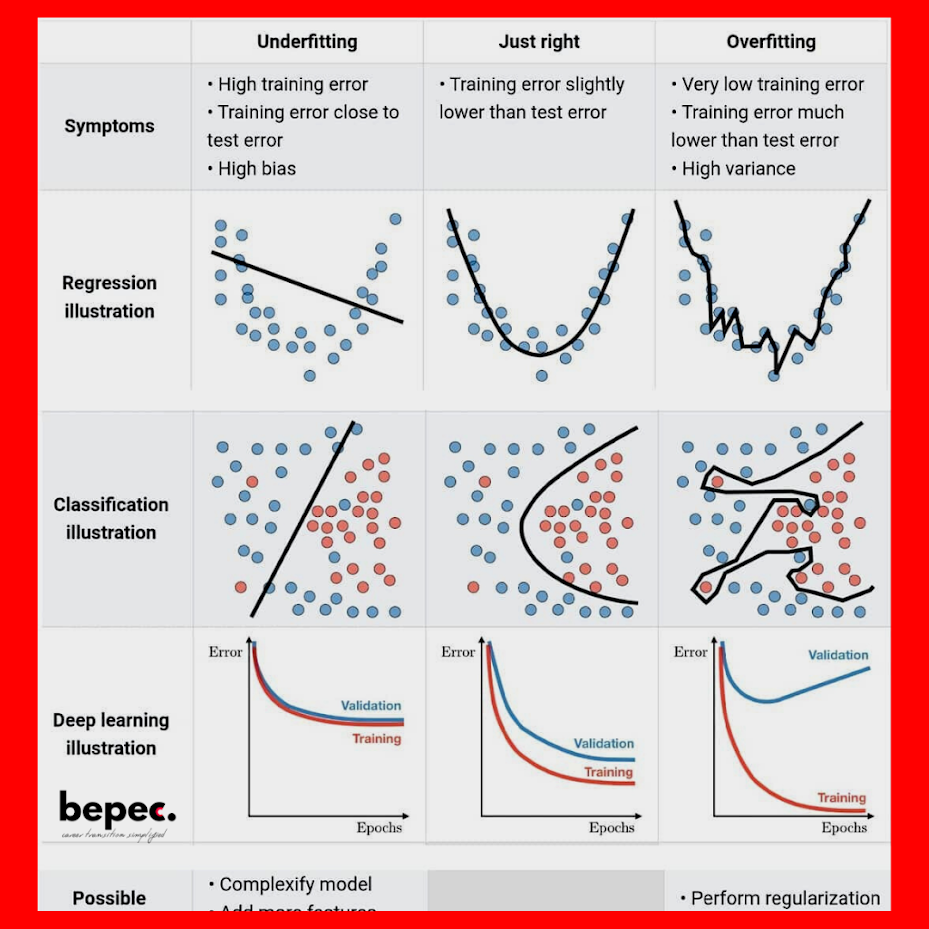

[TOC]

# 建置模型(Modeling)

## 簡介

機器學習模型的專案可以依據「是否有目標變數」以及「模型的產出為數值或分類資料」，將模型區分為以下四個類型

- 分類模型
- 回歸模型
- 分群模型
- 降維模型


- Supervised Learning

  - where we have inputs, and one (or more) response variable(s).
  - 如果我們的資料已經有明確的目標變數，我們可以直接讓模型專注在目標變數的變化
  - 找出讓訓練⽬標最佳的模型參數
    - 模型的參數組合可能有無限多組，我們可以⽤暴⼒法每個參數都試看看，從中找到讓損失函數最⼩的參數
    - 但是這樣非常沒有效率，有許多像是梯度下降 (Gradient Descent)、增量訓練 (Additive Training) 等⽅式，這些演算法可以幫我們找到可能的最佳模型參數

- Unsupervised Learning

  - where we have inputs, but not response variables.

  - 在不清楚資料特性、問題定義、沒有標記的情況下，非監督式學習技術可以幫助我們理清資料脈絡

  - 特徵數太龐⼤的情況下，非監督式學習可以幫助概念抽象化，⽤更簡潔的特徵描述資料

    - 客⼾分群

      在資料沒有任何標記，或是問題還沒定義清楚前，可⽤分群的⽅式幫助理清資料特性。

    - 特徵抽象化

      特徵數太多難於理解及呈現的情況下，藉由抽象化的技術幫助降低資料維度，同時不失去原有的資訊，組合成新的特徵。

    - 購物籃分析

      資料探勘的經典案例，適⽤於線下或線上零售的商品組合推薦。

    - 非結構化資料分析

      非結構化資料如⽂字、影像等，可以藉由⼀些非監督式學習的技術，幫助呈現及描述資料。

- 機器學習模型有很多，當訓練成本很小的時候，建議均作嘗試，不僅可以測試效果，還可以學習各種模型的使用技巧。
- 幸運的是，這些模型都已經有現成的工具（如scikit-learn、XGBoost、LightGBM等）可以使用，不用自己重複造輪子。
- 但是我們應該要知道各個模型的原理，這樣在調參的時候才會遊刃有餘。

- 調參


- 之前接觸到的所有模型都有超參數需要設置
  - LASSO，Ridge: α 的⼤⼩
  - 決策樹：樹的深度、節點最⼩樣本數
  - 隨機森林：樹的數量
- 這些超參數都會影響模型訓練的結果，建議先使⽤預設值，再慢慢進⾏調整
- 超參數會影響結果，但提升的效果有限，資料清理與特徵⼯程才能最有效的提升準確率，調整參數只是⼀個加分的⼯具。


## Supervised learning

### Linear Regression

Linear Regression models describe the relationship between a set of variables and a real value outcome. For example, input of the mileage, engine size, and the number of cylinders of a car can be used to predict the price of the car using a regression model. Regression differs from classification in how it's error is defined. In classification, the predicted class is not the class in which the model is making an error. In regression, for example, if the actual price of a car is 5000 and we have two models which predict the price to be 4500 and 6000, then we would prefer the former because it is less erroneous than 6,000. We need to define a loss function for the model, such as Least Squares or Absolute Value. The drawback of regression is that it assumes that a single straight line is appropriate as a summary of the data.

- 依據解釋變數的數量可以再細分成 Simple Linear Regression 和 Multiple Linear Regression，當只有一個解釋變數時為Simple，有兩個以上是則是 Multiple
- 線性回歸通過使用最佳的擬合直線（又被稱為回歸線），建立因變數 Y 和一個或多個引數 X 之間的關係。
- 它的運算式為：$Y = a + bX + e$  ，其中 $a$ 為直線截距，$b$ 為直線斜率，$e$ 為誤差項。如果給出了自變量 $X$ ，就能通過這個線性回歸表達式計算出預測值，即因變數 $Y$。
- 透過最小平方法(Ordinal Least Square, OLS)期望將$\sum(Y-\hat{Y})^2$最小化

$$
  b = \frac{Cov_{XY}}{S_x^2} = \frac{\sum^n_{i=1}(x_i - \bar{x})(y_i - \bar{y})}{\sum^n_{i=1}(x_i - \bar{x})^2}
$$

$$
  a = \bar{Y} - b\bar{X}
$$

- 訓練速度非常快，但須注意資料共線性、資料標準化等限制。通常可作為 baseline 模型作為參考點

- Assumptions of a Linear 

  - Linearity：資料呈線性關係
  - HomoScedasticity：資料要有相同的方差
  - Multivariate normality：資料要呈現多元正態分佈
  - Independence of errors：各個維度上的誤差相互獨立
  - Lack of Multicollinearity：沒有一個自變數和另外的自變數存線上性關係

- 要特別注意的是Coefficients代表的是在**固定**其他變數後，每單位變數對依變數的影響程度，只有在變數同單位同級距時，才能比較哪一個對依變數造成的量較大。

- Scikit-learn 中的 linear regression

  ```python
  from sklearn.linear_model import LinearRegression
  reg = LinearRegression()
  reg.fit(X, y)
  y_pred = reg.predict(X_test)
  ```

- 雖然線性模型相較其他模型不容易有overfitinng的問題，但當參數一多時仍然會有overfit的問題

- Backward Elimination in Python

  ```python
  import statsmodels.formula.api as sm
  def backwardElimination(x, sl):
      numVars = len(x[0])
      for i in range(0, numVars):
          regressor_OLS = sm.OLS(y, x).fit()
          maxVar = max(regressor_OLS.pvalues).astype(float)
          if maxVar > sl:
              for j in range(0, numVars - i):
                  if (regressor_OLS.pvalues[j].astype(float) == maxVar):
                      x = np.delete(x, j, 1)
      regressor_OLS.summary()
      return x
  
  
  SL = 0.05
  X_opt = X[:, [0, 1, 2, 3, 4, 5]]
  X_Modeled = backwardElimination(X_opt, SL)
  ```
  
- Ref

  - [Linear Regression With Gradient Descent From Scratch.ipynb](https://github.com/TLYu0419/DataScience/blob/master/Machine_Learning/Linear Regression With Gradient Descent From Scratch.ipynb)
  - [R Example](http://r-statistics.co/Linear-Regression.html)

### Polynomial Regression

Polynomial Regression is the same concept as linear regression except that it uses a curved line instead of a straight line (which is used by linear regression). Polynomial regression learns more parameters to draw a non-linear regression line. It is beneficial for data that cannot be summarized by a straight line.The number of parameters (also called degrees) has to be determined. A higher degree model is more complex but can over fit the data.

- [Python Example](https://www.geeksforgeeks.org/python-implementation-of-polynomial-regression/)

### Poisson Regression

Poisson Regression assumes that the predicted variables follows a Poisson Distribution. Hence, the values of the predicted variable are positive integers. The Poisson distribution assumes that the count of larger numbers is rare and smaller values are more frequent. Poisson regression is used for modelling rare occurrence events and count variables, such as incidents of cancer in a demographic or the number of times power shuts down at NASA.

- [R Example](https://www.r-bloggers.com/generalized-linear-models-poisson-regression/)

### Ordinary Least Squares (OLS) Regression

Least Squares is a special type of Regression model which uses squares of the error terms as a measure of how accurate the model is. Least Squares Regression uses a squared loss. It computes the difference between the predicted and the actual value, squares it, and repeats this step for all data points. A sum of the all the errors is computed. This sum is the overall representation of how accurate the model is.Next, the parameters of the model are tweaked such that this squared error is minimized so that there can be no improvement. For this model, it is appropriate to preprocess the data to remove any outliers, and only one of a set of variables which are highly correlated to each other should be used.

- [R Example](https://www.r-bloggers.com/ordinary-least-squares-ols-linear-regression-in-r/)

### Ordinal Regression

Also called ranking learning, ordinal regression takes a set of ordinal values as input. Ordinal variables are on an arbitrary scale and the useful information is their relative ordering. For example, ordinal regression can be used to predict the rating of a musical on a scale of 1 to 5 using ratings provided by surveys. Ordinal Regression is frequently used in social science because surveys ask participants to rank an entity on a scale.

- [R Example](https://www.r-bloggers.com/how-to-perform-ordinal-logistic-regression-in-r/)

### Support Vector Regression

Support Vector Regression works on the same principle as Support Vector Machine except the output is a number instead of a class. It is computationally cheaper, with a complexity of O^2*K where K is the number of support vectors, than logistic regression.


- [Support Vector Regression](https://core.ac.uk/download/pdf/81523322.pdf)

- [R筆記 – (14)Support Vector Machine/Regression(支持向量機SVM)](https://rpubs.com/skydome20/R-Note14-SVM-SVR)

- [Support Vector Machines Tutorial – Learn to implement SVM in Python](https://data-flair.training/blogs/svm-support-vector-machine-tutorial/)

- Find Maximum Margin

- 為什麼要把資料投影到更高維度的平面(kernel)?

  - 因為複雜的資料沒辦法用線性來分割出乾淨的資料

- The Kernel Trick

  - sigma越大，有越多資料點會提升
  - 有這麼多種類的kernel，你要用什麼kernel函數在你的資料上?你挑到kernel了，kernel參數怎麼調整？

- Types of Kernel Functions

  - linear Kernel
    - 優點是模型較為簡單，也因此比較安全，不容易 overfit；可以算出確切的 W 及 Support Vectors，解釋性較好。
    - 缺點就是，限制會較多，如果資料點非線性可分就沒用。
  - Gaussian RBG Kernel
    - 最後是 Gaussian Kernel，優點就是無限多維的轉換，分類能力當然更好，而且需要選擇的參數的較少。但缺點就是無法計算出確切的 w 及 support vectors，預測時都要透過 kernel function 來計算，也因此比較沒有解釋性，而且也是會發生 overfit。比起 Polynomail SVM，Gaussian SVM 比較常用。
  - Sigmoid Kernel
  - Polynomial Kernel
    - 由於可以進行 Q 次轉換，分類能力會比 Linear Kernel 好。缺點就是高次轉換可能會有一些數字問題產生，造成計算結果怪異。然後太多參數要選，比較難使用。

- Python Code

  ```python
  # SVR
  from sklearn.svm import SVR
  regressor = SVR(kernel = 'rbf')
  regressor.fit(X, y)
  ```

  

- Ref

  - [機器學習: Kernel 函數](https://medium.com/@chih.sheng.huang821/機器學習-kernel-函數-47c94095171)
  - [林軒田教授機器學習技法 Machine Learning Techniques 第 3 講學習筆記](https://blog.fukuball.com/lin-xuan-tian-jiao-shou-ji-qi-xue-xi-ji-fa-machine-learning-techniques-di-3-jiang-xue-xi-bi-ji/)
  - [資料分析&機器學習 第3.4講：支援向量機(Support Vector Machine)介紹 | by Yeh James | JamesLearningNote | Medium](https://medium.com/jameslearningnote/資料分析-機器學習-第3-4講-支援向量機-support-vector-machine-介紹-9c6c6925856b)
  - [7.2 支持向量机 | 编程之法：面试和算法心得 (gitbooks.io)](https://wizardforcel.gitbooks.io/the-art-of-programming-by-july/content/07.02.svm.html)

  


- [R Example](https://www.kdnuggets.com/2017/03/building-regression-models-support-vector-regression.html)

### Gradient Descent Regression

*Gradient Descent Regression uses gradient descent to optimize the model (as opposed to, for example, Ordinary Least Squares). Gradient Descent is an algorithm to reduce the cost function by finding the gradient of the cost at every iteration of the algorithm using the entire dataset.

- [R Example](https://www.r-bloggers.com/linear-regression-by-gradient-descent/)

### Stepwise Regression

Stepwise regression solves the problem of determining the variables, from the available variables, that should be used in a regression model. It uses F-tests and t-tests to determine the importance of a variable. R-squared, which explains the ratio of the predicted variable explained by a variable, is also used.Stepwise regression can either incrementally add and/or remove a variable from the entire dataset to the model such that the cost function is reduced.

- [R Example](http://r-statistics.co/Model-Selection-in-R.html)

### Lasso Regression 

- Least absoulute selection and shrinkage operator

Often times, the data we need to model demands a more complex representation which is not easy to characterize with the simple OLS regression model. Hence, to produce a more accurate representation of the data, we can add a penalty term to the OLS equation. This method is also known as L1 regularization.The penalty term imposes a constraint on the total sum of the absolute values of the model parameters. The goal of the model is to minimize the error represented in Fig. 6 which is the same as minimizing the SSE with an additional constraint. If your linear model contains many predictor variables or if these variables are correlated, the traditional OLS parameter estimates have large variance, thus making the model unreliable. This leads to an over-fitted model. A penalty term causes the regression coefficients for these unimportant variables to shrink towards zero. This process allows the model to identify the variables strongly associated with the output variable, thereby reducing the variance.Lambda, a tuning parameter, is used to control the strength of the model penalty in Lasso Regression. As lambda increases, more coefficients are reduced to zero. This feature selection process can help alleviate multi-collinearity because Lasso tends to select only one of the correlated features and shrink the other to zero. Lasso is generally used when we have a greater number of features, because it automatically performs feature selection.


- 先前學習到的回歸模型，我們只有提到損失函數會⽤ MSE 或 MAE，為了避免 Over-fitting，我們可以把正則化加入⽬標函數中，此時⽬標函數 = 損失函數 + 正則化

- LASSO 為 Linear Regression 加上 L1

- 正則化可以懲罰模型的複雜度，當模型越複雜時其值就會越⼤

  - 正則化函數

    - L1： $\alpha \sum|weights|$

      向量中各元素絕對值之和。又叫做稀疏規則運算元（Lasso regularization）。關鍵在於能夠實現特徵的自動選擇，參數稀疏可以避免非必要的特徵引入的雜訊

  - L1 會趨向於產生少量的特徵，而其他的特徵都是 0(選較少參數，選出的參數影響力大)

- Sklearn 使⽤ Lasso Regression

  ```python
  from sklearn.linear_model import Lasso
  reg = Lasso(alpha=0.1)
  reg.fit(X, y)
  print(reg.coef_) # 印出訓練後的模型參數
  ```

- 

### Ridge Regression (L2)

Ridge regression uses ridge regularization to prepare a regression model. Ridge regularization adds the square of the coefficients to the cost function. It is effective if there are multiple coefficients with large values. It makes the values of the coefficients of the indiscriminate variables small.

- Ridge 為 Linear Regression 加上 L2

- 正則化函數

  - L2： $\alpha \sum(weights)^2$

    L2 正則化。使得每個元素都盡可能的小，但是都不為零。在回歸裡面，有人把他的回歸叫做嶺回歸（Ridge Regression），也有人叫他 “權值衰減”（weight decay） 

  - L1 和 L2 這兩種都是希望模型的參數數值不要太⼤，原因是參數的數值變⼩，噪⾳對最終輸出的結果影響越⼩，提升模型的泛化能⼒，但也讓模型的擬合能⼒下降。

- Sklearn 使⽤ Ridge Regression

  ```python
  from sklearn.linear_model import Ridge
  reg = Ridge (alpha=0.1)
  reg.fit(X, y)
  print(reg.coef_) # 印出訓練後的模型參數
  ```


### LASSO, Ridge Regression

- 回歸模型與正規化

  - 

- 正則化函數

  - ⽤來衡量模型的複雜度

  - 該怎麼衡量？有 L1 與 L2 兩種函數

    - L1： $\alpha \sum|weights|$

      向量中各元素絕對值之和。又叫做稀疏規則運算元（Lasso regularization）。關鍵在於能夠實現特徵的自動選擇，參數稀疏可以避免非必要的特徵引入的雜訊

    - L2： $\alpha \sum(weights)^2$

      L2 正則化。使得每個元素都盡可能的小，但是都不為零。在回歸裡面，有人把他的回歸叫做嶺回歸（Ridge Regression），也有人叫他 “權值衰減”（weight decay） 

  - L2 會選擇更多的特徵，這些特徵都會接近於 0(選較多參數，選出的參數影響力小)
  
- [L1范数与L2范数的区别 - 知乎 (zhihu.com)](https://zhuanlan.zhihu.com/p/28023308)

### Elastic Net Regression

Elastic Net generalizes the idea of both Ridge and Lasso regression since it combines the penalties from both L1 ( Lasso) and L2 (Ridge) regularization. Elastic Net aims at minimizing the loss function represented in Fig. 7. 𝞪 is the tuning parameter which can be changed to implement both Ridge and Lasso regression alternatively or simultaneously to optimize the elastic net. If you plug in 𝞪 = 0, the penalty function corresponds to ridge and 𝞪 = 1 corresponds to Lasso regularization.In the case of correlated independent variables in a dataset, the Elastic Net will group these variables together. Now if any one of the variable of this group is strongly associated with the dependent variable, then the entire group will be a part of the model, because selecting only one of those variables (like what we did in Lasso) might result in losing some useful information, leading to a poor model performance. Hence, elastic net produces grouping in case of multi-collinearity.The size of the respective penalty terms Lambda and alpha can be tuned via cross-validation to find the model's best fit.

[R Example](https://daviddalpiaz.github.io/r4sl/elastic-net.html)

### Bayesian Linear Regression

In the Bayesian world, linear regression is formulated using probability distributions rather than point estimates. The dependent variable, Y, is not estimated as a single value, but is assumed to be drawn from a probability distribution. Y is generated from a normal distribution with a mean and variance. Bayesian Linear Regression aims to find the posterior distribution for the model parameters rather than determining a single "optimal" value for the model. In contrast to OLS, there is a posterior distribution for the model parameters that is proportional to the likelihood of the data multiplied by the prior probability of the parameters. One of the advantages of this approach is that if we have domain knowledge (Priors), or a an idea about the model parameters, we can include them in our model.The major  advantage of Bayesian processing is that you can incorporate the use of previous or assumed knowledge and update the current state of beliefs. You can incorporate prior information about a parameter and form a prior distribution for future analysis. One of the shortcomings of Bayesian analysis is that it does not tell you how to select a prior. There is no single correct way to choose a prior. This approach requires skills to translate subjective prior beliefs into a mathematically formulated prior. Any misunderstanding can generate misleading results.

- [R Example](https://www.r-bloggers.com/bayesian-linear-regression-analysis-without-tears-r/)

### Least-Angled Regression (LARS)

Least-Angled Regression (LARS), a new model selection algorithm, is a useful and less greedy version of traditional forward selection methods. This type of regression is useful when we have a high dimensional data. It's very similar to stepwise regression which finds out the best set of independent variables.

- [Python Example](https://plot.ly/scikit-learn/plot-lasso-lars/)

### Neural Network Regression

As the name suggests, neural networks are inspired by the brain. They form a network of interconnected nodes arranged in layers that make up a model. Neural networks are used to approzimate functions when the input data is too large for standard machine learning approaches.Fig. 8 represents the basic structure of a feed forward neural network. The input layer has number of nodes equal to a dimension of input data features. Each hidden layer consists of an arbitrary number of nodes. The number of the layers depends on the architecture and the scope of the problem.  And output layer consists of one node only if it is a regression problem. A neuron holds a number which represents the value of the corresponding feature of the input data, also known as activation. For each node of a single layer, input from each node of the previous layer is mixed in different proportions, and then passed into each node of the subsequent layer in a feed forward neural network, and so on until the signal reaches the final layer where a regression decision is made. All these are matrix operations.The questions then comes down to the network parameters which needs to be tuned such that it minimizes the loss between the predicted outcome and the true value. In large models, there can be millions of parameters to optimize. Gradient descent is used as the optimization function to adjust the weights/parameters in order to minimize the total error in the network. The gradient describes the relationship between the network’s error and a single weight, that is, how does the error vary as the weight is adjusted. As the training process continues, the network adjusts many weights/parameters such they can map the input data to produce an output which is as close as possible to the original output.Neural networks can run regression if given any prior information to predict a future event. For instance, you can predict heart attacks based on the vital stats data of a person. Moreover, you can also predict the likelihood that a customer will leave or not, based on web activity and metadata.


- [Python Example](https://machinelearningmastery.com/regression-tutorial-keras-deep-learning-library-python/)

- [Azure ML](https://docs.microsoft.com/en-us/azure/machine-learning/studio-module-reference/neural-network-regression)

### Locally Estimated Scatterplot Smoothing (LOESS)

LOESS is a highly flexible non-parametric regression technique. It makes as little assumptions as possible and tries to capture a general pattern. It is used to make an assessment of the relationship of two variables especially in large datasets.

- [R Example](http://r-statistics.co/Loess-Regression-With-R.html)

### Multivariate Adaptive Regression Splines (MARS)

MARS is a non-parametric model that fits a regression line in two phases. The first phase is a forward pass in which MARS starts with only an intercept and incrementally adds basis functions to it to improve the model. The brute force methodology of the first pass makes an overfit model which is pruned in the backward pass. In the backward pass any term from the model can be deleted.

- [R Example](http://uc-r.github.io/mars)

### Locally Weighted Regression (LWL)

This is a non-parametric model which makes local functions. It uses a set of weights, each for a subset of the data to make predictions on it. The use of higher weights for neighboring data points and lower weights for far away data, instead of using global patterns, makes it an accurate and flexible measure.

- [R Example](https://www.kdnuggets.com/2017/03/building-regression-models-support-vector-regression.html)

### Quantile Regression

Generally regression models predict the mean but this algorithm predicts the distribution of the data. It can be used to predict the distribution of prices given a certain input, for example what would be the 25th and 75th percentile of the distribution of a car price given some attributes.

- [Python Example](https://scikit-garden.github.io/examples/QuantileRegressionForests/)

### Principal Component Regression (PCR)

Principal Component Regression is an extension of Principal Component Analysis and Multiple Linear Regression. PCR models a target variable when there are a large number of predictor variables, and those predictors are highly correlated or even collinear. This method constructs new predictor variables, known as components, as linear combinations of the original predictor variables. PCR creates components to explain the observed variability in the predictor variables, without considering the target variable at all.In the first step, the principal components are calculated. The scores of the most important principal components are used as the basis for the multiple linear regression with the target variable. The most important point in PCR is the proper selection of the eigenvectors to be included. A plot of the eigenvalues usually indicates to the "best" number of eigenvectors.The benefit of PCR over multiple linear regression is that the noise remains in the residuals, since the eigenvectors with low eigenvalues represent only parts of the data with low variance. Moreover, the regression coefficients are more stable. This is because the eigenvectors are orthogonal to each other.

- [R Example](https://poissonisfish.wordpress.com/2017/01/23/principal-component-analysis-in-r/)

### Partial Least Squares Regression

Partial least squares regression (PLS regression) is developed from principal components regression. It works in a similar fashion as it finds a linear regression model by projecting the predicted variables and the predictor variables to a new space instead of finding hyperplanes of maximum variance between the target and predictor variables. While, PCR creates components to explain the observed variability in the predictors, without considering the target variable at all. PLS Regression, on the other hand, does take the response variable into account, and often leads to models that are able to fit the target variable with fewer components. However, it depends on the context of the model if using PLS Regression over PCR would offer a more parsimonious model.

- [R Example](https://rpubs.com/omicsdata/pls)


### Decision Tree

A decision tree classification algorithm uses a training dataset to stratify or segment the predictor space into multiple regions. Each such region has only a subset of the training dataset. To predict the outcome for a given (test) observation, first, we determine which of these regions it belongs to. Once its region is identified, its outcome class is predicted as being the same as the mode (say, ‘most common’) of the outcome classes of all the training observations that are included in that region. The rules used to stratify the predictor space can be graphically described in a tree-like flow-chart, hence the name of the algorithm. The only difference being that these decision trees are drawn upside down.Decision tree classification models can easily handle qualitative predictors without the need to create dummy variables. Missing values are not a problem either. Interestingly, decision tree algorithms are used for regression models as well. The same library that you would use to build a classification model, can also be used to build a regression model after changing some of the parameters.          Although the decision tree-based classification models are very easy to interpret, they are not robust.  One major problem with decision trees is their high variance. One small change in the training dataset can give an entirely different decision trees model. Another issue is that their predictive accuracy is generally lower than some other classification models, such as “Random Forest” models (for which decision trees are the building blocks).


- 從訓練資料中找出規則，讓每⼀次決策能使訊息增益(Information Gain) 最⼤化

  - 訊息增益越⼤代表切分後的兩群資料，群內相似程度越⾼

    - 訊息增益 (Information Gain): 決策樹模型會⽤ features 切分資料，該選⽤哪個 feature 來切分則是由訊息增益的⼤⼩決定的。希望切分後的資料相似程度很⾼，通常使⽤吉尼係數來衡量相似程度。

  - 衡量資料相似: Gini vs. Entropy

    - 兩者都可以表示數據的不確定性，不純度

      - Gini 指數的計算不需要對數運算，更加高效；

      - Gini 指数更偏向於連續属性，Entropy 更偏向於離散屬性。

        $Gini = 1 - \sum_j p_j^2$

        $Entropy = - \sum_jp_j log_2 p_j$

  - 決策樹的特徵重要性 (Feature importance)

    - 我們可以從構建樹的過程中，透過 feature 被⽤來切分的次數，來得知哪些features 是相對有⽤的
    - 所有 feature importance 的總和為 1
    - 實務上可以使⽤ feature importance 來了解模型如何進⾏分類

  - 使⽤ Sklearn 建立決策樹模型

    ```python
    from sklearn.tree import DecisionTreeRegressor
    regressor = DecisionTreeRegressor(random_state = 0)
    regressor.fit(X, y)
    
    from sklearn.tree import DecisionTreeClassifier
      classifier = DecisionTreeClassifier(criterion = 'entropy', random_state = 0)
      classifier.fit(X_train, y_train)
    ```

    - Criterion: 衡量資料相似程度的 metric
      - clf：gini，entropy
    - Max_depth: 樹能⽣長的最深限制
    - Min_samples_split: ⾄少要多少樣本以上才進⾏切分
    - Min_samples_lear: 最終的葉⼦ (節點) 上⾄少要有多少樣本

  

- [R Tutorial](https://blog.datasciencedojo.com/classification-decision-trees/)

### Decision Stump

A Decision Stump is a decision tree of 1 level. They are also called 1-rules and use one feature to arrive to a decision. Independently, a Decision Stump is a 'weak' learner, but they can be effective when used as one of the models in bagging and boosting techniques, like AdaBoost.If the data is discrete it can be divided in terms of frequency and continuous data can be divided by a threshold value. The graph on the left-hand side of this image shows a dataset divided linearly by a decision stump.


- [R Example](https://www.r-bloggers.com/the-power-of-decision-stumps/)

### Naive Bayes

Naive Bayes Classifier is based on the Bayes Theorem. The Bayes Theorem says the conditional probability of an outcome can be computed using the conditional probability of the cause of the outcome.The probability of an event x occurring, given that event C has occurred in the prior probability. It is the knowledge that something has already happened. Using the prior probability, we can compute the posterior probability - which is the probability that event C will occur given that x has occurred. The Naive Bayes classifier uses the input variable to choose the class with the highest posterior probability.The algorithm is called naive because it makes an assumption about the distribution of the data. The distribution can be Gaussian, Bernoulli or Multinomial. Another drawback of Naive Bayes is that continuous features have to be preprocessed and discretized by binning, which can discard useful information.

- 定理：

  - $P(A|B)$: 

    Posterior Probability： The Probability of A being true given that B is true

  - $P(B|A)$: 

    Likelihood： The probability of B being true given that A is true

  - $P(A)$： 

    Prior Probability： The probability of A being true

  - $ P(B)$: 

    Marginal Likelihood： The probability of B Being true

$$
P(A|B) = \frac{P(B|A) * P(A)}{P(B)}
$$

- Question：

  - Why Naive?

    Independence assumption：在計算marginal的時候會用features來算樣本的相似度。如果樣本彼此間不獨立會影響到計算的結果(偏向單一維度但有許多類似特徵的維度)。

  - P(X)?

    Randomly select from dataset will exhibit the features similar to the datapoint
    $$
    P(X) = \frac{Number of Similar Observations}{ Total Observations}
    $$

- Python Code

  ```python
  from sklearn.naive_bayes import GaussianNB
  classifier = GaussianNB()
  classifier.fit(X_train, y_train)
  ```

  

- [Tutorial](https://blog.datasciencedojo.com/unfolding-naive-bayes-from-scratch-part-1/)
- [R Example](https://rpubs.com/riazakhan94/naive_bayes_classifier_e1071)

### Gaussian Naive Bayes

The Gaussian Naive Bayes algorithm assumes that all the features have a Gaussian (Normal / Bell Curve) distribution. This is suited for continuous data e.g Daily Temperature, Height. The Gaussian distribution has 68% of the data in 1 standard deviation of the mean, and 96% within 2 standard deviations. Data that is not normally distributed produces low accuracy when used in a Gaussian Naive Bayes classifier, and a Naive Bayes classifier with a different distribution can be used.

- [Python Example](https://www.antoniomallia.it/lets-implement-a-gaussian-naive-bayes-classifier-in-python.html)

### Bernoulli Naive Bayes

The Bernoulli Distribution is used for binary variables - variables which can have 1 of 2 values. It denotes the probability of of each of the variables occurring. A Bernoulli Naive Bayes classifier is appropriate for binary variables, like Gender or Deceased.

- [Python Example](https://chrisalbon.com/machine_learning/naive_bayes/bernoulli_naive_bayes_classifier/)

### Multinomial Naive Bayes

The Multinomial Naive Bayes uses the multinomial distribution, which is the generalization of the binomial distribution. In other words, the multinomial distribution models the probability of rolling a k sided die n times.Multinomial Naive Bayes is used frequently in text analytics because it has a bag of words assumption - which is the position of the words doesn't matter. It also has an independence assumption - that the features are all independent.

- [Python Example](https://towardsdatascience.com/multinomial-naive-bayes-classifier-for-text-analysis-python-8dd6825ece67)

### K Nearest Neighbours (KNN)

K Nearest Neighbors is a the simplest machine learning algorithm. The idea is to memorize the entire dataset and classify a point based on the class of its K nearest neighbors.Figure 3 from Understanding Machine Learning, by Shai Shalev-Shwartz and Shai Ben-David, shows the boundaries in which a label point will be predicted to have the same class as the point already in the boundary. This is a 1 Nearest Neighbor, the class of only 1 nearest neighbor is used.KNN is simple and without any assumptions, but the drawback of the algorithm is that it is slow and can become weak as the number of features increase. It is also difficult to determine the optimal value of K - which is the number of neighbors used.

- Seps：
  1. Choose the number K of neighbors(default=5)
  2. Take the K nearest neighbors of the new data point, according to the Euclidean distance.
  3. Among these K neghbors, count the number of data points in each category
  4. Assign the new data point to the category where you counted the most neighbors.

```python
from sklearn.neighbors import KNeighborsClassifier
clf = KNeighborsClassifier(n_neighbors = 5,
                           metric = 'minkowski',
                           p = 2)
clf.fit(X_train, y_train)
```

- Parameters
  - n_neighbors：要用幾個點
  - wright：這些點的權重。全部等於1 or 距離越近越重要...

https://www.analyticsvidhya.com/blog/2017/09/30-questions-test-k-nearest-neighbors-algorithm/

https://towardsdatascience.com/k-nearest-neighbors-knn-algorithm-bd375d14eec7

缺點：每次predict時需要加載全部資料

- [R Example](https://www.datatechnotes.com/2018/10/learning-vector-quantization.html)

### Support Vector Machine (SVM)

An SVM is a classification and regression algorithm. It works by identifying a hyper plane which separates the classes in the data. A hyper plane is a geometric entity which has a dimension of 1 less than it's surrounding (ambient) space.If an SVM is asked to classify a two-dimensional dataset, it will do it with a one-dimensional hyper place (a line), classes in 3D data will be separated by a 2D plane and Nth dimensional data will be separated by a N-1 dimension line.SVM is also called a margin classifier because it draws a margin between classes. The image, shown here, has a class which is linearly separable. However, sometime classes cannot be separated by a straight line in the present dimension. An SVM is capable of mapping the data in higher dimension such that it becomes separable by a margin.Support Vector machines are powerful in situations where the number of features (columns) is more than the number of samples (rows). It is also effective in high dimensions (such as images). It is also memory efficient because it uses a subset of the dataset to learn support vectors.


- [Python Example](https://stackabuse.com/implementing-svm-and-kernel-svm-with-pythons-scikit-learn/)

  ```python
  # SVM
  from sklearn.svm import SVC
  classifier = SVC(kernel = 'rbf', random_state = 0)
  classifier.fit(X_train, y_train)
  ```

  

### Linear Support Vector Classifier (SVC)

A Linear SVC uses a boudary of  one-degree (linear / straight line) to classify data. It has much less complexity than a non-linear classifier and is only appropriate for small datasets. More complex datasets will require a non linear classifier.

- [Python Example](https://pythonprogramming.net/linear-svc-example-scikit-learn-svm-python/)

### NuSVC

NuSVC uses Nu parameters which is for regularization. Nu is the upper bound on the expected classification error. If the value of Nu us 10% then 10% of the data will be misclassified.

- [Python Example](https://scikit-learn.org/stable/modules/generated/sklearn.svm.NuSVC.html)

### Stochastic Gradient Descent (SGD) Classifier 

SGD is a linear classifier which computes the minima of the cost function by computing the gradient at each iteration and updating the model with a decreasing rate. It is an umbrella term for many types of classifiers, such as Logistic Regression or SVM) that use the SGD technique for optimization.

- [R Example](https://rpubs.com/aaronsc32/quadratic-discriminant-analysis)
- [Python Example](https://www.pyimagesearch.com/2016/10/17/stochastic-gradient-descent-sgd-with-python/)

### Bayesian Network

A Bayesian Network is a graphical model such that there are no cycles in the graph. This algorithm can model events which are consequences of each other. An event that causes another points to it in the graph. The edges of the graph show condition dependence and the nodes are random variables.

- [R Tutorial](https://www.r-bloggers.com/bayesian-network-in-r-introduction/)
- [Graph Source](http://www.cs.cmu.edu/afs/cs.cmu.edu/project/learn-43/lib/photoz/.g/web/glossary/bayesnet.html)

### Logistic Regression

Logistic regression estimates the relationship between a dependent categorical variable and independent variables. For instance, to predict whether an email is spam (1) or (0) or whether the tumor is malignant (1) or not (0).If we use linear regression for this problem, there is a need to set up a threshold for classification which generates inaccurate results. Besides this, linear regression is unbounded, and hence we dive into the idea of logistic regression. Unlike linear regression, logistic regression is estimated using the Maximum Likelihood Estimation (MLE) approach. MLE is a "likelihood" maximization method, while OLS is a distance-minimizing approximation method. Maximizing the likelihood function determines the mean and variance parameters that are most likely to produce the observed data. Logistic Regression transforms it's output using the sigmoid function in the case of binary logistic regression. As you can see in Fig. 5, if ‘t’ goes to infinity, Y (predicted) will become 1 and if ‘t’ goes to negative infinity, Y(predicted) will become 0.The output from the function is the estimated probability. This is used to infer how confident can predicted value be as compared to the actual value when given an input X. There are several types of logistic regression:


- Scikit-learn 中的 Logistic Regression

  ```python
  from sklearn.linear_model import LogisticRegression
  clf = LogisticRegression(random_state = 0)
  clf.fit(X_train, y_train)
  ```


- [Python Example](https://towardsdatascience.com/logistic-regression-detailed-overview-46c4da4303bc)

### Zero Rule (ZeroR)

ZeroR is a basic classification model which relies on the target and ignores all predictors. It simply predicts the majority category (class). Although there is no predictibility power in ZeroR, it is useful for determining a baseline performance as a benchmark for other classification methods. This is the least accurate classifier that we can have. For instance, if we build a model whose accuracy is less than the ZeroR model then it's useless.The way this algorithm works is that it constructs a frequency table for the target class and select the most frequent value as it's predicted value regardless of the input features.

- [Python Example](https://machinelearningmastery.com/implement-baseline-machine-learning-algorithms-scratch-python/)

### One Rule (OneR)

This algorithm is also based on the frequency table and chooses one predictor that is used for classification.It generates one rule for each predictor in the data set, then selects the rule with the smallest total error as its "One Rule". To create a rule for the predictor, a frequency table is constructed for each predictor against the target.

- [R Example](https://christophm.github.io/interpretable-ml-book/rules.html)

### Linear Discriminant Analysis (LDA)

Linear Discriminant Analysis (LDA) is performed by starting with 2 classes and generalizing to more. The idea is to find a direction, defined by a vector, such that when the two classes are projected on the vector, they are as spread out as possible.

- [Python Example](https://sebastianraschka.com/Articles/2014_python_lda.html)[Vector Source: Ethem Alpaydin](https://www.cmpe.boun.edu.tr/~ethem/i2ml/i2ml-figs.pdf)

### Quadratic Discriminant Analysis (QDA)

QDA is the same concept as LDA, the only difference is that we do not assume the distribution within the classes are normal. Therefore, a different covariance matrix has to be built for each class which increases the computational cost because there are more parameters to estimate, but it fits data better than LDA.

- [R Example](https://rpubs.com/aaronsc32/quadratic-discriminant-analysis)

### Fisher's Linear Discriminant

Fisher's Linear Discriminant improves upon LDA by maximizing the ratio between class variance and the inter class variance. This reduces the loss of information caused by overlapping classes in LDA. 	


## Unsupervised learning
### Dimensionality reduction

With some problems, especially classification, there can be so many variables, or features, that it is difficult to visualize your data. The correlation amongst your features creates redundancies, and that's where dimensionality reduction comes in. Dimensionality Reduction reduces the number of random variables you're working with. 

### Singular Value Decomposition (SVD)

This is a form of matrix analysis that leads to a low-dimensional representation of a high-dimensional matrix. SVD allows an approximate representation of any matrix, and also makes it easy to eliminate the less important parts of that representation to produce an approximate representation with any desired number of dimensions.Suppose we want to represent a very large and complex matrix using some smaller matrix representation then SVD can factorize an m x n matrix, M, of real or complex values into three component matrices, where the factorization has the form USV. The best way to reduce the dimensionality of the three matrices is to set the smallest of the singular values to zero. If we set a particular number of smallest singular values to 0, then we can also eliminate the corresponding columns. The choice of the lowest singular values to drop when we reduce the number of dimensions can be shown to minimize the root-mean-square error between the original matrix M and its approximation. A useful rule of thumb is to retain enough singular values to make up 90% of the energy. That is, the sum of the squares of the retained singular values should be at least 90% of the sum of the squares of all the singular values. It is also possible to reconstruct the approximation of the original matrix M using U, S , and V.SVD is used in the field of predictive analytics. Normally, we would want to remove a number of columns from the data since a greater number of columns increases the time taken to build a model. Eliminating the least important data gives us a smaller representation that closely approximates the original matrix. If some columns are redundant in the information they provide then this means those columns contribute noise to the model and reduce predictive accuracy. Dimensionality reduction can be achieved by simply dropping these extra columns. The resulting transformed data set can be provided to machine learning algorithms to yield much faster and accurate models.


- [R Example](https://www.displayr.com/singular-value-decomposition-in-r/)

### CA

https://www.princexml.com/doc/troubleshooting/

### Principal Component Analysis (PCA)

- PCA is a projection technique which find a projection of the data in a smaller dimension. The idea is to find an axis in the data with highest variance and to map the data along that axis.In figure 15, the data along vector 1 shows a higher variance than vector 2. Therefore, vector 1 will be preferred and chosen as the first principle component. The axis has been rotated in the direction of highest variance. We have thus reduced the dimensionality from two (X1 and X2) to one (PC 1).PCA is useful in cases where the dimensions are highly correlated. For example, pixels in images have a high correlation with each other, here will will prove a significant gain my reducing the dimension. However, if the features are not correlated to each other than the dimension will be the almost the same in quantity after PCA.Fig. 15: Original vs Principal Component R Tutorial

  

  - [R Tutorial](https://www.r-bloggers.com/principal-component-analysis-in-r/)

- 目的

  - Identify patterns in data
  - Detect the correlation between variables
  - Reduce the dimensions of a d-dimensional dataset by projecting into a (k)-dimensional subspace(where k < d) 
  - form the m independent variables of your dataset, PCA extracts p<= m new independent variables that explain the most the variance of the dataset.

- 流程

  - Standardize the data.
  - Obtain the Eigenvectors and Eigenvalues from the covariance matrix or correlation matrix, or perform Singular Vector Decomposition.
  - Sort eigenvalues in descending order and choose the $k$ eigenvectors that correspond to the $k$ largest eigenvalues where $k$ is the number of dimensions of the new feature subspace ($k<=d$).
  - Construct the projection matrix $W$ from the selected $k$ eigenvectors.
  - Transform the original dataset $X$ via $W$ to obtain a $k$-dimensional feature subspace $Y$.

- 參考資料

  - [Principal Component Analysis in Python/v3](https://plotly.com/python/v3/ipython-notebooks/principal-component-analysis/)

- 說明

  - 實務上我們經常遇到資料有非常多的 features, 有些 features 可能⾼度相關，有什麼⽅法能夠把⾼度相關的 features 去除？
  - PCA 透過計算 eigen value, eigen vector, 可以將原本的 features 降維⾄特定的維度
    - 原本資料有 100 個 features，透過 PCA，可以將這 100 個 features 降成 2 個features
    - 新 features 為舊 features 的線性組合
    - 新 features 之間彼此不相關

- 爲什麼需要降低維度 ? 

  降低維度可以幫助我們壓縮及丟棄無⽤資訊、抽象化及組合新特徵、視覺化⾼維數據。常⽤的算法爲主成分分析。

  - 壓縮資料

    - 有助於使⽤較少的 RAM 或 disk space，也有助於加速 learning algorithms

    - 影像壓縮

      - 原始影像維度爲 512, 在降低維度到 16 的情況下 , 圖片雖然有些許模糊 ,但依然保有明顯的輪廓和特徵

        

  - 特徵組合及抽象化

    - 壓縮資料可進⽽組合出新的、抽象化的特徵，減少冗餘的資訊。

    - 左下圖的 x1 和 x2 ⾼度相關 , 因此可以合併成 1 個特徵 (右下圖)。

      - 把 x(i) 投影到藍⾊線 , 從 2 維降低爲 1 維。

      

  - 資料視覺化

    - 特徵太多時，很難 visualize data, 不容易觀察資料。
    - 把資料維度 (特徵) 降到 2 到 3 個 , 則能夠⽤⼀般的 2D 或 3D 圖表呈現資料

- 應⽤

  - 組合出來的這些新的 features 可以進⽽⽤來做 supervised learning 預測模型
  - 以判斷⼈臉爲例 , 最重要的特徵是眼睛、⿐⼦、嘴巴，膚⾊和頭髮等都可捨棄，將這些不必要的資訊捨棄除了可以加速 learning , 也可以避免⼀點overfitting。

- 如何決定要選多少個主成分?

  - Elbow
  - 累積的解釋變異量達85%

- 降低維度可以幫助我們壓縮及丟棄無⽤資訊、抽象化及組合新特徵、呈現⾼維數據。常⽤的算法爲主成分分析。

- 在維度太⼤發⽣ overfitting 的情況下，可以嘗試⽤ PCA 組成的特徵來做監督式學習，但不建議⼀開始就做。

- 注意事項

  - 不建議在早期時做 , 否則可能會丟失重要的 features ⽽ underfitting。
  - 可以在 optimization 階段時 , 考慮 PCA, 並觀察運⽤了 PCA 後對準確度的影響
  - PCA是透過距離來進行運算，因此在跑PCA之前需要對資料做標準化。避免PCA的結果因為測量範圍的不一致，導致只反映其中範圍較大的變量。
  - [https://medium.com/@jimmywu0621/dimension-reduction-%E5%BF%AB%E9%80%9F%E4%BA%86%E8%A7%A3pca%E7%9A%84%E5%8E%9F%E7%90%86%E5%8F%8A%E4%BD%BF%E7%94%A8%E6%96%B9%E6%B3%95-f0ce2dd28660](https://medium.com/@jimmywu0621/dimension-reduction-快速了解pca的原理及使用方法-f0ce2dd28660)

```python
from sklearn.decomposition import PCA
pca = PCA(n_components = 2)
X_train = pca.fit_transform(X_train)
X_test = pca.transform(X_test)
explained_variance = pca.explained_variance_ratio_
```

### Kernel PCA

```python
from sklearn.decomposition import KernelPCA
kpca = KernelPCA(n_components = 2, kernel = 'rbf')
X_train = kpca.fit_transform(X_train)
X_test = kpca.transform(X_test)
```

### Partial Least Squares Regression (PLSR)

Partial least squares regression (PLS regression) is developed from principal components regression. It works in a similar fashion as it finds a linear regression model by projecting the predicted variables and the predictor variables to a new space instead of finding hyperplanes of maximum variance between the target and predictor variables. While, PCR creates components to explain the observed variability in the predictor variables, without considering the target variable at all, PLS Regression, on the other hand,  does take the response variable into account, and therefore often leads to models that are able to fit the target variable with fewer components. However, it depends on the context of the model if using PLS Regression over PCR would offer a more parsimonious model.

- [R Example](https://rpubs.com/omicsdata/pls)

### Latent Dirichlet Analysis (LDA)

Latent Dirichlet Allocation (LDA) is one of the most popular techniques used for topic modelling. Topic modelling is a process to automatically identify topics present in a text object.A latent Dirichlet allocation model discovers underlying topics in a collection of documents and infers word probabilities in topics. LDA treats documents as probabilistic distribution sets of words or topics. These topics are not strongly defined – as they are identified based on the likelihood of co-occurrences of words contained in them.The basic idea is that documents are represented as random mixtures over latent topics, where each topic is characterized by a distribution over words. Given a dataset of documents, LDA backtracks and tries to figure out what topics would create those documents in the first place. The goal of LDA is to map all the documents to the topics in a way, such that the words in each document are mostly captured by those imaginary topics.A collection of documents is represented as a document-term matrix. LDA converts this document-term matrix into 2 lower dimensional matrices, where one is a document-topics matrix and the other is a topic-terms matrix. LDA then makes use of sampling techniques in order to improve these matrices. A steady state is achieved where the document topic and topic term distributions are fairly good. As a result, it builds a topic per document model and words per topic model, modeled as Dirichlet distributions.

- [R Example](https://www.tidytextmining.com/topicmodeling.html)

### Regularized Discriminant Analysis (RDA)

The regularized discriminant analysis (RDA) is a generalization of the linear discriminant analysis (LDA) and the quadratic discriminant analysis (QDA). RDA differs from discriminant analysis in a manner that it estimates the covariance in a new way, which combines the covariance of QDA with the covariance of LDA using a tuning parameter. Since RDA is a regularization technique, it is particularly useful when there are many features that are potentially correlated.

- [R Example](https://daviddalpiaz.github.io/r4sl/regularized-discriminant-analysis.html)

### Linear Discriminant Analysis

- Used as a dimensionality reduction technique

- Used in the pre-processing step for pattern classification

- Has the goal to project a dataset onto a lower-dimensional space

- LDA differs because in addition to finding the component axises with LDA we are interested in the axes that maximize the separation between multiple aclsses.

- Breaking it down further:

  The goal of LDA is to project a feature space (a dataset n-dimensional

  samples) onto a small subspace subspace k(where ksn-1) while

  maintaining the class-discriminatory information.

  Both PCA and LDA are linear transformation techniques used for

  dimensional reduction. PCA is described as unsupervised but LDA is

  supervised because of the relation to the dependent variable.

- From the n independent variables of your dataset, LDA extracts p <= n new independent variables that separate the most the classes of the dependent variable.

  - The fact that the DV is considered makes LDA a supervised model.

- Difference with PCA

  - PCA: component axes that maximize the variance.
  - LDA: maximizing the component axes for class-separation.

- Step

  1. Compute the $d$-dimensional mean vectors for the different classes from the dataset.
  2. Compute the scatter matrices (in-between=class and within -class scatter matrix).
  3. Compute the eigenvectors($e_1$, $e_2$,...$e_d$) and corresponging eigenvalues($\lambda_1$, $\lambda_2$, ..., $\lambda_d$) for the scatter matrices.
  4. Sort the eigenvectors by decreasing eigrnvalues and choose $k$ eigenvectors with the largest eigenvalues to form a $d * k$ dimensional matrix $W$ (where every column represents an eigenvector).
  5. Use this $d*k$ eigenvector matrix to transform the samples onto the new subspace. This can be summarized by the matrix multiplication: $Y = X * W$(where $X$ is a $n*d$-dimensional matrix representing the $n$ samples, and $y$ are the transformed $n*k$-dimensional samples in the new subspace).  

  ```python
  from sklearn.discriminant_analysis import LinearDiscriminantAnalysis
  lda = LinearDiscriminantAnalysis(n_components = 2)
  X_train = lda.fit_transform(X_train, y_train)
  X_test = lda.transform(X_test)
  ```

  

### t-Distributed Stochastic Neighbor Embedding (t-SNE)

t-SNE is a non-linear dimensionality reduction algorithm used for exploring high-dimensional data. It maps multi-dimensional data to lower dimensions which are easy to visualize.This algorithm calculates probability of similarity of points in high-dimensional space and in the low dimensional space. It then tries to optimize these two similarity measures using a cost function. To measure the minimization of the sum of difference of conditional probability, t-SNE minimizes the sum of Kullback-Leibler divergence of data points using a gradient descent method. t-SNE minimizes the divergence between two distributions: a distribution that measures pairwise similarities of the high-dimensional points and a distribution that measures pairwise similarities of the corresponding low-dimensional points. Using this technique, t-SNE can find patterns in the data by identifying clusters based on similarity of data points with multiple features.t-SNE stands out from all the other dimensionality reduction techniques since it is not limited to linear projections so it is suitable for all sorts of datasets. 

- [R and Python Examples](https://www.analyticsvidhya.com/blog/2017/01/t-sne-implementation-r-python/)


t-Distributed Stochastic Neighbor Embedding

> - 瞭解 PCA 的限制
> - t-SNE 概念簡介，及其優劣

- PCA 的問題

  - 求共變異數矩陣進⾏奇異值分解，因此會被資料的差異性影響，無法很好的表現相似性及分佈。
  - PCA 是⼀種線性降維⽅式，因此若特徵間是非線性關係，會有
    underfitting 的問題。

- t-SNE

  - t-SNE 也是⼀種降維⽅式，但它⽤了更複雜的公式來表達⾼維和低維之間的關係。
  - 主要是將⾼維的資料⽤ gaussian distribution 的機率密度函數近似，⽽低維資料的部分⽤ t 分佈來近似，在⽤ KL divergence 計算相似度，再以梯度下降 (gradient descent) 求最佳解。

- t-SNE 優劣

  - 優點
    - 當特徵數量過多時，使⽤ PCA 可能會造成降維後的 underfitting，這時可以考慮使⽤t-SNE 來降維
  - 缺點
    - t-SNE 的需要比較多的時間執⾏

- 計算量太大了，通常不會直接對原始資料做TSNE,例如有100維的資料，通常會先用PCA降成50維，再用TSNE降成2維

- 如果有新的點加入，如果直接套用既有模型。因此TSNE不是用來做traing testing，而是用來做視覺化

- 流形還原

  - 流形還原就是將⾼維度上相近的點，對應到低維度上相近的點，沒有資料點的地⽅不列入考量範圍
  - 簡單的說，如果資料結構像瑞⼠捲⼀樣，那麼流形還原就是把它攤開鋪平 (流形還原資料集的其中⼀種，就是叫做瑞⼠捲-Swiss Roll)
  - 流形還原就是在⾼維度到低維度的對應中，盡量保持資料點之間的遠近關係，沒有資料點的地⽅，就不列入考量範圍
  - 除了 t-sne 外，較常⾒的流形還原還有 Isomap 與 LLE (Locally Linear Embedding) 等⼯具

- 特徵間爲非線性關係時 (e.g. ⽂字、影像資料)，PCA很容易 underfitting，t-SNE 對於特徵非線性資料有更好的降維呈現能⼒。

- Ref
  - [StatsLearning Lect12a](https://www.youtube.com/watch?v=ipyxSYXgzjQ)
  - [StatsLearning Lect12b](https://www.youtube.com/watch?v=dbuSGWCgdzw)
  - [StatsLearning Lect8k](https://www.youtube.com/watch?v=eYxwWGJcOfw)
  - [Principal Component Analysis Algorithm](https://www.youtube.com/watch?v=rng04VJxUt4)
  - [主成分分析（PCA）原理总结](https://www.cnblogs.com/pinard/p/6239403.html)

- [Visualizing Data Using t-SNE](https://www.youtube.com/watch?v=RJVL80Gg3lA)
- [ML Lecture 15: Unsupervised Learning - Neighbor Embedding](https://www.youtube.com/watch?v=GBUEjkpoxXc)


### Factor Analysis

Factor Analysis is designed on the premise that there are latent factors which give origin to the available data that are not observed. In PCA, we create new variables with the available ones, here we treat the data as created variables and try to reach the original ones – thus reversing the direction of PCA.If there is a group of variables that are highly correlated, there is an underlying factor that causes that and can be used as a representative variable. Similarly, the other variables can also be grouped and these groups can be represented using such representative variables.Factor analysis can also be used for knowledge extraction, to find the relevant and discriminant piece of information.

- [R Example](https://www.promptcloud.com/blog/exploratory-factor-analysis-in-r/)

### Multidimensional Scaling (MDS)

Multidimensional Scaling (MDS) computes the pairwise distances between data points in the original dimensions of the data. The data points are mapped on the a lower dimension space, like the Euclidean Space, such that the paints with low pairwise distances in higher dimension are also close in the lower dimension and points which are far apart in higher dimension, are also apart in lower dimension.The pitfall of this algorithm can be seen in the analogy of geography. Locations which are far apart in road distance due to mountains or rough terrains, but close by in bird-flight path will be mapped far apart by MDS because of the high value of the pairwise distance.


- [R Example](http://www.sthda.com/english/articles/31-principal-component-methods-in-r-practical-guide/122-multidimensional-scaling-essentials-algorithms-and-r-code/)

### AutoEncoder

A tool for dimensionality reduction, an autoencoder has as many outputs as inputs and it is forced to find the best representation of the inputs in the hidden layer. There are fewer perceptrons in the hidden layer, which implies dimensionality reduction. Once training is complete, the first layer from the input layer to the hidden layer acts as an encoder which finds a lower dimension representation of the data. The decoder is from the layer after the hidden layer to the output layer.The encoder can be used to pass data and find a lower dimension representation for dimension reduction.

- [Python Example](https://blog.keras.io/building-autoencoders-in-keras.html)

### Independent Component Analysis (ICA)

ICA solves the cocktail party problem. At a cocktail party, one is able to seperate the voice of any one person from the voices in the background. Computers are not as efficient at separating the noise from signal as the human brain, but ICA can solve this problem if the data is not Gaussian.ICA assumes independence among the variables in the data. It also assumes that the mixing of the noise and signal is linear, and the source singal has a non-gaussian distribution.

- [R Example](https://rpubs.com/skydome20/93614)

### Isomap

Isomap (Isometric Mapping) computes the geodesic distances between data points and maps those distances in a Euclidean space to create a lower dimension mapping of the same data.Isomap offers the advantage of using global patterns by first making a neighborhood graph using euclidean distances and then computes graph distances between the nodes. Thus, it uses local information to find global mappings.

- [Python Example](http://benalexkeen.com/isomap-for-dimensionality-reduction-in-python/)

### Local Linear Embedding (LLE)

LLE reduces the dimension of the data such that neighbourhood information (topology) is intact. Points that are far apart in high dimension should also be far apart in lower dimension. LLE assumes that data is on a smooth surface without abrupt holes and that it is well sampled (dense).LLE works by creating a neighbourhood graph of the dataset and computing a local weight matrix using which it regenerates the data in lower dimension. This local weight matrix allows it to maintain the topology of the data.

- [R Example](http://rstudio-pubs-static.s3.amazonaws.com/94107_913ae6a497fc408a91a2529b6c57f791.html)

### Locality-Sensitive Hashing

This technique uses a hash function to determine the similarity of the data. A hash function provide a lower dimensional unique value for an input and used for indexing in databases. Two similar values will give a similar hash value which is used by this technique to determine which data points are neighbours an which are far apart to produce a lower dimensional version of the input data set.

- [R Example](https://cran.r-project.org/web/packages/textreuse/vignettes/textreuse-minhash.html)

### Sammon Mapping

Sammon Mapping creates a projection of the data such that geometric relations between data points are maintained to the highest extent. It creates a new dataset using the pairwise distances between points. Sammon mapping is frequently used in image recognition tasks.


- [Paul Henderson](http://homepages.inf.ed.ac.uk/rbf/CVonline/LOCAL_COPIES/AV0910/henderson.pdf)
- [Python Example](https://datawarrior.wordpress.com/2016/10/23/sammon-embedding/)

### Clustering

In supervised learning, we know the labels of the data points and their distribution. However, the labels may not always be known. Clustering is the practice of assigning labels to unlabeled data using the patterns that exist in it. Clustering can either be semi-parametric or probabilistic. 

### K-means

K-Means Clustering is an iterative algorithm which starts of with k random numbers used as mean values to define clusters. Data points belong to the cluster defined by the mean value to which they are closest. This mean value co-ordinate is called the centroid.Iteratively, the mean value of the data points of each cluster is computed and the new mean values are used to restart the process till mean stop changing. The disadvantage of K-Means is that it a local search procedure and could miss global patterns.The k initial centroids can be randomly selected. Another approach of determining k is to compute the mean of the entire dataset and add k random co-ordinates to it to make k initial points. Another approach is to determine the principle component of the data and divide into k equal partitions. The mean of each partition can be used as initial centroids.

- [Python Example](https://datasciencelab.wordpress.com/2013/12/12/clustering-with-k-means-in-python/)

- 當問題不清楚或是資料未有標註的情況下，可以嘗試⽤分群算法幫助瞭解資料結構，⽽其中⼀個⽅法是運⽤ K-means 聚類算法幫助分群資料

- 分群算法需要事先定義群數，因此效果評估只能藉由⼈爲觀察。

- 把所有資料點分成 k 個 cluster，使得相同 cluster 中的所有資料點彼此儘量相似，⽽不同 cluster 的資料點儘量不同。

- 距離測量（e.g. 歐⽒距離）⽤於計算資料點的相似度和相異度。每個 cluster有⼀個中⼼點。中⼼點可理解為最能代表 cluster 的點。

- 算法流程

  1. Choose the number K of cluster

  2. Select at random K points, the centroids

  3. Assign each data point to the colsest centroid.

  4. Compute and place the new centroid of each cluster.

  5. Reassign each data point to the new closest centroid.

     If any reassignment took place, go to Step 4, otherwise go to Finish!

  

- 整體目標：K-means ⽬標是使總體群內平⽅誤差最⼩

$$
\sum^n_{i=0} \min_{\mu \epsilon C}(||X_i -  \mu_j||^2)
$$

- Random initialization Trap

  - initial 設定的不同，會導致得到不同 clustering 的結果，可能導致 local optima，⽽非 global optima。
  - Solution: Kmeans++

- Choosing the right number of cluster

  - 因爲沒有預先的標記，對於 cluster 數量多少才是最佳解，沒有標準答案，得靠⼿動測試觀察。

  - $$
    WCSS = \sum_{P_i inCluster1} distance(Pi,C1)^2 + \sum_{P_i inCluster2} distance(Pi,C2)^2 + \sum_{P_i inCluster3} distance(Pi,C3)^2 + ...
    $$

  - Elbow Method

    觀察 WCSS 的數值的降低趨勢，當 K+1 的 WCSS值沒有明顯降低時，K就是合適的分群組數(Optimal number of cluster)

- 

- 注意事項

  3. kmeans是透過距離來評估相似度，因此對於離群值會非常敏感。

- Kmeans in Python

  ```python
  from sklearn.cluster import KMeans
  # Find optimal number of cluster
  wcss = []
  for i in range(1, 11):
      kmeans = KMeans(n_clusters = i, init = 'k-means++', random_state = 42)
      kmeans.fit(X)
      wcss.append(kmeans.inertia_)
  plt.plot(range(1, 11), wcss)
  plt.title('The Elbow Method')
  plt.xlabel('Number of clusters')
  plt.ylabel('WCSS')
  plt.show()
  
  # Fit and predict
  kmeans = KMeans(n_clusters = 5, init = 'k-means++', random_state = 42)
  y_kmeans = kmeans.fit_predict(X)
  ```

### K-Medians Clustering

K-Medians uses absolute deviations (Manhattan Distance) to form k clusters in the data. The centroid of the clusters is the median of the data points in the cluster. This technique is the same as K-Means but more robust towards outliers because of the use of median not mean, because K-Means optimizes the squared distances.Consider a list of numbers: 3, 3, 3, 9. It's median is 3 and mean is 4.5. Thus, we see that use of median prevents the effect of outliers.

- [Python Example](https://gist.github.com/mblondel/1451300)

### Mean Shift Clustering

Mean Shift is a hierarchical clustering algorithm. It is a sliding-window-based algorithm that attempts to find dense areas of data points. Mean shift considers the feature space as sampled from the underlying probability density function. For each data point, Mean shift associates it with the nearby peak of the dataset's probability density function. Given a set of data points, the algorithm iteratively assigns each data point towards the closest cluster centroid. A window size is determined and a mean of the data points within the window is calculated. The direction to the closest cluster centroid is determined by where most of the points nearby are at. So after each iteration, each data point will move closer to where the most points are at, which leads to the cluster center.Then, the window is shifted to the newly calculated mean and this process is repeated until convergence. When the algorithm stops, each point is assigned to a cluster.Mean shift can be used as an  image segmentation algorithm. The idea is that similar colors are grouped to use the same color. This can be accomplished by clustering the pixels in the image. This algorithm is really simple since there is only one parameter to control which is the sliding window size. You don't need to know the number of categories (clusters) before applying this algorithm, as opposed to K-Means. The downside to Mean Shift is it's computationally expensive — O(n²). The selection of the window size can be non-trivial. Also, it does not scale well with dimension of feature space. 

- [Python Example](https://pythonprogramming.net/mean-shift-from-scratch-python-machine-learning-tutorial/)

### K-Modes Clustering

A lot of data in real world data is categorical, such as gender and profession, and, unlike numeric data, categorical data is discrete and unordered. Therefore, the clustering algorithms for numeric data cannot be used for categorical data. K-Means cannot handle categorical data since mapping the categorical values to 1/0 cannot generate quality clusters for high dimensional data so instead we can land onto K-Modes.The K-Modes approach modifies the standard K-Means process for clustering categorical data by replacing the Euclidean distance function with the simple matching dissimilarity measure, using modes to represent cluster centers and updating modes with the most frequent categorical values in each of iterations of the clustering process. These modifications guarantee that the clustering process converges to a local minimal result. The number of modes will be equal to the number of clusters  required, since they act as centroids. The dissimilarity metric used for K-Modes is the Hamming distance from information theory which can be seen in Fig. 25. Here, x and y are the values of attribute j in object X and Y. The larger the number of mismatches of categorical values between X and Y is, the more dissimilar the two objects. In case of categorical dataset, the mode of an attribute is either “1” or “0,” whichever is more common in the cluster. The mode vector of a cluster minimizes the sum of the distances between each object in the cluster and the cluster centerThe K-Modes clustering process consists of the following steps:


[Python Example](https://pypi.org/project/kmodes/)

### Fuzzy K-Modes

The Fuzzy K-Modes clustering algorithm is an extension to K-Modes. Instead of assigning each object to one cluster, the Fuzzy K-Modes clustering algorithm calculates a cluster membership degree value for each object to each cluster. Similar to the Fuzzy K-Means, this is achieved by introducing the fuzziness factor in the objective function.The Fuzzy K-Modes clustering algorithm has found new applications in bioinformatics. It can improve the clustering result whenever the inherent clusters overlap in a data set.

- [Python Example](https://github.com/medhini/Genetic-Algorithm-Fuzzy-K-Modes)

### Fuzzy C-Means

Fuzzy C-Means is a probabilistic version of K-Means clustering. It associates all data points to all clusters such that the sum of all the associations is 1. The impact is that all clusters have a continuous (as opposed to discrete as in K-Means) association to each cluster relative to each other cluster.The algorithm iteratively assigns and computes the centroids of the clusters the same as K-Means till either criterion function is optimized of the convergence falls below a predetermined threshold value.The advantages of this algorithm are that it is not stringent like K-Means in assigning and works well for over lapping datasets. However it has the same disadvantage as K-Means of having a prior assumption of the number of clusters. Also, a low threshold value gives better results but is more computationally costly.

- [Python Example](https://pythonhosted.org/scikit-fuzzy/auto_examples/plot_cmeans.html)

### Mini Batch K-Means Clustering

Mini Batch K-Means uses a random subset of the entire data set to perform the K-Means algorithm. The provides the benefit of saving computational power and memory requirements are reduced, thus saving hardware costs or time (or a combination of both).There is, however, a loss in overall quality, but an extensive study as shows that the loss in quality is not substantial.


- [Python Example](https://www.geeksforgeeks.org/ml-mini-batch-k-means-clustering-algorithm/)


### Hierarchical Clustering

Hierarchical Clustering uses the approach of finding groups in the data such that the instances are more similar to each other than to instances in other groups. This measure of similarity is generally a Euclidean distance between the data points, but Citi-block and Geodesic distances can also be used.The data is broken down into clusters in a hierarchical fashion. The number of clusters is 0 at the top and maximum at the bottom. The optimum number of clusters is selected from this hierarchy.

- ⼀種構建 cluster 的層次結構的算法。該算法從分配給⾃⼰ cluster 的所有資料點開始。然後，兩個距離最近的 cluster 合併為同⼀個 cluster。最後，當只剩下⼀個 cluster 時，該算法結束。
- K-means vs. 階層分群
  - K-mean 要預先定義群數(n of clusters)
  - 階層分群可根據定義距離來分群(bottom-up)，也可以決定羣數做分群 (top-down)
- 算法流程

  1. Make each data point a single point cluster

2. Take the two closest data points and make them one cluster
  3. Take the two closest clusters and make them one cluster
4. Repeat STEP3 until there is only one cluster

- 距離計算方式

  - Single-link：不同群聚中最接近兩點間的距離。
  - Complete-link：不同群聚中最遠兩點間的距離，這樣可以保證這兩個集合合併後, 任何⼀對的距離不會⼤於 d。
  - Average-link：不同群聚間各點與各點間距離總和的平均。
  - Centroid：計算不同群中心點的距離
- 最佳組數的選擇方式
  - Dendrograms：先將線的長度分割成不可分割的最小距離，再從中取最大距離的切分點作為最佳分割組數
- 階層分群優劣分析
- 優點：
  1. 概念簡單，易於呈現
  2. 不需指定群數

- 缺點：
  1. 只適⽤於少量資料，⼤量資料會很難處理

- 參考資料
  - [Hierarchical Clustering / Dendrograms](https://ncss-wpengine.netdna-ssl.com/wp-content/themes/ncss/pdf/Procedures/NCSS/Hierarchical_Clustering-Dendrograms.pdf)
  - [R Example](https://uc-r.github.io/hc_clustering)

### Expectation Maximization

Expectation Maximization uses a Maximum Likelihood Estimate system and is a three step procedure. The first step is Estimation - to conjecture parameters and a probability distribution for the data. The next step is to feed data into the model. The 3rd step is Maximization - to tweak the parameters of the model to include the new data. These three steps are repeated iteratively to improve the model.

- [R Example](http://rstudio-pubs-static.s3.amazonaws.com/154174_78c021bc71ab42f8add0b2966938a3b8.html)

### DBSCAN

DBSCAN stands for Density-based spatial clustering of applications with noise. Points that are a x distance from each other are a dense region and form a set of core points. Points that are x distance from each other, both core and non-core, form a cluster. Points that are not reachable from any core points are noise points.Density-Based Spatial Clustering of Applications with Noise is a density based clustering algorithm which identifies dense regions in the data as clusters. Dense regions are defined as areas in which points are reachable by each other. The algorithm uses two parameters, epsilon, and minimum points.Two data points are within reach of each other if their distance is less than epsilon. A cluster also needs to have a minimum number of points to be considered a cluster. Points which have the minimum number of points within epsilon distance are called core points.Points that are not reachable by any cluster are Noise points.DBSCAN's density based design makes it robust to outliers. However, it does not work well when working with clusters of varying density.

- [Python Example](https://medium.com/@elutins/dbscan-what-is-it-when-to-use-it-how-to-use-it-8bd506293818)

### Minimum Spanning Trees

The minimum spanning tree clustering algorithm is capable of detecting clusters with irregular boundaries. The MST based clustering method can identify clusters of arbitrary shape by removing inconsistent edges. The clustering algorithm constructs MST using Kruskal algorithm and then sets a threshold value and step size. It then removes those edges  from the MST, whose lengths are greater than the threshold value. A ratio between the intra-cluster distance and inter-cluster distance is calculated. Then, the threshold value is updated by incrementing the step size. At each new threshold value, the steps are repeated. The algorithm stops when no more edges can be removed from the tree. At this point, the minimum  value of the ratio can be checked and the clusters can be formed corresponding to the threshold value.MST searches for that optimum value of the threshold for which the Intra and Inter distance ratio is minimum. Generally, MST comparatively performs better than the k-Means algorithm for clustering.

- [Python Tutorial](https://slicematrix.github.io/mst_stock_market.html)

### Quality Threshold

Quality Threshold uses a minimum distance a point has to be away from a cluster to be a member and a minimum number of points for each cluster. Points are assigned clusters till the point and the cluster qualify these two criteria. Thus the first cluster is made and the process is repeated on the points which were not within distance and beyond the minimum number to form another cluster.The advantage of this algorithm is that quality of clusters is guaranteed and unlike K-Means the number of clusters does not have to be fixed apriori. The approach is also exhaustive and candidate clusters for all data points are considered.The exhaustive approach has the disadvantage of being computationally intense and time consuming. There is also the requirement of selecting the distance and minimum number apriori.

- [Python Example](https://github.com/melvrl13/python-quality-threshold/blob/master/QT.py)

### Gaussian Mixture Model (GMM)

A Gaussian mixture model (GMM) is a probabilistic model that assumes that the instances were generated from a mixture of several Gaussian distributions whose parameters are unknown. In this approach we describe each cluster by its centroid (mean), covariance , and the size of the cluster(Weight). All the instances generated from a single Gaussian distribution form a cluster where each cluster can have a different shape, size, density and orientation.GMMs have been used for feature extraction from speech data and have also been used extensively in object tracking of multiple objects. The parameters for Gaussian mixture models are derived either from maximum a posteriori estimation or an iterative expectation-maximization algorithm from a prior model which is well trained.

- [R Tutorial](http://tinyheero.github.io/2015/10/13/mixture-model.html)

### Spectral Clustering

Spectral clustering has become a promising alternative to traditional clustering algorithms due to its simple implementation and promising performance in many graph-based clustering. The goal of spectral clustering is to cluster data that is connected but not necessarily compact or clustered within convex boundaries. This algorithm relies on the power of graphs and the proximity between the data points in order to cluster them. This makes it possible to avoid the sphere shape cluster that the K-Means algorithm forces us to assume. As a result, spectral clustering usually outperforms K-Means algorithm.In practice Spectral Clustering is very useful when the structure of the individual clusters is highly non-convex or more generally when a measure of the center and spread of the cluster is not a suitable description of the complete cluster. For instance, when clusters are nested circles on the 2D plane.Spectral Clustering requires the number of clusters to be specified. It works well for a small number of clusters but is not advised when using many clusters.

- [Python Tutorial](https://medium.com/@tomernahshon/spectral-clustering-from-scratch-38c68968eae0)

## Ensemble learning

Ensemble learning methods are meta-algorithms that combine several machine learning methods into a single predictive model to increase the overall performance. 

### Random Forest

A random forest is comprised of a set of decision trees, each of which is trained on a random subset of the training data. These trees predictions can then be aggregated to provide a single prediction from a series of predictions.To build a random forest, you need to choose the total number of trees and the number of samples for each individual tree. Later, for each tree, the set number of samples with replacement and features are selected to train the decision tree using this data.The outputs from all the seperate models are aggregated into a single prediction as part of the final model. In terms of regression, the output is simply the average of predicted outcome values. In terms of classification, the category with the highest frequency output is chosen.The bootstrapping and feature bagging process outputs varieties of different decision trees rather than just a single tree applied to all of the data.Using this approach, the models that were trained without some features will be able to make predictions in aggregated models even with missing data. Moreover, each model trained with different subsets of data will be able to make decisions based on different structure of the underlysing data/population. Hence, in aggregated model they will be able to make prediction even when the training data doesn’t look exactly like what we’re trying to predict. 

- 決策樹的缺點

  - 若不對決策樹進⾏限制 (樹深度、葉⼦上⾄少要有多少樣本等)，決策樹非常容易 Overfitting
  - 為了解決決策樹的缺點，後續發展出了隨機森林的概念，以決策樹為基底延伸出的模型

- 集成模型

  - 集成 (Ensemble) 是將多個模型的結果組合在⼀起，透過投票或是加權的⽅式得到最終結果
  - 透過多棵複雜的決策樹來投票得到結果，緩解原本決策樹容易過擬和的問題，實務上的結果通常都會比決策樹來得好

- 隨機森林 (Random Forest), 隨機在哪？

  - 訓練樣本選擇方面的 Bootstrap方法隨機選擇子樣本
  - 特徵選擇方面隨機選擇 k 個屬性，每個樹節點分裂時，從這隨機的 k 個屬性，選擇最優的。
  - 隨機森林是個集成模型，透過多棵複雜的決策樹來投票得到結果，緩解原本決策樹容易過擬和的問題。

- 訓練流程

  1. 從原始訓練集中使用bootstrap方法隨機有放回採樣選出 m 個樣本，與m2 個 column，共進行 n_tree 次採樣，生成 n_tree 個訓練集

  2. 對於 n_tree 個訓練集，我們分別訓練 n_tree 個決策樹模型

  3. 對於單個決策樹模型，假設訓練樣本特徵的個數為 n_tree，那麼每次分裂時根據資訊增益/資訊增益比/基尼指數選擇最好的特徵進行分裂

  4. 每棵樹都一直這樣分裂下去，直到該節點的所有訓練樣例都屬於同一類。在決策樹的分裂過程中不需要剪枝

  5. 將生成的多棵決策樹組成隨機森林。

     - 對於分類問題，按多棵樹分類器投票決定最終分類結果
     - 對於回歸問題，由多棵樹預測值的均值決定最終預測結果

- 使⽤ Sklearn 中的隨機森林

  ```python
  from sklearn.ensemble import RandomForestRegressor
  reg = RandomForestRegressor()
  from sklearn.ensemble import RandomForestClassifier
  clf = RandomForestClassifier(n_estimators = 500, criterion = 'entropy', random_state = 0)
  clf.fit(X_train, y_train)
  ```

  - n_estimators:決策樹的數量
    - max_features:如何選取 features

- Ref:

  - [隨機森林（Random forest,RF）的生成方法以及優缺點](https://www.itread01.com/content/1547100921.html)

### Bagging (Bootstrap Aggregation)

Bagging (Bootstrap Aggregation) is used when we want to reduce the variance (over fitting) of a decision tree. Bagging comprises of the following steps:Bootstrap SamplingSeveral subsets of data can be obtained from the training data chosen randomly with replacement. This collection of data will be used to train decision trees. Bagging will construct n decision trees using bootstrap sampling of the training data. As a result, we will have an ensemble of different models at the end.AggregationThe outputs from all the seperate models are aggregated into a single prediction as part of the final model. In terms of regression, the output is simply the average of predicted outcome values. In terms of classification, the category with the highest frequency output is chosen. Unlike boosting, bagging involves the training a bunch of individual models in a parallel way. The advantage of using Bootstrap aggregation is that it allows the variance of the model to be reduced by averaging multiple estimates that are measured from random samples of a population data.

- [R Example](http://rpubs.com/kangrinboqe/268745)

### AdaBoost

AdaBoost is an iterative ensemble method. It builds a strong classifier by combining multiple weak performing classifiers.The final classifier is the weighted combination of several weak classifiers. It fits a sequence of weak learners on different weighted training data. If prediction is incorrect using the first learner, then it gives higher weight to observation which have been predicted incorrectly. Being an iterative process, it continues to add learner(s) until a limit is reached in the number of models or accuracy. You can see this process represented in the AdaBoost Figure.Initially, AdaBoost selects a training subset randomly and gives equal weight to each observation. If prediction is incorrect using the first learner then it gives higher weight to observation which have been predicted incorrectly. The model is iteratively training by selecting the training set based on the accurate prediction of the last training. Being an iterative process, the model continues to add multiple learners until a limit is reached in the number of models or accuracy.It is possible to use any base classifier with AdaBoost. This algorithm is not prone to overfitting. AdaBoost is easy to implement. One of the downsides of AdaBoost is that it is highly affected by outliers because it tries to fit each point perfectly. It is computationally slower as compared to XGBoost. You can use it both for classification and regression problem. 


- [R Tutorial](https://machinelearningmastery.com/gentle-introduction-gradient-boosting-algorithm-machine-learning/)

### Gradient Boosting

Gradient boosting is a method in which we re-imagine the boosting problem as an optimisation problem, where we take up a loss function and try to optimise it.Gradient boosting involves 3 core elements: a weak learner to make predictions, a loss function to be optimized, and an additive model to add to the weak learners to minimize the loss function.This algorithm trains various models sequentially. Decision trees are used as the base weak learner in gradient boosting. Trees are added one at a time, and existing trees in the model are not changed. Each new tree helps to correct errors made by previously trained tree. A gradient descent procedure is used to minimize the loss when adding trees. After calculating error or loss, the parameters of the tree are modified to minimize that error. Gradient Boosting often provides predictive accuracy that cannot be surpassed. These machines can optimize different loss functions depending on the problem type which makes it felxible. There is no data pre-processing required as it also handles missing data.One of the applications of Gradient Boosting Machine is anomaly detection in supervised learning settings where data is often highly unbalanced such as DNA sequences, credit card transactions or cyber security. One of the drawbacks of GBMs is that they are more sensitive to overfitting if the data is noisy and are also computationally expensive which can be time and memory exhaustive.

- 隨機森林使⽤的集成⽅法稱為 Bagging (Bootstrap aggregating)，⽤抽樣的資料與 features ⽣成每⼀棵樹，最後再取平均

- 訓練流程

  1. 將訓練資料集中的每個樣本賦予一個權值，開始的時候，權重都初始化為相等值
  2. 在整個資料集上訓練一個弱分類器，並計算錯誤率
  3. 在同一個資料集上再次訓練一個弱分類器，在訓練的過程中，權值重新調整，其中在上一次分類中分對的樣本權值將會降低，分錯的樣本權值將會提高
  4. 重複上述過程，串列的生成多個分類器，為了從所有弱分類器中得到多個分類結果
  5. 反覆運算完成後，最後的分類器是由反覆運算過程中選擇的弱分類器線性加權得到的

- Boosting 則是另⼀種集成⽅法，希望能夠由後⾯⽣成的樹，來修正前⾯樹學不好的地⽅

- 要怎麼修正前⾯學錯的地⽅呢？計算 Gradient!

- 每次⽣成樹都是要修正前⾯樹預測的錯誤，並乘上 learning rate 讓後⾯的樹能有更多學習的空間，緩解原本決策樹容易過擬和的問題，實務上的結果通常也會比決策樹來得好

- Bagging 與 Boosting 的差別

  - 樣本選擇上

    - Bagging：訓練集是在原始集中有放回選取的，從原始集中選出的各輪訓練集之間是獨立的。
    - Boosting：每一輪的訓練集不變，只是訓練集中每個樣例在分類器中的權重發生變化。而權值是根據上一輪的分類結果進行調整。

  - 樣例權重

    - Bagging：使用均勻取樣，每個樣例的權重相等。 
    - Boosting：根據錯誤率不斷調整樣例的權值，錯誤率越大則權重越大。

  - 預測函數

    - Bagging：所有預測函數的權重相等。
    - Boosting：每個弱分類器都有相應的權重，對於分類誤差小的分類器會有更大的權重。

  - 使用時機

    - Bagging：模型本身已經很複雜，一下就Overfit了，需要降低複雜度時
    - Boosting:模型無法fit資料時，透過Boosting來增加模型的複雜度

  - 主要目標：

    - Bagging：降低Variance
    - Boosting：降低bias

  - 平行計算： Bagging：各個預測函數可以並行生成。 Boosting：各個預測函數只能順序生成，因為後一個模型參數需要前一輪模型的結果。

  - 使⽤ Sklearn 中的梯度提升機

    ```python
    from sklearn.ensemble import GradientBoostingClassifier
    from sklearn.ensemble import GradientBoostingRegressor
    clf = GradientBoostingClassifier()
    ```

  - 可決定要⽣成數的數量，越多越不容易過擬和，但是運算時間會變長

  - Loss 的選擇，若改為 exponential 則會變成Adaboosting 演算法，概念相同但實作稍微不同

  - learning_rate是每棵樹對最終結果的影響，應與，n_estimators 成反比

  - n_estimators: 決策樹的數量

[純乾貨｜機器學習中梯度下降法的分類及對比分析（附源碼）](https://kknews.cc/tech/mmr8kag.html)

- 參考資料
  - [機器/深度學習-基礎數學(二):梯度下降法(gradient descent)](https://medium.com/@chih.sheng.huang821/機器學習-基礎數學-二-梯度下降法-gradient-descent-406e1fd001f)
  - [GBDT调优详解](https://7125messi.github.io/post/gbdt%E8%B0%83%E4%BC%98%E8%AF%A6%E8%A7%A3/)
  - [R Tutorial](https://towardsdatascience.com/understanding-gradient-boosting-machines-9be756fe76ab)

### Gradient Boosted Regression Trees

Gradient Boosted Regression Trees (GBRT) are a flexible, non-parametric learning technique for classification and regression, and are one of the most effective machine learning models for predictive analytics. Boosted regression trees combine the strengths of two algorithms which include regression trees and boosting methods. Boosted regression trees incorporate important advantages of tree-based methods, handling different types of predictor variables and accommodating missing data. They have no need for prior data transformation or elimination of outliers, can fit complex nonlinear relationships, and automatically handle interaction effects between predictors. 

- [Python Example](https://scikit-learn.org/stable/modules/ensemble.html)

### XGBoost(Extreme Gradient Boosting)

"XGBoost is similar to gradient boosting framework but it improves upon the base GBM architechture by using system optimization and algorithmic improvements.System optimizations:
Parallelization: It executes the sequential tree building using parallelized implementation. 
Hardware: It uses the hardware resources efficiently by allocating internal buffers in each thread to store gradient statistics.Tree Pruning: XGBoost uses ‘max_depth’ parameter instead of criterion first, and starts pruning trees backward. This ‘depth-first’ approach improves computational performance significantly.Algorithmic Improvements:
Regularization: It penalizes more complex models through both LASSO (L1) and Ridge (L2) regularization to prevent overfitting.Sparsity Awareness: Handles different types of sparsity patterns in the data more efficiently.Cross-validation: The algorithm comes with built-in cross-validation method at each iteration, taking away the need to explicitly program this search and to specify the exact number of boosting iterations required in a single run.Due to it's computational complexity and ease of implementation, XGBoost is used widely over Gradient Boosting."

https://zhuanlan.zhihu.com/p/31182879

- 簡介

  - XGB的建立在GBDT的基礎上,經過目標函數、模型演算法、運算架構等等的優化,使XGB成為速度快、效果好的Boosting模型

    - 目標函數的優化:

      模型的通則是追求目標函數的「極小化」,其中損失函數會隨模型複雜度增加而減少,而XGB將模型的目標函數加入正則化項,其將隨模型複雜度增加而增加,故XGB會在模型準確度和模型複雜度間取捨(trade-off),避免為了追求準確度導致模型過於複雜,造成overfitting

- 訓練流程

  ```python
  from xgboost import XGBClassifier
  classifier = XGBClassifier()
  classifier.fit(X_train, y_train)
  ```

  

- 調參順序

  1. 設置一些初始值。

     ```python
     - learning_rate: 0.1
     - n_estimators: 500
     - max_depth: 5
     - min_child_weight: 1
     - subsample: 0.8
     - colsample_bytree:0.8
     - gamma: 0
     - reg_alpha: 0
     - reg_lambda: 1
     ```

  2. estimdators

  3. min_child_weight 及 max_depth

  4. gamma

  5. subsample 及 colsample_bytree

  6. reg_alpha 及 reg_lambda

  7. learning_rate， 這時候要調小測試

- Ref
  - [R Tutorial](https://www.hackerearth.com/practice/machine-learning/machine-learning-algorithms/beginners-tutorial-on-xgboost-parameter-tuning-r/tutorial/)

### Voting Classifier

A voting classifier combines the results of several classifiers to predict the class labels. It is one of the simplest ensemble methods. The voting classifier usually achieves better results than the best classifier in the ensemble. A hard-voting classifier uses the majority vote to predict the class labels. Whereas, a soft-voting classifier will use the average predicted probabilities to predict the labels, however, this can only be possible if all individual classifiers can predict class probabilities.The voting classifier can balance out the individual weakness of each classifier used. It will be beneficial to include diverse classifiers so that models which fall prey to similar types of errors do not aggregate the errors. As an example, one can train a logistic regression, a random forest classifier a naïve bayes classifier and a support vector classifier. To predict the label, the class that receives the highest number of votes from all of the 4 classifiers will be the predicted class of the ensemble (Voting classifier).

- [Python Tutorial](http://rasbt.github.io/mlxtend/user_guide/classifier/EnsembleVoteClassifier/)

### Extremely Randomized Trees

Extremely Randomized Trees (also known as Extra-Trees) increases the randomness of Random Forest algorithms and moves a step further. As in random forests, a random subset of candidate features is used, but instead of looking for the most discriminating thresholds, thresholds are drawn at random for each candidate feature and the best of these randomly-generated thresholds is picked as the splitting rule.This trades more bias for a lower variance. It also makes Extra-Trees much faster to train than regular Random Forests since finding the best possible threshold for each feature at every node is one of the most time-consuming tasks of growing a tree. One can use it for both regression and classification.

- [R Example](https://daviddalpiaz.github.io/stat432sp18/lab/enslab/enslab.html)

### Boosted Decision Tree

Boosted Decision Trees are a collection of weak decision trees which are used in congregation to make a strong learner. The other decision trees are called weak because they have lesser ability than the full model and use a simpler model. Each weak decision tree is trained to address the error of the previous tree to finally come up with a robust model.

- [R Example](https://www.r-bloggers.com/gradient-boosting-in-r/)


### lightgbm

https://zhuanlan.zhihu.com/p/52583923

The LightGBM boosting algorithm is becoming more popular by the day due to its speed and efficiency. LightGBM is able to handle huge amounts of data with ease. But keep in mind that this algorithm does not perform well with a small number of data points.

### Category Boosting (CatBoost)

CatBoost is a fast, scalable, high performance algorithm for gradient boosting on decision trees. It can work with diverse data types to help solve a wide range of problems that businesses face today. Catboost achieves the best results on the benchmark.Catboost is built with a similar approach and attributes as with Gradient Boost Decision Tree models. The feature that separates CatBoost algorithm from rest is its unbiased boosting with categorical variables. Its power lies in its categorical features preprocessing, prediction time and model analysis.Catboost introduces two critical algorithmic advances - the implementation of ordered boosting, a permutation-driven alternative to the classic algorithm, and an innovative algorithm for processing categorical features.CatBoost handles data very efficiently, few tweaks can be made to increase efficiency like choosing the mode according to data. However, Catboost’s training and optimization times is considerably high.

- [R Tutorial](https://www.kaggle.com/slickwilly/simple-catboost-in-r)


As the name suggests, CatBoost is a boosting algorithm that can handle categorical variables in the data. Most [machine learning algorithms](https://www.analyticsvidhya.com/blog/2017/09/common-machine-learning-algorithms/?utm_source=blog&utm_medium=4-boosting-algorithms-machine-learning) cannot work with strings or categories in the data. Thus, converting categorical variables into numerical values is an essential preprocessing step.

CatBoost can internally handle categorical variables in the data. These variables are transformed to numerical ones using various statistics on combinations of features.

If you want to understand the math behind how these categories are converted into numbers, you can go through this article:

- [Transforming categorical features to numerical features](https://catboost.ai/docs/concepts/algorithm-main-stages_cat-to-numberic.html#algorithm-main-stages_cat-to-numberic)

## Evaluation Method

https://www.analyticsvidhya.com/blog/2019/08/11-important-model-evaluation-error-metrics/

機器學習模型中的⽬標函數

- 機器學習模型的⽬標函數中有兩個非常重要的元素

  - 損失函數 (Loss function)

    損失函數衡量預測值與實際值的差異，讓模型能往正確的⽅向學習

  - 正則化 (Regularization)

    - 正則化是為了解決過擬合問題，分為 L1 和 L2 正則化。主要通過修正損失函數，加入模型複雜性評估

    - 正則化是符合**奧卡姆剃刀原理**：在所有可能的模型中，能夠很好的解釋已知數據並且十分簡單的才是最好的模型。

定義⼀個⽬標函數 (Objective function) 也可稱作損失函數 (Loss function)，來衡量模型的好壞，Loss 越⼤，代表這組參數的模型預測出的 ŷ 越不準，也代表不應該選這組參數的模型

- **分類模型**：觀察「預測值」 (prediction) 與「實際值」 (Ground truth) 的正確程度

  - Accuracy
   - AUC, Area Under Curve

  - Precision: 模型判定瑕疵，樣本確實為瑕疵的比例

  - Recall: 模型判定的瑕疵，佔樣本所有瑕疵的比例
  - F1 - Score (Precision, Recall), 範圍: [0, 1]

### 回歸模型

- 觀察「預測值」 (Prediction) 與「實際值」 (Ground truth) 的差距

  - MAE, Mean Absolute Error, 範圍: [-∞, ∞]
    $$
    \frac{1}{m}\sum_{i=1}^m\vert (y_i-\hat y)\vert
    $$
    MSE, Mean Square Error, 範圍: [-∞, ∞]
    $$
    \frac{1}{m}\sum_{i=1}^m(y_i-\hat y)^2
    $$

  - R-square, 範圍: [0, 1]

    

  - Adjust R-square

    - R^2會隨著變數數量的增加而提升，進而容易有Overfit的問題，而adjust R^2 則會針對變數數量進行懲罰，可以幫助我們找出最合適的變數數量

    $$
    AdjR^2 = 1 - (1-R^2)\frac{n-1}{n-p-1}
    $$

    - p: number of independent variable
    - n: sample size

### 分類模型

- 觀察「預測值」 (prediction) 與「實際值」 (Ground truth) 的正確程度

  - 會透過混淆矩陣 (Confusion Matrix)來衡量模型的效度

  - 因應預測與實際結果的不一致，會產生TP，TN，FP，FN等4種情況

    (英文的命名可以從預測的角度來理解)

    

  

- 評估指標

  - Accuracy：

    - Accuracy in classification problems is the **number of correct predictions** made by the model divided by the **total number of predictions.**

      $\frac{(TP + TN)}{Total Sample}$

    - Accuracy Paradox

      - 樣本極度不平衡時，直接將所有樣本預測成多數的類別即可獲得高 Accuracy rate
      - 優點：直觀；缺點：沒有考量不同類型犯錯的成本差異

  - Precision： 則是針對某類別進⾏評估

    - Ability of a classification model to identify **only** the relevant data points.
    - Precision is defined as the number of **true positives divided by the number of true positives plus the number of false positives.** 
    - Precision: 模型判定瑕疵，樣本確實為瑕疵的比例

  - Recall

    - Ability of a model to find **all** the relevant cases within a dataset. 
    - The precise definition of recall is the **number of true positives divided by the number of true positives plus the number of false negatives.** 
    - Recall: 模型判定的瑕疵，佔樣本所有瑕疵的比例
      (以瑕疵檢測為例，若為 recall=1 則代表所有瑕疵都被找到)
    - Often you have a trade-off between Recall and Precision.
    - While recall expresses the ability to find all relevant instances in a dataset, precision expresses the proportion of the data points our model says was relevant actually were relevant.

  - F1 - Score (Precision, Recall), 範圍: [0, 1]

    - In cases where we want to find an optimal blend of precision and recall we can combine the two metrics using what is called the F1 score.

    - The F1 score is the harmonic mean of precision and recall taking both metrics into account in the following equation:

      $F_1=2*\frac{precision*recall}{precision+recall}$

    - We use the harmonic mean instead of a simple average because it punishes extreme values. 

    - A classifier with a precision of 1.0 and a recall of 0.0 has a simple average of 0.5 but an F1 score of 0. 

    - Precision and Recall typically make more sense in the context of a confusion matrix.

    - F1 是 Precision, Recall 的調和平均數

    - 分類問題中，我們有時會對某⼀類別的準確率特別有興趣。例如瑕疵/正常樣本分類，我們希望任何瑕疵樣本都不能被漏掉。

    - 衍生指標

      - F1-Score是指准确率和召回率一样重要；

      - F2-Score是指召回率比准确率重要一倍；

      - F0.5-Score是指准确率比召回率重要一倍。

  - AUC, Area Under Curve, 範圍: [0, 1]

    - AUC 指摽是分類問題常⽤的指標，通常分類問題都需要定⼀個閾值(threshold) 來決定分類的類別 (通常為機率 > 0.5 判定為 1, 機率 < 0.5 判定為 0)
    - AUC 是衡量曲線下的⾯積，因此可考量所有閾值下的準確性，因此 AUC 也廣泛地在分類問題的比賽中使⽤

  - CAP(Cumulative Accuracy Profile)

    - 衡量模型整體在抓多少的人時(X軸)，能抓到多少目標客戶(Y)
    - 隨機抓時抓多少%的客戶就會找到多少%的目標客戶，如果曲線越接近左上表示模型的效果越好

    - X軸放樣本的預測機率*-1

    - y軸放累積抓到的人數

    - 衡量指標(抓50%的樣本時，找到的目標百分比)

      - Rubbish：< 60%
      - Poor ： 60% ~ 70%
      - Good：70% ~ 80%
      - Very Good：80% ~ 90%
      - Too Good： 90% ~ 100%

  - ROC(Receiver Operating Characteristic)

  - [MAP](https://medium.com/@jonathan_hui/map-mean-average-precision-for-object-detection-45c121a31173)

  - 多分類問題，則可使⽤ top-k accuracy，k 代表模型預測前 k 個類別有包含正確類別即為正確 (ImageNet 競賽通常都是比 Top-5 Accuracy)

    - Type I error: False Positive
    - Type II error: false negative

- https://gombru.github.io/2018/05/23/cross_entropy_loss/

### Cluster

- 輪廓分析(Silhouette analysis)

  - 歷史

    - 最早由 Peter J. Rousseeuw 於 1986 提出。它同時考慮了群內以及相鄰群的距離，除了可以評估資料點分群是否得當，也可以⽤來評估不同分群⽅式對於資料的分群效果

  - 設計精神

    - 同⼀群的資料點應該很近，不同群的資料點應該很遠，所以設計⼀種當 同群資料點越近 / 不同群資料點越遠 時越⼤的分數
    - 當資料點在兩群交界附近，希望分數接近 0

  - 分群模型的評估

    - 與監督模型不同，非監督因為沒有⽬標值，因此無法使⽤⽬標值的預估與實際差距，來評估模型的優劣

  - 輪廓分析

    - 輪廓分數是⼀種同群資料點越近 / 不同群資料點越遠時會越⼤的分數，除了可以評估資料點分群是否得當，也可以⽤來評估分群效果
    - 要以輪廓分析觀察 K -mean，除了可以將每個資料點分組觀察以評估資料點分群是否得當，也可⽤平均值觀察評估不同 K 值的分群效果

  - 評估⽅式類型

    - 有⽬標值的分群

      - 如果資料有⽬標值，只是先忽略⽬標值做非監督學習，則只要微調後，就可以使⽤原本監督的測量函數評估準確性
    - 無⽬標值的分群

    - 但通常沒有⽬標值/⽬標值非常少才會⽤非監督模型，這種情況下，只能使⽤資料本⾝的分布資訊，來做模型的評估

    - 單點輪廓值

      - 對任意單⼀資料點 i，「與 i 同⼀群」 的資料點，距離 i 的平均稱為 ai
      - 「與 i 不同群」 的資料點中，不同群距離 i 平均中，最⼤的稱為bi ( 其實就是要取第⼆靠近 i 的那⼀群平均，滿⾜交界上分數為0 的設計)

  - i 點的輪廓分數 si : (bi-ai) / max{bi, ai}

    - 其實只要不是刻意分錯，bi 通常會⼤於等於 ai，所以上述公式在此條件下可以化簡為 1 - ai / bi 

    - 整體的輪廓分析

      - 分組觀察 如下圖，左圖依照不同的類別，將同類別的輪廓分數排序後顯⽰，可以發現黃綠兩組的輪廓值⼤多在平均以下，且比例上接近 0的點也比較多，這些情況都表⽰這兩組似乎沒分得那麼開 (可對照下圖)

        

      - 平均值觀察 計算分群的輪廓分數總平均，分的群數越多應該分數越⼩，如果總平均值沒有隨著分群數增加⽽變⼩，就說明了那些分組數較不洽當

### Dimension Reduction

- KMO球型檢定
- Compenent Loading


### 模型驗證(Validation)

- 出於理解的考量，我把模型驗證的順序放在選模型與衡量指標的後面，實際在建立模型時要先做這個步驟才開始建模。

- 機器學習模型需要資料才能訓練，若將⼿上所有資料都送進模型訓練，這樣就沒有額外資料來評估模型訓練情形！

- 機器學習模型可能會有過擬合 (Over-fitting) 的情形發⽣，需透過驗證/測試集評估模型是否過擬合

- 有些資料要特別注意!

  - 時間序列資料
  - 同⼀⼈有多筆資料

- 若僅做⼀次訓練/測試集切分，有些資料會沒有被拿來訓練過，因此後續就有 cross-validation 的⽅法，可以讓結果更為穩定，Ｋ為 fold 數量

- 每筆資料都曾經當過⼀次驗證集，再取平均得到最終結果。

- 在Test Data的標籤未知的情況下，我們需要自己構造測試資料來驗證模型的泛化能力，因此把Train Data分割成Train Set和Valid Set兩部分，Train Set用於訓練，Valid Set用於驗證。

  - 簡單切分

    - 將Train Data按一定方法分成兩份，比如隨機取其中70%的資料作為Train Set，剩下30%作為Valid Set，每次都固定地用這兩份資料分別訓練模型和驗證模型。這種做法的缺點很明顯，它沒有用到整個訓練資料，所以驗證效果會有偏差。通常只會在訓練資料很多，模型訓練速度較慢的時候使用。

    ```python
    from sklearn.model_selection import train_test_split
    X_train, X_test, y_train, y_test = train_test_split(X, y, test_size = 0.2, random_state = 0)
    ```

  - Cross-validation

    - 交叉驗證是將整個訓練資料隨機分成K份，訓練K個模型，每次取其中的K-1份作為Train Set，留出1份作為Valid Set，因此也叫做**K-fold**。至於這個K，你想取多少都可以，但一般選在3～10之間。我們可以用K個模型得分的mean和std，來評判模型得好壞（mean體現模型的能力，std體現模型是否容易過擬合），並且用K-fold的驗證結果通常會比較可靠。

      如果資料出現Label不均衡情況，可以使用Stratified K-fold，這樣得到的Train Set和Test Set的Label比例是大致相同。

       

    - 根據切分的方法不同，交叉驗證分為下面三種：　　　

      - 簡單交叉驗證，所謂的簡單，是和其他交叉驗證方法相對而言的。首先，我們隨機的將樣本資料分為兩部分（比如： 70%的訓練集，30%的測試集），然後用訓練集來訓練模型，在測試集上驗證模型及參數。接著，我們再把樣本打亂，重新選擇訓練集和測試集，繼續訓練資料和檢驗模型。最後我們選擇損失函數評估最優的模型和參數。　

      - 第二種是 S 折交叉驗證（ S-Folder Cross Validation），和第一種方法不同， S 折交叉驗證先將資料集 D 隨機劃分為 S 個大小相同的互斥子集，即

        $$D=D_1\cup D_2\cup ...\cup D_S,D_i\cap D_j=\varnothing(i\ne j)$$

        每次隨機的選擇 份作為訓練集，剩下的1份做測試集。當這一輪完成後，重新隨機選擇 份來訓練資料。若干輪（小於 ）之後，選擇損失函數評估最優的模型和參數。注意，交叉驗證法評估結果的穩定性和保真性在很大程度上取決於 取值。

      - 第三種是留一交叉驗證（Leave-one-out Cross Validation），它是第二種情況的特例，此時 S 等於樣本數 N ，這樣對於 N 個樣本，每次選擇 N-1 個樣本來訓練資料，留一個樣本來驗證模型預測的好壞。此方法主要用於樣本量非常少的情況，比如對於通適中問題， N 小於 50 時，一般採用留一交叉驗證。

      

      ```python
      sklearn.model_selection.KFold()
      ```

  - 驗證集 (validation set) 與測試集 (testing set)有甚麼差異？

    - 驗證集常⽤來評估不同超參數或不同模型的結果。⽽測試集則是在機器學習專案開始前先保留⼀⼩部分資料，專案進⾏中都不能使⽤，最終再拿來做測試。

  


### 參考資料

- [All Models Are Wrong: Concepts of Statistical Learning](https://allmodelsarewrong.github.io/index.html)
- [What is a good r square value in regression analysis?](https://www.researchgate.net/post/what_is_a_good_r_square_value_in_regression_analysis)
- [李宏毅⽼師線上課程/簡報](http://speech.ee.ntu.edu.tw/~tlkagk/courses_ML17_2.html])
- [Google 基礎機器學習線上課](https://developers.google.com/machine-learning/crash-course/)
- [AWS Machine Learning 線上課](https://aws.amazon.com/tw/training/learn-about/machine-learning/)


## Anomaly detection

Also known as outlier detection, anomaly detection is used to find rare occurrences or suspicious events in your data. The outliers typically point to a problem or rare event.

### Isolation Forest

Isolation Forests build a Random Forest in which each Decision Tree is grown randomly. At each node, it picks a feature randomly, then it picks a random threshold value (between the min and max value) to split the dataset in two. The dataset gradually gets chopped into pieces this way, until all instances end up isolated from the other instances.Random partitioning produces noticeably shorter paths for anomalies. Hence, when a forest of random trees collectively produces shorter path lengths for particular samples, they are highly likely to be anomalies.Python TutorialFig 12: IsolationForest Example

- [Python Tutorial](https://towardsdatascience.com/outlier-detection-with-isolation-forest-3d190448d45e)

  


### Once Class SVM

One Class SVM is an anomaly detection technique which trains a Support Vector Machine on data with only one class. The SVM learns a boundary around the data and identifies which data points are far away from it. Data points which are abnormally far away from the data are considered outliers.


- [R Tutorial](https://tsmatz.wordpress.com/2017/04/03/r-anomaly-detection-one-class-support-vector-machine-with-microsoftml-rxoneclasssvm/)
- [Python Tutorial](https://www.kaggle.com/amarnayak/once-class-svm-to-detect-anomaly)

### PCA-Based Anomaly Detection

PCA-Based Anomaly Detection uses distance metrics to differentiate between normal and anomalous behavior. Data points which are far apart from most of the data are classified as anomalous.

- [Python Example](https://www.oreilly.com/library/view/hands-on-unsupervised-learning/9781492035633/ch04.html)

### Fast-MCD

The Fast-MCD (minimum covariance determinant) algorithm is used for outlier detection. It assumes that the normal instances, also called inliers, are generated from a single Gaussian distribution and not a mixture, but it also assumes that the dataset is contaminated with outliers that were not generated from this Gaussian distribution. When it estimates the parameters of the Gaussian distribution, it is careful to ignore the instances that are most likely outliers. This makes it better at identifying the outliers. 

- [R Example](https://www.rdocumentation.org/packages/robustbase/versions/0.93-5/topics/covMcd)

### Local Outlier Factor (LOF)

LOF is an unsupervised algorithm and is used for anomaly/outlier detection which is based on the local density estimation. It compares the density of instances around a given instance to the density around its neighbors. An anomaly is often more isolated than its k nearest neighbors. If the density of a point is much smaller than the densities of its neighbors (LOF ≫1), the point is far from dense areas and, hence, an outlier. In short, we can say that the density around an outlier object is significantly different from the density around its neighbors.It can be summarized in three steps:

- [Python Tutorial](https://medium.com/@mtngt/local-outlier-factor-simple-python-example-8925dad97fe6)


### Stacked Generalization (Stacking)

Stacking is an ensemble method where a new model is trained to combine the predictions from two or more models already trained on a dataset. It is based on a simple idea: instead of using trivial ensemble functions to aggregate the predictions of all predictors in an ensemble, stacking would train a model to perform this aggregation. The idea is that you can attack a learning problem with different types of models which are capable to learn some part of the problem, but not the whole space of the problem.The procedure starts with splitting the training set into two disjoint sets. Following this we would train several base learners on the first part and test the base learners on the second part. Using these predictions as the inputs, and the correct responses as the outputs, we’ll train a higher-level learner.For example, for a classification problem, we can choose as weak learners a KNN classifier, a logistic regression and an SVM, and decide to learn a neural network as meta-model. Then, the neural network will take as inputs the outputs of our three weak learners and will learn to return final predictions based on it.It is typical to use a simple linear method to combine the predictions for sub models such as simple averaging or voting, to a weighted sum using linear regression or logistic regression. It is important that sub-models produce different predictions, so-called uncorrelated predictions. Stacking is one of the most efficient techniques used in winning data science competitions.

- [Python Tutorial](https://machinelearningmastery.com/implementing-stacked-scratch-python)


### Time Series


## Association Rule Learning

Association rule analysis is a technique to uncover how items are associated with each other. 

### Apriori

This algorithm is one of the basic approaches used in mining frequent patterns from datasets. It is one of the fundamental algorithms used in the market-basket analysis. You can use this to find the groups of items that occur together frequently in a shopping dataset which can help buisnesses find ways to promote their products. Apriori works by finding the counts of all the items in the dataset and filtering out items that do not occur frequently. The counts can be extended to a pair of items and later on to the count of itemsets till size N and then filtering out the infrequent itemsets. One thing to note here is that the frequent pairs are those where both items in the pair are frequent items.The advantage of this algorithm is that it saves a lot of time by cutting down on the number of itemsets that it builds and counts.

- [R Example](http://r-statistics.co/Association-Mining-With-R.html)

### Eclat

The ECLAT algorithm stands for Equivalence Class Clustering and bottom-up Lattice Traversal. While the Apriori algorithm works in a horizontal sense imitating the Breadth-First Search of a graph, the ECLAT algorithm works in a vertical manner just like the Depth-First Search of a graph. Due to this vertical approach, ECLAT is faster and scalable than the Apriori algorithm.ECLAT is superior over Apriori because of memory (Since the ECLAT algorithm uses a Depth-First Search approach, it uses less memory than Apriori algorithm) and computations (The ECLAT algorithm does not involve the repeated scanning of the data to compute the support values).

- Simplified Version of Aprior Rules, only care about support value
- 使用流程
  1. Set a minimum support
  2. Take all the subsets in transactions having higher support than minimum support
  3. Sort these subsets by decreasing supprt

- [R Example](http://r-statistics.co/Association-Mining-With-R.html)

## regularization

Regularization is used to prevent overfitting. Overfitting means a machine learning algorithm has fit the data set too strongly such that it has high accuracy in it but does not perform well on unseen data. 

### LASSO Regularization (Least Absolute Shrinkage and Selection Operator)

LASSO regularization adds the sum of the absolute values of the coefficients of the model to the cost function. This also acts as a form of feature selection as the coefficients may become 0 and only the coefficients of the variables which are discriminative stay. LASSO works well if few features affect the predictor variable (with a high coefficient) and others are close to zero.

- [Lasso and Ridge in Python](https://www.kaggle.com/jmataya/regularization-with-lasso-and-ridge)

### Ridge Regularization

Ridge regularization works by adding the square of the coefficients of the model to the cost function. The coefficients of correlated features becomes similar. Ridge works well if there are many large coefficients of the same value, that is, many features have a strong impact on the predicted variable.

- [Lasso and Ridge in Python](https://www.kaggle.com/jmataya/regularization-with-lasso-and-ridge)

### Elastic Net Regularization

Elastic Net is a combination of the penalties of LASSO and Ridge. It picks out a group of independent variables which are correlated and if there is a strong predicting power in them all of them will be used.

- [R Tutorial](https://www.r-bloggers.com/variable-selection-with-elastic-net/)


http://www.cc.ntu.edu.tw/chinese/epaper/0036/20160321_3606.html

- 應用

  - 超市：檢視哪些商品會一起購買
  - 客服：檢視哪些客戶服務會一起出現
    - 通過關聯服務與關聯的關聯服務，設計服務流程

- 評估指標

  - 支持度(support)：
    - 在所有的事務中同時出現A和B的機率。支持度表示了A和B同時出現的頻率，如果A和B一起出現的頻率非常小，那麼就說明了A和B之間的聯繫並不大;如果一起出現的頻率非常頻繁
    - 「規則」在資料內具有普遍性，也就是這些 A 跟 B 同時出現的機率多少。

  $$
  Support = \frac{freq(A,B)}{N}
  $$

  - 信賴度(confidence)：
    - 信賴度表示了這條規則有多大程度上值得可信。表示關聯規則A-->B中，發生A的前提下也出現了B，其實就是一種條件機率
    - 置信度揭示了B出現時，A是否一定會出現，如果出現則其大概有多大的可能出現。如果置信度為100%, 則說明了B出現時，A一定出現。那麼，對這種情況而言，假設A和B是市場上的兩種商品，就沒有理由不進行捆綁銷售了。如果置信度太低，那麼就會產生這樣的疑問，A和B關係並不大，也許與B關聯的並不是A。
    - 「規則」要有一定的信心水準，也就是當購買 A 狀態下，也會購買 B 的條件機率。

  $$
  Confidence(B|A)=\frac{Freq(A,B)}{Freq(A)}
  $$

  - 增益(Lift)：
    - 表示出現A的條件下同時出現B的可能性與沒有任何條件下出現B的可能性之比
    - 這個指標是置信度的補充，用來判斷A與B之間是不是獨立，不獨立的話關聯性有多強。一般提升度等於1時，表示A與B之間是獨立的，即A的出現對B的出現沒有派上仍然作用；提升度大於1，且值越大說明A對B的影響越大，關聯性也就越強。
    - 越接近1表示X與Y互相獨立，越高表示關聯性越強

  $$
  Lift(A->B) = \frac{support(A,B)}{support(A)*support(B)}
  $$

- 使用流程

  1. Set a minimum support and confidence.
  2. Take all the subsets in transactions having higher support than minimum support.
  3. Take all the rules of these subsets having higher confidence than minimum confidence.
  4. Sort the rules by decreasing lift.

- Python Code

  ```python
  # Training the Apriori model on the dataset
  from apyori import apriori
  rules = apriori(transactions = transactions, min_support = 0.003, min_confidence = 0.2, min_lift = 3, min_length = 2, max_length = 2)
  
  # Visualising the results
  results = list(rules)
  def inspect(results):
      lhs         = [tuple(result[2][0][0])[0] for result in results]
      rhs         = [tuple(result[2][0][1])[0] for result in results]
      supports    = [result[1] for result in results]
      confidences = [result[2][0][2] for result in results]
      lifts       = [result[2][0][3] for result in results]
      return list(zip(lhs, rhs, supports, confidences, lifts))
  resultsinDataFrame = pd.DataFrame(inspect(results), columns = ['Left Hand Side', 'Right Hand Side', 'Support', 'Confidence', 'Lift'])
  ```

  - 重要參數
    - min_support
    - min_confidence
    - min_lift
    - min_length
    - max_length

- 注意

- 要將資料處理成以訂單編號為base的DataFrame，column是每個商品，value是1,0

- 參考資料

  - https://www.itread01.com/content/1547127395.html
  - https://ithelp.ithome.com.tw/articles/10217912
  - https://kknews.cc/news/pvy9ke2.html 
  - https://www.twblogs.net/a/5c9a2e99bd9eee4250080ad1


### Reinforcement Learning

- Train the dog walk

- The Multi-Armed Bandit Problem

  - We have $d$ arms. For example, arms are ads we display to users each time they connect to a web page.
  - Each time a user connects to this web page, that makes a round.
  - At each round $n$, we choose one ad to display to the user.
  - At each round $n$, ad $i$ gives reward $r_i(n) \in \{0,1\}$
    - $r_i(n)=1$ if the user clicked on the ad
    - $r_i(n)=0$ if the user didn't.
  - Our goal is to maximize the total reward we get over many rounds.
  - 多臂式吃角子老虎機的問題其實是在考量，目前有個吃角子老虎機，上面有 個手臂，一次只能拉一個臂，拉完之後會觀察到一個新的報酬，要採用什麼樣子的策略，能夠獲得最大的期望報酬？為了回答這個問題，「如何決定要去拉哪一個手臂」，以及「 該被如何刻劃」，將是多臂式吃角子老虎機的重要元素。
  - 我們當然能夠透過 A/B Test的方式找出答案，但A/B Test的成本(時間，金錢)太高了，而且當有多個 campain 時，A/B Test 會需要多輪的測試。

- Upper Confidence Bound Algorithm

  1. At each round $n$, we consider two numbers for each ad $i$:

     - $N_i(n)$ - the number of times the ad $i$ was selected up to round $n_i$
     - $R_i(n)$ - the sum of rewards of the ad $i$ up to eound n.

  2. From these two numbers we compute:

     - the average reward of ad $i$ up to round $n$
       $$
       \bar r_i(n) = \frac{R_i(n)}{N_i(n)}
       $$

- the confidence interval[$\bar r_i(n) - \Delta_i (n), \bar r_i(n) + \Delta_i(n)$] at round $n$ with 
      $$
      \Delta_i(n) = \sqrt \frac{3log(n)}{2N_i(n)}
      $$
      

3. We select the ad $i$ that has the maximum UCB $\bar r_i(n) + \Delta_i(n)$.

- 最終會自動找出Conversion Rate最高的campain，並推薦該campain

- Thompson Sampling Algorithm

  - At each round $n$, we consider two numbers for each ad $i$:

    - $N_i^1(n)$ - the number of times the ad $i$ got reward 1 up to round $n$
    - $N_i^0(n)$ - the number of times the ad $i$ got reward 0 up to round n.

  - For each ad $i$, we take a random draw from the distribution below:
    $$
    \theta_i(n) = \beta(N_i^1(n)+1, N_i^0(n)+1)
    $$

  - We select the ad that has the highest $\theta_i(n)$.

- Compare UCB and Thompson Sampling

  - UCB
    - Deterministic
    - Requires update at every round
  - Thompson Sampling
    - Probabilistic
    - Can accommodate delayed feedback
    - Better empirical evidence

- 參考資料

  - [Multi-Armed Bandit: epsilon-greedy](https://zhuanlan.zhihu.com/p/32335683)
  - [Multi-Armed Bandit: UCB (Upper Bound Confidence)](https://zhuanlan.zhihu.com/p/32356077)
  - [人工智慧與增強學習-2：多臂吃角子老虎機理論](https://taweihuang.hpd.io/2016/10/17/人工智慧與增強學習-2：多臂式吃角子老虎機理論/)
  - [什么是汤普森采样（Thompson sampling）？](https://www.zhihu.com/question/37212823)

- 

### 模型集成(Ensemble)

曾經聽過一句話，”Feature為主，Ensemble為後”。Feature決定了模型效果的上限，而Ensemble就是讓你更接近這個上限。Ensemble講究“好而不同”，不同是指模型的學習到的側重面不一樣。

常見的Ensemble方法有Bagging、Boosting、Stacking、Blending。

- Bagging

  - Bagging是將多個模型（**基學習器**）的預測結果簡單地**加權平均或者投票**。Bagging的好處在於可以並行地訓練基學習器，其中Random Forest就用到了Bagging的思想。
  - Bagging通常是沒有一個明確的優化目標的，但是有一種叫[Bagging Ensemble Selection](http://link.zhihu.com/?target=http%3A//www.cs.cornell.edu/~alexn/papers/shotgun.icml04.revised.rev2.pdf)的方法，它通過貪婪演算法來Bagging多個模型來優化目標值。

- Boosting

  - Boosting的思想有點像**知錯能改**，每訓練一個基學習器，是為了彌補上一個基學習器所犯的錯誤。其中著名的演算法有AdaBoost，Gradient Boost。Gradient Boost Tree就用到了這種思想。

    在前面的錯誤分析中提到Boosting，錯誤分析->抽取特徵->訓練模型->錯誤分析，這個過程就跟Boosting很相似。

- Stacking

  - Stacking是用新的模型（**次學習器**）去**學習怎麼組合**那些**基學習器**，它的思想源自於[Stacked Generalization](http://link.zhihu.com/?target=http%3A//www.machine-learning.martinsewell.com/ensembles/stacking/Wolpert1992.pdf)這篇論文。如果把Bagging看作是多個基分類器的線性組合，那麼Stacking就是多個基分類器的非線性組合。Stacking可以很靈活，它可以將學習器一層一層地堆砌起來，形成一個網狀的結構

- Blending

  - Blending與Stacking很類似，它們的區別可以參考[這裡](http://link.zhihu.com/?target=https%3A//mlwave.com/kaggle-ensembling-guide/)

### 後處理

有些時候在確認沒有過擬合的情況下，驗證集上做校驗時效果挺好，但是將測試結果提交後的分數卻不如人意，這時候就有可能是訓練集的分佈與測試集的分佈不一樣而導致的。這時候為了提高LeaderBoard的分數，還需要對測試結果進行分佈調整。

比如這次比賽，訓練資料中正類的占比為0.37，那麼預測結果中正類的比例也在0.37左右，然後Kernel上有人通過測試知道了測試資料中正類的占比為0.165，所以我們也對預測結果進行了調整，得到了更好的分數。具體可以看[這裡](http://link.zhihu.com/?target=https%3A//www.kaggle.com/davidthaler/how-many-1-s-are-in-the-public-lb)。

### 參考資料

- 切分訓練/測試資料

  - [How (dis)similar are my train and test data?](https://towardsdatascience.com/how-dis-similar-are-my-train-and-test-data-56af3923de9b)

- 選定評估指標

  - [精度评定中的准确率（Precision）和召回率（Recall）](https://www.jianshu.com/p/a4d3c393f9b5)
  - [ROC curves and Area Under the Curve explained (video)](https://www.dataschool.io/roc-curves-and-auc-explained/)
  - [机器学习模型评估](https://zhuanlan.zhihu.com/p/30721429)

- 模型選擇

  - [Logistic Regression — Detailed Overview](https://towardsdatascience.com/logistic-regression-detailed-overview-46c4da4303bc)
  - [線性迴歸的運作原理](https://brohrer.mcknote.com/zh-Hant/how_machine_learning_works/how_linear_regression_works.html)
  - [邏輯斯回歸(Logistic Regression) 介紹]([https://medium.com/jameslearningnote/%E8%B3%87%E6%96%99%E5%88%86%E6%9E%90-%E6%A9%9F%E5%99%A8%E5%AD%B8%E7%BF%92-%E7%AC%AC3-3%E8%AC%9B-%E7%B7%9A%E6%80%A7%E5%88%86%E9%A1%9E-%E9%82%8F%E8%BC%AF%E6%96%AF%E5%9B%9E%E6%AD%B8-logistic-regression-%E4%BB%8B%E7%B4%B9-a1a5f47017e5](https://medium.com/jameslearningnote/資料分析-機器學習-第3-3講-線性分類-邏輯斯回歸-logistic-regression-介紹-a1a5f47017e5))
  - [你可能不知道的邏輯迴歸 (Logistic Regression)](https://taweihuang.hpd.io/2017/12/22/logreg101/)
  - [Linear regression with one variable](https://www.coursera.org/lecture/machine-learning/model-representation-db3jS)
  - [逻辑回归常见面试题总结](https://www.cnblogs.com/ModifyRong/p/7739955.html)
  - [Homemade Machine Learning](https://github.com/trekhleb/homemade-machine-learning)
  - [2 WAYS TO IMPLEMENT MULTINOMIAL LOGISTIC REGRESSION IN PYTHON](http://dataaspirant.com/2017/05/15/implement-multinomial-logistic-regression-python/)
  - [脊回归（Ridge Regression）](https://blog.csdn.net/daunxx/article/details/51578787)
  - [Linear least squares, Lasso,ridge regression有何本质区别？](https://www.zhihu.com/question/38121173)
  - https://towardsdatascience.com/ridge-and-lasso-regression-a-complete-guide-with-python-scikit-learn-e20e34bcbf0b
  - [決策樹(Decision Tree)以及隨機森林(Random Forest)介紹](https://medium.com/jameslearningnote/%E8%B3%87%E6%96%99%E5%88%86%E6%9E%90-%E6%A9%9F%E5%99%A8%E5%AD%B8%E7%BF%92-%E7%AC%AC3-5%E8%AC%9B-%E6%B1%BA%E7%AD%96%E6%A8%B9-decision-tree-%E4%BB%A5%E5%8F%8A%E9%9A%A8%E6%A9%9F%E6%A3%AE%E6%9E%97-random-forest-%E4%BB%8B%E7%B4%B9-7079b0ddfbda)
  - [Let’s Write a Decision Tree Classifier from Scratch - Machine Learning Recipes](https://www.youtube.com/watch?v=LDRbO9a6XPU)
  - [HOW DECISION TREE ALGORITHM WORKS](http://dataaspirant.com/2017/01/30/how-decision-tree-algorithm-works/)
  - [Creating and Visualizing Decision Trees with Python](https://medium.com/@rnbrown/creating-and-visualizing-decision-trees-with-python-f8e8fa394176)
  - [[ML] Random Forest](http://hhtucode.blogspot.com/2013/06/ml-random-forest.html)
  - [How Random Forest Algorithm Works in Machine Learning](https://medium.com/@Synced/how-random-forest-algorithm-works-in-machine-learning-3c0fe15b6674)
  - [Random Forests - The Math of Intelligence (Week 6)](https://www.youtube.com/watch?v=QHOazyP-YlM)
  - [A Kaggle Master Explains Gradient Boosting](http://blog.kaggle.com/2017/01/23/a-kaggle-master-explains-gradient-boosting/)
  - [ML Lecture 22: Ensemble](https://www.youtube.com/watch?v=tH9FH1DH5n0)
  - [How to explain gradient boosting](https://explained.ai/gradient-boosting/index.html)
  - [GBDT︰梯度提升決策樹](https://ifun01.com/84A3FW7.html)
  - [Kaggle Winning Solution Xgboost Algorithm - Learn from Its Author, Tong He](https://www.youtube.com/watch?v=ufHo8vbk6g4)
  - [Introduction to Boosted Trees](https://homes.cs.washington.edu/~tqchen/pdf/BoostedTree.pdf)
  - [Complete Machine Learning Guide to Parameter Tuning in Gradient Boosting (GBM) in Python](https://www.analyticsvidhya.com/blog/2016/02/complete-guide-parameter-tuning-gradient-boosting-gbm-python/)
  - [bootstrap自采样再理解](https://blog.csdn.net/iterate7/article/details/79740136)
  - [Boosting 算法介绍](https://zhuanlan.zhihu.com/p/75330932)
  - [xgboost参数调节](https://zhuanlan.zhihu.com/p/28672955)
  - [一文读懂机器学习大杀器XGBoost原理](https://zhuanlan.zhihu.com/p/40129825)
  - [Complete Guide to Parameter Tuning in XGBoost with codes in Python](https://www.analyticsvidhya.com/blog/2016/03/complete-guide-parameter-tuning-xgboost-with-codes-python/)
  - [XGboost数据比赛实战之调参篇(完整流程)](https://segmentfault.com/a/1190000014040317)
  - [UnSupervised Learning by Andrew Ng](https://www.youtube.com/watch?v=hhvL-U9_bLQ)
  - [Unsupervised learning：PCA ](http://speech.ee.ntu.edu.tw/~tlkagk/courses/ML_2017/Lecture/PCA.mp4)

  - [Scikit-learn unsupervised learning](http://scikit-learn.org/stable/unsupervised_learning.html)

- **超參數調整與步驟**
- [Scanning hyperspace: how to tune machine learning models](https://cambridgecoding.wordpress.com/2016/04/03/scanning-hyperspace-how-to-tune-machine-learning-models/)
  - [Hyperparameter Tuning the Random Forest in Python](https://towardsdatascience.com/hyperparameter-tuning-the-random-forest-in-python-using-scikit-learn-28d2aa77dd74)

- [機器學習老中醫：利用學習曲線診斷模型的偏差和方差](http://www.sohu.com/a/218382300_465975)

- [谈谈 Bias-Variance Tradeoff](https://liam.page/2017/03/25/bias-variance-tradeoff/)

- [ML Lecture 1: Regression - Case Study](https://www.youtube.com/watch?v=fegAeph9UaA)

- [ML Lecture 2: Where does the error come from?](https://www.youtube.com/watch?v=D_S6y0Jm6dQ&feature=youtu.be)

- [Awesome Gradient Boosting Papers](https://awesomeopensource.com/project/benedekrozemberczki/awesome-gradient-boosting-papers)


## 建模流程

- 設定評估指標
- 切分訓練測試資料
- 

## Model tunning

- 超參數調整方法

  - 窮舉法 (Grid Search)：直接指定超參數的組合範圍，每⼀組參數都訓練完成，再根據驗證集 (validation) 的結果選擇最佳參數
  - 隨機搜尋 (Random Search)：指定超參數的範圍，用均勻分布進⾏參數抽樣，用抽到的參數進⾏訓練，再根據驗證集的結果選擇最佳參數
  - 隨機搜尋通常都能獲得更佳的結果，詳⾒[Smarter Parameter Sweeps (or Why Grid Search Is Plain Stupid)](https://medium.com/rants-on-machine-learning/smarter-parameter-sweeps-or-why-grid-search-is-plain-stupid-c17d97a0e881)

- 超參數調整步驟

  - 若持續使⽤同⼀份驗證集 (validation) 來調參，可能讓模型的參數過於擬合該驗證集，正確的步驟是使⽤ Cross-validation 確保模型泛化性

    - 先將資料切分為訓練/測試集，測試集保留不使⽤

    - 將剛切分好的訓練集，再使⽤Cross-validation 切分 K 份訓練/驗證集

      ,藉由 grid/random search 的超參數進⾏訓練與評估

    - 選出最佳的參數，⽤該參數與全部訓練集建模

    - 最後使⽤測試集評估結果

    

```python
from sklearn.model_selection import GridSearchCV
parameters = [{'C': [1, 10, 100, 1000], 'kernel': ['linear']},
              {'C': [1, 10, 100, 1000], 'kernel': ['rbf'], 'gamma': [0.1, 0.2, 0.3, 0.4, 0.5, 0.6, 0.7, 0.8, 0.9]}]
grid_search = GridSearchCV(estimator = classifier,
                           param_grid = parameters,
                           scoring = 'accuracy',
                           cv = 10,
                           n_jobs = -1)
grid_search = grid_search.fit(X_train, y_train)
best_accuracy = grid_search.best_score_
best_parameters = grid_search.best_params_
print("Best Accuracy: {:.2f} %".format(best_accuracy*100))
print("Best Parameters:", best_parameters)
```


- 常見問題
  - 導致 Overfitting 的問題主要有兩種，一種是模型，一種是參數數量
    - 雖然線性模型相較非線性模型較不容易有overfitting的問題，但當參數一多時仍然會有這個狀況發生!
  - 這些模型的數學式⼦都很多，⼀定要完全看懂才繼續往下嗎? 不會推導可以嗎?
    - 回歸模型是機器學習模型中的基礎，雖然實務上應⽤的機會不多 (因為模型過於簡單)，但是之後更複雜的模型都是基於回歸模型做加強，所以對基本原理有⼀定的了解會比較好。畢竟 Python 使⽤線性回歸只要⼀⾏程式碼，但是不了解原理，就會陷入當遇到錯誤不知如何修正的情況。
  - Lasso 跟 Ridge 都是回歸問題的模型，那麼在使⽤時應該先⽤哪個模型跑呢？
    - 從模型的特性來看，Lasso 使⽤的是 L1 regularization，這個正則化的特性會讓模型變得較為稀疏，除了能做特徵選取外，也會讓模型變得更輕量，速度較快。
    - 實務上因為訓練回歸模型非常容易，可以兩者都跑跑看，在比較準確率，應該不會有太⼤的差異！


https://www.analyticsvidhya.com/blog/2020/02/underfitting-overfitting-best-fitting-machine-learning/

在訓練模型前，我們需要預設一些參數來確定**模型結構**（比如樹的深度）和**優化過程**（比如學習率），這種參數被稱為超參（Hyper-parameter），不同的參數會得到的模型效果也會不同。總是說調參就像是在“煉丹”，像一門“玄學”，但是根據經驗，還是可以找到一些章法的：

1. 根據經驗，選出對模型效果**影響較大的超參**。

2. 按照經驗設置超參的**搜索空間**，比如學習率的搜索空間為[0.001，0.1]。

3. 選擇**搜索演算法**，比如Random Search、Grid Search和一些啟發式搜索的方法。

4. **驗證模型**的泛化能力


## Model Selection

- Type of parameter
  - parameter：The model learns that is the parameters that were changed and found optimal values by running the model 
  - Hyperparameter: We chose ourselves,nor learned by the modelWe need to figure out by gridsearch or randomsearch. For example the kernel parameter in the kernel as we model and these parameters.
- There is still room to improve the model because we can still choose some optimal values for these hyperparameters.

```python
from sklearn.model_selection import cross_val_score
accuracies = cross_val_score(estimator = classifier, X = X_train, y = y_train, cv = 10)
print("Accuracy: {:.2f} %".format(accuracies.mean()*100))
print("Standard Deviation: {:.2f} %".format(accuracies.std()*100))
```


## 建立 pipeline

```python
pipr_lr = Pipeline(steps=[('cv', CountVectorizer()), ('lr', LogisticRegression())])

from sklearn import set_config
set_config(display='diagram')

#Accuracy
pipr_lr.score(x_test, y_test)
```


## 模型診斷

- 我們通常會為了提升模型的準確度，會盡可能的增加模型的複雜度。但是當模型的複雜度提升時伴隨而來的就是可解釋性就隨之降低。
- 當模型很準確且無需解釋時，固然可以直接使用複雜的模型，但在商業環境中則往往會需要解釋模型發現了什麼，因為除了預測的準確度之外，公司也會希望模型協助管理，如營運績效、服務流程等等。
- 又或者當模型的準確度不夠時會需要對模型進行診斷，找出模型犯錯的原因，來改善模型的預測結果。 
- 欠擬合
  - 特徵萃取
- 過擬合
  - 特徵選擇
  
  

- Ref
  - [机器学习老中医：利用学习曲线诊断模型的偏差和方差 ](https://www.sohu.com/a/218382300_465975)

### Bias and Variance
- [偏差（Bias）与方差（Variance)](https://cloud.tencent.com/developer/article/1012465)
- [为什么说bagging是减少variance，而boosting是减少bias?](https://www.zhihu.com/question/26760839)
- [机器学习老中医：利用学习曲线诊断模型的偏差和方差](https://cloud.tencent.com/developer/article/1119597?areaSource=106002.15)
- [【機器學習】偏差與方差之權衡 Bias-Variance Tradeoff](https://jason-chen-1992.weebly.com/home/-bias-variance-tradeoff)

### OverFit

- 過擬合 (Over-fitting)

  - 模型的訓練⽬標是將損失函數的損失降⾄最低

  - 過擬合代表模型可能學習到資料中的噪⾳，導致在實際應⽤時預測失準

- 如何知道模型已經過擬合了?

  - 保留⼀些測試資料，觀察模型對於訓練資料的誤差與測試資料的誤差，是否有改變的趨勢(學習曲線 Learning curve)

- 如何解決過擬合或欠擬合**

  - 過擬合
  - 增加資料量
    - 降低模型複雜度
  - 使⽤正規化 (Regularization)
  - ⽋擬合
  - 增加模型複雜度
    - 減輕或不使⽤正規化

  

- 切分完訓練測試資料需要比較兩者是否有差異

  - 將切出的訓練/測試資料作為 Y 標籤來建置 RandomForest模型，看模型能不能準確區分出兩者
  - 如果能就將該模型的重要變數丟掉，並在後續的建模流程中排除


#### Feature Selection

- 在做特徵抽取的時候，我們是盡可能地抽取更多的Feature，但過多的Feature會造成冗餘，雜訊，容易過擬合等問題，因此我們需要進行特徵篩選。特徵選擇能剔除不相關(irrelevant)或冗餘(redundant)的特徵，從而達到減少特徵個數，提高模型精確度，減少執行時間的目的。

- 另一方面，選取出真正相關的特徵簡化模型，協助理解資料產生的過程。

  - Garbage In Garbage Out
  - [奥卡姆剃刀原理](https://zhuanlan.zhihu.com/p/45321953)

- 讓後續解釋更簡單

- All-in

  基於 Domain Knowledge，或設計過的調查資料時會使用此方法。此外通常在建置模型是也會出於與其他模型做比較的考量，建置一個這類的模型，藉以檢視後續其他模型的效度。

- 特徵選擇有三⼤類⽅法

  - 過濾法 (Filter) : 選定統計數值與設定⾨檻，刪除低於⾨檻的特徵
  - 包裝法 (Wrapper) : 根據⽬標函數，逐步加入特徵或刪除特徵

- 嵌入法 (Embedded) : 使⽤機器學習模型，根據擬合後的係數，刪除係數低於⾨檻的特徵

  


##### 過濾法(Filter)

按照發散性或者相關性對各個特徵進行評分，設定閾值或者待選擇閾值的個數選擇特徵。

- 方差選擇
  先要計算各個特徵的方差，然後根據閾值，選擇方差大於閾值的特徵

  ```python
  from sklearn.feature_selection import VarianceThreshold
  
  #方差选择法，返回值为特征选择后的数据
  #参数threshold为方差的阈值
  VarianceThreshold(threshold=3).fit_transform(iris.data)
  ```

- 相關係數
  - 皮爾森相關係數是一種最簡單的，能説明理解特徵和回應變數之間關係的方法，該方法衡量的是變數之間的線性相關性，結果的取值區間為 $-1$ 至 $1$  ， $-1$ 表示完全的負相關(這個變數下降，那個就會上升)，$+1$ 表示完全的正相關，$0$ 表示沒有線性相關。

  - Pearson相關係數的一個明顯缺陷是，作為特徵排序機制，他只對線性關係敏感。如果關係是非線性的，即便兩個變數具有一一對應的關係，Pearson相關性也可能會接近 $0$

  ```python
  from sklearn.feature_selection import SelectKBest
  from scipy.stats import pearsonr
  
  #选择K个最好的特征，返回选择特征后的数据
  #第一个参数为计算评估特征是否好的函数，该函数输入特征矩阵和目标向量，输出二元组（评分，P值）的数组，数组第i项为第i个特征的评分和P值。在此定义为计算相关系数
  #参数k为选择的特征个数
  SelectKBest(lambda X, Y: array(map(lambda x:pearsonr(x, Y), X.T)).T, k=2).fit_transform(iris.data, iris.target)
  ```

  

- 卡方檢驗(K-Best)
  - 傳統的卡方檢驗是檢驗類別變數對類別目標變數的相關性。假設自變數有 $N$ 種取值，目標變數有 $M$ 種取值，考慮自變數等於 $i$ 且目標變數等於 $j$ 的樣本頻數的觀察值與期望的差距，構建統計量：

  $$
  \chi^2 = \sum \frac{(A-E)^2}{E}
  $$

  ```python
  from sklearn.datasets import load_iris
  from sklearn.feature_selection import SelectKBest
  from sklearn.feature_selection import chi2
  iris = load_iris()
  X, y = iris.data, iris.target
  X.shape
  # (150, 4)
  # 迴歸：f_regression
  # 分類：chi2, f_classif
  X_new = SelectKBest(chi2, k=2).fit_transform(X, y)
  X_new.shape
  # (150, 2)
  ```

  


##### 包装法(Wrapper)

包裹型是指把特徵選擇看做一個特徵子集搜索問題，根據目標函數（通常是預測效果評分），每次選擇/刪除若干特徵，藉以評估效果。

- Forward Selection(向前搜索)
  1. 先設定一個顯著水準/重要性
  2. 逐一針對，每個 X 變數對 Y 建立模型，從中保留最顯著 / 重要性最高的變數
  3. 逐一針對其餘的 X變數並加入保留下來的變數，對Y建立模型，從中保留最顯著/最重要的變數
  4. 觀測模型的效果是否有提升，若有則重複第3個步驟
  5. 最後只會留下最佳解釋效果的變數，並藉以建出的模型

- Backwark Elimination(向後搜索)

  最快速，而且看得到過程

  1. 先設定一個顯著水準/重要性
  2. 將全部變數投入到模型中
  3. 找出最不顯著(p值最高)/重要性最低的變數，並移除該變數，並重新建模
  4. 觀測移除後的模型表現是否有較移除前提升，若有，回到第3個步驟繼續執行
  5. 最後只會留下最佳解釋效果的變數，並藉以建出的模型

- Bidirectional Elimination(遞歸特徵消除法)

  結合前兩種方法，由於模型在新增變數時會影響到其他變數的顯著性/重要性，因此在新增變數後同步確認時候有變數變得不顯著，此時需要將這類變數從模型中移除。後只會留下最佳解釋效果的變數，並藉以建出的模型。

  1. 設定要選入變數/移除變數的閾值(顯著水準/重要性)
  2. 執行 Forward Selection 找出最重要的變數加入至模型中
  3. 針對目前選入的變數執行 Backwark Elimination，確認所有變數的閾值都有符合設定的條件，執行完後回到步驟2，繼續找新變數。
  4. 直到沒有變數可以新增/移除後才結束

  ```python
  # RFE
  from sklearn.feature_selection import RFE
  # EFCV
  from sklearn.feature_selection import RFECV
  ```

  

##### 嵌入法(Embedded)

先使用某些機器學習的演算法和模型進行訓練，得到各個特徵的權值係數，根據係數從大到小選擇特徵。類似於Filter方法，但是是通過訓練來確定特徵的優劣。


- 基於懲罰項的特徵選擇法(Lasso)
  - 通過L1正則項來選擇特徵：L1正則方法具有稀疏解的特性，因此天然具備特徵選擇的特性，但是要注意，L1沒有選到的特徵不代表不重要，原因是兩個具有高相關性的特徵可能只保留了一個，如果要確定哪個特徵重要應再通過L2正則方法交叉檢驗。

  - 對於SVM和logistic回歸來說，參數C控制著稀疏性：C越小，選擇到的features就越少。而對於Lasso，alpha的值越大，則選擇到的features越少。

  - L1懲罰項降維的原理在於保留多個對目標值具有同等相關性的特徵中的一個，所以沒選到的特徵不代表不重要。故可結合L2懲罰項來優化。
    - L1正則化是指權值向量w中各個元素的絕對值之和,L1正則化可以產生稀疏權值矩陣，即產生一個稀疏模型，可以用於特徵選擇
    - L2正則化是指權值向量w中各個元素的平方和然後再求平方根L2正則化可以防止模型過擬合（overfitting）。當然，一定程度上，L1也可以防止過擬合

  ```python
  from sklearn.linear_model import LassoCV
  ```

  

- 基於模型的特徵選擇法(Model based ranking)
  - 直接使用機器學習演算法，針對每個單獨的特徵和目標變數建立預測模型。假如某個特徵和目標變數之間的關係是非線性的，可以用基於樹的方法（決策樹、隨機森林）、或者擴展的線性模型等。基於樹的方法比較易於使用，因為他們對非線性關係的建模比較好，並且不需要太多的調試。但要注意過擬合問題，因此樹的深度最好不要太大，再就是運用交叉驗證。通過這種訓練對特徵進行打分獲得相關性後再訓練最終模型。

  - 使⽤梯度提升樹擬合後，以特徵在節點出現的頻率當作特徵重要性，以此刪除重要性低於⾨檻的特徵

  - 特徵選擇中，計算時間較長，但是能排除共線性且比較穩定的⽅式是梯度提升樹嵌入法

  ```python
  from sklearn.feature_selection import SelectFromModel
  ```


##### Forward Feature Selection

Forward Selection is performed by starting with 1 or a few features initially and creating a model. Another feature is repeatedly added to improve the model till the required level of accuracy is achieved. This is a rather slow approach and impractical when there are a large number of features available.

- [Python Example](https://www.kdnuggets.com/2018/06/step-forward-feature-selection-python.html)

##### Backward Feature Elemination

Backward Elimination is performed by starting with all or most of the features to be used for the model and eliminating the features one at a time to improve the model. The removed features are indiscriminant and add confusion to the model. Statistical techniques such as R squared metric and statistical tests can be used to decide which features to remove.

- [Python Example](https://towardsdatascience.com/feature-selection-with-pandas-e3690ad8504b)

##### Subset Selection

In this technique a subset of features is selected by manual trial. Variables are added and removed such that the Error term is reduced. An exhaustive approach would take 2^n models, where n is the number of features – therefore a heuristic technique is used because a thorough approach is too expensive.There are three methodologies – forward selection, backward selection and floating search. Forward selection is performed by incrementally adding a variable to the model to reduce the error. Backward selection is performed by starting with all the variables and reducing them stepwise to improve the model. Floating Search uses a back and forth approach to add and reduce variables to form different combinations.

- [R Example](http://www.science.smith.edu/~jcrouser/SDS293/labs/lab8-r.html)

- 排列重要性 (permutation Importance)
  - 特徵重要性計算方法
    - 在樹模型中特徵的分支次數：weight
    - 特徵覆蓋度：cover
    - 損失函數降低量：gain
  - 雖然特徵重要性相當實⽤，然⽽計算原理必須基於樹狀模型，於是有了可延伸⾄非樹狀模型的排序重要性
  - 排序重要性計算，是打散單⼀特徵的資料排序順序，再⽤原本模型重新預測，觀察打散前後誤差會變化多少

- Ref
  - [谈谈 L1 与 L2-正则项](https://liam.page/2017/03/30/L1-and-L2-regularizer/)

  - [Permutation Importances](https://www.kaggle.com/dansbecker/permutation-importance?utm_medium=email&utm_source=mailchimp&utm_campaign=ml4insights)
  - [干货：结合Scikit-learn介绍几种常用的特征选择方法](https://www.zhihu.com/question/28641663)
  - [特征工程到底是什么？](https://www.zhihu.com/question/29316149)
  - [Kaggle競賽-鐵達尼號生存預測(前16%排名)]([https://medium.com/jameslearningnote/%E8%B3%87%E6%96%99%E5%88%86%E6%9E%90-%E6%A9%9F%E5%99%A8%E5%AD%B8%E7%BF%92-%E7%AC%AC4-1%E8%AC%9B-kaggle%E7%AB%B6%E8%B3%BD-%E9%90%B5%E9%81%94%E5%B0%BC%E8%99%9F%E7%94%9F%E5%AD%98%E9%A0%90%E6%B8%AC-%E5%89%8D16-%E6%8E%92%E5%90%8D-a8842fea7077](https://medium.com/jameslearningnote/資料分析-機器學習-第4-1講-kaggle競賽-鐵達尼號生存預測-前16-排名-a8842fea7077))

  - [Stopping stepwise: Why stepwise selection is bad and what you should use instead](https://towardsdatascience.com/stopping-stepwise-why-stepwise-selection-is-bad-and-what-you-should-use-instead-90818b3f52df)
  - [The 5 Feature Selection Algorithms every Data Scientist should know](https://towardsdatascience.com/the-5-feature-selection-algorithms-every-data-scientist-need-to-know-3a6b566efd2)

  - [The Curse of Dimensionality in classification](https://www.visiondummy.com/2014/04/curse-dimensionality-affect-classification/)


#### Underfit

- 如果經過調整模型參數還是無法擬合模型，還可以嘗試 錯誤分析來提升模型效度
- 人無完人，每個模型不可能都是完美的，它總會犯一些錯誤。為瞭解某個模型在犯什麼錯誤，我們可以觀察被模型誤判的樣本，總結它們的共同特徵，我們就可以再訓練一個效果更好的模型。這種做法有點像後面Ensemble時提到的Boosting，但是我們是人為地觀察錯誤樣本，而Boosting是交給了機器。通過錯誤分析->發現新特徵->訓練新模型->錯誤分析，可以不斷地反覆運算出更好的效果，並且這種方式還可以培養我們對資料的嗅覺。
- 舉個例子，這次比賽中，我們在錯誤分析時發現，某些樣本的兩個問句表面上很相似，但是句子最後提到的地點不一樣，所以其實它們是語義不相似的，但我們的模型卻把它誤判為相似的。比如這個樣本：
  - Question1: Which is the best digital marketing institution in banglore?
  - Question2: Which is the best digital marketing institute in Pune?
- 為了讓模型可以處理這種樣本，我們將兩個問句的最長公共子串(Longest Common Sequence)去掉，用剩餘部分訓練一個新的深度學習模型，相當於告訴模型看到這種情況的時候就不要判斷為相似的了。因此，在加入這個特徵後，我們的效果得到了一些提升。
- 模型組合
  - 把不同模型的預測結果當成解釋變數，藉此預測 Y 的結果，


##### Feature Construction

> - 「數據和特徵決定了機器學習的上限，而模型和算法只是逼近這個上限而已」
> - 特徵工程是針對數據進行加工處理，讓模型能最大限度的從原始數據中找出變數之間的關聯性，進而提升模型的效度。

- 使用統計或領域知識，以各種組合調整方式，生成新特徵以提升模型預測力

- 我們應該盡可能多地抽取特徵，只要你認為某個特徵對解決問題有説明，它就可以成為一個特徵。特徵抽取需要不斷反覆運算，是最為燒腦的環節，它會在整個比賽週期折磨你，但這是比賽取勝的關鍵，它值得你耗費大量的時間。

- 那問題來了，怎麼去發現特徵呢？光盯著資料集肯定是不行的。如果你是新手，可以先耗費一些時間在Forum上，看看別人是怎麼做Feature Extraction的，並且多思考。雖然Feature Extraction特別講究經驗，但其實還是有章可循的：
  1. 對於Numerical Variable，可以通過**線性組合、多項式組合**來發現新的Feature。
  2. 對於文本資料，有一些常規的Feature。比如，文本長度，Embeddings，TF-IDF，LDA，LSI等，你甚至可以用深度學習提取文本特徵（隱藏層）。
  3. 如果你想對資料有更深入的瞭解，可以通過思考資料集的構造過程來發現一些magic feature，這些特徵有可能會大大提升效果。
  4. 通過**錯誤分析**也可以發現新的特徵。


##### Features Interaction

- 假設你有 `A` 和 `B` 兩個 continuous 特徵，你可以用 `A + B`、`A - B`、`A * B` 或 `A / B` 之類的方式建立新的特徵。
- 有些特徵需要一起考慮才有意義，如在分析計程車的運輸資料時，會有起點的經緯度與終點的經緯度等4個變項。
- 單獨各自使用「起點經度」、「起點緯度」、「終點經度」或「終點緯度」都是沒有意義的。必須要將這四個變數進行組合，並計算實際距離。或更細緻的處理每個緯度長度不一致的問題後計算實際距離，能夠再進一步提高預測的精準度。

##### Feature Combination 

- 特徵組合主要是針對 categorical 特徵，特徵交互則是適用於 continuous 特徵。但是兩者的概念是差不多的，就是把兩個以上的特徵透過某種方式結合在一起，變成新的特徵。通常用來解決一般的線性模型沒辦法學到非線性特徵的問題。

- 群聚編碼(Group by Encoding)

  均值編碼是計算各個類別在目標變數的平均值，而群聚編碼則是針對其他數值變數計算類別平均值 (Mean)、中位數 (Median)，眾數(Mode)，最⼤值(Max)，最⼩值(Min)，次數(Count)...等。

- 群聚編碼的使用時機是，先以 領域知識 或 特徵重要性 挑選強⼒特徵後, 再將特徵組成更強的特徵

- 可以依照領域知識挑選,或亂槍打⿃後再以特徵重要性挑選

- 以前是以非樹狀模型為主, 為了避免共線性, 會很注意類似的特徵不要增加太多，但現在強⼒的模型都是樹狀模型, 所以只要有可能就通通可以做成特徵嘗試!

- 假設 C 是 categorical 特徵，N 是 continuous 特徵，以下有幾種有意義的組合：

  - `median(N) GROUP BY C` 中位數
  - `mean(N) GROUP BY C` 算術平均數
  - `mode(N) GROUP BY C` 眾數
  - `min(N) GROUP BY C` 最小值
  - `max(N) GROUP BY C` 最大值
  - `std(N) GROUP BY C` 標準差
  - `var(N) GROUP BY C` 方差
  - `N - median(N) GROUP BY C`


##### Feature Extraction

通常就是指 dimensionality reduction。

- Principal Component Analysis (PCA)
- Latent Dirichlet Allocation (LDA)
- Latent Semantic Analysis (LSA)

##### Feature Learning

- 葉編碼 (leaf encoding) 顧名思義，是採⽤決策樹的葉點作為編碼依據重新編碼

- 概念是將每棵樹都視為⼀個新特徵，樹下的 n 個節點則作為新特徵的 n 個類別值，由於每個葉節點的性質接近，因此可視為資料的⼀種分組⽅式。

- 雖然不適合直接沿⽤樹狀模型機率，但分組⽅式有代表性，因此按照葉點將資料離散化 ，會比之前提過的離散化⽅式跟有助於提升精確度

- 葉編碼的結果，是⼀組模型產⽣的新特徵，我們可以使⽤邏輯斯回歸，重新賦予機率 (如下葉圖)，也可以與其他算法結合 (例如 : 分解機 Factorization Machine )使資料獲得新⽣，最後再以邏輯斯迴歸合併預測

  

- 葉編碼需要先對樹狀模型擬合後才能⽣成，如果這步驟挑選了較佳的參數，後續處理效果也會較好，這點與特徵重要性類似

  - 實際結果也證明，在分類預測中使⽤樹狀模型，再對這些擬合完的樹狀模型進⾏
    葉編碼+邏輯斯迴歸，通常會將預測效果再進⼀步提升

  

  - 葉編碼編完後，因為特徵數量較多，通常搭配邏輯斯回歸或者分解機做預測，其他模型較不適合

- Ref
  - [Practical Lessons from Predicting Clicks on Ads at Facebook](http://quinonero.net/Publications/predicting-clicks-facebook.pdf)
  - [Feature transformations with ensembles of trees](https://scikit-learn.org/stable/auto_examples/ensemble/plot_feature_transformation.html#example-ensemble-plot-feature-transformation-py)
  - [CTR预估: Algorithm-GBDT Encoder](https://zhuanlan.zhihu.com/p/31734283)
  - [三分鐘了解推薦系統中的分解機方法](https://kknews.cc/code/62k4rml.html)


### Imbalance Data

- Machine Learnings have been well developed and successfully applied to many application domains. However, the imbalanced class distribution of a data set has a problem because the majority of supervised learning techniques developed are for balanced class distribution.
- The imbalanced class distribution usually happens when we are studying a rare phenomenon such as medical diagnosis, risk management, hoax detection, and many more.
- Symptom: High Accuracy but low recall!

#### Resample method

- Under sampling
- Over sampling
- smote
- 

#### Optimal Threshold

- ROC curve

- G-Mean
  $$
  G-Mean = \sqrt {Recall * Specifivity}\\
  = \sqrt{TPR*\frac{TN}{FP+TN}} \\
  = \sqrt{TPR*(1-FPR)}
  $$
  
- Youden’s J statistic
  $$
  youdenj = tpr-fpr
  $$

- precision-Recall curve

- F-Score
  $$
  fscore = \frac{(2*precision*recall)}{ (precision + recall)}
  $$
  
- Threshold tuning


Ref

- [Imbalanced data & why you should NOT use ROC curve](https://www.kaggle.com/lct14558/imbalanced-data-why-you-should-not-use-roc-curve)

- [Optimal Threshold for Imbalanced Classification | by Audhi Aprilliant | Towards Data Science](https://towardsdatascience.com/optimal-threshold-for-imbalanced-classification-5884e870c293)

### DataLeak

- 本來不應該出現在X裡的、和目標y有關的資料，出現在了X中。如此一來，機器學習演算法就會有好到不真實的表現。


- 資料洩露的種類以及影響分析
  - 測試集資料被洩露到訓練集：過擬合，模型在現實中的表現遠不如test accuracy；測試集失去意義。

  - 正確的預測（y）被洩露到測試集：嚴重過擬合，訓練出的模型毫無用處，比賽組織者的極大失敗

  - 未來的資訊被洩露到過去：時間序列相關，現實中模型將無法有效根據過去情況預測未來。

  - 模型可以獲得一些不該獲得的資訊，比如和目標變數有較大關係的變數、現實裡接觸不到的變數。例子：y是“病人是否患有癌症”，但是X包括了“病人是否接受腫瘤切除手術”。

  - 反向工程，去匿名化，去除資料集中的隨機打亂操作，社會工程學。這種行為是資料比賽明令禁止的，而且在現實中也涉嫌侵犯隱私。例子：反向工程“隨機的”使用者編碼，得出使用者的真名。

  - 第三方信息。例子：已知座標，利用geocoder類型的服務推出所在城市；在預測金融市場時加入協力廠商的政策新聞的特徵。

 

- 有效發現和利用資料洩露

  資料洩露可以分為兩大類：

  - 由於自己的疏忽，在交叉驗證、訓練過程中，產生的資料洩露。這種情況屬於失誤，應當儘量避免。

  - 在資料競賽中，找到了理論上不能使用（但是也沒有明令禁止）的額外資料，從而提升分數。

  - 避免第一種資料洩露的方法，可以參考kaggle的各類比賽。假設有大量資料，我們可以把未處理的資料分為訓練集和測試集，其中，測試集包括Public LB和Private LB兩部分。
    - 在模型的訓練、選擇和交叉驗證時，我們只能接觸訓練集。
    - 在對自己的模型非常自信時，可以偶爾在Public LB上驗證。
    - 只有模型即將被用於正式商業用途時，才能看模型在Private LB上的表現。

  - 交叉驗證誤差、public LB誤差、private LB誤差：如果後者的誤差值顯著高於前者，那麼需要考慮過擬合或第一類資料洩露。

  - 第二類的資料洩露，屬於旁門左道。本質上，這相當於在模型訓練階段，幹了資料收集階段的工作。搜集原始資料，或是自己提供資料舉辦競賽（試圖避免他人利用資料洩露）時，可以參考這種思路。
    - 資料夾的創造時間。
    - 看似亂碼的字串（如各類id）可能有統計分佈的規律。
    - 地理位置資訊：如果提供了座標，則可反向地理編碼，得出相關地理資訊。

  這類資料可能會導致過擬合。

  - [为什么我们要重视机器学习模型的调试？](https://zhuanlan.zhihu.com/p/110754325)


## 推薦書單與公開課

**网络公开课：**

- [麻省理工公开课 线性代数](http://link.zhihu.com/?target=http%3A//open.163.com/special/opencourse/daishu.html)——学习矩阵理论及线性代数的基本知识，推荐笔记[MIT线性代数课程精细笔记by忆瑧](https://zhuanlan.zhihu.com/p/28277072)。
- [台大机器学习公开课](http://link.zhihu.com/?target=https%3A//www.csie.ntu.edu.tw/%7Ehtlin/mooc/)——授课人林轩田，课程分为机器学习基石和机器学习技法两部分。
- [华盛顿大学机器学习公开课](http://link.zhihu.com/?target=https%3A//www.coursera.org/specializations/machine-learning)——华盛顿大学在Coursera开的机器学习专项课，共有四个部分，这个课直接从应用案例开始讲起，对于回归，分类，协同过滤和情感分析等都会具体去讲怎么实现应用，并且会告诉你如何在Python中利用网上一些现有的库来实现特定的功能，也就是说基本上在课程的第一部分你就可以全面的知道机器学习能够在现实生活中的应用，以及简单方式去实现一些功能。
- [斯坦福大学公开课 机器学习](http://link.zhihu.com/?target=http%3A//open.163.com/special/opencourse/machinelearning.html)——Andrew Ng（吴恩达）在斯坦福开设的CS229，难度远高于Coursera上面的课程。
- [Google線上課程](https://developers.google.cn/machine-learning/crash-course/)

**书单：**

- [《机器学习》](http://link.zhihu.com/?target=https%3A//book.douban.com/subject/26708119/)by 周志华，这是一本中国无数Machine Learning热爱者的启蒙教材，它非常合适没有任何背景的初学者看，每一个概念的来龙去脉讲的都很细致，是一本大而全的教材。
- [《统计学习方法》](http://link.zhihu.com/?target=https%3A//book.douban.com/subject/10590856/)by 李航，这本书主要偏优化和推倒，推倒相应算法的时候可以参考这本书。虽然只是薄薄的一本，但全是精华内容。
- [《机器学习实战](http://link.zhihu.com/?target=https%3A//book.douban.com/subject/24703171/)》by Peter Harrington，可以对应《统计学习方法》进行实现代码。
- [《Pattern Recognition And Machine Learning》](http://link.zhihu.com/?target=http%3A//www.rmki.kfki.hu/%7Ebanmi/elte/Bishop%2520-%2520Pattern%2520Recognition%2520and%2520Machine%2520Learning.pdf) by Christopher Bishop，属于机器学习进阶书籍，内容全，建议首先完成以上三本书籍，再看这本。
- [《利用Python进行数据分析》](http://link.zhihu.com/?target=https%3A//book.douban.com/subject/25779298/)——Python常用的库学习（numpy，pandas）
- [《剑指offer》](http://link.zhihu.com/?target=https%3A//book.douban.com/subject/25910559/)——常见面试题，面试必备。

最后推荐一个网站，收集了进阶的机器学习各种资源[Github机器学习Machine-Learning](http://link.zhihu.com/?target=https%3A//github.com/JustFollowUs/Machine-Learning%23learning_route)


### 參考資料

- Kmeans
  - [StatsLearning Lect12c 111113](https://www.youtube.com/watch?v=aIybuNt9ps4)
  - [KMeans Algorithm](https://www.youtube.com/watch?v=hDmNF9JG3lo)
  - [Unsupervised Machine Learning: Flat Clustering](https://pythonprogramming.net/flat-clustering-machine-learning-python-scikit-learn/)
- Hierarchical Clustering
  - [StatsLearning Lect12d](https://www.youtube.com/watch?v=Tuuc9Y06tAc)
  - [StatsLearning Lect12e](https://www.youtube.com/watch?v=yUJcTpWNY_o)

### 常見問題與處理

- Overfiting
  - 模型捕捉到太細節的特徵，導致在訓練資料的預測效果很好，但在測試資料就完全壞掉
  - 處理方式
    - 將解釋變數與目標變數的分佈畫出來，逐一檢視解釋變數對於目標變數的區辨效度
    - 確認目標變數的資料是否存在離群值
    - 將複雜模型替換為簡單的模型，降低模型的複雜度


## FAQ

### Linear Regression

- **What is the p-value?** 
  - To understand the P-value, we need to start by understanding the null hypothesis: the null hypothesis is the assumption that the parameters associated to your independent variables are equal to zero. 
  - Therefore under this hypothesis, your observations are totally random, and don’t follow a certain pattern. The P-value is the probability that the parameters associated to your independent variables have certain nonzero values, given that the null hypothesis is True. The most important thing to keep in mind about the P-Value is that it is a statistical metric: the lower is the P-Value, the more statistically significant is an independent variable, that is the better predictor it will be.

- **What are the Multiple Linear Regression assumptions in more details?** 
  - Linearity: There must be a linear relationship between the dependent variable and the independent variables. Scatterplots can show whether there is a linear or curvilinear relationship. 
  - Homoscedasticity: This assumption states that the variance of error terms is similar across the values of the independent variables. A plot of standardized residuals versus predicted values can show whether points are equally distributed across all values of the independent variables. 
  - Multivariate Normality: Multiple Linear Regression assumes that the residuals (the differences between the observed value of the dependent variable y and the predicted value yˆ are normally distributed. 
  - Independence of errors: Multiple Linear Regression assumes that the residuals (the differences between the observed value of the dependent variable y and the predicted value yˆ are independent. 
  - Lack of multicollinearity: Multiple Linear Regression assumes that the independent variables are not highly correlated with each other. This assumption is tested using Variance Inflation Factor (VIF) values.

- **How is the coefficient b0 related to the dummy variable trap?**

  - Since $D2 = 1 − D1$ then if you include both $D1$ and $D2$ you get:
    $$
    \begin{equation}\begin{split} 
    y& = b_0 + b_1x_1 + b_2x_2 + b_3x_3 + b_4D_1 + b_5D_2\\
    &= b_0 + b_1x_1 + b_2x_2 + b_3x_3 + b_4D_1 + b_5(1 − D_1)\\
    &= b_0 + b_5 + b_1x_1 + b_2x_2 + b_3x_3 + (b_4 − b_5)D_1\\
    &= b^∗_0 + b_1x_1 + b_2x_2 + b_3x_3 + b^∗_4D_1
    \end{split}\end{equation}
    $$

  - with $b^∗_0 = b_0 + b_5$ and  $b^∗_4 = b_4 − b_5$ 

  - Therefore the information of the redundant dummy variable $D2$ is going into the constant $b_0$.

### Decision Tree Regression

- **How does the algorithm split the data points?** 
  - It uses reduction of standard deviation of the predictions. In other words, the standard deviation is decreased right after a split. Hence, building a decision tree is all about finding the attribute that returns the highest standard deviation reduction (i.e., the most homogeneous branches).

- **What is the Information Gain and how does it work in Decision Trees?**
  - The Information Gain in Decision Tree Regression is exactly the Standard Deviation Reduction we are looking to reach. We calculate by how much the Standard Deviation decreases after each split. Because the more the Standard Deviation is decreased after a split, the more homogeneous the child nodes will be.

- **What is the Entropy and how does it work in Decision Trees?**
  - The Entropy measures the disorder in a set, here in a part resulting from a split. So the more homogeneous is your data in a part, the lower will be the entropy. The more you have splits, the more you have chance to find parts in which your data is homogeneous, and therefore the lower will be the entropy (close to 0) in these parts. However you might still find some nodes where the data is not homogeneous, and therefore the entropy would not be that small.

### Random Forest Regression

- **What is the advantage and drawback of Random Forests compared to Decision Trees?** 
  - Advantage: Random Forests can give you a better predictive power than Decision Trees. 
  - Drawback: Decision Tree will give you more interpretability than Random Forests, because you can plot the graph of a Decision Tree to see the different splits leading to the prediction, as seen in the Intuition Lecture. That’s something you can’t do with Random Forests.

- **When to use Random Forest and when to use the other models?**
  - First, you need to figure out whether your problem is linear or non linear. 
  - Then: If your problem is linear, you should go for Simple Linear Regression if you only have one feature, and Multiple Linear Regression if you have several features. If your problem is non linear, you should go for Polynomial Regression, SVR, Decision Tree or Random Forest. 

### Evaluating Regression Models Performance

- **What are Low/High Bias/Variance in Machine Learning?** 
  - Low Bias is when your model predictions are very close to the real values. 
  - High Bias is when your model predictions are far from the real values. 
  - Low Variance: when you run your model several times, the different predictions of your observation points won’t vary much. 
  - High Variance: when you run your model several times, the different predictions of your observation points will vary a lot.
  - What you want to get when you build a model is: Low Bias and Low Variance.

###  Logistic Regression

- **Is Logistic Regression a linear or non linear model?**
  - It is a linear model. You will visualize this at the end of the section when seeing that the classifier’s separator is a straight line

- **What are the Logistic Regression assumptions?**
  - First, binary logistic regression requires the dependent variable to be binary and ordinal logistic regression requires the dependent variable to be ordinal. 
  - Second, logistic regression requires the observations to be independent of each other. In other words, the observations should not come from repeated measurements or matched data. 
  - Third, logistic regression requires there to be little or no multicollinearity among the independent variables. This means that the independent variables should not be too highly correlated with each other. 
  - Fourth, logistic regression assumes linearity of independent variables and log odds. although this analysis does not require the dependent and independent variables to be related linearly, it requires that the independent variables are linearly related to the log odds.

### K-Nearest Neighbors (K-NN)

- **Is K-NN a linear model?**
  - No, K-NN is a non linear model, as you will see in the practical sections of this course.
- **What number of neighbors should we choose?**
  - The more you have neighbors, the more this team of neighbors has chance to find correct predictions, and therefore the more your model accuracy has chance to increase. 
  - However be careful, if you have too many neighbors, that will cause overfitting on the training set and the predictions will be poor on new observations in the test set.

### Support Vector Machine (SVM)

- **Is SVM a linear model?** 
  - Yes, SVM is a linear model. You will see that easily in the practical sections of this course, when visualizing the results on the graph (you will notice that the prediction boundary is a straight line). However we can make the SVM a non linear model, by adding a kernel, which you will see in the next section.

- **Why does we see the support vectors as vectors not as points?**
  - The vectors are points in 2-D space (as in this example), but in real-world problems we have data-sets of higher dimensions. In an n-dimensional space, vectors make more sense and it is easier to do vector arithmetic and matrix manipulations rather than considering them as points. This is why we generalize the data-points to vectors. This also enables us to think of them in an N-dimensional space.

### Naive Bayes

- **Is Naive Bayes a linear model or a non linear model?** 
  - Naive Bayes is a non linear model. You will see that very clearly in Python or R when plotting the prediction boundary which will be a very nice curve well separating the non linearly distributed observations.

- **How does the algorithm decide the circle?**
  - In the Intuition lecture we see that a circle is drawn to create a collection of data points similar to the new datapoint. The new datapoint was roughly at the center of the circle and hence we saw that number of green points were lesser than the number of red points and hence the new point went to the red category. 
  - But if we had drawn the circle a little differently around the new datapoint, then the number of green points could have been more than red. So how is that circle chosen? There is a parameter in the model that decides the radius of the circle, just like there is a parameter that chooses the number of neighbors in K-NN.

### Decision Tree Classification

### Random Forest Classification

### Evaluating Classification Models Performance

### K-Means Clustering

- **Where can we apply clustering algorithm in real life?** 
  - You can apply them for different purposes: 
    - Market Segmentation
    - Medicine with for example tumor detection
    - Fraud detection
    - to simply identify some clusters of your customers in your company or business.

### Hierarchical Clustering

- **What is the point of Hierarchical Clustering if it always leads to one cluster per observation point?** 
  - The main point of Hierarchical Clustering is to make the dendrogram, because you need to start with one single cluster, then work your way down to see the different combinations of clusters until having a number of clusters equal to the number of observations. And it’s the dendrogram itself that allows to find the best clustering configuration.
- **When you are comparing the distance between two clusters or a cluster and a point, how exactly is it measured?** 
  - Are you taking the centroid in the cluster and measuring the distance? Exactly, the metric is the euclidean distance between the centroid of the first cluster and the point, (or the centroid of the other cluster for the distance between two clusters).

- **Do we also need to perform feature scaling for Hierarchical Clustering**
  - Yes because the equations of the clustering problems involve the Euclidean Distance. Anytime the model equations involve the Euclidean Distance, you should apply feature scaling.

- **Should we use the dendrogram or the elbow method to find that optimal number of clusters?** 
  - You should use both (it’s faster to try both than you think thanks to the templates), just to double check that optimal number. However if you really only have time for one, I would recommend the elbow method. The dendrogram is not always the easiest way to find the optimal number of clusters. But with the elbow method it’s very easy, since the elbow is most of the time very obvious to spot.

### Association Rule Learning

- **What are the three essential relations between the support, confidence and lift?**

  - Given two movies M1 and M2, here are the three essential relations to remember: Relation between the support and the confidence
    $$
    confidence(M_1 \to M_2) = \frac{support(M_1,M_2)}{support(M_1)}
    $$
    
  - Relation between the lift and the support:
    $$
    lift(M_1\to M_2) = \frac{support(M_1, M_2)}{support(M_1)×support(M_2)}
    $$
    
  - Relation between the lift and the confidence (consequence of the two previous equations):
    $$
    lift(M_1 \to M_2) = \frac{confidence(M_1, M_2)}{support(M_2)}
    $$
  
- **Are the confidence and lift symmetrical functions?**

  - Given the three equations of the previous question, we can easily see that: Confidence is non symmetrical:
    $$
    confidence(M_1 \to M_2) \ne confidence(M_2 \to M_1)
    $$

  - Lift is symmetrical:
    $$
    lift(M_1 \to M_2) = lift(M_2 \to M_1) 
    $$

- **In real time scenario what is the ideal time period we should consider to make a good Market Basket Analysis model?And should it be done on each store separately or region wise? **

  - One month is a good time period. However you could also consider 3-6 months to normalize the seasonality effect, or you can run the same model every month, which I would rather do to catch the specificities of each month (season, tourism rate, etc.). Then Market Basket Analysis should be done on each store separately, since it depends on the customer behaviors within a specific neighborhood. Basically customers might behave differently across different neighborhoods.

### Eclat

- **When should we use Eclat rather than Apriori?** 
  - The only advantage of Eclat compared to Apriori is that it is simpler and faster to use. However if you need to run a deep analysis of your market basket, then you should definitely go for Apriori.

### Upper Confidence Bound (UCB)

### Thompson Sampling

- **How is Thompson Sampling better than UCB?** 
  - Thompson Sampling is better than UCB in terms of convergence of the regret. The regret is the difference between the optimal reward and the reward you accumulate with your algorithm. Thompson Sampling shows a better regret curve than UCB in my experience. Also, the fact that UCB is deterministic as opposed to Thompson Sampling being stochastic, helps making Thompson Sampling outperform UCB. Besides you will see in the practical sections that Thompson Sampling finds the best ad faster and with more certainty than UCB.

- **How Thompson Sampling can accept delayed feedback.**
  - When doing Thompson Sampling, we can still perform updates in our algorithm (like making new guesses for the distributions with existing data, sampling from the guessed distribution, etc) while we are waiting for the results of an experiment in the real world. This would not hinder our algorithm from working. This is why it can accept delayed feedback.

- **What are further examples of Thompson Sampling applications?**
  - Another potential application of Multi-armed bandits (MAB) can be the online testing of algorithms. For example, let’s suppose you are running an e-commerce website and you have at your disposal several Machine Learning algorithms to provide recommendations to users (of whatever the website is selling), but you don’t know which algorithm leads to the best recommendations. 
  - You could consider your problem as a MAB problem and define each Machine Learning algorithm as an "arm": at each round when one user requests a recommendation, one arm (i.e. one of the algorithms) will be selected to make the recommendations, and you will receive a reward. In this case, you could define your reward in various ways, a simple example is "1" if the user clicks/buys an item and "0" otherwise. Eventually your bandit algorithm will converge and end up always choosing the algorithm which is the most efficient at providing recommendations. This is a good way to find the most suitable model in an online problem. Another example coming to my mind is finding the best clinical treatment for patients: each possible treatment could be considered as an "arm", and a simple way to define the reward would be a number between 0 (the treatment has no effect at all) and 1 (the patient is cured perfectly). 
  - In this case, the goal is to find as quickly as possible the best treatment while minimizing the cumulative regret (which is equivalent to say you want to avoid as much as possible selecting "bad" or even sub-optimal treatments during the process).

###  Principal Component Analysis (PCA)

- **What is the true purpose of PCA?** 
  - The true purpose is mainly to decrease the complexity of the model. It is to simplify the model while keeping relevance and performance. Sometimes you can have datasets with hundreds of features so in that case you just want to extract much fewer independent variables that explain the most the variance.
- **What is the difference between PCA and Factor Analysis?**
  - Principal component analysis involves extracting linear composites of observed variables. 
  - Factor analysis is based on a formal model predicting observed variables from theoretical latent factors. PCA is meant to maximize the total variance to look for distinguishable patterns, and Factor analysis looks to maximize the shared variance for latent constructs or variables.
- **Should I apply PCA if my dataset has categorical variables?**
  - You could try PCA, but I would be really careful, because categorical values can have high variances by default and will usually be unstable to matrix inversion. 
  - Apply PCA and do cross validation to see if it can generalize better than the actual data. If it does, then PCA is good for your model. (Your training matrix is numerically stable). However, I am certain that in most cases, PCA does not work well in datasets that only contain categorical data. Vanilla PCA is designed based on capturing the covariance in continuous variables. There are other data reduction methods you can try to compress the data like multiple correspondence analysis and categorical PCA etc.

- **Is it better to use Feature Extraction or Feature Selection, or both? If both, in which order?**
  - Feature Extraction and Feature Selection are two great dimensionality reduction techniques, and therefore you should always consider both. 
  - What I recommend is doing first Feature Selection to only keep the relevant features, and then apply Feature Extraction on these selected relevant features to reduce even more the dimensionality of your dataset while keeping enough variance.

- **How much total variance ratio do we need to use? Is there any threshold for good total variance ratio?** 
  - Generally a good threshold is 50%. But 60% is more recommended.

- **Is it more common to use exactly 2 independent variables to build a classifier, or do people typically use more than that?** 
  - In general people just extract a number of independent variables that explain a sufficient proportion of the variance (typically 60%). So it’s not always two. It can be more. And if it’s two that is great because then you can visualize better.

### Linear Discriminant Analysis (LDA)

- **Could you please explain in a more simpler way the difference between PCA and LDA?** 
  - A simple way of viewing the difference between PCA and LDA is that PCA treats the entire data set as a whole while LDA attempts to model the differences between classes within the data. Also, PCA extracts some components that explain the most the variance, while LDA extracts some components that maximize class separability.
- **Feature Selection or Feature Extraction?**
  - You would rather choose feature selection if you want to keep all the interpretation of your problem, your dataset and your model results. But if you don’t care about the interpretation and only car about getting accurate predictions, then you can try both, separately or together, and compare the performance results. So yes feature selection and feature extraction can be applied simultaneously in a given problem.

- **Can we use LDA for Regression?**
  - LDA is Linear Discriminant Analysis. It is a generalization of Fisher’s linear discriminant, a method used in statistics, pattern recognition and machine learning to find a linear combination of features that characterizes or separates two or more classes of objects or events. The resulting combination may be used as a linear classifier, or, more commonly, for dimensionality reduction before later classification. However, for regression, we have to use ANOVA, a variation of LDA. LDA is also closely related to principal component analysis (PCA) and factor analysis in that they both look for linear combinations of variables which best explain the data. LDA explicitly attempts to model the difference between the classes of data. PCA on the other hand does not take into account any difference in class, and factor analysis builds the feature combinations based on differences rather than similarities. Discriminant analysis is also different from factor analysis in that it is not an interdependence technique: a distinction between independent variables and dependent variables (also called criterion variables) must be made. LDA works when the measurements made on independent variables for each observation are continuous quantities. When dealing with categorical independent variables, the equivalent technique is discriminant correspondence analysis.

### Kernel PCA

- **Should Kernel PCA be used to convert non-linearly separable data into linearly separable data?** 
  - That’s right, but you don’t need to use Kernel PCA with a non linear classifier since the data will be linearly separable after applying Kernel PCA, and therefore a linear classifier will be sufficient.
- **When should we use PCA vs Kernel PCA?** 
  - You should start with PCA. Then if you get poor results, try Kernel PCA.

- **How do I know if my data is linearly separable or not?** 
  - A good trick is to train a Logistic Regression model on it first. If you get a really good accuracy, it should be (almost) linearly separable.

- **Is there a huge difference and what is better to use between Kernel PCA + SVM vs PCA + Kernel SVM?** 
  - Yes there is a difference. 
    - Use Kernel PCA + SVM when you can transform your data into a non-linear low dimensional manifold where the points are separable. 
    - Use PCA + Kernel SVM when you need to transform your data through a linear transformation into a low dimensional manifold, using these points to be transformed into a non-linear space where they are separable.

- **How do we decide which kernel is best for Kernel PCA?**
  - The RBF Kernel is a great kernel, and is the best option in general. But the best way to figure out what kernel you need to apply is to do some Parameter Tuning with Grid Search and k-Fold Cross Validation. 

### k-Fold Cross Validation

- **What is low/high bias/variance?** 
  - These concepts are important to understand k-Fold Cross Validation: 
    - Low Bias is when your model predictions are very close to the real values. 
    - High Bias is when your model predictions are far from the real values. 
    - Low Variance: when you run your model several times, the different predictions of your observation points won’t vary much. 
    - High Variance: when you run your model several times, the different predictions of your observation points will vary a lot.

- **Does k-Fold Cross Validation improve the model or is it just a method of validation?**
  - k-Fold Cross Validation is used to evaluate your model. It doesn’t necessarily improve your model, but improves your understanding of the model. However you can use it to improve your model by combining it with some Parameter Tuning techniques like Grid Search.

- **What is the difference between a parameter and a hyperparameter?** 
  - Hyper parameters and parameters are very similar but not the exact same thing. 
  - A parameter is a configurable variable that is internal to a model whose value can be estimated from the data. 
  - A hyperparameter is a configurable value external to a model whose value cannot be determined by the data, and that we are trying to optimize (find the optimal value) through Parameter Tuning techniques like Random Search or Grid Search.

- **What is a good/best value of k to choose when performing k-Fold Cross Validation?** 
  - We strongly recommend 10.

- **What does this Standard Deviation tell us exactly?** 
  - The Standard Deviation of the model’s accuracy simply shows the variance of the model accuracy is 6%. This means the model can vary about 6%, which means that if I run my model on new data and get an accuracy of 86%, I know that this is like within 80-92% accuracy. Bias and accuracy sometimes don’t have an obvious relationship, but most of the time you can spot some bias in the validation or testing of your model when it does not preform properly on new data.
- **How to calculate the F1 score, Recall or Precision from k-Fold Cross Validation?** 
  - You can use sklearn’s metrics library for this. Here is a link.

### Grid Search

- **How do we know which values we should test in the Grid Search?** 
  - A good start is to take default values and experiment with values around them. For example, the default value of the penalty parameter C is 10, so some relevant values to try would be 1, 10 and 100.
- 
