# Deep Learning

## Neural Networks

A neural network is an artificial model based on the human brain. These systems learn tasks by example without being told any specific rules. 

### Perceptron

A perceptron is a basic processing unit. The output of a perceptron is the the weighted sum of it's inputs and a bias unit, which acts as an intercept. A perceptron can define a decision boundary to separate two classes from each other. Multiple layers of perceptrons are combined to make much more powerful Artificial Neural Networks.

- [R Example](https://rpubs.com/FaiHas/197581)


### Multilayer Perceptron (MLP)

A single layer of perceptrons can only approximate a linear boundry in the data and cannot learn complex functions. A multilayer perceptron, besides input and output layers, also has hidden layers. This stack of layers allows it to learn non-linear decision boundaries in the data.MLP is considered a universal approximator because any arbitrary function can be learned from it using different assortments of layers and number of perceptrons in each layer. However, 'long and thin' networks are preferred over 'short and fat' networks.

- [Python Example](https://medium.com/technology-invention-and-more/how-to-build-a-multi-layered-neural-network-in-python-53ec3d1d326a)

### Recurrent Neural Network (RNN)

RNNs are used to learn sequences and temporal patterns. They achieve this by having self-connections, the perceptrons are connected to themselves, along with feed forward connections. These two types of connections allow them to learn both recurrency and a non-linear decision boundary.


- [R Example](https://cran.r-project.org/web/packages/rnn/vignettes/rnn.html)
- [Python Example](https://www.youtube.com/watch?v=BSpXCRTOLJA)

### Convolutional Neural Network (CNN)

Convolutional Neural Networks, AKA CNN or ConvNet, are very similar to traditional Neural Networks with minimal differences. The architechture for ConvNet assumes that images are to be encoded due to which the properties of the framework constructed are different from that of a plain vanilla neural network. Simple Neural Networks don’t scale well to full images because of their architectural design. A ConvNet is able to successfully capture the spatial and temporal information in an image just because of it's design and properties. Moreover, unlike a regular Neural Network, the layers of a ConvNet have neurons arranged in 3 dimensions: width, height, and depth. Each layer takes 3D data as input and transforms it to an output through a series of functions.These artificial neural networks are able to perform image classification, image recongnition, object detection and much more. These powerful algorithms can identify and label street signs, types of cancer, human faces, and many other aspects of life. CNN can also be applied in the field of text analytics to draw useful insights from the data.	


- [Python Example](https://www.kdnuggets.com/2018/04/building-convolutional-neural-network-numpy-scratch.html)

### Deep Belief Network (DBN)

DBN is a category of deep neural network which is comprised of multiple layers of graphical models having both directed and undirected edges. It is composed of multiple layers of hidden units, where each layer is connected with each other, but units are not. DBNs can learn the underlying structure of input and probabilistically reconstruct it. DBN does not use any labels. In other words, DBNs are generative models. In the training process of DBN, one layer is trained at a time. The first RBM is trained to re-construct its input as accurately as possible.The hidden layer of the first RBM is treated as the visible layer for the second layer and the second RBM is trained using the outputs from the first RBM. All these steps continue until all the layers of the DBN are trained. One thing to note about a DBN is that each RBM layer learns the entire input unlike convolutional nets, in which each layer detects unique patterns and later aggregates the result. A DBN fine-tunes the entire input in a sequence as the model is trained.Deep Belief Networks can be used in the field of Image Recognition, Video Sequence recognition, and Motion-capture data. 


- [Python Example](https://medium.com/analytics-army/deep-belief-networks-an-introduction-1d52bb867a25)

### Hopfield Networks

Hopfield Networks are used to regain lost or distorted data. It is trained to memorize a pattern in data and reproduce it using a partial input. Each perceptron is an indivisible piece of information and will be connected to each other neuron. Thus all the neurons in it can be both input and output neurons.Hopfield networks are very computationally expensive as n inputs have n^2 weights. The network has to be trained till the weights stop changing.

- [Python Example](https://www.bonaccorso.eu/2017/09/20/ml-algorithms-addendum-hopfield-networks/)

### Learning Vector Quantization (LVQ)

LVQ addresses the drawback of KNN in that it needs to memorize the entire dataset for classification. LVQ uses a winner-takes-all strategy to identify representative vectors that are an approximation of the input space. The representatives are a form of low dimensionality compression.The model is prepared by using an input pattern to adjust the vectors most similar to it. Repeated performance of this procedure results in a distribution of vectors which provide a fair representation of the input space. Classification is performed by finding the Best Matching Unit (BMU) to the unlabeled input. The BMU has the least Euclidean distance to the input data, but other distance may also be used.The advantage of LVQ is that it is non-parametric - it does not make any assumptions about the data. However, the more complex the structure of the data, the more vectors and training iterations are required. It is recommended for robustness that the learning rate decays as training progresses and the number of passes for each learning rate is increased.

- [Python Tutorial](https://machinelearningmastery.com/implement-learning-vector-quantization-scratch-python/)

### Stacked Autoencoder

Stacked Autoeconders are mulitple layers of autoencoders that are trained in an unsupervised fashion individually. After this one final softmax layer is trained. These layers are combined after training to form a classifier which is trained a final time.

- [Python Example](http://deeplearning.net/tutorial/SdA.html)

### Boltzmann Machine

Boltzmann Machines are two layer neural networks which make stochastic decisions about the state of a system. A Boltzmann Machine does not discriminate between neurons, they are connected to each other. It was because of this they did not have much success.A Boltzmann Machine learns the distribution of data using the input and makes inferences on unseen data. It is a generative model - it does not expect input, it rather creates it.	

### Restricted Boltzmann Machine (RBM)

A Restricted Boltzmann Machine is called restricted because it has intra-layer communication. It can be used for feature selection, topic modelling and dimensionality reduction. In feed forward it learns the probability of neuron a being 1 given input x, and in back propagation it learns probability of x given a.It takes an input and tries to reconstruct it in forward and backward passes. Imagine a dataset of product purchases at a store. An RBM can be designed to take input of the products and connect them to nodes representing their categories. Thus, the RBM will learn a pattern between the category and purchase and make recommendations of the product.

- [Python Example](https://rubikscode.net/2018/10/22/implementing-restricted-boltzmann-machine-with-python-and-tensorflow/)

### Generative Adversarial Networks (GANs)

GANs are used for generating new data. A GAN comprises of 2 parts, a discriminator and a generator. The generator is like a reverse Convolutional Neural Network, it takes a small amount of data (random noise) and up scales it to generate input. The discriminator takes this input and predicts whether it belongs to the dataset.The two components are engaged in a zero-sum game to come up with new data, for example, GANs have been used to generate paintings.Python Tutorial

- [Python Tutorial](https://medium.com/ai-society/gans-from-scratch-1-a-deep-introduction-with-code-in-pytorch-and-tensorflow-cb03cdcdba0f)

## Artificial Neural Network

### 類神經網絡 (Neural Network)

- 在1956年的達特茅斯會議中誕⽣，以數學模擬神經傳導輸出預測，在初期人工智慧領域中就是重要分⽀
- 因層數⼀多計算量就大幅增加等問題，過去無法解決，雖不斷有學者試圖改善，在歷史中仍不免大起大落
- 直到近幾年在算法、硬體能力與巨量資料的改善下，多層的類神經網路才重新成為當前人工智慧的應用主流
- 類神經的應用曾沉寂⼆三⼗年，直到 2012 年 AlexNet 在 ImageNet 圖像分類競賽獲得驚艷表現後，才重回主流舞台

- 類神經網路(NN)與深度學習的比較

  - 就基礎要素而⾔，深度學習是比較多層的類神經網路，但就實務應用的層次上，因著設計思路與連結架構的不同，兩者有了很大的差異性。

    - 算法改良
      - 網路結構：CNN 與 RNN 等結構在神經連結上做有意義的精省，使得計算力得以用在刀口上
      - 細節改良：DropOut (隨機移除) 同時有節省連結與集成的效果，BatchNormalization (批次正規化) 讓神經層間有更好的傳導力
      - 計算機硬體能力提升
      - 圖形處理器 (GPU) 的誕⽣，持續了晶片摩爾定律，讓計算成為可行

    - 巨量資料

      - 個人行動裝置的普及及網路速度的持續提升，帶來巨量的資料量，使得深度學習有了可以學習的素材


  - 解決問題
    - NN: 基礎回歸問題
    - DL:影像、自然語⾔處理等多樣問題


### 深度學習

- **CNN**

  - 設計目標：影像處理

  - 結構改進：CNN 參考像素遠近省略神經元，並且用影像特徵的平移不變性來共用權重，大幅減少了影像計算的負擔

  - 衍伸應用：只要符合上述兩種特性的應用，都可以使用 CNN 來計算，例如AlphaGo 的 v18 版的兩個主網路都是 CNN

    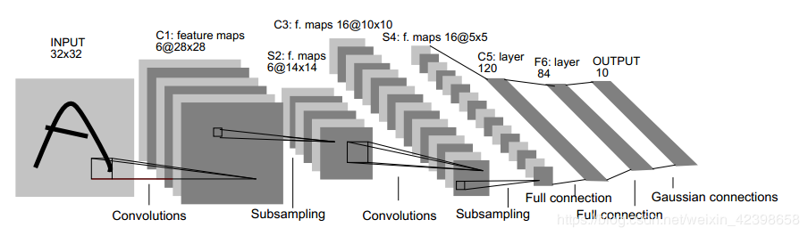
    
    

- **RNN**

  - 設計目標：時序資料處理，自然語言處理

  - 結構改進：RNN 雖然看似在 NN 外增加了時序間的橫向傳遞，但實際上還是依照時間遠近省略了部分連結

  - 衍伸應用：只要資料是有順序性的應用，都可以使用 RNN 來計算，近年在自然語⾔處理 (NLP) 上的應用反而成為大宗

    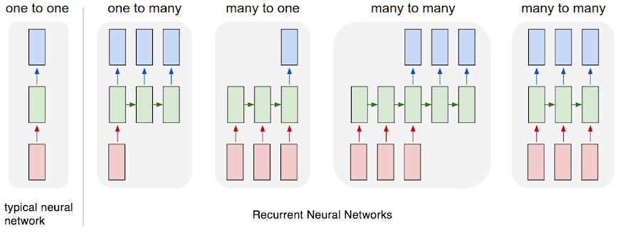


### 深度學習-巨觀結構

- 輸入層：
  - 輸入資料進入的位置，即我們的解釋變數
- 輸出層：
  - 輸出預測值的最後⼀層，可以是連續資料，二分類資料或多分類資料。當資料是多分類的資料時，需要轉換成虛擬變數
- 隱藏層：
  - 除了上述兩層外，其他層都稱為隱藏層
  - 隱藏層的流程
    1. 將 input 的 neuron * 權重 後加總
    2. 將加總後的資料透過activate function 進行線性與非線性的轉換，藉以放大有用的資料，或過濾掉雜訊。
  - 透過在 input 與 output 層之間加入Hidden Layer，每層Hidden Layer中的許多neuron，我們可以對input layer的資料做許多線性與非線性的轉換，自動做出許多特徵工程。藉以提升模型的解釋效度。
  - 但我們仍然需要對資料做特徵工程，藉以幫助模型更好的擬合模型。

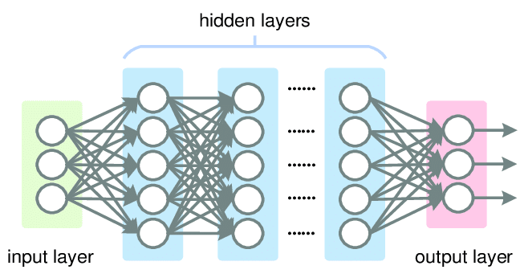


### 深度學習-微觀結構

由啟動函數轉換輸出，藉由預測與實際值差距的損失函數，用倒傳遞方式反覆更新權重，不斷縮小預測與實際結果間的落差，最終達成各種應用的學習目標。

- **啟動函數(Activation Function)**

  位於神經元內部，將上⼀層神經元的輸入總和，轉換成這⼀個神經元輸出值的函數

- **損失函數(Loss Function)**

  定義預測值與實際值的誤差大小

- **倒傳遞Back-Propagation)**

  將損失值倒傳遞回，轉換成類神經權重更新的方法

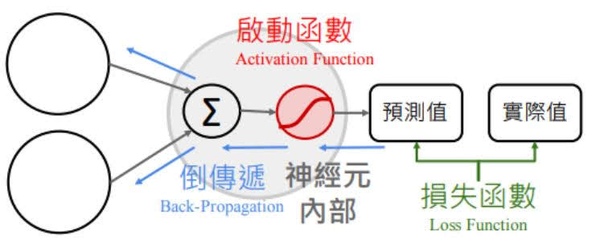

### Ref

- [神经网络的Python实现（一）了解神经网络](https://www.jianshu.com/p/a2bc960ee325)
- [神经网络的Python实现（二）全连接网络](https://www.jianshu.com/p/51c92cd4eb67)
- [神经网络的Python实现（三）卷积神经网络](https://www.jianshu.com/p/b6b9a1b0aabf)
- [Understanding Neural Networks](https://towardsdatascience.com/understanding-neural-networks-19020b758230)


## Forward Propagation

- A model is for making predictions, but how do neural network make predictions?
  - We refer to this as 'going in the forward direction'
- Important ways to extend the single neuron
  - The same imputs can be fed to multiple different neurons, each calculating something differnent(more neurons per layer)
  - Neurons in one layer can act as inputs to another layer
- Each neural network layer is a 'feature transformation'
- Making the line more compicated
  - 2 ways we can make our problem more complicated than 'finding a line'
    - Add more input dimensions
    - Make the pattern nonlinear that is what we are concerned with now
- Feature Engineering
  - Suppose salary is a quadratic function of years of experence
  - Problem: Too many  possibility
    - $x_1, x_1^2, x_1^3, ..., x_2, x_2^2, x_2^3, ....$
  - But in the neuron network, each neuron computes a differeny nonlinear feature of the input
  - It's nonlinear because of the activation funcion(ex: sigmoid) 
- 'Automatic' Feature Engineering
  - $W^\prime$ and $b^\prime$ are randomly initialized, found iteratively using gradient descent
  - In the Olden days og machine learning, feature engineering was at times the only way to apply ML successfully
  - Unfortunately this often requires domain knowledge
  - Deep learning allows people who are not domain experts to build models


## Activation Functions

- 激活函數定義了每個節點（神經元）的輸出和輸入關係的函數為神經元提供規模化非線性化能力，讓神經網絡具備強大的擬合能力

  

- 輸出值的範圍

  - 當激活函數輸出值是有限的時候，基於梯度的優化方法會更加穩定，因為特徵的表⽰受有限權值的影響更顯著
  - 當激活函數的輸出是無限的時候，模型的訓練會更加高效

- 激活函數的作用

  - 深度學習的基本原理是基於人工神經網絡，信號從⼀個神經元進入，經過非線性的 activation function
  - 如此循環往復，直到輸出層。正是由於這些非線性函數的反覆疊加，才使得神經網絡有⾜夠的 capacity 來抓取複雜的 pattern
  - 激活函數的最大作用就是非線性化，如果不用激活函數的話，無論神經網絡有多少層，輸出都是輸入的線性組合

  - 激活函數的另⼀個重要特徵是：它應該是可以區分，以便在網絡中向後推進以計算相對於權重的誤差（丟失）梯度時執行反向優化策略，然後相應地使用梯度下降或任何其他優化技術優化權重以減少誤差

- 常用激活函數介紹

  - Threshold Function
    $$
    \begin{cases}1, \quad if \quad x >= 0 \\0, \quad if \quad x <  0\end{cases}
    $$

  - **Sigmoid**

    - 特點是會把輸出限定在 0~1 之間，在 x<0 ，輸出就是 0，在 x>0，輸出就是 1，這樣使得數據在傳遞過程中不容易發散

      - 兩個主要缺點
        1. Sigmoid 容易過飽和，丟失梯度。這樣在反向傳播時，很容易出現梯度消失的情況，導致訓練無法完整
        2. Sigmoid 的輸出均值不是 0

    - Sigmoid 將⼀個 real value 映射到（0,1）的區間，用來做⼆分類。

      - 用於二分類的輸出層

      $$
      f(z) = \frac{1}{1+exp(-z)}
      $$

      

  - **Softmax**

    - Softmax 把⼀個 k 維的 real value 向量（a1,a2,a3,a4….）映射成⼀個（b1,b2,b3,b4….）其中 bi 是⼀個 0～1 的常數，輸出神經元之和為 1.0，所以可以拿來做多分類的機率預測
      - 為什麼要取指數
        1. 第⼀個原因是要模擬 max 的行為，所以要讓大的更大。
        2. 第⼆個原因是需要⼀個可導的函數
      - ⼆分類問題時 sigmoid 和 softmax 是⼀樣的，求的都是 cross entropy loss

    $$
    \sigma (z)_j = \frac {e^{zj}}{\Sigma^K_{k=1}e^{ek}}
    $$

    

  - **Tanh(Hyperbolic Tangent)**

    - 也稱為雙切正切函數，取值範圍為 [-1,1]。

      - 在特徵相差明顯時的效果會很好，在循環過程中會不斷擴大特徵效果

      - 將輸入值壓縮到 -1~1 的範圍，因此它是 0 均值的，解決了 Sigmoid 函數的非 zero-centered 問題，但是它也存在梯度消失和冪運算的問題。

        - The deeper a neural network is, the more terms have to be multiplied in the gradient due to the **chain rule** of calculus.

        - Because the neural network output is just a bunch of composite functions

        - Output = $\sigma(...\sigma(...\sigma(...\sigma(...\sigma(...)))))$

        - In other words, we end up multiplying by the derivative of the sigmoid over and over again

        - What's wrong with the derivative of the sigmoid?

        - Derivative of sigmoid is very tiny number! Maximun value is only 0.25

          

      - Why are tiny numbers a problem?

        - What is 0.25(max value) multiplied by itself 5 times?
          - $0.25^5\approx 0.001$
        - More realistically, what if we have 0.1 multiplied by itself 5 times?
          - $0.0^5\approx 0.00001$
        - Result: The further back we go in a neural network, the smaller the gradient becomes!

      - Modern deep networks have hundreds of layers

    - $tanh(x) = sinh(x)/cosh(x)$ is the same shape as sigmoid, but goes from -1 ... +1

    $$
    tanh(x)=2sigmoid(2x)-1
    $$

  - **ReLU**

    - 修正線性單元（Rectified linear unit，ReLU）

      - 在 x>0 時導數恆為1
        - 對於 x<0，其梯度恆為 0，這時候它也會出現飽和的現象，甚⾄使神經元直接無效，從而其權重無法得到更新（在這種情況下通常稱為 dying ReLU）
        - Leaky ReLU 和 PReLU 的提出正是為了解決這⼀問題
        - 使用時機：二分類的問題選擇sigmoid，其餘預設選ReLU

      $$
      f(x) = max(0, x)
      $$

    - In deep learning, we care about experimental results

      - It's not a problem if it works!

    - Simple fact: the ReLU works

      - The right side 'not vanishing' appears to be enough

  - **ELU**

    - ELU 函數是針對 ReLU 函數的⼀個改進型，相比於 ReLU 函數，在輸入為負數的情況下，是有⼀定的輸出的
      - 這樣可以消除 ReLU 死掉的問題
      - 還是有梯度飽和和指數運算的問題

    $$
      f(x) =\begin{cases}x\quad \quad \quad, x > 0 \\a(e^x-1),\quad x \leq  0\end{cases}
    $$

  - **PReLU**

    - 參數化修正線性單元（Parameteric Rectified Linear Unit，PReLU）屬於 ReLU 修正類激活函數的⼀員。

  - **Leaky ReLU**

    - 當 α=0.1 時，我們叫 PReLU 為Leaky ReLU，算是 PReLU 的⼀種特殊情況

    - In order to fix 'Dead Neurons', one solution is the Leaky ReLUU

    - Small positive slope for negative inputs(like 0.1)

      

    > PReLU 以及 Leaky ReLU 有⼀些共同點，即爲負值輸入添加了⼀個線性項。

  - **Maxout**

    - 是深度學習網絡中的⼀層網絡，就像池化層、卷積層⼀樣，可以看成是網絡的激活函數層
      - 神經元的激活函數是取得所有這些「函數層」中的最大值
      - 擬合能力是非常強的，優點是計算簡單，不會過飽和，同時⼜沒有 ReLU 的缺點
      - 缺點是過程參數相當於多了⼀倍

    $$
      f(x) = max(wT1x+b1, wT2x+b2)
    $$

  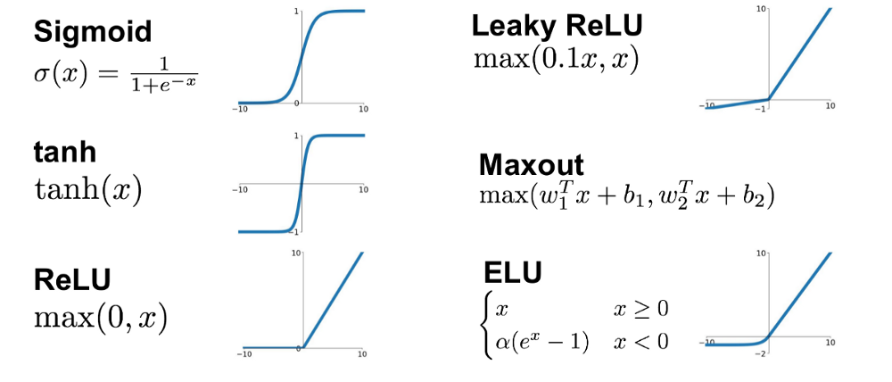

  - **BRU**
    - [Deep learning improved by biological activation functions](https://www.researchgate.net/publication/324860573_Deep_learning_improved_by_biological_activation_functions)

- 如何選擇正確的激活函數

  - Default: ReLu

    - Most people still use ReLU as a reasonable default
    - Sometimes, you'll find that LReLU and ELU offer no benefit
    - You just have to try it by yourself
    - Machine learning is experimentation, not philosophy

  - 根據各個函數的優缺點來配置

    - 如果使用 ReLU，要小⼼設置 learning rate，注意不要讓網絡出現很多「dead」 神經元，如果不好解決，可以試試 Leaky ReLU、PReLU 或者Maxout

  - 根據問題的性質

    - 用於分類器時，Sigmoid 函數及其組合通常效果更好
    - 由於梯度消失問題，有時要避免使用 sigmoid 和 tanh 函數。ReLU 函數是⼀個通用的激活函數，目前在大多數情況下使用
    - 如果神經網絡中出現死神經元，那麼 PReLU 函數就是最好的選擇
    - ReLU 函數建議只能在隱藏層中使用

  - 考慮 DNN 損失函數和激活函數

    - 如果使用 sigmoid 激活函數，則交叉熵損失函數⼀般肯定比均方差損失函數好；
    - 如果是 DNN 用於分類，則⼀般在輸出層使用 softmax 激活函數
    - ReLU 激活函數對梯度消失問題有⼀定程度的解決，尤其是在CNN模型中。

  - 梯度消失 Vanishing gradient problem

    - 原因：前面的層比後面的層梯度變化更小，故變化更慢
    - 結果：Output 變化慢 -> Gradient小 -> 學得慢
    - Sigmoid，Tanh 都有這樣特性
    - 不適合用在 Layers 多的DNN 架構

    

- 前述流程 / python程式對照

  - 激活函數可以通過設置單獨的激活層實現，也可以在構造層對象時通過傳遞 activation 參數實現：

    ```python
    from keras.layers import Activation,Dense
    model.add(Dense(64,activation=‘tanh’))
    ```

  - 考慮不同Backend support，通過傳遞⼀個元素運算的Theano / TensorFlow / CNTK函數來作為激活函數：

    ```python
    from keras import backend as k
    model.add(Dense(64,activation=k.tanh))
    model.add( Activation(k.tanh))
    ```

- 參考資料

  1. [神經網絡常用激活函數總結](https://zhuanlan.zhihu.com/p/39673127)
  2. [Reference 激活函數的圖示及其一階導數](https://dashee87.github.io/data science/deep learning/visualising-activation-functions-in-neural-networks/)
  3. [Maxout Network](https://arxiv.org/pdf/1302.4389v4.pdf)
  4. [Activation function](https://en.wikipedia.org/wiki/Activation_function)
  5. [整理Sigmoid~Dice常见激活函数，从原理到实现](https://blog.csdn.net/u010412858/article/details/104423623)


## 深度學習體驗平台

- [TensorFlow PlayGround](https://playground.tensorflow.org/) 是 Google 精⼼開發的體驗網⾴，提供學習者在接觸語⾔之前，就可以對深度學習能概略了解
- 平台上目前有 4 個分類問題與 2 個迴歸問題，要先切換右上問題種類後，再選擇左上的資料集

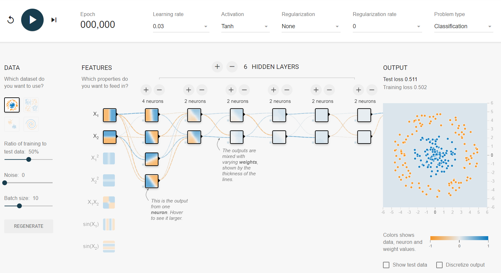


### 練習1：按下啟動，觀察指標變化

- 全部使用預設值，按下啟動按鈕，看看發⽣了什麼變化?
  - 遞迴次數（Epoch，左上）：逐漸增加
  - 神經元（中央）：方框圖案逐漸明顯，權重逐漸加粗，滑鼠移⾄上方會顯⽰權重
  - 訓練/測試誤差：開始時明顯下降，幅度漸漸趨緩
  - 學習曲線：訓練/測試誤差
  - 結果圖像化：圖像逐漸穩定

 - 後續討論觀察，如果沒有特別註明，均以訓練/測試誤差是否趨近 0 為主，這種情況我們常稱為收斂

### 練習2：增減隱藏層數

- 練習項目

  - 資料集切換：分類資料集(左下)-2 群，調整層數後啟動學習
  - 資料集切換：分類資料集(左上)-同⼼圓，調整層數後啟動學習
  - 資料集切換：迴歸資料集(左)-對⾓線，調整層數後啟動學習

  

- 實驗結果

  - 2 群與對⾓線：因資料集結構簡單，即使沒有隱藏層也會收斂
  - 同⼼圓：資料及稍微複雜 (無法線性分割)，因此最少要⼀層隱藏層才會收斂

### 練習3：增減神經元數

- 練習項目

  - 資料集切換：分類資料集(左上)-同⼼圓，隱藏層設為 1 後啟動學習
  - 切換不同隱藏層神經元數量後，看看學習效果有何不同？

- 實驗結果

  - 當神經元少於等於兩個以下時，將無法收斂(如下圖)

    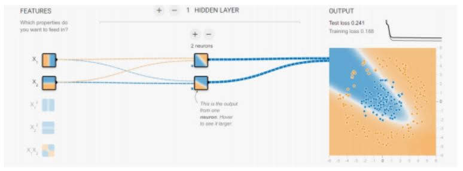

### 練習4：切換不同特徵

- 練習項目

  - 資料集切換：分類資料集(左上)-同⼼圓，隱藏層 1 層，隱藏神經元 2 個
  - 切換 任選不同的 2 個特徵 後啟動，看看學習效果有何不同?

- 實驗結果

  - 當特徵選到兩個特徵的平方時，即使中間只有 2 個神經元也會收斂

    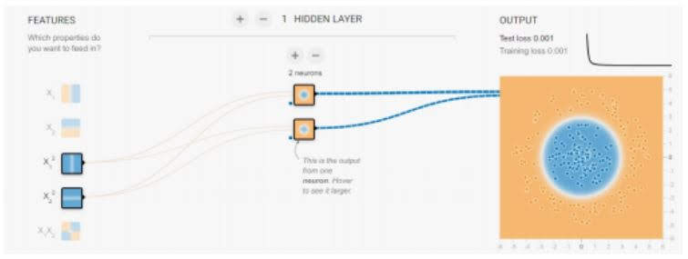

### 練習 5：切換批次大小

- 練習項目

  - 資料集切換:分類資料集(右下)-螺旋雙臂，特徵全選，隱藏層1層/8神經元
  - 調整 不同的批次大小後執行500次遞迴，看看學習效果有何不同?

- 實驗結果

  - 批次大小很小時，雖然收斂過程非常不穩定，但平均而⾔會收斂到較好的結果

  - 實務上，批次大小如果極小的效果確實比較好，但計算時間會相當久，因此通常會依照時間需要而折衷

    

### 練習 6：切換學習速率

- 練習項目

  - 資料集切換：分類資料集(右下)-螺旋雙臂，特徵全選，隱藏層 1 層 /8 神經元，批次大小固定 10
  - 調整 不同的學習速率 後執行 500 次遞迴，看看學習效果有何不同?

- 實驗結果

  - 學習速率較大時，收斂過程會越不穩定，但會收斂到較好的結果

  - 大於 1 時 因為過度不穩定而導致無法收斂

    

### 練習 7：切換啟動函數

- 練習項目
  - 資料集切換 : 分類資料集(右下)-螺旋雙臂，特徵全選，隱藏層 1層 /8 神經元，批次大小固定 10，學習速率固定 1
  - 調整不同的啟動函數 後執行500次遞迴，看看學習效果有何不同?
- 實驗結果
  - 在這種極端的情形下，Tanh會無法收斂，Relu很快就穩定在很糟糕的分類狀態，惟有Sigmoid還可以收斂到不錯的結果
  - 但實務上，Sigmoid需要大量計算時間，而Relu則相對快得很多，這也是需要取捨的，在本例中因位只有⼀層，所以狀況不太明顯

### 練習 8：切換正規化選項與參數

- 練習項目
  - 資料集切換:分類資料集(右下)-螺旋雙臂，特徵全選，隱藏層1層/8神經元，批次大小固定 10，學習速率固定 0.3，啟動函數設為 Tanh
  - 調整不同的正規化選項與參數後執行500次遞迴，看看學習效果有何不同?

- 實驗結果
  - 我們已經知道上述設定本來就會收斂，只是在較小的 L1 / L2 正規劃參數下收斂比較穩定⼀點
  - 但正規化參數只要略大，反而會讓本來能收斂的設定變得無法收斂，這點 L1 比 L2情況略嚴重，因此本例中最適合的正規化參數是 L2 + 參數 0.001
  - 實務上：L1 / L2 較常使用在非深度學習上，深度學習上效果有限

### 重點摘錄

- 雖然圖像化更直覺，但是並非量化指標且可視化不容易，故深度學習的觀察指標仍以損失函數/誤差為主
- 對於不同資料類型，適合加深與加寬的問題都有，但加深適合的問題類型較多
- 輸入特徵的選擇影響結果甚鉅，因此深度學習也需要考慮特徵工程
- 批次大小越小 : 學習曲線越不穩定、但收斂越快
- 學習速率越大 : 學習曲線越不穩定、但收斂越快，但是與批次大小不同的是，學習速率大於⼀定以上時，有可能不穩定到無法收斂
- 當類神經網路層數不多時，啟動函數 Sigmoid / Tanh 的效果比 Relu 更好
- L1 / L2 正規化在非深度學習上效果較明顯，而正規化參數較小才有效果

### Ref

- [深度学习网络调参技巧](https://zhuanlan.zhihu.com/p/24720954)


## Keras 簡介與安裝

### When to ues Keras?

- If you fon't need low-level control of your training process, using Keras's built-in `fit`, `evaluate`, and `predict` methods is recommended.
- 

### Keras 簡介

- Keras 是易學易懂的深度學習套件

  - Keras 設計出發點在於容易上⼿，因此隱藏了很多實作細節，雖然自由度稍嫌不夠，但很適合教學
  - Keras 實作並優化了各式經典組件，因此即使是同時熟悉TensorFlow 與Keras 的老⼿，開發時也會兩者並用互補

- Keras包含的組件有哪些?

  - Keras 的組件很貼近直覺，因此我們可以用 TensorFlow PlayGround 體驗所學到的概念，分為兩大類來理解 ( 非⼀⼀對應 )
  - 模型形狀類
    - 直覺概念：神經元數 / 隱藏層數 / 啟動函數
    - Keras組件 : Sequential Model / Functional Model / Layers
  - 配置參數類
    - 直覺概念：學習速率 / 批次大小 / 正規化
    - Keras組件 : Optimier / Reguliarizes / Callbacks

- 深度學習寫法封裝

  - TensorFlow 將深度學習中的 GPU/CPU指令封裝起來，減少語法差異，Keras 則是將前者更進⼀步封裝成單⼀套件，用少量的程式便能實現經典模型

- Keras的後端

  - Keras 的實現，實際上完全依賴 TensorFlow 的語法完成，這種情形我們稱 TensorFlow 是 Keras 的⼀種後端(Backend)

- Keras/TensorFlow的比較

  |          | Keras        | Tensorflow                     |
  | -------- | ------------ | ------------------------------ |
  | 學習難度 | 低           | 高                             |
  | 模型彈性 | 中           | 高                             |
  | 主要差異 | 處理神經層   | 處理資料流                     |
  | 代表組件 | Layers/Model | Tensor / Session / Placeholder |

### Keras 安裝

- 安裝方法

  - 由於 Anaconda 已經會自動幫忙安裝 CUDA / cuDNN 因此我們只需要創造一個 tensorflow 的虛擬環境，啟動 jupyter 後輸入直接安裝 gpu 版的 tensorflow 即可!

  - 安裝完後，建議重新啟動電腦 / restart kernel 後再跑相關語法!

    ```python
    conda create --name tensorflow
    activate tensorflow
    jupyter lab
    conda install tensorflow-gpu
    conda install keras
    ```


### Ref

- https://keras.io/
- https://www.tensorflow.org/guide/keras/train_and_evaluate
- https://www.tensorflow.org/tutorials/distribute/keras
- [Keras: The Python Deep Learning library](https://keras.io/)
- [别再使用pip安装TensorFlow了！用conda吧](https://zhuanlan.zhihu.com/p/46579831)


## Dataset 介紹與應用

### Dataset 介紹

- **CIFAR10**

  - CIFAR10 small image classification
  
  - Dataset of 50,000 32x32 color training images, labeled over 10 categories, and 10,000 test images.
  
    ```python
    from keras.datasets import cifar10
    (x_train, y_train), (x_test, y_test) = cifar10.load_data()
    ```

- **CIFAR100**

  - CIFAR100 small image classification

  - Dataset of 50,000 32x32 color training images, labeled over 100 categories, and 10,000 test images.

    ```python
    from keras.datasets import cifar100
    (x_train, y_train), (x_test, y_test) = cifar100.load_data(label_mode='fine')
    ```

- **MNIST database**

  - MNIST database of handwritten digits

  - Dataset of 60,000 28x28 grayscale images of the 10 digits, along with a test set of 10,000 images.

    ```python
    from keras.datasets import mnist
    (x_train, y_train), (x_test, y_test) = mnsit.load_data() 
    ```

- **Fashion-MNIST**

  - Fashion-MNIST database of fashion articles

  - Dataset of 60,000 28x28 grayscale images of 10 fashion categories, along with a test set of 10,000 images. This dataset can be used as a drop-in replacement for MNIST. 

    ```python
    from keras.datasets import fashion_mnsit
    (x_train, y_train), (x_test, y_test) = fashion_mnsit.load_data()
    ```

- **Boston housing price**

  - Boston housing price regression dataset

  - Dataset taken from the StatLib library which is maintained at Carnegie Mellon University.

  - Samples contain 13 attributes of houses at different locations around the Boston suburbs in the late 1970s. Targets are the median values of the houses at a location (in k$).

    ```python
    from keras.datasets import boston_housing
    (x_train, y_train), (x_test, y_test) = boston_housing.load_data()
    ```

- **IMDB電影評論情緒分類**

  - 來自 IMDB 的 25,000 部電影評論的數據集，標有情緒（正面/負面）。評論已經過預處理，每個評論都被編碼為⼀系列單詞索引（整數）。

    ```python
    from keras.datasets import imdb
    (x_train, y_train), (x_test, y_test) = imdb.load_data(path='imdb.npz', 
                                                          num_words=None,
                                                          skip_top=0, 
                                                          maxlen=None, 
                                                          seed=113, 
                                                          start_char=1, 
                                                          oov_char=2, 
                                                          index_from=3)
    ```
  
- **路透社新聞專題主題分類**

  - 來自路透社的 11,228 條新聞專線的數據集，標註了 46 個主題。與 IMDB 數據集⼀樣，每條線都被編碼為⼀系列字索引

    ```python
    from keras.datasets import reuters
    (x_train, y_train), (x_test, y_test) = reuters.load_data(path='reuters npz', 
                                                             num_words=None,
                                                             skip_top=0,
                                                             maxlen=None,
                                                             test_split=0.2,
                                                             seed=113,
                                                             start_char=1,
                                                             oov_char=2,
                                                             index_from=3)
    ```

- **[Imagenet](http://www.image-net.org/about-stats)**

  - Imagenet數據集有1400多萬幅圖片，涵蓋2萬多個類別；其中有超過百萬的圖片有明確的類別標註和圖像中物體位置的標註。

  - Imagenet數據集是目前深度學習圖像領域應用得非常多的一個領域，關於圖像分類、定位、檢測等研究工作大多基於此數據集展開。Imagenet數據集文檔詳細，有專門的團隊維護，使用非常方便，在計算機視覺領域研究論文中應用非常廣，幾乎成為了目前深度學習圖像領域算法性能檢驗的“標準”數據集。
  - 數據集大小：~1TB（ILSVRC2016比賽全部數據）

- **[COCO](http://mscoco.org/)**

  - COCO(Common Objects in Context)是一個新的圖像識別、分割和圖像語義數據集。

  - COCO數據集由微軟贊助，其對於圖像的標註信息不僅有類別、位置信息，還有對圖像的語義文本描述，COCO數據集的開源使得近兩三年來圖像分割語義理解取得了巨大的進展，也幾乎成為了圖像語義理解算法性能評價的“標準”數據集。


### Dataset 應用

- 適用於⽂本分析與情緒分類
  - IMDB 電影評論情緒分類
  - 路透社新聞專題主題分類
- 適用於 Data / Numerical 學習
  - Boston housing price regression dataset
- 適用於影像分類與識別學習
  - CIFAR10/CIFAR100
  - MNIST/ Fashion-MNIST
- 針對小數據集的深度學習
  - 數據預處理與數據提升

  

### Ref

1. [Keras: The Python Deep Learning library](https://github.com/keras-team/keras/)
2. [Keras dataset](https://keras.io/datasets/)
3. [Predicting Boston House Prices](https://www.kaggle.com/sagarnildass/predicting-boston-house-prices)


## Keras Sequential API

### 序列模型

- 序列模型是多個網路層的線性堆疊。

- Sequential 是⼀系列模型的簡單線性疊加，可以在構造函數中傳入⼀些列的網路層：

  ```python
  from keras.models import Sequential
  from keras.layers import Dense, Activation
  model = Sequential([Dense(32, _input_shap=(784,)), Activation(“relu”)
  ```

- 也可以透過 .add 疊加

  ```python
  model = Sequential()
  model.add(Dense(32, _input_dim=784))
  model.add(Activation(“relu”))
  ```

  

### Keras 框架回顧


### 指定模型的輸入維度

- Sequential 的第⼀層需要知道輸入的shape(只有第⼀層，後面的層會自動匹配)
  - 在第⼀層加入⼀個 input_shape 參數，input_shape 應該是⼀個 shape 的 tuple 資料類型
  - input_shape 是⼀系列整數的 tuple，某些位置可為 None
  - input_shape 中不用指明 batch_size 的數目

- 2D 的網路層，如 Dense，允許在層的構造函數的 input_dim 中指定輸入的維度
- 對於某些 3D 時間層，可以在構造函數中指定 input_dim 和 input_length 來實現
- 對於某些 RNN，可以指定 batch_size。這樣後面的輸入必須是(batch_size, input_shape)的輸入

- 常用參數

  - Dense：實現全連接層

    ```python
    Dense(units,activation,use_bias=True, kernel_initializer='glorot_uniform', bias_initializer='zeros')
    ```

  - Activation：對上層輸出應用激活函數

    ```python
    Activation(activation)
    ```

  - Dropout：對上層輸出應用 dropout 以防⽌過擬合

    ```python
    Dropout(ratio)
    ```

  - Flatten:對上層輸出⼀維化

    ```python
    Flatten()
    ```

  - Reahape:對上層輸出 reshape  

    ```python
    Reshape(target_shape)
    ```

### Sequential 模型

  - Sequential 序列模型為最簡單的線性、從頭到尾的結構順序，⼀路到底
  - Sequential 模型的基本元件⼀般需要：
    1. Model: 宣告
    2. model.add: 添加層
    3. model.compile: 模型訓練
    4. model.fit: 模型訓練參數設置 + 訓練
    5. 模型評估
    6. 模型預測

  ```python
  model = Sequential()
  model.add(Conv2D(64, 3,3), padding='same', input_shape=x_train.shape[1:]))
  model.add(Activation('relu'))
  model.add(Conv2D(128, (3,3)))
  model.add(Activation('relu'))
  model.add(MaxPooling2D(pool_size=(2,2)))
  model.add(Dropout(0.25))
  
  model.add(Flatten())
  model.add(Dense(512))
  model.add(Activation('relu'))
  model.add(Dropout(0.5))
  model.add(Dense(num_classes))
  model.add(Activation('softmax'))
  ```


### 參考資料

- [Getting started with the Keras Sequential model](https://keras.io/getting-started/sequential-model-guide/)

- [Keras 中文文档](https://keras.io/zh/)


## Keras Functional API

- Keras 函數式模型接⼝是用⼾定義多輸出模型、非循環有向模型或具有共享層的模型等複雜模型的途徑

- 定義復雜模型（如多輸出模型、有向無環圖，或具有共享層的模型）的方法。

- 所有的模型都可調用，就像網絡層⼀樣

  - 利用函數式API，可以輕易地重用訓練好的模型：可以將任何模型看作是⼀個層，然後通過傳遞⼀個張量來調用它。注意，在調用模型時，您不僅重用模型的結構，還重用了它的權重。
  - 具有多個輸入和輸出的模型。函數式 API 使處理大量交織的數據流變得容易。
    - 試圖預測 Twitter 上的⼀條新聞標題有多少轉發和點贊數
    - 模型的主要輸入將是新聞標題本⾝，即⼀系列詞語。
    - 但是為了增添趣味，我們的模型還添加了其他的輔助輸入來接收額外的數據，例如新聞標題的發布的時間等。
    - 該模型也將通過兩個損失函數進行監督學習。較早地在模型中使用主損失函數，是深度學習模型的⼀個良好正則方法。
  - 函數式API 的另⼀個用途是使用共享網絡層的模型。
    - 來考慮推特推⽂數據集。我們想要建立⼀個模型來分辨兩條推⽂是否來自同⼀個人（例如，通過推⽂的相似性來對用⼾進行比較）。
    - 實現這個目標的⼀種方法是建立⼀個模型，將兩條推⽂編碼成兩個向量，連接向量，然後添加邏輯回歸層；這將輸出兩條推⽂來自同⼀作者的概率。模型將接收⼀對對正負表⽰的推特數據。
    - 由於這個問題是對稱的，編碼第⼀條推⽂的機制應該被完全重用來編碼第⼆條推⽂（權重及其他全部）。

- 函數式API 與 順序模型

  - 模型需要多於⼀個的輸出，那麼你總應該選擇函數式模型。
    - 函數式模型是最廣泛的⼀類模型，序貫模型（Sequential）只是它的⼀種特殊情況。
  - 延伸說明
    - 層對象接受張量為參數，返回⼀個張量。
    - 輸入是張量，輸出也是張量的⼀個框架就是⼀個模型，通過 Model 定義。
    - 這樣的模型可以被像 Keras 的 Sequential ⼀樣被訓練

- Keras 函數式模型接⼝是用⼾定義多輸出模型、非循環有向模型或具有共享層的模型等複雜模型的途徑

- 延伸說明

  - 層對象接受張量為參數，返回⼀個張量。
  - 輸入是張量，輸出也是張量的⼀個框架就是⼀個模型，通過 Model 定義。
  - 這樣的模型可以被像 Keras 的 Sequential ⼀樣被訓練

- 如何設定

  使用函數式模型的⼀個典型場景是搭建多輸入、多輸出的模型

  ```python
  from keras.layers import Input
  from keras.models import Model
  main_input = Input(shape=(100,), dtype='int32', name='main_input')
  ```


### 參考資料

[Getting started with the Keras functional API](https://keras.io/getting-started/functional-api-guide/)


## Multi-Layer Perception

- Multi-Layer Perceptron (MLP)：MLP 為⼀種監督式學習的演算法，可以使用非線性近似將資料分類或進行迴歸運算

- 多層感知機其實就是可以用多層和多個 perception 來達到最後目的

- 在機器學習領域像是我們稱為 multiple classification system 或是 ensemble learning

- 深度神經網路(deep neural network, DNN)，神似人工神經網路的 MLP

- 若每個神經元的激活函數都是線性函數，那麼，任意層數的 MLP 都可被約簡成⼀個等價的單層感知器

- 多層感知機是⼀種前向傳遞類神經網路，⾄少包含三層結構(輸入層、隱藏層和輸出層)，並且利用到「倒傳遞」的技術達到學習(model learning)的監督式學習，以上是傳統的定義。

- 現在深度學習的發展，其實MLP是深度神經網路(deep neural network, DNN)的⼀種special case，概念基本上⼀樣，DNN只是在學習過程中多了⼀些⼿法和層數會更多更深。

  - 以NN的組成為例

    

  - Multi-Layer Perceptron(多層感知器): NN 的結合

    

- **MLP優缺點**

  - **優點**
    - 有能力建立非線性的模型
    - 可以使用 partial_fit​ 建立 realtime模型
  - **缺點**
    - 擁有大於⼀個區域最小值，使用不同的初始權重，會讓驗證時的準確率浮動
    - MLP 模型需要調整每層神經元數、層數、疊代次數
    - 對於特徵的預先處理很敏感

- 參考資料

  - [機器學習-神經網路(多層感知機 Multilayer perceptron, MLP)運作方式](https://medium.com/@chih.sheng.huang821/機器學習-神經網路-多層感知機-multilayer-perceptron-mlp-運作方式-f0e108e8b9af)

  - [多層感知機](https://zh.wikipedia.org/wiki/多层感知器)


## 損失函數

- 機器學習中所有的算法都需要最大化或最小化的⼀個函數，這個函數被稱為「目標函數」。其中，我們⼀般把最小化的⼀類函數，稱為「損失函數」。它能根據預測結果，衡量出模型預測能力的好壞
- 損失函數中的損失就是「實際值和預測值的落差」，根據不同任務會需要使用不同的損失函數，並將損失降到最低
- 損失函數大致可分為：分類問題的損失函數和回歸問題的損失函數

- 損失函數為什麼是最小化?
  - 期望：希望模型預測出來的東⻄可以跟實際的值⼀樣
  - 預測出來的東⻄基本上跟實際值都會有落差
    - 在回歸問題稱為「殘差(residual)」
    - 在分類問題稱為「錯誤率(errorrate)」

  - 損失函數中的損失就是「實際值和預測值的落差」
  - 在以下的說明中，y 表⽰實際值，ŷ 表⽰預測值


- 損失函數的分類介紹

  - **mean_squared_error**

    - 就是最小平方法(Least Square) 的目標函數-- 預測值與實際值的差距之平方值。
      $$
      \sum (\hat y - y)^2/N
      $$

    - 另外還有其他變形的函數, 如

      - mean_absolute_error
      - mean_absolute_percentage_error
      - mean_squared_logarithmic_error

      - 使用時機為處理 y 為數值資料的迴歸問題

      - Keras 上的調用方式：

        ```python
        from keras import losses
        model.compile(loss= 'mean_squared_error', optimizer='sgd')
        # 其中，包含 y_true， y_pred 的傳遞，函數式表達如下：
        keras.losses.mean_squared_error(y_true, y_ped)
        ```

  - **Cross Entropy**

    - 當預測值與實際值愈相近，損失函數就愈小，反之差距很大，就會更影響損失函數的值要用 Cross Entropy 取代 MSE，因為，在梯度下時，Cross Entropy 計算速度較快。

    - 使用時機：

      - 整數目標：Sparse categorical_crossentropy
      - 分類目標：categorical_crossentropy
      - 二分類目標：binary_crossentropy

    - Keras 上的調用方式：

      ```python
      from keras import losses
      model.compile(loss= 'categorical_crossentropy', optimizer='sgd’)
      # 其中, 包含 y_true， y_pred 的傳遞, 函數是表達如下：
      keras.losses.categorical_crossentropy(y_true, y_pred)
      ```

  - **Hinge Error (hinge)**

    - 是⼀種單邊誤差，不考慮負值，同樣也有多種變形，squared_hinge, categorical_hinge

    - 適用於『⽀援向量機』(SVM)的最大間隔分類法(maximum-margin classification)

    - Keras 上的調用方式：

      ```python
      from keras import losses
      model.compile(loss= 'hinge', optimizer='sgd’)
      # 其中，包含 y_true，y_pred 的傳遞, 函數是表達如下:
      keras.losses.hinge(y_true, y_pred) 
      ```

  - **自定義損失函數**

    - 根據問題的實際情況，定制合理的損失函數

    - 舉例：預測果汁⽇銷量問題，如果預測銷量大於實際銷量則會損失成本；如果預測銷量小於實際銷量則會損失利潤。

      - 考慮重點：製造⼀盒果汁的成本和銷售⼀盒果汁的利潤不是等價的

      - 需要使用符合該問題的自定義損失函數自定義損失函數為：
        $$
        loss = \sum nf(y_, y)
        $$
      
    - 損失函數表⽰若預測結果 y 小於標準答案 y_ ，損失函數為利潤乘以預測結果 y 與標準答案之差
    
    - 若預測結果 y 大於標準答案 y_，損失函數為成本乘以預測結果 y 與標準答案之差用
    
    - Tensorflow 函數表⽰為
      
      ```python
      loss = tf.reduce_sum(tf.where(tf.greater(y, y_), COST*(y-y_), PROFIT*(y_-y)))
      ```

- 參考資料

  1. [TensorFlow筆記-06-神經網絡優化-損失函數，自定義損失函數，交叉熵](https://blog.csdn.net/qq_40147863/article/details/82015360)
  2. [Hinge_loss](https://en.wikipedia.org/wiki/Hinge_loss)
  3. [使用損失函數](https://keras.io/losses/)


## Learning rate

- η ⼜稱學習率，是⼀個挪動步長的基數，df(x)/dx是導函數，當離得遠的時候導數大，移動的就快，當接近極值時，導數非常小，移動的就非常小，防⽌跨過極值點

- Learning rate 選擇，實際上取值取決於數據樣本，如果損失函數在變小，說明取值有效，否則要增大 Learning rate

- 機器學習算法當中，優化算法的功能，是通過改善訓練方式，來最小化(或最大化)損失函數，當中最常用的優化算法就是梯度下降

  - 通過尋找最小值，控制方差，更新模型參數，最終使模型收斂

    - 梯度下降法的過程

      - ⾸先需要設定⼀個初始參數值，通常情況下將初值設為零(w=0)，接下來需要計算成本函數 cost
      - 然後計算函數的導數-某個點處的斜率值，並設定學習效率參數(lr)的值。
      - 重複執行上述過程，直到參數值收斂，這樣我們就能獲得函數的最優解

      

  - 目的：沿著目標函數梯度下降的方向搜索極小值（也可以沿著梯度上升的方向搜索極大值）

  - 要計算 Gradient Descent，考慮

    - Loss = 實際 ydata – 預測 ydata 

      ​     = w* 實際 xdata – w*預測 xdata (bias 為 init value，被消除)

    - Gradient =  ▽f($\theta$) (Gradient = $\partial$L/$\partial$w)

    - 調整後的權重 = 原權重 – $\eta$(Learning rate) * Gradient
      $$
      w ←w- η  ∂L/∂w
      $$
      

- 梯度下降法的缺點包括：

  - 靠近極小值時速度減慢

  - 直線搜索可能會產⽣⼀些問題

  - 可能會「之字型」地下降

- 避免局部最佳解(Avoid local minima)

  - Gradient descent never guarantee global minima
  - Different initial point will be caused reach different minima, so different results

- 在訓練神經網絡的時候，通常在訓練剛開始的時候使用較大的 learning rate，隨著訓練的進行，我們會慢慢的減小 learning rate ，具體就是每次迭代的時候減少學習率的大小，更新公式

  - 學習率較小時，收斂到極值的速度較慢
  - 學習率較大時，容易在搜索過程中發⽣震盪
  - 相關參數:
    - decayed_learning_rate 哀減後的學習率
    - learning_rate 初始學習率
    - decay_rate 哀減率
    - global_step 當前的 step
    - decay_steps 哀減週期

- η ⼜稱學習率，是⼀個挪動步長的基數，df(x)/dx是導函數，當離得遠的時候導數大，移動的就快，當接近極值時，導數非常小，移動的就非常小，防⽌跨過極值點

- 學習率對梯度下降的影響

  - 學習率定義了每次疊代中應該更改的參數量。換句話說，它控制我們應該收斂到最低的速度或速度

  - 小學習率可以使疊代收斂，大學習率可能超過最小值

    

- 自動更新 Learning rate - 衰減因⼦ decay

  - 算法參數的初始值選擇。初始值不同，獲得的最小值也有可能不同，因此梯度下降求得的只是局部最小值；當然如果損失函數是凸函數則⼀定是最優解。

  - 學習率衰減公式

    - lr_i = lr_start * 1.0 / (1.0 + decay * i)

    - 其中 lr_i 為第⼀迭代 i 時的學習率，lr_start 為初始值，decay 為⼀個介於[0.0, 1.0]的小數。從公式上可看出：

      > decay 越小，學習率衰減地越慢，當 decay = 0時，學習率保持不變
      >
      > decay 越大，學習率衰減地越快，當 decay = 1時，學習率衰減最快

  - 使用 momentum 是梯度下降法中⼀種常用的加速技術。Gradient Descent 的實現：SGD, 對於⼀般的SGD，其表達式為

    - 隨著 iteration 改變 Learning
      - 衰減越大，學習率衰減地越快。 衰減確實能夠對震盪起到減緩的作用

  - momentum

    - 如果上⼀次的 momentum 與這⼀次的負梯度方向是相同的，那這次下降的幅度就會加大，所以這樣做能夠達到加速收斂的過程
    - 如果上⼀次的 momentum 與這⼀次的負梯度方向是相反的，那這次下降的幅度就會縮減，所以這樣做能夠達到減速收斂的過程

  $$
  X ← x -a * dx
  $$

  - 而帶 momentum 項的 SGD 則寫⽣如下形式：

  $$
  v = \beta * v -a*dx 
  $$

  $$
  X ← x + v
  $$

  

  - 其中 ß 即 momentum 係數，通俗的理解上面式⼦就是，如果上⼀次的 momentum（即ß ）與這⼀次的負梯度方向是相同的，那這次下降的幅度就會加大，所以這樣做能夠達到加速收斂的過程


- 要使用梯度下降法找到⼀個函數的局部極小值，必須向函數上當前點對應梯度（或者是近似梯度）的反方向的規定步長距離點進行疊代搜索。
  - avoid local minima
    - Item-1：在訓練神經網絡的時候，通常在訓練剛開始的時候使用較大的learning rate，隨著訓練的進行，我們會慢慢的減小 learning rate
      - 學習率較小時，收斂到極值的速度較慢。
      - 學習率較大時，容易在搜索過程中發⽣震盪
    - Item-2：隨著 iteration 改變 Learning
      - 衰減越大，學習率衰減地越快。 衰減確實能夠對震盪起到減緩的作用
    - Item-3：momentum
      - 如果上⼀次的 momentum 與這⼀次的負梯度方向是相同的，那這次下降的幅度就會加大，所以這樣做能夠達到加速收斂的過程
      - 如果上⼀次的 momentum 與這⼀次的負梯度方向是相反的，那這次下降的幅度就會縮減，所以這樣做能夠達到減速收斂的過程

- 參考資料
  - [知乎 - Tensorflow中learning rate decay](https://zhuanlan.zhihu.com/p/32923584)
  - [機器/深度學習-基礎數學篇(一):純量、向量、矩陣、矩陣運算、逆矩陣、矩陣轉置介紹](https://medium.com/@chih.sheng.huang821/機器學習-基礎數學篇-一-1c8337179ad6?source=post_page---------------------------)
  - [機器/深度學習-基礎數學(二):梯度下降法(gradient descent)](https://medium.com/@chih.sheng.huang821/機器學習-基礎數學-二-梯度下降法-gradient-descent-406e1fd001f?source=post_page---------------------------)
  - [機器/深度學習-基礎數學(三):梯度最佳解相關算法(gradient descent optimization algorithms)](https://medium.com/@chih.sheng.huang821/機器學習-基礎數學-三-梯度最佳解相關算法-gradient-descent-optimization-algorithms-b61ed1478bd7?source=post_page---------------------------)
  - [五步解析机器学习难点—梯度下降](https://zhuanlan.zhihu.com/p/27297638)
  - [機器學習-梯度下降法](https://www.jianshu.com/p/31740cd2ca48)
  - [gradient descent using python and numpy](https://stackoverflow.com/questions/17784587/gradient-descent-using-python-and-numpy)
  - [梯度下降算法的參數更新公式](https://blog.csdn.net/hrkxhll/article/details/80395033)


## BackPropagation

- 反向傳播（BP：Backpropagation）是「誤差反向傳播」的簡稱，是⼀種與最優化方法（如梯度下降法）結合使用的該方法對網路中所有權重計算損失函數的梯度。這個梯度會反饋給最優化方法，用來更新權值以最小化損失函數。
- 反向傳播要求有對每個輸入值想得到的已知輸出，來計算損失函數梯度。因此，它通常被認為是⼀種監督式學習方法，可以對每層疊代計算梯度。反向傳播要求人工神經元（或「節點」）的啟動函數可微
- BP 神經網路是⼀種按照逆向傳播算法訓練的多層前饋神經網路
  - 優點：具有任意複雜的模式分類能力和優良的多維函數映射能力，解決了簡單感知器
    不能解決的異或或者⼀些其他的問題。
    - 從結構上講，BP 神經網路具有輸入層、隱含層和輸出層。
    - 從本質上講，BP 算法就是以網路誤差平方目標函數、採用梯度下降法來計算目標函數的最小值。

  - 缺點：
    - 學習速度慢，即使是⼀個簡單的過程，也需要幾百次甚⾄上千次的學習才能收斂
    - 容易陷入局部極小值
    - 網路層數、神經元個數的選擇沒有相應的理論指導
    - 網路推廣能力有限

  - 應用：
    - 函數逼近
    - 模式識別
    - 分類
    - 數據壓縮
  - 流程
    - 第1階段：解函數微分
    - 每次疊代中的傳播環節包含兩步：
      - （前向傳播階段）將訓練輸入送入網路以獲得啟動響應
      - （反向傳播階段）將啟動響應同訓練輸入對應的目標輸出求差，從而獲得輸出層和隱藏層的響應誤差
    - 第2階段：權重更新
      - Follow Gradient Descent
      - 第 1 和第 2 階段可以反覆循環疊代，直到網路對輸入的響應達到滿意的預定的目標範圍為⽌。


- 參考資料

1. [Backpropagation](https://en.wikipedia.org/wiki/Backpropagation)
2. [BP神經網絡的原理及Python實現](https://blog.csdn.net/conggova/article/details/77799464)
3. [完整的結構化代碼見於](https://github.com/conggova/SimpleBPNetwork.git)
4. [深度學習-BP神經網絡(python3代碼實現)](https://blog.csdn.net/weixin_41090915/article/details/79521161)


## Optimizers

- 什麼是Optimizer

  - 機器學習算法當中，大部分算法的本質就是建立優化模型，通過最優化方法對目標函數進行優化從而訓練出最好的模型
  - 優化算法的功能，是通過改善訓練方式，來最小化(或最大化)損失函數 E(x)
  - 優化策略和算法，是用來更新和計算影響模型訓練和模型輸出的網絡參數，使其逼近或達到最優值

- 常用的優化算法

  - Gradient Descent

    - 最常用的優化算法是梯度下降

      - 這種算法使用各參數的梯度值來最小化或最大化損失函數E(x)。

    - 通過尋找最小值，控制方差，更新模型參數，最終使模型收斂

    - 複習⼀下，前面提到的 Gradient Descent

      > wi+1 = wi - di·ηi, i=0,1,…
      >
      > - 參數 η 是學習率。這個參數既可以設置為固定值，也可以用⼀維優化方法沿著訓練的方向逐步更新計算
      > - 參數的更新分為兩步：第⼀步計算梯度下降的方向，第⼆步計算合適的學習

  - Momentum

    > ⼀顆球從⼭上滾下來，在下坡的時候速度越來越快，遇到上坡，方向改變，速度下降

    $$
    V_t ← \beta V_{t-1}-\eta \frac{\partial L}{\partial w}
    $$

    - $V_t$ :方向速度，會跟上一次的更新相關
    - 如果上⼀次的梯度跟這次同方向的話，|Vt|(速度)會越來越大(代表梯度增強)，W參數的更新梯度便會越來越快，
    - 如果方向不同，|Vt|便會比上次更小(梯度減弱)，W參數的更新梯度便會變小

    $$
    w ← w + V_t
    $$

    - 加入 $V_t$ 這⼀項，可以使得梯度方向不變的維度上速度變快，梯度方向有所改變的維度上的更新速度變慢，這樣就可以加快收斂並減小震盪

  - SGD

    - SGD-隨機梯度下降法(stochastic gradient decent)
    - 找出參數的梯度(利用微分的方法)，往梯度的方向去更新參數(weight)

    $$
    w ← w - \eta \frac{\partial L}{\partial w}
    $$

    - w 為權重(weight)參數，
    - L 為損失函數(loss function)， 
    - η 是學習率(learning rate)， 
    - ∂L/∂W 是損失函數對參數的梯度(微分)
    - 優點：SGD 每次更新時對每個樣本進行梯度更新， 對於很大的數據集來說，可能會有相似的樣本，而 SGD ⼀次只進行⼀次更新，就沒有冗餘，而且比較快
    - 缺點： 但是 SGD 因為更新比較頻繁，會造成 cost function 有嚴重的震盪。

    ```python
    keras.optimizers.SGD(lr=0.01, momentum=0.0, decay=0.0, nesterov=False)
    ```

    - lr：學習率
    - Momentum 動量：用於加速 SGD 在相關方向上前進，並抑制震盪。
    - Decay(衰變)： 每次參數更新後學習率衰減值。
    - nesterov：布爾值。是否使用 Nesterov 動量

    ```python
    from keras import optimizers
    model = Sequential()
    model.add(Dense(64, kernel_initializer='uniform', input_shape=(10,)))
    model.add(Activation('softmax’))
    
    # 實例化⼀個優化器對象，然後將它傳入model.compile()，可以修改參數
    sgd = optimizers.SGD(lr=0.01, decay=1e-6, momentum=0.9, nesterov=True)
    model.compile(loss='mean_squared_error', optimizer=sgd)
                         
    # 通過名稱來調用優化器，將使用優化器的默認參數。
    model.compile(loss='mean_squared_error', optimizer='sgd')
    ```

    - Train the ANN with Stochastic Gradient Descent

      1. Randomly initialise the weights to small numbers close to 0(but not 0).
      2. Input the first observation of your dataset in the input layer, each feature in one input node.
      3. forward-Propagation: from left to right, the neurons are activated in a way that the impact of each neurons activation is limited by the weights. Propagate the activations until getting the predicted result y.
      4. Compare the predicted result to the actual result. Measure the generated error.
      5. Back-Propagation: from right to left, the error is back-propagated.Update the weights according to how much they are responsible for the error. The learning rate decides by how much we update the weights.
      6. Repeat Step 1 to 5 and update the weights after each observation(Reinforcement Learning).
         Or: ReapeatStep 1 to 5 but update the weights only after a batch of observations(Batch Learning).
      7. When the whole training set set pass through the ANN, that makes an epoch.Redo more epochs.

      ```python
      # splitting the dataset into the Training set and Test set
      from sklearn.model_selection import train_test_split
      X_train, X_test, y_train, y_test = train_test_split(X, y. test_size=0.2, random_state=42)
      
      # Feature Scaling
      from sklearning.preprocessing import StandardScaler
      sc = StandardScaler()
      X_train = sc.fit_transform(X_train)
      X_test = sc.transform(X_test)
      
      # importing the Keras libraries and packages
      import keras
      from keras.comdels import Sequential
      from keras.layers import Dense
      
      # Initialising the ANN
      clf = Sequential()
      
      # Adding the input layer and the first hidden layer
      clf.add(Dense(units=X_train.shape[1], # 第一層的units數為變數的數量
                     kernel_initializer = 'glorot_uniform'))
      ```

    

  - mini-batch gradient descent

    - batch-gradient，其實就是普通的梯度下降算法但是採用批量處理。
      - 當數據集很大（比如有100000個左右時），每次 iteration 都要將1000000 個數據跑⼀遍，機器帶不動。於是有了 mini-batch-gradient——將 1000000 個樣本分成 1000 份，每份 1000 個，都看成⼀組獨立的數據集，進行 forward_propagation 和 backward_propagation。
      
    - 在整個算法的流程中，cost function 是局部的，但是W和b是全局的。
  
      - 批量梯度下降對訓練集上每⼀個數據都計算誤差，但只在所有訓練數據計算完成後才更新模型。
      - 對訓練集上的⼀次訓練過程稱為⼀代（epoch）。因此，批量梯度下降是在每⼀個訓練 epoch 之後更新模型。
      
      
      
      - 參數說明

        - batchsize：批量大小，即每次訓練在訓練集中取batchsize個樣本訓練；
          - batchsize=1;
          - batchsize = mini-batch;
          - batchsize = whole training set
        - iteration：1個 iteration 等於使用 batchsize 個樣本訓練⼀次；
  
      - epoch：1個 epoch 等於使用訓練集中的全部樣本訓練⼀次；

        > Example:
        > features is (50000, 400)
        >
        > labels is (50000, 10)
        > batch_size is 128
        > Iteration = 50000/128+1 = 391
  
    - 怎麼配置mini-batch梯度下降
  
      - Mini-batch sizes，簡稱為「batch sizes」，是算法設計中需要調節的參數。
        - 較小的值讓學習過程收斂更快，但是產⽣更多噪聲。
        - 較大的值讓學習過程收斂較慢，但是準確的估計誤差梯度。
        - batch size 的默認值最好是 32 盡量選擇 2 的冪次方，有利於 GPU 的加速
      - 調節 batch size 時，最好觀察模型在不同 batch size 下的訓練時間和驗證誤差的學習曲線
      - 調整其他所有超參數之後再調整 batch size 和學習率
  
  - Adagrad
  
    - 對於常見的數據給予比較小的學習率去調整參數，對於不常見的數據給予比較大的學習率調整參數
  
      - 每個參數都有不同的 learning rate,
  
      - 根據之前所有 gradient 的 root mean square 修改
  
      $$
      \theta^{t+1} = \theta - \frac{\eta}{\sigma^t}g^t
      $$

    $$
    \sigma^t = \sqrt{\frac{(g^0)^2+...+(g^t)^2}{t+1}}
    $$

    > Root mean square (RMS) of all Gradient 

    - 優點：Adagrad 的優點是減少了學習率的⼿動調節
    - 缺點：它的缺點是分⺟會不斷積累，這樣學習率就會收縮並最終會變得非常小。
  
    ```python
      keras.optimizers.Adagrad(lr=0.01, epsilon=None, decay=0.0)
    ```
  
    - lr：float >= 0. 學習率.⼀般 η 就取 0.01
    - epsilon： float >= 0. 若為 None，默認為 K.epsilon().

    - decay：float >= 0. 每次參數更新後學習率衰減值

    ```python
    from keras import optimizers
    model = Sequential()
    model.add(Dense(64, kernel_initializer='uniform', input_shape=(10,)))
    model.add(Activation('softmax’))
                         
    #實例化⼀個優化器對象，然後將它傳入model.compile() , 可以修改參數
    opt = optimizers. Adagrad(lr=0.01, epsilon=None, decay=0.0)
    model.compile(loss='mean_squared_error', optimizer=opt)
    ```
  
  
  - RMSprop
  
    - RMSProp 算法也旨在抑制梯度的鋸⿒下降，但與動量相比， RMSProp 不需要⼿動配置學習率超參數，由算法自動完成。更重要的是，RMSProp 可以為每個參數選擇不同的學習率。
  
    -  This optimizer is usually a good choice for recurrent neural networks.
      
    - RMSprop 是為了解決 Adagrad 學習率急劇下降問題的，所以
      $$
      \theta^{t+1} = \theta ^t - \frac{\eta} {\sqrt{r^t}}g^t
      $$
    
      $$
        r^t = (1-p)(g^t)^2+pr^{t-1}
      $$
    
    - 比對Adagrad的梯度更新規則：分⺟換成了過去的梯度平方的衰減平均值
    
      ```python
       keras.optimizers.RMSprop(lr=0.001, rho=0.9, epsilon=None, decay=0.0) 
      ```
      
      - lr：float >= 0. Learning rate.
      - rho：float >= 0.
      - epsilon：float >= 0. Fuzz factor. If None, 
      - defaults to K.epsilon().
      - decay：float >= 0. Learning rate decay over each update
      
      ```python
      from keras import optimizers
      model = Sequential()
      model.add(Dense(64, kernel_initializer='uniform', input_shape=(10,)))
      model.add(Activation('softmax’))
      #實例化⼀個優化器對象，然後將它傳入model.compile() , 可以修改參數
      opt = optimizers.RMSprop(lr=0.001, epsilon=None, decay=0.0)
      model.compile(loss='mean_squared_error', optimizer=opt) 
      ```
    
  - Adam
  
    - 除了像 RMSprop ⼀樣存儲了過去梯度的平方 vt 的指數衰減平均值，也像momentum ⼀樣保持了過去梯度 mt 的指數衰減平均值,「 t 」：
      $$
        m_t=\beta_1m_t + (1-\beta_1)g_t
      $$
  
      $$
        v_t=\beta_2m_t + (1-\beta_2)g^2_t
      $$
  
    - 計算梯度的指數移動平均數，m0 初始化為 0。綜合考慮之前時間步的梯度動量。
  
      - β1 係數為指數衰減率，控制權重分配（動量與當前梯度），通常取接近於1的值。默認為 0.9
      - 其次，計算梯度平方的指數移動平均數，v0 初始化為 0。β2 係數為指數衰減率，控制之前的梯度平方的影響情況。類似於 RMSProp 算法，對梯度平方進行加權均值。默認為 0.999 
      - 由於 m0 初始化為 0，會導致 mt 偏向於 0，尤其在訓練初期階段。所以，此處需要對梯度均值 mt 進行偏差糾正，降低偏差對訓練初期的影響。
      - 與 m0 類似，因為 v0 初始化為 0 導致訓練初始階段 vt 偏向 0，對其進行糾正
  
      $$
      \hat m_t = \frac{m_t}{1-\beta_1^t}
      $$
  
      $$
      \hat v_t = \frac{v_t}{1-\beta_2^t}
      $$
  
      - 更新參數，初始的學習率 lr 乘以梯度均值與梯度方差的平方根之比。其中默認學習率lr =0.001, eplison (ε=10^-8)，避免除數變為 0。
  
      - 對更新的步長計算，能夠從梯度均值及梯度平方兩個⾓度進行自適應地調節，而不是直接由當前梯度決定
  
    ```python
    from keras import optimizers
    model = Sequential()
    model.add(Dense(64, kernel_initializer='uniform', input_shape=(10,)))
    model.add(Activation('softmax’))
    #實例化⼀個優化器對象，然後將它傳入 model.compile() , 可以修改參數
    opt = optimizers.Adam(lr=0.001, epsilon=None, decay=0.0)
    model.compile(loss='mean_squared_error', optimizer=opt) 
    ```
    
    - lr：float >= 0. 學習率。
    - beta_1：float, 0 < beta < 1. 通常接近於 1。
    - beta_2：float, 0 < beta < 1. 通常接近於 1。
    - epsilon：float >= 0. 模糊因數. 若為 None, 默認為 K.epsilon()。
    - amsgrad：boolean. 是否應用此演算法的 AMSGrad 變種，來自論⽂ 「On the Convergence of Adam and Beyond」
    - decay：float >= 0. 每次參數更新後學習率衰減值

### 如何選擇優化器

- 隨機梯度下降（Stochastic Gradient Descent）

  SGD 指的是 mini batch gradient descent 優點：針對大數據集，訓練速度很快。從訓練集樣本中隨機選取⼀個 batch 計算⼀次梯度，更新⼀次模型參數。

  - 缺點：
    - 對所有參數使用相同的學習率。對於稀疏數據或特徵，希望盡快更新⼀些不經常出現的特徵，慢⼀些更新常出現的特徵。所以選擇合適的學習率比較困難。
    - 容易收斂到局部最優 Adam：利用梯度的⼀階矩估計和⼆階矩估計動態調節每個參數的學習率。
  - 優點：
    - 經過偏置校正後，每⼀次迭代都有確定的範圍，使得參數比較平穩。善於處理稀疏梯度和非平穩目標。
    - 對內存需求小
    - 對不同內存計算不同的學習率

- AdaGrad 採用改變學習率的方式

- RMSProp：這種方法是將 Momentum 與 AdaGrad 部分相結合，自適應調節學習率。對學習率進行了約束，適合處理非平穩目標和 RNN。

  - 如果數據是稀疏的，就用自適用方法，如：Adagrad, RMSprop, Adam。

- Adam 

  結合 AdaGrad 和 RMSProp 兩種優化算法的優點，在 RMSprop 的基礎上加了 bias-correction 和momentum，隨著梯度變的稀疏，Adam 比 RMSprop 效果會好。

  對梯度的⼀階矩估計（First Moment Estimation，即梯度的均值）和⼆階矩估計（SecondMoment Estimation，即梯度的未中⼼化的方差）進行綜合考慮，計算出更新步長。

### Ref

- [An overview of gradient descent optimization algorithms](http://ruder.io/optimizing-gradient-descent/index.html)
- [An overview of gradient descent optimization algorithms](https://arxiv.org/pdf/1609.04747.pdf)
- [A Neural Network in 13 lines of Python (Part 2 - Gradient Descent)](https://iamtrask.github.io/2015/07/27/python-network-part2/)

- [How the backpropagation algorithm works](http://neuralnetworksanddeeplearning.com/chap2.html)
- [TensorFlow中的優化器](https://www.tensorflow.org/api_guides/python/train)
- [keras中的優化器](https://keras.io/optimizers/)
- [Adam优化器如何选择](https://blog.csdn.net/qq_35860352/article/details/80772142)

## 訓練神經網路的細節與技巧

### Validation and overfit

- Overfitting：訓練⼀個模型時，使用過多參數，導致在訓練集上表現極佳，但面對驗證/測試集時，會有更高的錯誤率。

  

- 過度擬合 (overfitting) 代表

- 訓練集的損失下降的遠比驗證集的損失還來的快

- 驗證集的損失隨訓練時間增長，反而上升

  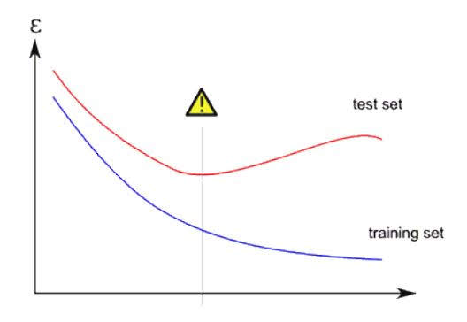

- 在 Keras 的 model.fit 中，加入 validation split 以檢視模型是否出現過擬合現象。

  ```python
  model.fit(x_train, y_train, # 訓練資料
            epochs=EPOCHS, # EPOCHS
            batch_size=BATCH_SIZE, #BATCH_SIZE
            validation_data=(x_valid, y_valid), # 驗證資料
            shuffle=True) # 每epoch後，將資料順序打亂
  
  model.fit(x_train, y_train, # 訓練資料
            epochs=EPOCHS, # EPOCHS
            batch_size=BATCH_SIZE, #BATCH_SIZE
            validation_split=0.9, # 驗證資料
            shuffle=True) # 每epoch後，將資料順序打亂
  ```

  > 注意：使用 validation_split 與 shuffle 時，Keras 是先自 x_train/y_train 取最後 (1-x)% 做為驗證集使用，再行 shuffle

- 在訓練完成後，將 training loss 與 validation loss 取出並繪圖

  ```python
  train_loss = model.history.history['loss']
  valid_loss = model.history.history['val_loss']
  
  train_acc = model.history.history['acc']
  valid_acc = model.history.history['val_acc']
  ```

  

- 參考資料

  - [Overfitting – Coursera 日誌](https://medium.com/@ken90242/machine-learning學習日記-coursera篇-week-3-4-the-c05b8ba3b36f)
  - [EliteDataScience – Overfitting](https://elitedatascience.com/overfitting-in-machine-learning#signal-vs-noise)
  - [Overfitting vs. Underfitting](https://towardsdatascience.com/overfitting-vs-underfitting-a-complete-example-d05dd7e19765)


### 訓練模型前的檢查

- 訓練模型的時間跟成本都很大 (如 GPU quota & 你/妳的人⽣)

- 要做哪些檢查

  1. 使用的裝置：是使用 CPU or GPU / 想要使用的 GPU 是否已經被別人佔用?

     - nvidia-smi 可以看到目前可以取得的GPU 裝置使用狀態

     - windows作業系統的nvidia-smi在以下路徑，進入該路徑後輸入nvidia-smi即可使用

       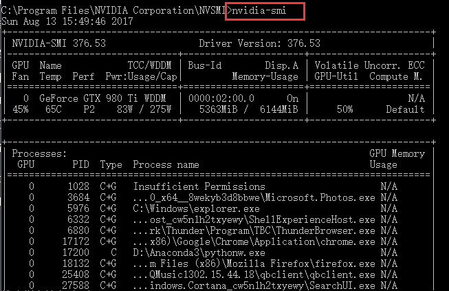

  2. Input preprocessing：資料 (Xs) 是否有進行過適當的標準化?

     透過 Function 進行處理，而非在 Cell 中單獨進行避免遺漏、錯置

  3. Output preprocessing：目標 (Ys) 是否經過適當的處理?(如 onehotencoded)

     透過 Function 進行處理，而非在 Cell 中單獨進行避免遺漏、錯置

  4. Model Graph：模型的架構是否如預期所想?

     model.summary() 可以看到模型堆疊的架構

  5. 超參數設定(Hyperparameters)：訓練模型的相關參數是否設定得當?

     將模型/程式所使用到的相關參數集中管理，避免散落在各處

- 參考資料

  - [選擇 GPU 裝置與僅使用部分 GPU 的設定方式](https://github.com/vashineyu/slides_and_others/blob/master/tutorial/gpu_usage.pdf)
  - [養成良好 Coding Style: Python Coding Style – PEP8](https://www.python.org/dev/peps/pep-0008/)
  - [Troubleshooting Deep Neural Network – A Field Guide to Fix your Model](http://josh-tobin.com/assets/pdf/troubleshooting-deep-neural-networks-01-19.pdf)

### Learning rate effect

- 學習率過大：每次模型參數改變過大，無法有效收斂到更低的損失平面

- 學習率過小：每次參數的改變量小，導致

  1. 損失改變的幅度小
  2. 平原區域無法找到正確的方向

  

- Options in SGD optimizer 

  - Momentum：動量 – 在更新方向以外，加上⼀個固定向量，使得真實移動方向會介於算出來的 gradient step 與 momentum 間。

    - Actual step = momentum step + gradient step

  - Nesterov Momentum：拔草測風向

    - 將 momentum 納入 gradient 的計算

    - Gradient step computation is based on x + momentum

    

- 在 SGD 中的動量方法

  - 在損失方向上，加上⼀定比率的動量協助擺脫平原或是小⼭⾕

- 參考資料

  - [優化器總結 by Joe-Han](https://blog.csdn.net/u010089444/article/details/76725843)


### Regularization

- Cost function = Loss + Regularization

- 透過 regularization，可以使的模型的weights 變得比較小

- Regularizer 的效果：讓模型參數的數值較小 – 使得 Inputs 的改變不會讓 Outputs 有大幅的改變。

  - 對於 Input 的數值，前面提到建議要 re-scale
  - Weights 修正的路徑比較會在同⼼圓⼭⾕中往下滑

  

  - 只加在輸入層 re-scale 不夠，你可以每⼀層都 re-scale !

- wi 較小 
  ➔ Δxi 對 ŷ 造成的影響(Δ̂ y)較小 
  ➔ 對 input 變化比較不敏感
  ➔ better generalization

```python
from keras.regularizers import l1
input_layer = keras.layers.Input(...)
keras.layers.Dense(units=n_units,
                   activation='relu',
                   kernel_regularizer=l1(0.001))(input_layer)
```


- 參考資料
  - [Regularization in Machine Learning](https://towardsdatascience.com/regularization-in-machine-learning-76441ddcf99a)
  - [Machine Learning Explained：Regularization](http://enhancedatascience.com/2017/07/04/machine-learning-explained-regularization/)
  - [機器學習：正規化 by Murphy](https://murphymind.blogspot.com/2017/05/machine.learning.regularization.html)

### Dropout

- Dropout：在訓練時隨機將某些參數暫時設為 0(刻意讓訓練難度提升)，強迫模型的每個參數有更強的泛化能力，也讓網路能在更多參數組合的狀態下習得表徵。
- 在訓練過程中，在原本全連結的前後兩層 layers ，隨機拿掉⼀些連結(weights 設為 0)
  - 解釋1：增加訓練的難度 – 當你知道你的同伴中有豬隊友時，你會變得要更努力學習
  - 解釋2：被視為⼀種 model 自⾝的ensemble 方法，因為 model 可以有 2^n 種 weights combination

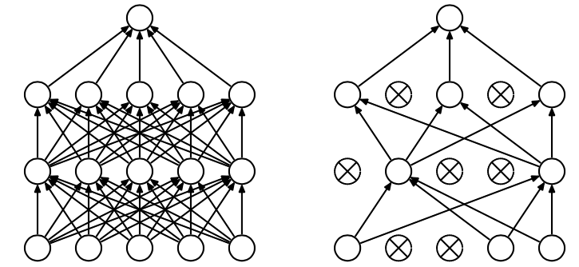

```python
from keras.layers import Dropout
x = keras.layers.Dense(units=n_units,
                       activation='relu')(x)

# 隨機在一次 update 中，忽略 20% 的neurons間的connenction
x = Dropout(0.2)(x) 
```

- 參考資料
  - [理解 Dropout – CSDN](https://blog.csdn.net/stdcoutzyx/article/details/49022443) 
  - [Dropout in Deep Learning](https://medium.com/@amarbudhiraja/https-medium-com-amarbudhiraja-learning-less-to-learn-better-dropout-in-deep-machine-learning-74334da4bfc5)
  - [Dropout: A Simple Way to Prevent Neural Networks from Overfitting](https://www.cs.toronto.edu/~hinton/absps/JMLRdropout.pdf)


### Batch Normalization

- Batch normalization：除了在 Inputs 做正規化以外，批次正規層讓我們能夠將每⼀層的輸入/輸出做正規化
- 各層的正規化使得 Gradient 消失 (gradient vanish)或爆炸 (explode) 的狀況得以減輕 (但最近有 paper對於這項論點有些不同意)
- 每個 input feature 獨立做 normalization
- 利用 batch statistics 做 normalization 而非整份資料
- 同⼀筆資料在不同的 batch 中會有些微不同
- BN：將輸入經過 t 轉換後輸出
  - 訓練時：使用 Batch 的平均值
  - 推論時：使用 Moving Average
- 可以解決 Gradient vanishing 的問題
- 可以用比較大的 learning rate加速訓練
- 取代 dropout & regularizes
  - 目前大多數的 Deep neural network 都會加

```python
from keras.layers import BatchNormalization
x = keras.layers.Dense(units=n_units,
                       activation='relu')(x)
x = BatchNormalization()(x)
```

- 參考資料
  - [為何要使用 Batch Normalization – 莫凡 python](https://morvanzhou.github.io/tutorials/machine-learning/ML-intro/3-08-batch-normalization/)
  - [Batch normalization 原理與實戰 – 知乎](https://zhuanlan.zhihu.com/p/34879333)
  - [Batch Normalization： Accelerating Deep Network Training by Reducing Internal Covariate Shift](https://arxiv.org/pdf/1502.03167.pdf)
  - [深度學習基礎系列（九）| Dropout VS Batch Normalization? 是時候放棄Dropout了 深度學習基礎系列（七）| Batch Normalization](https://www.itread01.com/content/1542171910.html)

### EarlyStopping

- Callbacks function：在訓練過程中，我們可以透過⼀些函式來監控/介入訓練

- Earlystopping：如果⼀個模型會overfitting，那 training 與 validation 的表現只會越差越遠，不如在開始變糟之前就先停下

- 在 Overfitting 前停下，避免 model weights 被搞爛

- 注意：Earlystop 不會使模型得到更好的結果，僅是避免更糟

  

  ```python
  from keras.callbacks import EarlyStopping
  earlystop = EarlyStopping(monitor='val_loss', # waht to monitor
                            patience=5, # epochs to wait
                            verbose=1) # print information
  
  model.fit(x_train, y_train,
           epochs=EPOCHS,
           batch_size=BATCHIZES,
           validation_data=(x_test, y_test),
           shuffle=Ture,
           callbacks=[earlystop])
  ```

  

- 參考資料

  - [Keras 的 EarlyStopping callbacks的使用與技巧 – CSND blog](https://blog.csdn.net/silent56_th/article/details/72845912)

  

### ModelCheckPoint

  - 為何要使用 Model Check Point?
    - ModelCheckPoint：自動將目前最佳的模型權重存下
  - Model checkpoint：根據狀況隨時將模型存下來，如此可以保證
    - 假如不幸訓練意外中斷，前面的功夫不會⽩費。我們可以從最近的⼀次繼續重新開始。
    - 我們可以透過監控 validation loss 來保證所存下來的模型是在 validation set表現最好的⼀個
  - 假如電腦突然斷線、當機該怎麼辦? 難道我只能重新開始?
    - 假如不幸斷線 : 可以重新自最佳的權重開始
    - 假如要做 Inference :可以保證使用的是對 monitor metric 最佳的權重

  ```python
  from keras.callbacks import ModelCheckpoint
  checkpoint = ModelCheckpoint('model.h5', # path to save
                               monitor = 'val_loss', # target to monitor
                               verbose = 1, # print information
                               save_best_only = True # save best checkpoint)
                               
  model.fit(x_train, y_train,
           epochs=EPOCHS,
           batch_size=BATCH_SIZE,
           validation_data=(x_test, y_test),
           shuffle=True,
           callbacks=[checkpoint])
  ```

  - 參考資料
    - [How to Check-Point Deep Learning Models in Keras](https://machinelearningmastery.com/check-point-deep-learning-models-keras/)
    - [ModelCheckpoint – Keras github](https://github.com/keras-team/keras/blob/master/keras/callbacks.py#L633)

### Reduce Learning Rate

- Reduce learning rate on plateau：模型沒辦法進步的可能是因為學習率太大導致每次改變量太大而無法落入較低的損失平面，透過適度的降低，就有機會得到更好的結果

- 因為我們可以透過這樣的監控機制，初始的 Learning rate 可以調得比較高，讓訓練過程與 callback 來做適當的 learning rate 調降。

- Reduce Learning Rate: 隨訓練更新次數，將 Learning rate 逐步減小
  - 因為通常損失函數越接近⾕底的位置，開⼝越小 – 需要較小的Learning rate 才可以再次下降
  
- 可行的調降方式
  - 每更新 n 次後，將 Learning rate 做⼀次調降 – schedule decay
  - 當經過幾個 epoch 後，發現 performance 沒有進步 – Reduce on plateau
  
  
  
  ```python
  from keras.callbacks import ReduceLROnPlateau
  reduce_lr = ReduceLROnPlateau(factor=0.5,
                                min_lr=1e-12,
                                monitor='val_loss',
                                patience=5,
                                verbose=1)
  
  model.fit(x_train, y_train,
            epochs=EPOCHS,
            batch_size=BATCH_SIZE,
            validation_data=(x_test, y_test),
            shuffle=True,
            callbacks=[reduce_lr])
  ```

- 參考資料
  - [Learning Rate Schedules and Adaptive Learning Rate Methods for Deep Learning](https://towardsdatascience.com/learning-rate-schedules-and-adaptive-learning-rate-methods-for-deep-learning-2c8f433990d1) 
  - [Why Reduce Learning Rate so quickly WILL fail](https://stats.stackexchange.com/questions/282544/why-does-reducing-the-learning-rate-quickly-reduce-the-error)
  - [Keras source code of reduce-learning-rate](https://github.com/keras-team/keras/blob/master/keras/callbacks.py#L906) 

### 撰寫自己的callbacks 函數

- Callbacks 可以在模型訓練的過程中，進行監控或介入。Callbacks 的時機包含
  - on_train_begin：在訓練最開始時
  - on_train_end：在訓練結束時
  - on_batch_begin：在每個 batch 開始時
  - on_batch_end：在每個 batch 結束時
  - on_epoch_begin：在每個 epoch 開始時
  - on_epoch_end：在每個 epoch 結束時

- 通常都是在 epoch end 時啟動

  ```python
  from keras.callbacks import Callback
  class My_Callback(Callback):
      def on_train_begin(self, logs={}):
          return
      
      def on_train_end(self, logs={}):
          return
      
      def on_epoch_begin(self, log={}):
          return
      
      def on_epoch_end(self, log={}):
          return
      
      def on_batch_begin(self, batch, logs{}):
          return
      
      def on_batch_end(self, batch, logs={}):
          return
  ```

  

  - 參考資料

    - [Keras 中保留 f1-score 最高的模型 – 知乎](https://zhuanlan.zhihu.com/p/51356820)
    - [How easy is making custom Keras Callbacks](https://medium.com/@upu1994/how-easy-is-making-custom-keras-callbacks-c771091602da)
    - [Keras Callbacks — Monitor and Improve Your Deep Learning](https://medium.com/singlestone/keras-callbacks-monitor-and-improve-your-deep-learning-205a8a27e91c)

### Loss function

- 在 Keras 中，除了使用官方提供的 Loss function 外，亦可以自行定義/修改 loss function
- 在 Keras 中，我們可以自行定義函式來進行損失的運算。⼀個損失函數必須
  - 有 y_true 與 y_pred 兩個輸入
  - 必須可以微分
  - 必須使用 tensor operation，也就是在 tensor 的狀態下，進行運算。如K.sum …
- 所定義的函數
  - 最內層函式的參數輸入須根據 output tensor 而定，舉例來說，在分類模型中需要有 y_true, y_pred
  - 需要使用 tensor operations – 即在 tensor 上運算而非在 numpy array上進行運算
  - 回傳的結果是⼀個 tensor

```python
import keras.backend as K
def dice_coef(y_true, y_pred, smooth):
    # 皆須使用 tensor operations
    y_pred = y_pred >= 0.5
    y_true_f = K.flatten(y_true)
    y_pred_f = K.flatten(y_pred)
    intersection = K.sum(y_true_f * y_pred_f)
    
    # 最內層的函式 – 在分類問題中，只能有y_true 與 y_pred，其他調控參數應⾄於外層函式
    return (2. * intersection + smooth) / (K.sum(y_true_f) = K.sum(y_pred_f) + smooth)

# 輸出為 Tensor
def dice_loss(smooth, thresh):
    def dice(y_true, y_pred):
        return -dice_coef(t_true, y_pred, smooth, thresh)
    return dice
```

- 參考資料
    - [如何自定義損失函數 – CSDN blog](https://blog.csdn.net/A_a_ron/article/details/79050204)
    - [How to use a custom objective function for a model – keras github](https://github.com/keras-team/keras/issues/369)
    - [Issue for load model if using custom loss function – keras issue](https://github.com/keras-team/keras/issues/3977)


## 傳統電腦視覺與影像辨識

> - 了解用傳統電腦來做影像辨識的過程
> - 如何用顏⾊直方圖提取圖片的顏⾊特徵

- 影像辨識的傳統方法是特徵描述及檢測，需要辦法把影像像素量化為特徵（特徵工程），然後把特徵丟給我們之前學過的機器學習算法來做分類或回歸。


### 傳統電腦視覺提取特徵的方法

- 為了有更直觀的理解，這裡介紹⼀種最簡單提取特徵的方法

  - 如何描述顏⾊？
  - 顏⾊直方圖

- 顏⾊直方圖是將顏⾊信息轉化為特徵⼀種方法，將顏⾊值 RGB 轉為直方圖值，來描述⾊彩和強度的分佈情況。舉例來說，⼀張彩⾊圖有 3 個channel， RGB，顏⾊值都介於 0-255 之間，最小可以去統計每個像素值出現在圖片的數量，也可以是⼀個區間如 (0 - 15)、(16 - 31)、...、(240 -255)。可表⽰如下圖

  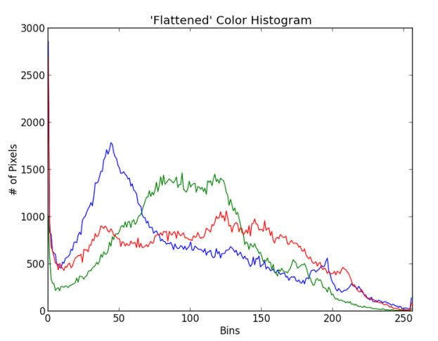

### 重要知識點複習

- 傳統影像視覺描述特徵的方法是⼀個非常「⼿工」的過程， 可以想像本⽇知識點提到的顏⾊直方圖在要辨認顏⾊的場景就會非常有用
- 但可能就不適合用來做邊緣檢測的任務，因為從顏⾊的分佈沒有考量到空間上的信息。
- 不同的任務，我們就要想辦法針對性地設計特徵來進行後續影像辨識的任務。

### 參考資料

1. [圖像分類 | 深度學習PK傳統機器學習](https://cloud.tencent.com/developer/article/1111702)
2. [OpenCV - 直方圖](https://chtseng.wordpress.com/2016/12/05/opencv-histograms直方圖/)
3. [OpenCV 教學文檔](https://docs.opencv.org/3.0-beta/doc/py_tutorials/py_tutorials.html)
4. [Udacity free course: Introduction To Computer Vision](https://www.udacity.com/course/introduction-to-computer-vision--ud810)


## 傳統電腦視覺與影像辨識_HOG

> - 體驗使用不同特徵來做機器學習分類問題的差別
> - 知道 hog 的調用方式
> - 知道 svm 在 opencv 的調用方式

- 嘗試比較用 color histogram 和 HOG 特徵分類 cifar10 準確度各在 training 和 testing data 的差別

### 重要知識點複習

- 靠人工設計的特徵在簡單的任務上也許是堪用，但複雜的情況，比如說分類的類別多起來，就能明顯感覺到這些特徵的不⾜之處
- 體會這⼀點能更幫助理解接下來的卷積神經網路的意義。

### 參考資料

1. [Sobel 運算子 wiki](https://zh.wikipedia.org/wiki/索貝爾算子)
2. [基於傳統圖像處理的目標檢測與識別(HOG+SVM附代碼)](https://www.cnblogs.com/zyly/p/9651261.html)
3. [知乎 - 什麼是 SVM](https://www.zhihu.com/question/21094489)
4.  [mnist程式碼範例](https://github.com/opencv/opencv/blob/master/samples/python/tutorial_code/ml/py_svm_opencv/hogsvm.py)
   - [digit.png](https://raw.githubusercontent.com/opencv/opencv/master/samples/data/digits.png)
5. [支持向量机(SVM)是什么意思？](https://www.zhihu.com/question/21094489)
6. [第十八节、基于传统图像处理的目标检测与识别(HOG+SVM附代码)](https://www.cnblogs.com/zyly/p/9651261.html)


# FAQ

### Natural Language Processing

- **Why does the Bag of Words model replace all the capital letters by the lower cases?** 
  - Many computer languages, in particular Python and R, treat capitals and lower case letters as completely different symbols. So if we won’t convert everything to lower cases then we are to take into account that some words may contain capitalized letters and include additional code for them. Much more simpler to replace all capitals by lower cases.

- **What is sparsity?**
  - sparsity occurs when you have lots and lots of zeros in your matrix (therefore called a sparse matrix). So when we reduce sparsity, that means we reduce the proportion of zeros in the matrix.
- **Why do we delete ’NOT’, given that "Crust is good" is not the same as "Crust is not good"?**
  - It also works the other way: "Crust is bad" is not the same as "Crust is not bad". Hence, this is not usually taken into account. Hence we believe/hope that on average, the number of misconceptions caused by this would be less in total.
- **After we are done with cleaning and getting our bag of words model, why are we doing classification?**
  - We are doing classification on the reviews to predict the outcome of new ones, exactly like sentiment analysis. Only to make these predictions in the best conditions, we need to apply the bag of words model first. That will prepare the data in a correct format for it to be fitted to the classifier.
- **Why do we remove punctuation from the text? At first they look like they don’t contain information. But why we won’t let classification algorithm to decide?**
  - It is usually a trade-off between dimensionality and information. We remove punctuation to make the dataset more manageable with less dimensions. 
  - Moreover, the punctuation doesn’t really carry as much discriminatory information as words in usual classification processes. 
  - Through experience, cross-validation has pointed towards removing punctuation performing better. 
  - However yes, we could let the classification algorithm decide. Maybe some datasets perform better with punctuation but as a general-rule, punctuation is better to be avoided.

### Artificial Neural Networks

- **How does the Neural Network figure out what the optimal weights are. When does it stop its learning?**
  - It figures out the optimal weights based on an optimization algorithm employed to minimize the loss function w.r.t. all the input datapoints. It stops when the training loss goes very close to 0. Besides we usually pick a certain number of epochs which is the number of times the neural network is trained. After the last epoch, the training is over. There is also what we call "Early Stopping" which is a technique that stops the training once we get a too small loss reduction on a validation set over the epochs. In that case, the training stops before the last epoch

- **Why should the cost function be reduced?**
  - The cost function is a numerical estimate of how wrong our neural network predictions are. If we reduce the cost function, it means we are reducing the mistakes made by the neural network, in-turn making it predict more accurately

- **How is the weight calculated for each neuron?**
  - At the beginning of the training, the weights are initialized close to zero. Then, over each of many iterations (or epochs), the weights are updated through gradient descent, in the direction that decreases the most the loss error (or cost function) between the predictions and the targets.

- **Could you please recap on the process of each training iteration?**
  - After the weights are initialized randomly with values close to zero, the training goes over many iterations (the number of iterations, also called the number of epochs, is usually decided in the implementation). Here is the process of each iteration
    1. Forward Propagation: the input is forward propagated inside the neural network which at the end returns the prediction.
    2. We compare that prediction to the target (the real value which we have because we are dealing with the training set) and we compute the loss error between the prediction and the target.
    3. That loss error is back-propagated inside the neural network.
    4. Through Gradient Descent or Stochastic Gradient Descent, the weights are updated in the directions that reduce the most the loss error (since in fact the loss error is a cost function of the weights). 
    5. We thus get new weights, ready to make a new prediction at the next iteration. Then the same whole process goes again, until the loss error stops reducing (early stopping) or until the training reaches the last epoch.

- **Why are we using Sequential and Dense?**
  - Basically it’s very simple: 
    - Sequential is used to initialize the Deep Learning model as a sequence of layers (as opposed to a computational graph).
    - Dense is used to add one layer of neurons in the neural network

- **How can we decide the number of hidden layers?**
  - There is no rule of thumb and generally more hidden layers can give you higher accuracy but can also give you overfitting so you need to be cautious. The key is intuition and experience. 
- **What does the rectifier activation function do?**
  - Since Deep Learning is used to solve non linear problems, the models need to be non linear. And the use of the rectifier function is to actually make it non linear. By applying it you are breaking the linearity between the output neurons and the input neurons.
- **Where do all the hyperparameters come from? How did we choose the number of layers, the number of neurons in each layer, and all the other parameters?**
  - Through a lot of research and experimentation. There is no rule of thumb as to choose such numbers. Usually you can find some ready to use neural networks architectures online which prove to get good results. But you can experiment by tuning your model manually with other parameter values. And lastly, you can use some parameter tuning techniques like Grid Search with k-Fold Cross Validation to find the optimal values. You will learn how to do that in Part 10 - Model Selection.

- **Python or R for Deep Learning?**
  - Python. Without a doubt. Python is used by all the best Deep Learning scientists today and it has amazing libraries (Tensorflow, Keras, PyTorch) developed for powerful applications (Image Classification, Computer Vision, Artificial Intelligence, ChatBots, Machine Translation, etc.)

### Convolutional Neural Networks

- **What are the differences between the CNN and the ANN? Is the CNN applied to image classification only?** 
  - ANN means neural networks in general. So a CNN is a ANN. 
  - CNNs are not only used for Image Processing, they can also be applied to Text like Text Comprehension. Down to how much the image size will be reduced for the feature detector? In the practical section it will be reduced down to 64 by 64 dimensions.

- **What is the purpose of the feature maps?**
  - We are building feature maps with each convolutional filter, meaning we are making features that help us classify the object. The example shown in the Intuition Lecture is like a one-dimensional edge detection filter. That is one feature map. So we want our model to "activate" in a feature map only where there is an edge. We will have several feature maps like this which when all put together will help us identify the object. This is helped by removing the black or the negative values.

- **What is the purpose of the ReLU?**
  - The biggest reason why we use ReLU is because we want to increase the non-linearity in our image. And ReLU acts as a function which breaks up linearity. And the reason why we want to break up linearity in our network is because images themselves are highly non-linear. Indeed they have a lot of non-linear elements like the transitions between pixels.

- **Why does Max-Pooling consider only 4 values to take a maximum from and not 2 or 8 values? Also in convolution how is the feature detector formed?**
  - Because a maximum is taken from a spot on the image which is represented by a 2x2 square on our image. Therefore it covers 4 pixels.

- **After flattening, are we going to get one long vector for all pooled layers or a vector for each pooled layer?** 
  - It will be one long vector gathering all the pooled layers.

- **How much images are required to train a good model? Is there any rule of thumb for this decision?** 
  - 10,000 is a good number. No rule of thumbs, just the more you have, the better chance you’ll have to get a good accuracy.

- **Could you please explain the numbers 0, 1, 2, 3 and 4 in the feature maps?**
  - When the 3x3 feature detector is covering one part of the input image, it gets: 
    - 0 if there is no 1 in common between the 3x3 subtable of the input image and the 3x3 feature detector, 
    - 1 if there is one 1 in common between the 3x3 subtable of the input image and the 3x3 feature detector, 
    - 2 if there is two 1 in common between the 3x3 subtable of the input image and the 3x3 feature detector, 
    - 3 if there is three 1 in common between the 3x3 subtable of the input image and the 3x3 feature detector, 
    - 4 if there is four 1 in common between the 3x3 subtable of the input image and the 3x3 feature detector.

- **Could you please recap the forward propagation of the input images happening inside the CNN by describing in a few words the classes we use in Python?**
  - Sure, here is the process with the essential descriptions of the classes used: 
    - Sequential is first used to specify we introduce a sequence of layers, as opposed to a computational graph. 
    - Convolution2D is then used to add the convolutional layer. 
    - MaxPooling2D is then used to apply Max Pooling to the input images. 
    - Flatten is then used to flatten the pooled images. 
    - Dense is used to add the output layer with softmax.


## RNN_Recurrent Neural Network

具有記憶力的神經網絡模型

- Elman Network
  - 把 hidden layer的值，作為下一個的輸入
- Jordan Network
  - 把 output 的值，作為下一個的輸入
  - 通常這個會有較好的表象，因為下一個的輸入是有目標的
- Bidirectional RNN
  - 訓練正反向的兩個NN，作為下一個的輸入
- LSTM
  - input
    - Input Gate
    - Memory Cell
    - Output Gate
    - Forget Gate
  - output gate