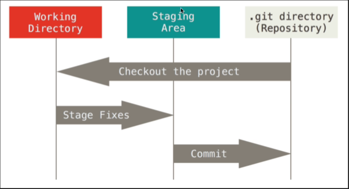
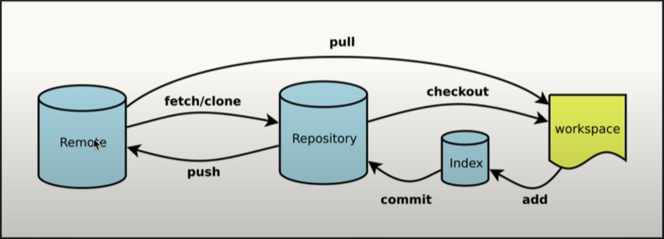

# 什麼是Git

- 傳統我們在一台電腦的時候會用 copy paste的方式來備份文件，但是當今天面對的情況是需要多人協作、共編的專案文件時，就會凸顯出麻煩和沒有規則的缺點

- 我們當然可以開個共享資料夾讓大家編輯，但這樣的方式還是有缺點，像是我們不知道是誰最後修改，以及如果有人把檔案用壞了，我們沒辦法把他還原

- Git是分佈式的版本管理系統

- Git可以保證文件的完整性

- Git中的數據庫

  - .git directory
    - 用來保存原始的資料
  - Staging Area
    - 暫存區
  - Working Directory
  - 

  

- 工作流程

  1. 我們在工作區進行程式的修改/更新
  2. 接著我們將文件的快照放進暫存區
  3. 透過commit 將暫存區的文件永久性的更新至git倉庫中。如果

  


# Git的基本操作

- Git 本身是一個軟體，所以我們需要根據自己的作業系統來下載和安裝使用

  - OSC
  - Windows
  - Linux

- 安裝完之後會需要先設定git的帳號和email

  - 以 tlyu0419的帳號和email為例

    ```git
    git config --global user.name 'tlyu0419'
    git config --global user.email 'tlyu0419@gmail.com'
    ```

  - 透過 cat 的語法可以查看目前的設定

    ```git
    cat ~/.gitconfig
    ```

- 常用指令

  - 建立資料夾

    ```git
    mkdir git-tutorial
    ```

  - 初始化git倉庫

    ```git
    git init
    ```

  - 建立檔案

    ```git
    touch README.md
    ```

  - 檢視目前倉庫的狀態

    ```git
    git status
    ```

  - 將檔案加入佔存區讓git跟蹤檔案的狀態

    ```git
    # 跟蹤特定檔案
    git add README.md
    
    # 跟蹤所有檔案
    git add .
    ```

  - 確定要將暫存區的資料提交出去

    ```git
    # 新增這次提交檔案的說明
    git commit -m 'add README.md'
    ```

  - 將本地的資料推動到遠程的服務器，讓別人能拉下來我們的程式使用

    ```git
    # 將本地的資料夾與遠程的專案建立連結
    git remote add origin https://github.com/biezhi/git-tutorial.git
    
    # 正式推送資料，第一次加入-u之後，第二次之後就可以直接 git push
    git push -u 
    ```

  - 複製遠程的資料到本地使用

    ```git
    git clone https://github.com/biezhi/git-tutorial.git
    ```

    

# Git中的分支

當我們在做一些功能的時候，通常會新增一些功能會修復Bug，他們之間的功能都是相互獨立的，並且都有自己的歷史記錄，因此Git提供了Branch的功能，他能保證代碼不會被破壞，不同的功能可以由不同的人同時操作。讓你可以專注於自己的分支，不用擔心其他人破壞了這個環境。

- 建立分支

  ```git
  git branch feature1
  ```

- 檢視當前分支

  ```git
  git branch
  ```

- 切換到不同分支

  ```git
  git checkout feature1
  ```

- 接著我們可以在feature1的branch中進行一系列的編輯/修改

  ```git
  touch a.txt
  git add a.txt
  git commit -m 'add a.txt'
  ```

- 也可以直接創建和切換到新的分支

  ```git
  git checkout -b featre3
  ```

- 刪除分支

  當分支已經有變動的時候會需要使用強制刪除的功能才能刪除分支

  ```git
  # 刪除分支
  git branch -d feature2
  
  # 強制刪除分支
  git branch -D
  ```

- 合併分支

  ```git
  git merge feature3
  ```

- 在遠程倉庫建立分支

  ```git
  git checkout feature1
  git push origin feature1
  ```

- 在本地刪除遠程倉庫的分支

  ```git
  git push origin :feature1
  ```

  

# Git中的合併

- 看更改的日誌

  ```git
  # show all logs
  git log
  
  # show logs in one line
  git log --oneline
  
  # show top 3 logs in one line
  git log --oneline -3
  ```

- 合併分支

  ```git
  git merge f1 --no-ff
  ```

- 提交變更

  ```git
  git push
  ```

  

# Git中的回滾撤銷

- 時光一去不復返，但 Git 可以，這邊要介紹怎麼讓 git 撤銷變更的方法

- 回退版本

  ```git
  # 在最後面的^符號，每一個^符號表示「前一次」
  git reset master^
  
  # 或者直接回到前5次提交的狀態
  git reset master~5
  
  # 檢視變更記錄
  git reflog
  
  # 回到特定的提交
  git reset -hard 7d37397
  ```

  

- 撤銷某次操作

  ```git
  git revert
  ```

  

# Gitignore 和 Fork 同步

有些檔案我們不想將他上傳，如個人電腦的設置、帳號密碼等，因此我們可以在git中設置忽略掉這些檔案

- ignore

  ```git
  touch .gitignore
  code .gitignore
  ```

  - 接著編輯 .gitignore 檔案，透過規則不上傳特定類型的文件

    ```git
    # 不上傳 sh 結尾的文件
    *.sh 
    
    # 不上傳 .settings 資料夾下的檔案
    .settings/
    
    # 不能被忽略的檔案類型
    # *.txt被排除忽略，也就是不會被忽略他們
    !*.txt
    
    # 不上傳特定資料夾下的特定類型檔案
    /a/*.class
    ```

- Fork

  - 直接Fork最新的狀態

    以 [TLYu0419/DataScience: My Data Science Note (github.com)](https://github.com/TLYu0419/DataScience) 為例

    ```git
    git clone git@github.com:TLYu0419/DataScience.git
    ```

  - 將先前 fork 的結果更新至最新狀態

    ```git
    cd DataScience
    git remote -v
    git remote add upstream https://github.com/TLYu0419/DataScience.git
    
    # 將遠端分支的資料拉回本地
    git fetch upstream
    
    git rebase upstream/master
    git push
    ```

    

# 實現Github免密推送

正常每次提交更新都會需要輸入帳號密碼，但這樣做會有些麻煩，因此可以透過ssh key來實現免輸入密碼的推送

- [Generating a new SSH key and adding it to the ssh-agent - GitHub Docs](https://docs.github.com/en/authentication/connecting-to-github-with-ssh/generating-a-new-ssh-key-and-adding-it-to-the-ssh-agent)
- [SSH 免密登录是怎么玩儿的? - 知乎 (zhihu.com)](https://zhuanlan.zhihu.com/p/28423720)


# Git中的工作流

- [my-git/git-workflow-tutorial.md at master · xirong/my-git (github.com)](https://github.com/xirong/my-git/blob/master/git-workflow-tutorial.md)


# Git常用的圖形化工具

實際在工作中還是會用圖形化界面來溝通會便利許多，但圖形化界面仍然是使用上面的這些語法

- [Sourcetree | Free Git GUI for Mac and Windows (sourcetreeapp.com)](https://www.sourcetreeapp.com/)
- VSCODE
- JetBrains 

# 參考資料

- [互联网人都该懂点 Git #01 什么是 Git？ - YouTube](https://www.youtube.com/watch?v=29q6zwRGywk)

- [互联网人都该懂点 Git #02 萌新也看的懂的 Git 基本操作 - YouTube](https://www.youtube.com/watch?v=OVLR9qRc9ak)
- [gitignore.io - 为你的项目创建必要的 .gitignore 文件 (toptal.com)](https://www.toptal.com/developers/gitignore)
- [Git - Tutorial (vogella.com)](https://www.vogella.com/tutorials/Git/article.html)

