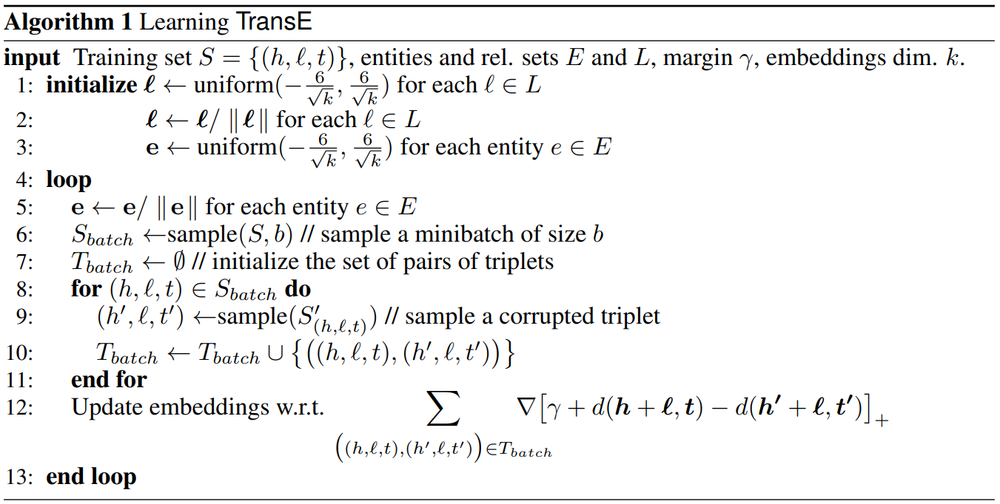
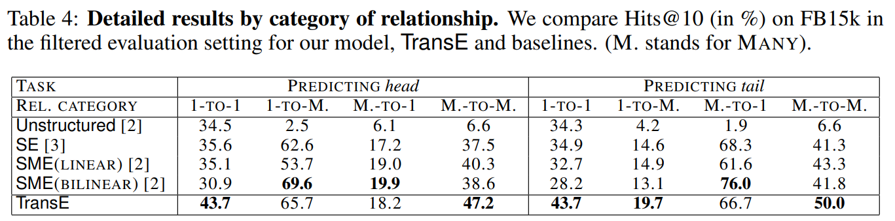

# Knowledge Graph

- 三元組(head, relation and tail)來表達知識 

  - 如 sky tree, location, Tokyo

- Data

  - Input: $(h, \ell, t)$

  - output

    - embedded_entity
    - embedded_relation

- Graph

  - directed

  - multi-relations

## TransE

### 目的

- 希望將知識圖譜中的 entity 和 relation 轉換成低維度的向量
  - 用embedding不是one-hot的原因是希望賦予維度更多意義
  - 處理了維度災難的問題，有助於深度學習模型運算
  - 先前也有許多方式嘗試轉向量，但效果不好或運算量太大
  
- 優點

  - 模型簡單
  - 準度高
  - 能夠處理大量資料

  - 讓 head + relation ~= tail

### 應用場景

#### 連結預測

- A 跟 B 會不會是好友

#### 推薦系統

- 協同過濾在用戶-物品的交互稀少時表現會不理想，可以透過混合的推薦系統來優化模型效度

#### 問答系統

- (?, r, t): 給導演(r)和驚魂(t)，希望知道導演(h)是誰
- (h, r, ?): 給驚魂(h)和導演(r)，希望知道被哪個人導演

### Data In/Out

- Input

  - List of triplets $(h, \ell, t)$

    

- Output

  - entity embedding

    

  - relation embedding

    

    

### 方法

#### Core idea

- Embed head/tail and relation in the same vector space, such that
  $$
  head + relation = tail\\
  $$

#### Loss function

$$
\mathcal{L} = \sum_{(h, \ell, t) \in S} \; \sum_{(h\prime, \ell, t^\prime)\in S^\prime_{(h, \ell, t)}} [ \gamma +d(h+\ell, t) - d(h^\prime+\ell,t^\prime)]_+
$$

  - 樣本資料
    -  $(h, \ell, t) \in S$ 為正確的樣本
    -  $(h^\prime, \ell, t^\prime) \in S$ 為錯誤的樣本，從正確的樣本中抽換 h 或 t 而來
       -  每個tail的數量不一定，冷門的標度比較難被抽樣到，會有inbalance的問題
       -  抽 head 和 tail 的時候會遇到down sampleng 的說明
  - 因為希望 $h +\ell \approx t$ ，所以 $d(h+\ell, t)$ 要越小越好，反之 $d(h^\prime+\ell, t^\prime)$ 要越大越好
    - 距離的計算方式可以是 L1 也可以是 L2
- 最終會取正值作為得分，如小於 0 則取 0
- 參數設定 
  - learning rate: {0.001, 0.01, 0.1}
  - $\gamma$ 邊際值: {1,2,10}
    - 差距要大一些才會當成有差距
    - dimenson小的時候，$\gamma$ 會大一些
  - k 維度數: {20, 50}

#### 演算法流程

- Input
  - Training Set S，包含 $(h, \ell, t)$
- Initialize
  - 初始化 entity 和 relation 的參數
- loop
  - 從訓練資料中抽正確的資料並製造錯誤的資料
  - Gradient descent 的方式逐步優化 embedding 的結果

#### 效度評估方式

- mean rank
  - 透過測試資料中的 $(h, \ell)$ 來預測 t ，計算出知識圖譜中所有實體的分數後，比較實際的答案在預測分數的排名，最終取平均值  
- hit@10
  - 同樣通過 $(h, \ell)$ 來預測 $t$，檢視實際的答案是否在預測出分數的前10 名

### 建模結果

- Category
  - 1-1
  - 1-M
  - M-1
  - M-M

- 在一對一和多對多的表現較好，但一對多和多對多的表現較差，因此後續有一系列的Trans 家族演算法
  - TransE
  - TransH
  - TransR
  - TransD

## 應用方式

- 怎麼做推薦
  - H+R ~=t

## Trans家族

[知识表示学习Trans系列梳理(论文+代码) - 知乎 (zhihu.com)](https://zhuanlan.zhihu.com/p/144412694)

### Trans-E(2013)

- 只適合處理一對一的關係，無法處理一對多，多對一或多對多的關係
- 有两个知识，(skytree, location, tokyo)和(gundam, location, tokyo)。经过训练，“sky tree”实体向量将非常接近“gundam”实体向量。但实际上它们没有这样的相似性。

### Trans-H(2014)

- TransH的目标是处理一对多/多对一/多对多关系，并且不增加模式的复杂性和训练难度。
- 其基本思想是将**关系**解释为超平面上的转换操作。每个关系都有两个向量，超平面的范数向量Wr和超平面上的平移向量(dr)。

### Trans-R(2015)

- Learning Entity and Relation Embeddings for Knowledge Graph Completion（2015）

- TransE和TransH模型都假设实体和关系是语义空间中的向量，因此相似的实体在同一实体空间中会非常接近。

  然而，每个实体可以有许多方面，不同的关系关注实体的不同方面。例如，`(location, contains, location)`的关系是'contains'，`(person, born, date)`的关系是'born'。这两种关系非常不同。

  为了解决这个问题，我们让TransR在两个不同的空间，即**实体空间**和**多个关系空间**(关系特定的实体空间)中建模实体和关系，并在对应的关系空间中进行转换，因此命名为TrandR。

### Trans-D(2015)

- Knowledge Graph Embedding via Dynamic Mapping Matrix（2015）
- TransR也有其不足之处。
  - 首先，head和tail使用相同的转换矩阵将自己投射到超平面上，但是head和tail通常是一个不同的实体，例如，`(Bill Gates, founder, Microsoft)`。'Bill Gate'是一个人，'Microsoft'是一个公司，这是两个不同的类别。所以他们应该以不同的方式进行转换。
  - 第二，这个投影与实体和关系有关，但投影矩阵仅由关系决定。
  - 最后，TransR的参数数大于TransE和TransH。由于其复杂性，TransR/CTransR难以应用于大规模知识图谱。

## 解釋性

- 方式說明

## Packages

- [knowledge-graph-embedding/kge_intro.rst at main · melissakou/knowledge-graph-embedding (github.com)](https://github.com/melissakou/knowledge-graph-embedding/blob/main/docs/source/kge_intro.rst)
  - Translating Based

    - Unstructured Model (UM)
    - Structured Embedding (SE)
    - TransE
    - TransH
    - TransR
    - TransD
    - RotatE
  - Semantic Based
    - RESCAL
    - DistMult
- [thunlp/OpenKE: An Open-Source Package for Knowledge Embedding (KE) (github.com)](https://github.com/thunlp/OpenKE)
  - RESCAL
  - DistMult, ComplEx, Analogy
  - TransE, TransH, TransR, TransD
  - SimplE
  - RotatE
- [Sujit-O/pykg2vec: Python library for knowledge graph embedding and representation learning. (github.com)](https://github.com/Sujit-O/pykg2vec)

## 實務面的問題

- 樣本不平衡，負樣本的少數類別不好抽
- 冷啟動的問題
  - 新客戶的冷啟動
  - 新產品的冷啟動
- 怎麼持續更新，月>日>即時
- 資料表很大張
  - 怎麼樣讓查詢有效率
- Training的時間如何加速
- Online traing 的方法

## 後續

- 看底層的程式，檢視如何實踐
- 繼續研究 Trans 家族的方法與比較

- 補充數學的知識

## QA

- 專案面
  - 後續上線至數據中台的是 Model API 還是 Data API

- 論文

  - 為什麼是 translations 模型?

    > 他是把 relation 當做翻譯

  - 什麼是 energy-based model?

  - 什麼是 triplets?
    - 

  - 抽出關係之後怎麼放入模型?

  - 在基金模型中

  - 如何挑選負樣本?

  - 看不太懂的地方
    - 1-1；1-M；M-1；M-M

- 

## Ref

- [Translating Embeddings for Modeling Multi-relational Data](https://proceedings.neurips.cc/paper/2013/file/1cecc7a77928ca8133fa24680a88d2f9-Paper.pdf)
  - [TransE论文：多元关系数据嵌入_NULL-CSDN博客](https://blog.csdn.net/FFFNULL/article/details/51130028?spm=1001.2014.3001.5501)
  - [TransE论文第2节：翻译模型_NULL-CSDN博客](https://blog.csdn.net/FFFNULL/article/details/51139927?spm=1001.2014.3001.5501)
  - [TransE论文第3节：相关工作_NULL-CSDN博客](https://blog.csdn.net/FFFNULL/article/details/51150389?spm=1001.2014.3001.5501)
  - [TransE论文第4节：实验_NULL-CSDN博客_transe实验](https://blog.csdn.net/FFFNULL/article/details/51158519?spm=1001.2014.3001.5501)
  - [TransE论文剩余部分_NULL-CSDN博客](https://blog.csdn.net/FFFNULL/article/details/51163035?spm=1001.2014.3001.5501)
- [论文解读：（TransE）Translating Embeddings for Modeling Multi-relational Data_夏栀的博客-CSDN博客](https://blog.csdn.net/qq_36426650/article/details/103316877)
- [文献知识图谱可视化\[论文解读]知识图谱向量化表示Trans系列EHRD四篇文献_小莫笔记的博客-CSDN博客](https://blog.csdn.net/weixin_42377742/article/details/112655707)

- [一文理解Ranking Loss/Margin Loss/Triplet Loss - 知乎 (zhihu.com)](https://zhuanlan.zhihu.com/p/158853633)
- [FaceNet: A Unified Embedding for Face Recognition and Clustering](https://arxiv.org/pdf/1503.03832.pdf)
- [刘知远大神《知识表示学习研究进展》的学习小结 - 知乎 (zhihu.com)](https://zhuanlan.zhihu.com/p/356147538)
- [Knowledge Graph Embedding: A Survey of Approaches and Applications](https://persagen.com/files/misc/Wang2017Knowledge.pdf)
- [知识图谱嵌入的Translate模型汇总（TransE，TransH，TransR，TransD） (qq.com)](https://mp.weixin.qq.com/s/2YbfL_1_SyM4wNozyaj4lw)
- [知识表示学习Trans系列梳理(论文+代码) - 知乎 (zhihu.com)](https://zhuanlan.zhihu.com/p/144412694)

- [[數學分析\] 淺談各種基本範數 (Norm) (ch-hsieh.blogspot.com)](https://ch-hsieh.blogspot.com/2010/04/norm.html)

- [【译】理解 Ranking Loss，Contrastive Loss，Margin Loss，Triplet Loss，Hinge Loss 等易混淆的概念 - 知乎 (zhihu.com)](https://zhuanlan.zhihu.com/p/355870299)
- [Loss function及regulation总结-2 - 知乎 (zhihu.com)](https://zhuanlan.zhihu.com/p/40394834)

