[TOC]

# 資料科學概論

## 機器學習簡介

- 大數據的特性分成資料量（Volume）、多樣性（Variety）、傳輸速度（Velocity）與真實性（Veracity）
  - 資料量：無論是天文學、生物醫療、金融、聯網物間連線、社群互動…每分每秒都正在生成龐大的數據量，如同上述所說的 TB、PB、EB 規模單位。
  - 多樣性：分析多樣化的資料──從文字、位置、語音、影像、圖片、交易數據、類比訊號… 等結構化與非結構化包羅萬象的資料，彼此間能進行交互分析、尋找數據間的關聯性。
  - 傳輸速度：隨著使用者每秒都在產生大量的數據回饋，過去三五年的資料已毫無用處。一旦資料串流到運算伺服器，企業便須立即進行分析、即時得到結果並立即做出反應修正，才能發揮資料的最大價值。
  - 真實性：資料收集的時候是不是有資料造假、即使是真實資料，是否能夠準確的紀錄、資料中有沒有異常值、有異常值的話該怎麼處理… 等等。
- 機器學習是甚麼? 
  - 讓機器從資料中找尋規律與趨勢⽽不需要給定特殊規則
  - 給定⽬標函數與訓練資料，學習出能讓⽬標函數最佳的模型參數
  - ⼀個機器學習模型中會有許多參數(parameters)，例如線性回歸中的 w (weights)跟 b (bias) 就是線性回歸模型的參數
    - 當我們輸入⼀個 x 進到模型中，不同參數的模型就會產⽣不同的 ŷ 
    - 希望模型產⽣的 ŷ 跟真實答案的 y 越接近越好
    - 找出⼀組參數，讓模型產⽣的 ŷ 與真正的 y 很接近，這個步驟就有點像學習的概念
- 機器學習的組成及應用
  - 監督式學習 (Supervised Learning)
    - 會有⼀組成對的 (x, y) 資料，且 x 與 y 之間具有某種關係，如圖像分類，每⼀張圖都有對應到的標記 (y)，讓模型學習到 x 與 y 之間的對應關係
    - ⽬前主流且有⾼準確率的機器學習應⽤多以此類型為主，但缺點是必須要蒐集標註資料。應用在圖像分類、詐騙偵測領域。

  - 非監督式學習(Unsupervised Learning) 
    - 僅有 x 資料⽽沒有標註的 y，例如僅有圖像資料但沒有標記。
      非監督式學習通常透過降維 (Dimension Reduction)、分群 (Clustering) 的⽅式實現
    - 非監督式的準確率通常都低於監督式學習，但如果資料收集非常困難時，可應⽤此⽅法。應用在維度縮減、分群、壓縮等。

  - 強化學習
    - 增強式學習是透過定義環境(Environment)、代理機器⼈ (Agent)及獎勵 (Reward)，讓機器⼈透過與環境的互動學習如何獲取最⾼的獎勵。
    - Alpha GO 就是透過增強式學習的⽅式訓練，增強式學習近幾年在棋類、遊戲類都取得巨⼤的進展，是⽬前非常熱⾨的研究領域。應用在下圍棋、打電玩。

- Ref
  - [「机器学习」到底需要多少数据？](https://zhuanlan.zhihu.com/p/34523880)


## 機器學習開發流程

1. 商業主題，要解決什麼問題
   - 定義⽬標與評估準則：要預測的⽬標是甚麼? 
     - 回歸問題?
     - 分類問題?
   - 要⽤什麼資料來進⾏預測? (predictor 或 x)
2. 蒐集資料：針對這個主題，我們要定義出具體的指標，以及在這個主題之下相關的解釋變數。
3. 資料處理：
   - 缺失值填補
   - 離群值
   - 常態化
   - 特徵工程
4. 建置模型：
   1. 將資料分為
      - 訓練集, training set
      - 驗證集, validation set
      - 測試集, test set
   2. 設定評估準則
      - 回歸問題 (預測值為實數)
        - RMSE, Root Mean Square Error
        - Mean Absolute Error
        - R-Square
      - 分類問題 (預測值為類別)
        - Accuracy
        - F1-score
        - AUC, Area Under Curve
   3. 建立模型並調整參數
      - 根據設定⽬標建立機器學習模型
        - Regression, 回歸模型
        - Tree-based model, 樹模型
        - Neural network, 神經網路
      - 各模型都有其超參數需調整，根據經驗與對模型了解、訓練情形等進⾏調參
      - 如果有資料不平衡的問題，可以用 Upsampling, DownSampling, SMOTE 等方式建立新資料集再建模
   4. 透過CV調整最佳參數
5. 專案佈署：檢視模型實施後是否能有良好的預測、解釋效果。並且也可以在這個階段找出進一步優化模型的客能。

- 導入
  - 建立資料搜集、前處理等流程
  - 送進模型進⾏預測
  - 輸出預測結果
  - 視專案需求整合前後端
    - 建議統⼀資料格式，⽅便讀寫 (.json, .csv)
  - 如何確立⼀個機器學習模型的可⽤性？
    - 當我們訓練好⼀個機器學習模型，為了驗證其可⾏性，多半會讓模型正式上線，觀察其在實際資料進來時的結果；有時也會讓模型跟專家進⾏PK，挑⼀些真實資料讓模型與專家分別測試，評估其準確率。

- Ref
  - [The 7 Steps of Machine Learning (AI Adventures)](https://www.youtube.com/watch?v=nKW8Ndu7Mjw)
  - [ML Lecture 0-1: Introduction of Machine Learning](https://www.youtube.com/watch?v=CXgbekl66jc)
  - [機器學習的機器是怎麼從資料中「學」到東西的？](https://kopu.chat/2017/07/28/機器是怎麼從資料中「學」到東西的呢/)
  - [我們如何教導電腦看懂圖像](https://www.ted.com/talks/fei_fei_li_how_we_re_teaching_computers_to_understand_pictures?language=zh-tw)


## 角色與職務分工

- 資料科學家
- 數據分析師
- 資料工程師

- Ref
  - [Data Scientist vs Data Engineer](https://www.datacamp.com/community/blog/data-scientist-vs-data-engineer)
  - [Data Scientist、Data Analyst、Data Engineer 的区别是什么?](https://www.zhihu.com/question/23946233)
  - [Why Data Scientists Must Focus on Developing Product Sense](https://www.kdnuggets.com/2018/04/data-scientists-product-sense.html)
  - [Why so many data scientists are leaving their jobs](https://www.kdnuggets.com/2018/04/why-data-scientists-leaving-jobs.html)
  - [真．資料團隊與分工](https://blog.v123582.tw/2020/10/31/%E7%9C%9F%E3%83%BB%E8%B3%87%E6%96%99%E5%9C%98%E9%9A%8A%E8%88%87%E5%88%86%E5%B7%A5/)


## 分析工具

- Anaconda
  - 適合電腦空間大，預先安裝 720 多個 Python 套件，所占容量約 3.0 Gb

- miniconda
- 適合電腦空有限，可自由控制需要安裝的 Python 套件，所占容量約 600 Mb
  - Cheatsheet
    - `conda --version` 檢視 conda 版本
    - `conda update PACKAGE_NAME`更新指定套件
    - `conda --help` 檢視 conda 指令說明文件
    - `conda list --ENVIRONMENT` 檢視指定工作環境安裝的套件清單
    - `conda install PACAKGE_NAME=MAJOR.MINOR.PATCH` 在目前的工作環境安裝指定套件
    - `conda remove PACKAGE_NAME` 在目前的工作環境移除指定套件
    - `conda create --name ENVIRONMENT python=MAIN.MINOR.PATCH` 建立新的工作環境且安裝指定 Python 版本
    - `conda activate ENVIRONMENT` 切換至指定工作環境
    - `conda deactivate` 回到 base 工作環境
    - `conda env export --name ENVIRONMENT --file ENVIRONMENT.yml` 將指定工作環境之設定匯出為 .yml 檔藉此複製且重現工作環境
    - `conda remove --name ENVIRONMENT --all` 移除指定工作環境
- Jupyter extensions
  - Table of Content
  - Autopep8: 自動排版程式碼
  - variable inspector
  - ExecuteTime

- Ref
  - [Miniconda 手把手安裝教學 輕量化 Anaconda 客製化自由選擇](https://www.1989wolfe.com/2019/07/miniCONDAwithPython.html)
  - [15个好用到爆炸的Jupyter Lab插件](https://zhuanlan.zhihu.com/p/101070029)
  - [輕鬆學習 Python：conda 的核心功能](https://medium.com/datainpoint/python-essentials-conda-quickstart-1f1e9ecd1025)


## 建立虛擬環境

在開發 Python 專案時，很常遇見的問題是不同專案會需要不同的 Python 版本與不同的 package ，因此這時候就會需要建立出不同的環境進行開發，避免彼此在使用時收到影響。

- 確認目前有哪些虛擬環境

  ```python
  conda env list
  ```

- 建立虛擬環境

  以建置 python 3.5版本的環境，並將環境命名為myenv為例

  ```python
  conda create --name myenv python=3.5
  ```

- 啟動虛擬環境

  ```python
  activate myenv
  ```

  

- 離開虛擬環境

  ```python
  deactivate
  ```

  

- 刪除虛擬環境

  ```python
  conda env remove --name myenv
  ```


## Python basic

### Work with txt file

- read mode
  - r: read only

```python
myfile = open('test.txt')
myfile.read() 
>>> 'Hello, this is a quick test file\nThis is the second line of the file'

myfile.close()

# readlines
myfile = open('test.txt')
myfile.readlines()
>>> ['Hello, this is a quick test file\n', 'This is the second line of the file']
```

- write

  ```python
  myfile = open('test.txt','w+')
  myfile.read()
  >>> ''
  
  myfile.write('MY BRAND NEW TEXT')
  myfile.seek(0)
  myfile.read()
  >>> 'MY BRAND NEW TEXT'
  myfile.close
  ```

  - 將 list 寫成txt

    若遇到中文在encoding的部分很容易出錯，需要在open時加上encoding='utf-8'的參數!

    ```python
    with open("stop_words.txt", "w", encoding="utf-8") as outfile:
        outfile.write("\n".join(stopwords))
    ```

    

- append

  ```python
  myfile = open('whoops.txt','a+')
  myfile.write('MY FIRST LINE IN A+ OPENING')
  myfile.close()
  newfile = open('whoops.txt')
  newfile.read()
  >>> 'MY FIRST LINE IN A+ OPENING'
  newfile.close()
  
  myfile = open('whoops.txt', mode='a+')
  myfile.write('This is an added line, because i used a+ mode')
  myfile.seek(0)
  myfile.read()
  >>> 'MY FIRST LINE IN A+ OPENINGThis is an added line, because i used a+ mode'
  
  myfile.write('\nThis is a read new line, on the next line')
  myfile.seek(0)
  myfile.read()
  >>> 'MY FIRST LINE IN A+ OPENINGThis is an added line, because i used a+ mode\nThis is a read new line, on the next line'
  myfile.close()
  ```

- with

  ```python
  with open('whoops.txt', 'r') as mynewfile:
      myvariable = mynewfile.readlines()
  myvariable
  >>> 'MY FIRST LINE IN A+ OPENINGThis is an added line, because i used a+ mode\nThis is a read new line, on the next line'
  ```

  

### Loops

- for
- while


### Pandas

提供了高性能、易用的資料結構及資料分析工具


  - Pandas exercises

      - [Getting and knowing](https://github.com/guipsamora/pandas_exercises#getting-and-knowing)
      - [Filtering and Sorting](https://github.com/guipsamora/pandas_exercises#filtering-and-sorting)
      - [Grouping](https://github.com/guipsamora/pandas_exercises#grouping)
      - [Apply](https://github.com/guipsamora/pandas_exercises#apply)
      - [Merge](https://github.com/guipsamora/pandas_exercises#merge)
      - [Stats](https://github.com/guipsamora/pandas_exercises#stats)
      - [Visualization](https://github.com/guipsamora/pandas_exercises#visualization)
      - [Creating Series and DataFrames](https://github.com/guipsamora/pandas_exercises#creating-series-and-dataframes)
      - [Time Series](https://github.com/guipsamora/pandas_exercises#time-series)
      - [Deleting](https://github.com/guipsamora/pandas_exercises#deleting)
  - Ref

      - [pandas_exercises](https://github.com/guipsamora/pandas_exercises)
    - [資料科學家的 pandas 實戰手冊：掌握 40 個實用數據技巧](https://leemeng.tw/practical-pandas-tutorial-for-aspiring-data-scientists.html)
    - [Pandas Cheat Sheet](https://pandas.pydata.org/Pandas_Cheat_Sheet.pdf)


### Numpy

必用的科學計算基礎包，底層由C實現，計算速度快。

- Functions
  - np.select

### datetime

```python
from datetime import datetime
today = datetime(year = 2019, month=2, day=28)
print(f'{today: %B %d, %Y}')
>>> February 28, 2019
```

- 參考資料

  - [Python's `strftime` directives](


### Matplotlib

- [matplotlib](https://matplotlib.org/gallery/index.html)
- 
- [Python Gallery](https://python-graph-gallery.com/)
- [R-Gallery](https://www.r-graph-gallery.com/)
- [R-Gallery (Interactive plot)](https://bl.ocks.org/mbostock)
- [样式美化matplotlib.pyplot.style.use定制画布风格](https://zhuanlan.zhihu.com/p/37891729)

### Seaborn

- [seaborn](https://seaborn.pydata.org/examples/index.html)

### Regular Expressions

- Regular expressions allow for pattern searching in a text document.

- The syntax for regular expressions can be very intimidating at first.

- For special code, you need to use backslash allow python to understand that it is a special code.

- 正規表達式是使⽤⼀段語法，來描述符合該語法規則的⼀系列⽂本。常⽤簡稱：regex, regexp。 

- 正規表達式常⽤來處理⽂本資料。例如搜尋、過濾、新增、移除、隔離等功能。

- 正規表達式運作及基本語法

  - 正規表達式(regex)由兩種字元所組成：
    - 詮釋字元(metacharacters)。擁有特殊意義的字元。
    - 字⾯⽂字(literal)，或稱為⼀般⽂字。 
  - 可以把 regex 比喻成⼀段句⼦。詮釋字元是語法，字⾯⽂字是單字。 單字+語法=>句⼦，這個句⼦就是⼀種表達式。此表達式可⽤來尋找 匹配(matching)此規則的⼀系列⽂字。 
  - Regex 檢驗的對象是⽂本中的「⾏」，⽽不是單詞。

- special code

  - ^:以...開頭
  - $：以...結尾

- Sample Code

  - [Regular Expressions](https://github.com/TLYu0419/NLP_Natural_Language_Processing_with_Python/blob/master/00-Python-Text-Basics/02-Regular-Expressions.ipynb)

- functions

  - re.search:在一個字符串中搜索匹配正則表達式的第一個位置，返回match對象
  - re.match：從一個字符串的開始位置起匹配正則表達式，返回match對象
  - re.findall：搜索字符串，以列表類型返回全部能匹配的字串
  - re.split：將一個字符串按照正則表達式匹配結果進行分割，返回列表類型
  - re.finditer：搜索字符串，返回一個匹配結果的迭代類型，每個迭代元素是match對象
  - re.sub：在一個字符串中替換所有匹配正則表達式的字串，返回替換後的字符串

- 用法

  - 函數式用法(一次性操作)

    ```python
    rst = re.search(r'[1-9]\d{5}', 'BIT 100081')
    ```

  - 物件式用法(多次操作)

    將正則表達式的字符形式編譯成正則表達式對象

    ```python
    pat = re.compile(r'[1-9]\d{5}')
    rst = pat.search('BIT 100081')
    ```

- 參考資料

  - [Regexone](https://regexone.com/)
    - 這是⼀個互動式學習網站，裡⾯有15道題⽬，讓學員們練習 regex。匹配的結果會即時顯⽰，相當適合練習建構regex。 
  - [Pythex](https://pythex.org/)
    - 線上建構regex，並測試結果是否能匹配⽂本。 
  - [常⽤ Regular Expression 範例](https://note.artchiu.org/2009/09/24/%E5%B8%B8%E7%94%A8-regular-expression-%E7%AF%84%E4%BE%8B/)
    - 常⽤的regex patterns參考。

  - [Regular expression operations](https://docs.python.org/3.9/library/re.html)


### PyPDF2

- The PyPDF2 library is made to extract text from PDF files directly from a word processor, but keep in mind: NOT ALL PDFS HAVE TEXT THAT CAN BE EXTRACTED!

  - Some PDFs are created through scanning, these scanned PDFs are more like image files.

  ```python
  pip install PyPDF2
  
  import PyPDf2
  myfile = open('US_Declaration.pdf', mode='rb')
  pdf_reader = PyPDF2.PdfFileReader(myfile)
  pdf_reader.numPages
  >>> 5
  
  # read pdf
  page_one = pdf_reader.getPage(0)
  page_one.extractText()
  >>> 'Declaration of Independence ...'
  myfile.close()
  
  # write pdf
  f = open('US_Declaration.pdf', 'rb')
  pdf_reader = PyPDF2.PdfFileReader(f)
  first_page = pdf_reader.getPage(0)
  pdf_writer = PyPDF2.PdfFileWriter()
  pdf_writer.addPage(first_page)
  pdf_output = open('MY_BRAND_NEW.pdf', 'wb')
  pdf_writer.write(pdf_output)
  pdf_output.close()
  f.close()
  ```

### sqlite3

```python
import sqlite3
mydb = sqlite3.connect('mydb')
creat_table='creat table tableA (columnA varchar(512), columnB varchar(128))'
mydb.execute(creat_table)
```

```python
# 使用Python 連結資料庫
import sqlite3 as lite
con = lite.connect('test.sqlite')
cur = con.cursor()
cur.execute('SELECT SQLITE_VERSION()')
data = cur.fetchone()
print(data)
con.close()
```

```python
# 透過SQLite 做資料新增、查詢
import sqlite3 as lite
with lite.connect("test.sqlite") as con:
cur = con.cursor()
cur.execute("DROP TABLE IF EXISTS PhoneAddress")
cur.execute("CREATE TABLE PhoneAddress(phone CHAR(10) PRIMARY KEY, address TEXT, name TEXT unique, age INT
NOT NULL)")
cur.execute("INSERT INTO PhoneAddress VALUES('0912173381','United State','Jhon Doe',53)")
cur.execute("INSERT INTO PhoneAddress VALUES('0928375018','Tokyo Japan','MuMu Cat',6)")
cur.execute("INSERT INTO PhoneAddress VALUES('0957209108','Taipei','Richard',29)")
cur.execute("SELECT phone,address FROM PhoneAddress")
data = cur.fetchall()
for rec in data:
print(rec[0], rec[1])
```

```python
# 使用Pandas 儲存資料
# 建立DataFrame
import sqlite3 as lite
import pandas
employee = [{'name':'Mary',
             'age':23 ,
             'gender': 'F'},
            {'name':'John',
             'age':33 ,
             'gender': 'M'}]
df = pandas.DataFrame(employee)
# 使用Pandas 儲存資料
with lite.connect('test.sqlite') as db:
df.to_sql(name='employee', index=False, con=db,
if_exists='replace')
```

```python
# 存儲資料到資料庫
import sqlite3 as lite
import pandas
with lite.connect('house.sqlite') as db:
df.to_sql('rent_591', con = db, if_exists='replace', index=None)
```

### pyinstaller

- [Python打包後的執行檔檔案太大?Pyinstaller與Numpy的那些事](https://medium.com/@rick.huang1609/python打包成執行檔後檔案太大-pyinstaller與numpy的那些事-dcc75ff9d42c)

- [python實戰筆記之（10）：使用pyinstaller打包python程式](https://www.itread01.com/content/1547118036.html)

### PySimpleGUI

- [PySimpleGUI](https://pysimplegui.readthedocs.io/en/latest/Pythonic GUIs/)

# 設定專案目標

## ML的使用時機

> ML是好工具，是達成目標的方法之一，但不要為了ML而ML

### 適合

- 數據量大到領域專家無法解決
- 偵測異常、惡意檔案缺陷、異常行為分析、生產線產品
- 大數據分類與篩選、推薦系統、客戶分群
- 協助處理大量複雜的感官數據：自動駕駛

### 不適合

- 高階主管不支持時
- 可以用簡單的規則解決問題時
- 沒有辦法取得ML需要的資料品質和數據量時
- 要求精準到不能容許錯誤時
- 產品需要資訊透明，AI常常是黑盒子


## 為什麼這個問題重要？

> 對於投稿 Proposal 來說，如果能說明為什麼要在這個場合發表會是很加分的事情

- What problem you want to solve?

- What's the customer pain point?

- What value you want to deliver to your customers?

- What customer need?

- 

- 好玩：預測⽣存 (吃雞) 遊戲誰可以活得久, [PUBG](https://www.kaggle.com/c/pubg-finish-placement-prediction)

- 企業核⼼問題：⽤⼾廣告投放, [ADPC](https://www.kaggle.com/c/avito-demand-prediction)

- 公眾利益 / 影響政策⽅向：[停⾞⽅針](https://www.kaggle.com/new-york-city/nyc-parking-tickets/home), [計程⾞載客優化](https://www.kaggle.com/c/nyc-taxi-trip-duration)

- 對世界很有貢獻：[肺炎偵測](https://www.kaggle.com/c/rsna-pneumonia-detection-challenge)

  

## 資料從何⽽來？

- 來源與品質息息相關， 根據不同資料源，我們可以合理的推測/懷疑異常資料異常的理由與頻率
- 資料來源如：網站流量、購物⾞紀錄、網路爬蟲、格式化表單、[Crowdsourcing](https://en.wikipedia.org/wiki/Crowdsourcing)、紙本轉電⼦檔


## 資料的型態是什麼?

- 結構化資料：檢視欄位意義以及名稱，如數值, 表格,...etc 
- 非結構化資料：需要思考資料轉換與標準化⽅式（如圖像、影片、⽂字、⾳訊…etc）


## 要回答什麼問題?

- 分析案
  - 藉由資料分析來回答商業/社會問題，並嘗試找到解決問題的方式
- 透過**視覺化**的技巧，協助長官理解想傳遞的想法
  - 要有清楚、具體的建議，與後續的工作項目
- 模型案
  - 建立**預測模型**精準的找到目標客戶或訂定目標
  - 要清楚的告訴業務單位改變跟影響是什麼
  - 需要設計追蹤的機制定期檢視模型成效
  - 每個問題都應該要可以被評估、被驗證，常⾒的[衡量指標](https://blog.csdn.net/aws3217150/article/details/50479457)如：
    - 分類：Accuracy, AUC, MAP, F1-score, ...etc

    - 迴歸：MAE, RMSE, R-Square, ...etc
  - **範例：我們應該要/可以回答什麼問題？**
    - ⽣存 (吃雞) 遊戲
      - 玩家排名：平均絕對誤差 (Mean Absolute Error, MAE)
      - 怎麼樣的⼈通常活得久/不久 (如加入遊戲的時間、開始地點、單位時間內取得的資源量, ...) → 玩家在⼀場遊戲中的存活時間：迴歸 (Mean Squared Error, MSE)
    - 廣告投放
      - 不同時間點的客群樣貌如何 → 廣告點擊預測 → 預測哪些受眾會點擊或⾏動：Accuracy / Receiver Operating Curve, ROC
      - 哪些素材很好/不好 → 廣告點擊預測 → 預測在版⾯上的哪個廣告會被點擊：ROC / MAP@N (eg. MAP@5, MAP@12)

## 需求訪談技巧

### 一個好的訪談包含三個步驟
準備工作、執行訪談、後續追蹤

- 準備工作
    - 闡明目標
    - 確認目標對象
    - 準備訪談大綱
> 訪談時程和訪談指引
- 執行訪談 
    - 善用三步驟
        - 介紹
        - 核心
        - 結論
> 快速筆記、粗略的資料和下一步
- 後續追蹤
    - 撰寫詳細筆記
    - 跟進文件或事項 ( 若有承諾 )
    - 澄清不清楚的論點 ( 若有 )
> 整合後的資訊供未來分析或呈現

### 準備工作要點
- 事由:闡明專案背景 (background) 及情境 (context) 
- 定位:釐清 “訪談者” 訪談原因，及 “受訪者” 受邀原因
- 原則:以 “交朋友” 為出發點建立長期合作關係
- 方法:“Give and Take” 互惠方式，創造雙方皆有收穫的對話
- 結果:設想各種可能的情境

- Do’s / Don’ts
    - Do’s
        - 在安排面談時先溝通邏輯 / 目的
        - 先提供會議大綱和問題清單給訪談對象，讓對方有足夠的準備時間 (若可以)
        - 尊重訪談對象，因為他們在日常工作中挪出額外時間協助你的工作 (而不是反過來)
        - 時時保持專業、禮貌、尊重
    - Don’t
        - 要求安排面談，卻未解釋安排面談目的或這場訪談對整個專案的重要性
        - 提供過度細節的 “問卷” 給受訪者
        - 利用訪談機會做進度報告
        - 未做好準備並期待受訪者主導會議
        - 在訪談時不能接受不同的看法

### 執行訪談要點
- 介紹
    - 重點事項
        - 讓受訪者放鬆並建立融洽關係
        - 確認受訪者知道被訪談的原因
        - 確認訪談重點並鼓勵開放討論
    - 訪談技巧
        - 問候: 自我介紹、感謝和簡短聊天
        - 目的: 描述專案目標、專案成員角色和面談目標
        - 議程: 概述訪談架構、確認細節及徵求額外問題
- 核心
    - 重點事項
        - 提問、聆聽、總結並確定認知
        - “兩耳一口” 準則，在回應之前做到聽見、理解和評估訊息
        - 建立互信關係的同時記下重要細節
    - 訪談技巧
        - 利用 “由粗到細” 的提問模式，例：
            - 你能不能跟我解釋授信核准的流程 ?
            - 拖慢整體流程的主要原因為何 ?
            - 主管簽核是否嚴重拖慢整體流程 ?
        - “暖身題”；逐漸提出有爭議的議題
- 結論
    - 重點事項
        - 重述討論重點和議題
        - 確認雙方後續需提供資料
        - 討論 “下一步”
    - 訪談技巧
        - 分開強調 “已經同意的事項” 及”有待進一步討論的問題”
        - 確認對方額外想討論的主題
        - 確認顧問日後的追蹤活動
        - 感謝受訪者的時間和貢獻

- Do’s / Don’ts
    - Do’s
        - ▪ 將訪談指引當作參考，聚焦在維持一個流暢的討論，確保 “自然地” 提出面談問題
        - 對受訪者表達同理心，雙向溝通並跟進有趣的進展
        - 大部分的時間應讓受訪者說話，並視情形展現業務知識
        - 在討論敏感 “政治” 議題時，可考慮闔上筆記本並提議不將回應納入紀錄
    - Don’ts
        - 將訪談指引當作手冊，嘗試回答所有的問題或證明一個小細節
        - 根據自己的問題順序提問，而非順著受訪者回答的方向
        - 僅想像對方會怎麼說，而不是聽他們親自說
        - 花更多時間反駁 / 辯證，而不是聆聽對方

### 後續追蹤要點及注意事項
- 訪談筆記技巧
    - 著重於建構一個有邏輯的大綱，包含討論到的議題並加入有用資訊
    - 將筆記組織圍繞幾個大主題、問題種類 (按照訪談指引) 或其他重要要素
    - 養成一個好的習慣，在 24 小時之內整理你的筆記，確保你抓到所有討論的重點
> 一般來說，一輪的訪談可能會分別與不同部門進行相同的提問，因此好的訪談筆記也會幫助修改未來的訪談指引 !

- Do’s / Don’ts
    - Do’s
        - 另以信件或電話表達感謝，尤其是希望同時提醒後續可能的活動 (如有)
        - 整理訪談結論及重點，建構有邏輯的大綱
        - 確實跟進後續追蹤事項
    - Don’ts
        - 逐字記錄訪談
        - “上對下” 地要求對方完成代辦事項
        - 後續的專案工作及結果未讓受訪者知悉


# 資料收集

- 資料蒐集的方式可以分為以下幾種，說明如下

## 調查問卷

- 傳統的資料蒐集方式，由領域知識的專家設計具有信、效度的問卷，並用有代表性的方式發放、回收問卷，最後將資料登入至電腦中
- 將問卷內容登入至網路問卷平台，並藉由連結的方式發放問卷，請受訪者在線上填答問卷
  - [Google表單](https://www.google.com.tw/intl/zh-TW/forms/about/)
  - [Survey Monkey](https://www.surveymonkey.com/)
  - [Survey Cake](https://www.surveycake.com/)

## 資料庫

> - [ ] TO DO: 開一個 SQLlite 的專案來練習 SQL

- 中/大型的公司通常會採購資料庫，藉此統一存放公司各項業務的資料表

- MySQL

  - [MySQL Insert](https://www.mysqltutorial.org/mysql-insert-statement.aspx)

### SQL

- create table

  ```sql
  CREATE TABLE TMP.LEO_XXXXXXXXXXXXX_01 AS
  (
  SELECT
     TXN_DATE AS "日期"
    ,MERCHANT_NAME AS "商店"
    ,COUNT(DISTINCT CUSTOMER_ID) AS "客戶數"
    ,SUM(TXN_AMT) AS "總金額"
    ,AVG(TXN_AMT) AS "平均金額"
  FROM EVENT_CC_TXN
  WHERE MERCHANT_NAME LIKE '%百貨%'
  HAVING AVG(TXN_AMT) > 1000
  GROUP BY 1,2
  ) WITH DATA;
  ```

- drop table

  ```sql
  DROP TABLE 
  TMP.LEO_XXXXXXXXXXXXX_01;
  ```

- select

  ```sql
  SELECT 
    CUSTOMER_ID
    ,TXN_DATE 
    ,MERCHANT_NAME
    ,TXN_AMT 
  FROM EVENT_CC_TXN;
  ```

  

- as

  ```sql
  SELECT 
    CUSTOMER_ID AS “客戶”
    ,TXN_DATE AS “日期”
    ,MERCHANT_NAME AS “商店”
    ,TXN_AMT AS “金額”
  FROM EVENT_CC_TXN
  ```

  

- order by

  ```sql
  SELECT 
    CUSTOMER_ID AS “客戶”
    ,TXN_DATE AS “日期”
    ,MERCHANT_NAME AS “商店”
    ,TXN_AMT AS “金額”
  FROM EVENT_CC_TXN
  ORDER BY TXN_DATE DESC
           TXN_AMT ASC;
  ```

  

- where

  ```sql
  SELECT 
    CUSTOMER_ID AS “客戶”
    ,TXN_DATE AS “日期”
    ,MERCHANT_NAME AS “商店”
    ,TXN_AMT AS “金額”
  FROM EVENT_CC_TXN
  WHERE TXN_DATE = ‘2015-11-01’; 
  ```

  

- 判斷式

  - =：等於
  - \>:大於
  - \<:小於
  - <>: 不等於
  - \>=: 大於等於
  - <=：小於等於

- AND/OR

  ```sql
  SELECT 
    CUSTOMER_ID AS “客戶”
    ,TXN_DATE AS “日期”
    ,MERCHANT_NAME AS “商店”
    ,TXN_AMT AS “金額”
  FROM EVENT_CC_TXN
  WHERE TXN_DATE = ‘2015-11-01’
        AND TXN_AMT > 10000; 
  ```

  

- IN/NOT IN

  ```sql
  SELECT 
    CUSTOMER_ID AS “客戶”
    ,TXN_DATE AS “日期”
    ,MERCHANT_NAME AS “商店”
    ,TXN_AMT AS “金額”
  FROM EVENT_CC_TXN
  WHERE TXN_DATE IN (‘2015-11-01’)
        AND TXN_AMT > 10000; 
  ```

  

- BETWEEN

  ```sql
  SELECT 
    CUSTOMER_ID AS “客戶”
    ,TXN_DATE AS “日期”
    ,MERCHANT_NAME AS “商店”
    ,TXN_AMT AS “金額”
  FROM EVENT_CC_TXN
  WHERE TXN_DATE 
        BETWEEN ‘2015-11-01’
        AND ‘2015-11-30’
        AND TXN_AMT > 10000; 
  ```

  

- LIKE

  ```sql
  SELECT 
    CUSTOMER_ID AS “客戶”
    ,TXN_DATE AS “日期”
    ,MERCHANT_NAME AS “商店”
    ,TXN_AMT AS “金額”
  FROM EVENT_CC_TXN
  WHERE MERCHANT_NAME LIKE ‘%百貨%’; 
  ```

  ```sql
  SELECT 
    CUSTOMER_ID AS “客戶”
    ,TXN_DATE AS “日期”
    ,MERCHANT_NAME AS “商店”
    ,TXN_AMT AS “金額”
  FROM EVENT_CC_TXN
  WHERE MERCHANT_NAME LIKE ANY (‘%百貨%’,'小吃'); 
  ```

  

- GROUP BY

  ```sql
  SELECT 
     CUSTOMER_ID AS “客戶”
    ,TXN_DATE AS “日期”
    ,MERCHANT_NAME AS “商店”
    ,TXN_AMT AS “金額”
  FROM EVENT_CC_TXN
  WHERE MERCHANT_NAME LIKE ‘%百貨%’
  GROUP BY 1,2,3,4 
  ```

  

- COUNT

  ```sql
  SELECT
     TXN_DATE AS “日期”
    ,MERCHANT_NAME AS “商店”
    ,COUNT(CUSTOMER_ID) AS “客戶數”
  FROM EVENT_CC_TXN
  WHERE MERCHANT_NAME LIKE ‘%百貨%’
  GROUP BY 1,2;
  ```

  

- DISTINCT

  ```sql
  SELECT
     TXN_DATE AS “日期”
    ,MERCHANT_NAME AS “商店”
    ,COUNT(DISTINCT CUSTOMER_ID) AS “客戶數”
  FROM EVENT_CC_TXN
  WHERE MERCHANT_NAME LIKE ‘%百貨%’
  GROUP BY 1,2;
  ```

  

- SUM

  ```sql
  SELECT
     TXN_DATE AS “日期”
    ,MERCHANT_NAME AS “商店”
    ,COUNT(DISTINCT CUSTOMER_ID) AS “客戶數”
    ,SUM(TXN_AMT) AS “總金額”
  FROM EVENT_CC_TXN
  WHERE MERCHANT_NAME LIKE ‘%百貨%’
  GROUP BY 1,2;
  ```

  

- AVG

  ```sql
  SELECT
     TXN_DATE AS “日期”
    ,MERCHANT_NAME AS “商店”
    ,COUNT(DISTINCT CUSTOMER_ID) AS “客戶數”
    ,SUM(TXN_AMT) AS “總金額”
    ,AVG(TXN_AMT) AS “平均金額”
  FROM EVENT_CC_TXN
  WHERE MERCHANT_NAME LIKE ‘%百貨%’
  GROUP BY 1,2;
  ```

  

- 函式條件

  ```SQL
  SELECT
     TXN_DATE AS “日期”
    ,MERCHANT_NAME AS “商店”
    ,COUNT(DISTINCT CUSTOMER_ID) AS “客戶數”
    ,SUM(TXN_AMT) AS “總金額”
    ,AVG(TXN_AMT) AS “平均金額”
    ,"總金額"/"客戶數" AS "總金額/客戶數"
  FROM EVENT_CC_TXN
  WHERE MERCHANT_NAME LIKE ‘%百貨%’
  HAVING AVG(TXN_AMT) > 1000
  GROUP BY 1,2;
  ```

  

- UNION/UNION ALL

  - UNION: 去除重複的串接
  - UNIONALL： 不去除重複的串接

  ```SQL
  SELECT * FROM TABLE1
  UNION
  SELECT * FROM TABLE1
  UNION
  SELECT * FROM TABLE3
  ```

  

- CAST

  - 文字形態轉數字

  ```SQL
  SELECT CAST('1   ' AS DEC(4,0))
  ```

  - 數字形態轉文字

  ```SQL
  SELECT CAST(1 AS VARCHAR(4))
  ```

  - 文字轉時間

  ```SQL
  SELECT CAST('153330' AS TIME(0) FORMAT 'HHMISS');
  ```

  - 文字轉日期

  ```python
  SELECT CAST ('20191201' as date format 'yyyymmdd') as yyyymmdd
  ```

- 日期運算

  ```SQL
  SELECT CAST ('20191201' as date format 'yyyymmdd') as yyyymmdd -- 轉為日期格式
  		, add_months(yyyymmdd, 1) as yyyymmdd2 -- 加1個月
  		, extract(year from yyyymmdd2) -- 萃取年的資訊
  		, extract(month from yyyymmdd2) -- 萃取月的資訊
  		, extract(day from yyyymmdd2) -- 萃取日的資訊
  ```

  - 將時間轉為timestamp format

    ```SQL
    SELECT CAST(KEYIN_DATE||' '||KEYIN_TIME AS TIMESTAMP(0) FORMAT 'YYYY-MM-DDbHH:MI:SS')
    FROM TABLEA
    ```

  - 計算兩個timeformat的時間差距

    ```SQL
    SELECT (MAX_TIME - MIN_TIME) HOUR(4) TO SECOND AS DIFF_SEC AS DIFF_SEC -- 計算兩個時間差了幾個小時、分鐘與秒
    		, EXTRACT(HOUR FROM DIFF_SEC) * 3600 + EXTRACT(MINUTE FROM DIFF_SEC) * 60 + EXTRACT(SECOND FROM DIFF_SEC) AS USAGE_TIME
    ```

    

- LPAD/RPAD

  - 補0

    ```SQL
    SELECT LPAD('12345', 8, '0')
    ```

    

- CASE WHEN

  ```SQL
  SELECT CUSTOMER_ID
  		, AGE
          , CASE WHEN AGE < 20 THEN '20-'
           		WHEN AGE < 30 THEN '30-'
           		WHEN AGE < 40 THEN '40-'
          		ELSE '40+' END AS AGE2
  FROM PARTY_DRV_DEMO
  ```

  

- QUANTILE

  ```SQL
  SELECT CUSTOMER_ID, PURCHASE_AMT, QUANTILE(100, PURCHASE_AMT) AS nPURCHASE_AMT
  FROM bacc_temp.NT86000_CHATBOT_CUSTATR
  ```

  

- JOIN

  ```SQL
  SELECT * FROM EVENT_CTI_CALL_TYPE_TXN A
  LEFT JOIN (SELECT * FROM EVENT_CTI_INBOND_TXN202001) B
  ON A.CALL_NBR=B.CALL_NBR
  WHERE B.CALL_NBR <> ''
  ```

  

- REPLACE

  ```SQL
  SELECT REPLACE (REGION_NAME, 'AST', 'ASTERN')
  FROM GEOGRAPHY
  ```

  

- 宣告變數

  ```SQL
  WITH VARIABLES AS
  (
  	SELECT '2019-05-01' AS MINDATE,
      	   '2019-05-02' AS MAXDATE
  )
  SELECT *
  FROM EVENT_ICS_QRY_FLOW_LOG201905, VARIABLES
  WHERE KEYIN_DATE >= VARIABLES.MINDATE AND KEYIN_DATE <= VARIABLES.MINDATE
  ```

  

- 萃取時間

  - 當天日期

    ```SQL
    SELECT DATE
    ```

  - 當年

    ```SQL
    SELECT EXTRACT (YEAR FROM DATE)
    ```

  - 當月

    ```SQL
    SELECT EXTRACT (MONTH FROM DATE)
    ```

  - 當號

    ```SQL
    SELECT EXTRACT (DAY FROM DATE)
    SELECT EXTRACT (HOUR FROM '12:34:56')
    SELECT EXTRACT (MINUTE FROM '12:34:56')
    SELECT EXTRACT (SECOND FROM '12:34:56')
    ```

  

- STRTOK

  - 用底線切割字串，並取第一個值

  ```SQL
  select strtok('HiHi_Tony', '_', 1)
  ```

- QUALIFY

  - 可以直接將 row over 的排序結果放在篩選條件，不用多做一次子查詢

### Hive

- 可以透過SQL語言作資料查詢

- Hadoop 生態圈

- 透過Hive幫忙SQL語法把操作複雜的MapReduce過程

- 常用指令

  - 查看欄位及欄位型別

  ```HIVE
  DESCRIBE tables_name
  DESC table_name
  ```

  - 查看欄位細項內容

  ```HIVE
  DESCRIBE FORMATTED table_name
  ```

  - 查看 CREATE SCHEMA

  ```HIVE
  SHOW CREATE TABLE table_name
  ```

  - Creat tale

  ```HIVE
  CREATE TABLE [IF NOT EXISTS] [db_name.]table_name 
  (col_name data_type [COMMENT 'col_comment'],...) 
  [PARTITIONED BY (col_name data_type [COMMENT 'col_comment'], ...)] 
  [ROW FORMAT DELIMITED]
    [FIELDS TERMINATED BY char [ESCAPED BY char]
  [STORED AS file_format]
  ```

  - Insert Data

    Append Data

  ```HIVE
  insert into table
  ```

  - 先清空Data，再insert Data

  ```HIVE
  insert overwrite table
  ```

  - 刪除資料表
  ```HIVE
  DROP TABLE table_name
  ```

  - 清空資料表

  ```HIVE
  TRUNCATE TABLE table_name
  ```

- Partition vs. Index

  在構建數據模型時，可以根據數據的大小和預期的使用模式確定對索引和/或分區的最佳使用。

  Partition：目的是做數據區隔，縮小讀取/查詢的數據量。

  - 底層其實就是利用目錄存放，來達到縮小資料範圍。

  - 每個分區會創建子目錄
  - 使用where子句，來指定分區列
  - PARTITION 欄位必須放在最後面
  
  Index：目的是加快對Table中的搜索速度。
  
  - 僅限於單表
    - 建立時會建一個單獨的表
  - 可以進行分區
    - 但不能與外部表一起使用
  
## 公開資料集

- 政府/企業釋出的資料集，供民眾或資料科學家進行分析、解決問題
  - [openml](https://www.openml.org/search?type=data)
  - [UCI MLdataset](https://archive.ics.uci.edu/ml/datasets.php)
  - [台灣社會變遷基本調查](https://www2.ios.sinica.edu.tw/sc/cht/home.php)
  - [經濟地理資訊系統](https://egis.moea.gov.tw/EgisWeb/)
  - [捷運各站進出量統計](https://www.metro.taipei/cp.aspx?n=FF31501BEBDD0136)


## 網路爬蟲

### 基礎知識

#### 資料來源與檔案存取

- 資料釋出的三個來源
  1. 檔案: 資料會包成檔案提供下載，格式可能包含常⽤的標準格式，例如「CSV」、「JSON」等等通⽤的格式
  2. 開放接口（API）: 提供程式化的連接的接⼝，讓⼯程師/分析師可以選擇資料中要讀取的特定部分，⽽不需要把整批資料事先完整下載回來 
  3. 網⾴爬蟲: 資料沒有以檔案或 API 提供，但出現在網⾴上。可以利⽤網路爬蟲程式，將網⾴的資料解析並保存所需的部分
- 資料的來源⽅式很多，檔案 & API 是由資料擁有者主動釋出，爬蟲則是資料擁有者被動公開的。所以需要取得資料時，通常會先考慮前兩者⽅法，真的無法才使⽤網路爬蟲。

#### 資料格式

- csv

  - CSV（Comma Seperated Values）逗號分隔值，是⼀種常⾒的資料格式，使用逗號將不同欄位做為分隔。可以使⽤⼀般的⽂字編輯器以原始格式開啟，也可以使⽤ excel 或 number 等試算表軟體以表格⽅式開啟。

  - 優點

    - 結構單純
    - ⼈機皆可讀
    - 檔案⼩

  - 缺點

    - 未限定編碼(big5, utf-8 … )
    - 值內有逗點或換⾏可能造成欄位判斷錯誤
    - 第⼀⾏不⼀定是欄位名稱

    ```python
    import csv
    spamReader = csv.reader(open('egg.csv'), delimiter='',quotechar='|')
    for row in spamReader:
        print(','.join(row))
    ```

    

- json

  - JSON（JSON stands for JavaScript Object Notation）JavaScript 物件格式， 是⼀種延伸⾃ JavaScript 物件來儲存和交換簡單結構的輕量級純⽂字資料交換格式。⼀般格式如下，每⼀筆資料都會⽤屬性 + 數值的格式紀錄，也可以是巢狀資料。
  - 優點
    - 可以存放結構較複雜的資料
    - ⼤部份瀏覽器都⽀援 
  - 缺點
    - 檔案較⼤（不過比XML⼩）
    - 不⼀定適合轉換成表格型式

- XML

  - XML（eXtensible Markup Language）可延伸標記式語⾔，是⼀種標記式語⾔，利⽤標籤紀錄資料的屬性與數值，常⽤來處理包含各種資訊的資料等。

  - 優點

    - 可以存放結構較複雜的資料
    - ⼤多瀏覽器可幫忙排版成較易讀格式 

  - 缺點

    - 檔案較⼤
    - 不⼀定適合轉換成表格型式

  - XML 檔案格式會利⽤ ... 標籤的⽅式記錄資料：

    ```html
    <標籤名稱 屬性='值'> 內文 </標籤名稱>
    ```

  - XML⽂件的字元分為標記（Markup）與內容（content）兩類。標記通常以<開頭，以>結尾；每⼀個標籤代表⼀個元素，元素當中有屬性與內容兩種設定。

  - 解析工具

    - xml.dom

      將 XML 資料在記憶體中解析成⼀個樹狀結構，通過對樹的操作來操作。

    - xml.etree

      輕量級的 DOM，具有⽅便友 好的API。程式碼可⽤性好， 速度快，消耗記憶體少。

    - xmltodict(推薦)

      將 XML 轉成 Dict ，可以 利⽤ Dict 的⽅式做操作。

#### 下載檔案

- 在 Python 可以使⽤第三⽅套件「urllib」中的「urlretrieve」⽅法來下載檔案。 

- urllib 是⼀個⽤於網路資源（URL）操作的函式庫（library），例如：檔案下 載就是這⼀類。

  ```python
  from urllib.request import urlretrieve
  urlretrieve ("http://www.example.com/songs/mp3.mp3", "mp3.mp3") 
  ```

#### 路徑的⽤法

- 在 Python 程式當中，有兩種表⽰路徑的⽅法

  - 相對路徑： 
    - 「 ./data/sample.csv」=> 與程式相同⽬錄下 data 資料夾中的 sample.csv 檔案
    - 「 ../data/sample.csv」=> 程式的前⼀層⽬錄下 data 資料夾中的 sample.csv 檔案 
  - 絕對路徑：
    - 「C:\Users\cupoy\Desktop\sample.csv」=> windows 環境中，桌⾯的 sample.csv 檔案
    - 「/Users/cupoy/Desktop/sample.csv」=> mac 環境中，桌⾯的 sample.csv 檔案

- 路徑的寫法有可能因為不同的作業系統⽽產⽣歧義，因此我們通常可以搭配 OS 這個內建套件來幫我們處理路徑字串。

  - 例如：windows 環境⽤ 「\」，mac 環境⽤ 「/」

    ```python
    import os
    os.path.join('/hello/','good/boy/','doiido')
    ```

#### Python File I/O

- File I/O 全名叫 File Input and Output，意思是如何在程式當中存取⼀個外部 的檔案。在⼤部分的程式語⾔當中，這是⼀個基本功能，不⽤使⽤額外的套件。

- 在檔案存取時候，依照權限可以分為以下幾種：

  - ‘r’ read，讀取檔案 

  - ‘w’ write，寫入檔案（會覆蓋原本的內容）

  - 'a' append，寫入檔案（會對已存在的的部分增加內容）

    ```python
    # 讀取檔案
    fh = open("example.txt", "r")
    fh.read()
    fh.close()
    
    # 寫入檔案
    fh = open("example.txt", "w")
    fh.write("To write or not to write\nthat is the question!\n")
    fh.close()
    ```

- 讀取檔案

  - read()：⼀次將整個⽂件讀成⼀個字串

  - readline()：⼀次讀取⽂件中的⼀⾏資料成字串

  - readlines()：將整個⽂件逐⾏存成⼀個列表

    ```python
    f = open("test.txt", "w")
    print(f.read())
    print(f.readline())
    for line in f.readlines():
     print(line)
    f.close()
    ```

- 寫入檔案

  - write()：將⼀個字串寫進檔案

  - writelines()：將⼀個字串列表寫進檔案

    ```python
    f = open("test.txt", "w")
    s = ‘Hello World’
    f.write( seq )
    seq = ["Hello", “ ”,"World"]
    f.writelines( seq )
    f.close() 
    ```

- 從檔案中整理資料

  - ⼀個 File 在 Open 之後，如果沒有 Close，則會將檔案的狀態顯⽰為被佔 ⽤，因此可能造成資源的浪費或是其他⼈無法使⽤該檔案。 

  - Python 提出了⼀個 With 的語法，稱為資源管理器，⽤於 File 存取時能夠⾃ 動在使⽤完畢後直接關閉佔⽤。

    ```python
    with open("example.txt", "w") as fh:
     fh.write("To write or not to write\nthat is the question!\n")
    with open("example.txt", "r") as fh:
     fh.read() 
    ```

#### 使⽤API 存取網路資料

- HTTP 協定

  「HyperText Transfer Protocol(HTTP) 是⼀種⽤⼾端瀏覽器和伺服端伺 服器之間溝通的標準協定，規範了「客⼾端」與「伺服器端」兩者間如 何傳輸資料。」

  - get: 請求獲取url位置的資源

  - head：請求獲取URL位置資源的響應消息報告，即獲取資源的頭部信息

    > 網站很大，或只想快速取得重要訊息時使用

  - post：請求向URL位置的資源後附加新的數據

  - put：請求向URL位置存儲一個資源，覆蓋原URL位置的資源

  - patch：請求局部更新URL位置的資源，及改變該處資源的部分內容

  - delete：請求刪除URL位置存儲的資源

- Request & Response

  HTTP 協定簡單來說就是：使⽤者端發送⼀個「Request 請求」，伺服器端根據請求回傳⼀個「Response 回覆」

- Request 可以分成幾種⽅法

  HTTP 將請求（Request）依據使⽤情境分成兩種⽅法：GET & POST。GET ⽅法將要傳送的資料以 Query String 的⽅式接在網址後⾯。Query String 是⼀種 Key-Vaule 的組成。POST ⽅法則是將傳送的資料寫在傳送的封包當中，從網址上看不到。

  - GET：將資料帶在網址上，利⽤ ?Key=Value 接在網址之後
  - POST：⽤ form 的⽅式帶資料

- ⼀般網⾴網⾴會利⽤ HTML 表單來發送請求，可以再傳資料的時候 設置⽅法。

- Request 分為 Headers 與 Content

  - Header ⽤來帶「發送⽅」相關的資訊

  - Body 帶需要傳送給伺服器的資料

    
    
    

- Response 有幾種⽅式

  HTTP 的回應（Respone）常⾒有兩種格式，API 與 HTML View。兩者的差別 是回傳的 HTTP 內容不同。

  - API 通常會以 JSON 格式⽽成的字串，是提供給程式存取。
  - HTML View 是包含 JS、CSS、HTML 三種語⾔所組成的網⾴原始碼，會交由瀏覽器進⾏處理。

- Response 分為 Headers 與 Content

  - Header ⽤來帶「發送⽅」相關的資訊

  - Body 則會帶回傳給瀏覽器的資料

    

- Response 狀態代碼

  - 200 OK 代表請求已成功被伺服器接收、理解、並接受 
  - 3XX Redirection ⽤來重新導向，後續的請求位址（重新導向⽬標） 
  - 4XX Error ⽤⼾端看起來可能發⽣了錯誤，妨礙了伺服器的處理。 
  - 5XX Server Error 伺服器在處理請求的過程中有錯誤或者異常狀態發⽣

- 什麼是 API ？

  - 資料的來源⽅式很多，檔案 & API 是由資料擁有者主動釋出，爬蟲則是資料擁 有者被動公開的。所以需要取得資料的時，通常會先考慮前兩者⽅法，真的無 法才使⽤網⾴爬蟲。

  - 第⼆種資料的發布⽅式是 API 的存取接⼝，API 的全名叫應⽤程式介⾯ （Application Programming Interface），表⽰程式與程式間的溝通⽅式或介 ⾯。換句話說，就是資料⽅寫好⼀組程式，提供你可以⽤程式的⽅式與其串接 資料。

  ```python
  import requests
  # 引入函式庫
  r = requests.get('https://github.com/timeline.json')
  # 想要爬資料的⽬標網址
  response = r.text
  # 模擬發送請求的動作
  ```

- 加入 headers

  - Headers 是指從這個 API 的哪個部分來來獲知請求中的內容是使⽤用何種編碼⽅方式，需輸入的欄欄位包含了 Key 和 Value 兩部分。通常會包含發送資料⽅方的資訊，例如「時間」、「權限」、「瀏覽器資訊」等等的。
  - 所以 Headers 可以視為是最基本的檢查機器，可以用來判斷發出 Request 的那⼀⽅是否為⼀個正常的來源。因此我們在這邊可以加上⼀些資訊，讓我們利⽤Python 發出的 Request 更像是⼀個正常的使⽤者行為。
  - 從瀏覽器的開發者工具中可以在這裡看出瀏覽器帶了⼀堆 Headers 在請求中，我們可以從這裡找到要加入哪些 headers 的參數。在一開始不確定的情況下，會建議把所有參數都加上去！

  ```python
  import requests
  # 定義標頭檔內容
  headers = {'user-agent': 'my-app/0.0.1'}
  r  = requests.get('https://www.zhihu.com/api/v4/questions/55493026/answers',
                    headers=headers)
  response = r.text
  ```

  

#### 參考資料

- 資料來源與檔案存取
  - [Reading and Writing CSV Files in Python](https://realpython.com/python-csv/)
- 資料格式
  - [Difference Between XML and HTML](https://techdifferences.com/difference-between-xml-and-html.html)
  - [淺談 HTTP Method：表單中的 GET 與 POST 有什麼差別？](https://blog.toright.com/posts/1203/%E6%B7%BA%E8%AB%87-http-method%EF%BC%9A%E8%A1%A8%E5%96%AE%E4%B8%AD%E7%9A%84-get-%E8%88%87-post-%E6%9C%89%E4%BB%80%E9%BA%BC%E5%B7%AE%E5%88%A5%EF%BC%9F.html)
  - [[不是工程師] 休息(REST)式架構? 寧靜式(RESTful)的Web API是現在的潮流？](https://progressbar.tw/posts/53)
  - 介紹常見的五種HTTP Method

### 靜態網頁爬蟲

#### HTTP 網⾴架構-靜態網⾴

- HTTP 協定

  - HyperText Transfer Protocol(HTTP) 是⼀種⽤⼾端瀏覽器和伺服端伺服器之間溝通的標準協定，規範了「客⼾端」與「伺服器端」兩者間如何傳輸資料。

- Request & Response

  - HTTP 協定簡單來說就是：使⽤者端發送⼀個「Request 請求」，伺服器端根據請求回傳⼀個「Response 回覆」
  - HTTP Status
    - 200 伺服器回應Data成功。
    - 206 取得片段資料，Http Request 中有的 Range 屬性，可以指定要取得那一段Bytes數。
    - 301 目標網頁移到新網址(永久轉址)。
    - 302 暫時轉址
    - 304 已讀取過的圖片或網頁，由瀏覽器緩存 (cache) 中讀取。
    - 401 需身分驗證，如 SSL key or htaccess pasword。
    - 403 沒有權限讀取，可能是 IP 被阻檔或是伺服器限制。
    - 404 伺服器未找到目標網址，檔案不存在。
    - 408 Client Request timeout
    - 411 沒有指定 content-length，使用 POST 傳送參數時，必須指定參數的總長度
    - 414 URL 太長導致伺服器拒絕處理。
    - 429 Requests 太多
    - 500 伺服器發生錯誤 : 可能是 htaccess 有錯
    - 503 伺服器當掉 : maybe is code dump
    - 505 不支此 HTTP 版本

- 靜態網⾴運作原理

  - 所謂的靜態網⾴，表⽰網⾴是在 Server-side 就已經產⽣回來的，所以你看的網⾴上的資料是固定的（除非重新要求 Server-side）。這樣時候，我們可以來解析⼀下那資料，網⾴，瀏覽器，是怎麼被串起來的呢？⼀般來說流程是這樣：

    1. 使⽤者（Client-side）發出請求，稱為是 Request。 

    2. 伺服器（Server-side）收到請求，根據請求處理後回應，稱為是 Response。 
    3. 產⽣的回應如果是純資料的話，屬於 API 的⼀種；如果是網⾴的話，就會回傳⼀個包含 HTML 標籤的網⾴格式。 
    4. 瀏覽器接收包含 HTML 標籤的網⾴格式，呈現網⾴給使⽤者。

- 網⾴的組成

- 每⼀個 HTTP Request 的回傳形式有兩種，⼀種是 API、⼀種是 HTML 。所謂的 HTML，其實就是現在⼤家所看到「網⾴」的原始碼。在真實的使⽤下，網⾴除了 HTML ，其中還包含了 CSS 與 JavaScript 兩種程式碼。

- HTML

  - HTML（超⽂本標記語⾔，HyperText Markup Language）⽤於結構化網⾴內容。DOM 指的是HTML的分層結構。每個尖括號中的標籤稱為⼀個元素（元素），網⾴瀏覽器通 過解析 DOM 來理解⾴⾯的內容。

    - 三個常⽤來定位的 HTML 屬性：

      - id
      - class
      - name

    - HTML 標籤與屬性

      - 對於爬蟲程式⽽⾔，我們不需要非常熟悉 HTML 語法也沒關係，但是我們⾄少要知道幾個屬性：
        -  id 是 HTML 元素的唯⼀識別碼，⼀個網⾴中是不可重複的。主要是定位與辨識使⽤。 
        -  name 主要是⽤於獲取提交表單的某表單域信息，同⼀表單內不可重複。 
        -  class 是設置標籤的類，⽤於指定元素屬於何種樣式的類，允許同⼀樣式元素使⽤重複的類名稱。

      

- CSS

- 層疊樣式表（Cascading Style Sheets，CSS）⽤於為HTML⾴⾯的圖形表達設 計樣式.CSS樣式包括選擇器（selectors）和規則（rules），規則由屬性跟值組 成

- JavaScript

  - JavaScript的是⼀種動態腳本語⾔，它可以向瀏覽器發送命令，在網⾴加載完 成之後再去修改網⾴內容。腳本可以直接放在HTML中的兩個腳本標籤之間。
    - HTML DOM/CSS 的操作
    - HTML 事件函数/監聽
    - JavaScript 特效與動畫
    - AJAX 非同步的網⾴溝通

- ⼀般的網⾴通常會包含三種程式碼，負責不同⽤途

  - JavaScript：Behavior
  - CSS：Presentation
  - HTML：Content & Structure

- 網⾴運作的流程

  - 從瀏覽器取得網⾴回傳之後，會先載入 HTML 的內容，再把 CSS 的樣式加上 去，最後才會運⾏ JavaScript 的語法。

#### 靜態網⾴的資料爬蟲策略

- 網路爬蟲，簡單來說，就是模擬使⽤者的⾏為，把資料做⼀個攔截的動作。基本上可以簡化為：

  - 模擬 Request 
  - 攔截 Response 
  - 從 Response 整理資料

- 靜態爬蟲的處理

  利⽤「request」和「BeautifulSoup」這兩個函式庫進⾏

  1. 模擬 Request & 攔截 Response 
  2. 從 Response 整理資料

- Requests Library

  - Requests 是⼀個 Python HTTP 庫，該項⽬的⽬標是使 HTTP 請求更簡單，更⼈性化。 
  - 其主要⼯作作為負責網⾴爬蟲中的 HTTP Request & Respone 的部分。

- BeautifulSoup Library

  - Beautiful Soup 是⼀個 Python 包，功能包括解析HTML、XML⽂件、修復含 有未閉合標籤等錯誤的⽂件。這個擴充包為待解析的⾴⾯建立⼀棵樹，以便提 取其中的資料。 
  - 其主要⼯作作為負責網⾴爬蟲中的 解析資料 的部分。

  ```python
  soup = BeautifulSoup(html_doc) # => 將原始的 HTML 字串轉成物件
  # 利⽤標籤
  soup.title # <dom> => 取出第⼀個 title 標籤的物件
  soup.title.name # title => 取出第⼀個 title 標籤的物件的標籤名稱
  soup.title.text # The story => 取出第⼀個 title 標籤的物件的⽂字
  # 取出屬性
  soup.p['class'] # [title-class] => 取出第⼀個 p 標籤的物件中的 class 屬性
  soup.a[‘id’] # title-id => 取出第⼀個 p 標籤的物件中的 id 屬性
  # 利⽤ find ⽅法
  soup.find(id='titile-id')#  => 取出第⼀個 id = title-id 的物件
  soup.find(‘p’, class_=”content”)# => 取出第⼀個 class = content 的 p 標籤物件
  soup.find_all(‘a’, class_=”link”)# => 取出所有 class = link 的 a 標籤物件
  ```

#### 圖片下載

- 圖片爬蟲流程

  - 與⼀般爬蟲⽬標是⽂字的過程，圖片爬蟲其實只是要多送⼀次請求
    - BEAUTIFULSOUP - PARSE + 定位
    - 透過 SRC 屬性取得圖片位置
    - 送出請求

- 圖片副檔名會造成的問題

  - 副檔名是讓電腦決定要⽤甚麼軟體開啟檔案的提⽰
  - 更改副檔名不等於轉檔
  - 副檔名錯誤就無法正確開啟檔案

- 網路上顯⽰的圖片格式不⼀定是正確的

  - 在這個第三⽅服務⽤不同副檔名都可以檢視到同樣的圖片
  - http://i.imgur.com/Cgb5oo1.jpg
  - http://i.imgur.com/Cgb5oo1.png
  - http://i.imgur.com/Cgb5oo1.gif

- 下載圖片並以正確副檔名儲存

  - 為了要⽤正確的副檔名存檔，我們必須下載下來之後先判斷圖片格式這邊可以藉由 PIL.Image 來判斷格式

  ```python
  from PIL import	Image
  resp = requests.get(image_url,	stream=True)
  image = Image.open(resp.raw)
  print(image.format)	#	e.g.	JPEG
  # 假設我們重新組合圖片檔名與副檔名 logo.jpeg	之後
  # 可以⽤ requests 的⽅式也可以⽤ PIL 儲存圖片
  image.save('logo.jpeg')
  ```


### 動態網頁爬蟲

- 動態網⾴有別於靜態網⾴產⽣資料的⽅式。靜態網⾴是透過每⼀次使⽤者請求，後端會產⽣⼀次網⾴回傳，所以請求與回傳是⼀對⼀的， 有些⼈把他們稱為同步。
- 在動態網⾴的話，是透過 Ajax 的技術，來完成非同步的資料傳輸。換句話說，就是在網⾴上，任何時間點都可以發送請求給後端，後端只回傳資料，⽽不是回傳整個網⾴

#### HTTP 動態網頁架構說明與非同步取得資料

- AJAX（Asynchronous JavaScript and XML）
  - AJAX（Asynchronous JavaScript and XML）是⼀種在瀏覽器中讓⾴ ⾯不會整個重載的情況下發送 HTTP 請求的技術。使⽤ AJAX 來與伺 服器溝通的情況下，不會重新載入整個⾴⾯，⽽只是傳遞最⼩的必要 資料。原⽣的老舊 AJAX 實現標準為 XHR，設計得⼗分粗糙不易使⽤，⽽ jQuery 其中的 AJAX 功能是前端早期相當普及的 AJAX 封裝， 使得 AJAX 使⽤起來容易許多。
- 非同步載入的優點
  - 提升使⽤者體驗
  - 節省流量

- 動態網⾴爬蟲如何進⾏
  - 動態網⾴與靜態網⾴最⼤的不同是資料是在什麼時間點取得的。動態網⾴是在瀏覽器已經取得 HTML 後，才透過 JavaScript 在需要時動態地取得資料。因此，爬蟲程式也必須要考慮動態取得資料這件事情，才有辦法正確地找到想要的資料。

- 先思考⼀下動態網⾴的運作流程
  1. 使⽤者（Client-side）發出請求，稱為是 Request。 
  2. 伺服器（Server-side）收到請求，根據請求處理後回應，稱為是 Response。 
  3. 產⽣的回應如果是純資料的話，屬於 API 的⼀種；如果是網⾴的話，就會回傳 ⼀個包含 HTML 標籤的網⾴格式。
  4. 瀏覽器接收包含 HTML 標籤的網⾴格式，呈現網⾴給使⽤者。 
     => 此時是還沒有資料的！ 
  5. 當瀏覽器解析 HTML 後，開始運⾏ JavaScript 時會動態的呼叫 API Request 取得資料。
  6. 瀏覽器中的 JavaScript 會將資料更新到現有的 HTML 上，呈現網⾴給使⽤ 者。

- 動態網⾴的爬蟲問題是什麼？
  - 動態網⾴必須藉由 JavaScript 在第⼀次 Request 後，再動態載入更多的資料。因此，依據過去傳統的 HTTP ⼀來⼀回的機制，會找不到時機點執⾏動態的 Request 更新。另外單純靠 Python 程式，也無法執⾏ JavaScript。

- 兩種策略
  - 模擬使⽤者打開瀏覽器
  - 模擬 JavaScript 取得新資料

- 法⼀：模擬使⽤者打開瀏覽器
  - 原本靜態爬蟲的策略是模擬 Request，那我們現在可以模擬更多⼀ 點，改為模擬使⽤者從「發出 Request」到「JavaScript 動態載入資料」的過程。也就是說，這邊的做法是從模擬使⽤者打開瀏覽器的⾏為，到模擬器執⾏JavaScript 動態載入之後。

- 法⼆：模擬 JavaScript 取得新資料
  - 另外⼀種⽅法是我們知道 Python 無法直接執⾏ JavaScript 的。但本質上 JavaScript 也是透過呼叫 API 的⽅式拉資料，因此我們只要模 仿 JavaScript 呼叫 API 這個動作，改由 Python 執⾏即可。

#### 瀏覽器開發者工具介紹

- ⼤部分的瀏覽器都會提供開發者⼯具，開發者⼯具主要會包含網⾴的 結構與網⾴資料的溝通兩⼤主要功能。
- 包含哪些資訊
  - 打開Chrome 開發者⼯具 在Chrome菜單中選擇 更多⼯具 > 開發者⼯具 在⾴⾯元素上右鍵點擊，選擇 “檢查” 使⽤ 快捷鍵 Ctrl+Shift+I (Windows) 或 Cmd+Opt+I (Mac)
  - Elements
    - 元素⾯板（ Elements ）：顯⽰網⾴中的 HTML 元素與佈局，可以在 這裡做簡單的修改。另外注意右⽅會顯⽰選取的 HTML DOM 的 CSS 樣式。
  - Console
    - Console 可以⽤來執⾏ JavaScript ，通常我們會在上⾯做簡單的測 試。
  - Source
    - Source 會顯⽰這次載入的網⾴所需要所有檔案，像是 CSS、JS 或是 圖片等等
  - Network
    - Network 會記錄所有網⾴存取過程中所有的 HTTP 傳輸，⽽每個 HTTP 都會包含 Request 與 Response。
  - Application
    - Application 主要會存放的是網⾴在瀏覽器的暫存資料，包含 Cookie 或是 Storate 。
- 開發者⼯具如何幫助爬蟲？
  - Elements：觀察需要取得的 DOM 位置與 Selector 定位。 
  - Network：⽤來觀察存取資料的 API Request（尤其是在動態網⾴ 爬蟲）。 
  - Application：有⼀種登入機制會把權限狀態存在 Cookie ，可以在 這裡查看。


#### 使用Selenium + BeautifulSoup 模擬瀏覽器執行

- 關於這種利⽤到 JavaScript 的非同步特性載入更多資料的網⾴稱為動 態網⾴。⽽爬蟲程式也會因為沒有執⾏到 JavaScript 導致資料不完全 的現象。 

- 第⼀種解法會採⽤ selenium 這樣的瀏覽器模擬⼯作，從模擬使⽤者打 開瀏覽器的⾏為，到模擬器執⾏JavaScript 動態載資料之後

- 利⽤ Selenium 模擬操作瀏覽器

  - Selenium 是⼀個瀏覽器⾃動化（Browser Automation）⼯具，讓程式 可以直接驅動瀏覽器進⾏各種網站操作。最早的⽬的是⽤來進⾏網⾴ 測試使⽤，這邊我們藉由特性來運⾏ JavaScript 作為爬蟲⽤。

  - 準備 Selenium 環境

    - 安裝 selenium 套件

      ```python
      $ pip install selenium
      ```

    - 下載 Chrome 驅動程式

      上⾯第⼀步驟只是安裝 Selenium 模組⽽已，必須要下載對應的瀏覽器 Chrome 的驅動程式（建議放在程式相同⽬錄下）：http://chromedriver.chromium.org/downloads

  - 範例：使⽤ Selenium 進⾏爬蟲

    ```python
    from selenium import webdriver
    browser = webdriver.Chrome(executable_path='./chromedriver')
    browser.get("http://www.google.com")
    browser.close()
    browser.page_source
    ```

    - 執⾏後會真的看到電腦打開⼀個新個瀏覽器，⽽且跳轉到設定的網址上！ 透過 browser.page_source 可以取出，⽬前網⾴上當下的 HTML，不過這是⼀個 HTML 格式的字串，此時就可以再利⽤ BeautifulSoup 進⾏解析。


#### 利用開發者工具，觀察模擬 API 存取

- 關於這種利⽤到 JavaScript 的非同步特性載入更多資料的網⾴稱為動 態網⾴。⽽爬蟲程式也會因為沒有執⾏到 JavaScript 導致資料不完全 的現象。 
- 第⼆種解法透過利⽤ Python 模仿 JavaScript 呼叫 API 這個動作，也 可以達到動態取得資料的⽬的。
- 利⽤ 開發者⼯具 觀察 JavaScript ⾏為
  - 可以從瀏覽器的開發中⼯具中提供的「Network」功能，去查看所有 網⾴中的傳輸⾏為。這種透過 JavaScript 動態載入的請求，就可以從 中觀察到。接著就可以利⽤我們前⾯談到的 API 爬蟲⽅式進⾏。
    1. 在網⾴上叫出 Console 切換到 Network Tab，中間選 XHR，這裡 會記載所有網⾴中的 API 呼叫
    2. 此時點選重新整理，會發現網址沒有 動（表⽰沒有發送新的 HTML 網⾴請 求），但畫⾯有新的內容出現，左下 ⾓也多了⼀次新的 API 呼叫。
    3. 點開就可以得到完整的 API 呼叫 內容，包含網址，Headers 和資 料。
  - 簡單來說，在⼀個動態網⾴中，我們可以簡單地透過開發者的⼯具的 觀察，知道 JavaScript 發送了哪些請求。換句話說，我們就可以模仿 這部分，改⽤ Python 來發出 API，將原問題簡化為前⾯講過的 API 存取。

### Scrapy爬蟲框架

- Scrapy 是為了持續運行設計的專業爬蟲框架

- 使用時機
  - 簡單&一次性的任務：requests
  - 大量&重複性的任務：Scrapy

#### 多網頁爬蟲實作策略介紹

- 多網⾴爬蟲概念

  - 多網⾴爬蟲基本上就是逐⼀對網址清單上的網址爬蟲 ⽽根據網址清單型式的不同會有額外的策略
    - ⾃訂清單列表：透過⽂件或是 List 紀錄⽬標網⾴網址 
    - HTML 清單列表：\<div>\<li>等 tag 紀錄⽬標網⾴網址

- 單⼀網站多網⾴爬蟲概念

  - 如果是要爬取單⼀網站下的多個網⾴，我們不太可能拿到所有⽬標網⾴的清 單，此時比較適合的策略是階層式搜尋網⾴並爬取
    1. 了解網站⽂件結構 
    2. 從網站⾸⾴逐⼀根據超連結 (e.g.  tag) 找到其他網⾴網址
    3. 爬取網⾴內容並檢查是否有超連結連到其他網⾴

- 跨網站多網⾴爬蟲概念

  - 概念上跟多網⾴爬蟲⼀樣可以列出多個⽬標網站的網址清單 再根據單⼀網站多網⾴爬蟲的概念逐⼀爬取 過程中有可能超連結會連到其他網站上的網⾴ 
  - 隨著需要搜索的次數愈多，不確定性愈⾼ 需要更謹慎的檢查每次⽬標網址的合法性

- 階層式搜尋的注意事項

  - 紀錄已搜尋過的網址，避免重複爬蟲與無窮回圈 

  - 合法超連結格式為絕對路徑

    - 相對路徑建議可以透過 urllib.parse.urljoin 轉換

  - 建議在處理網址問題時要先了解每個片段的意義 scheme://netloc/path;params?query#fragment	 

    其中比較重要的是判斷網域的 netloc 與路徑的 path

- 超連結的注意事項

  - 超連結可以不是網址格式
    - \<a>可以是其他非網址格式的型式

- 網址網域的注意事項

  - 超連結網址可以是任何網路位置
    - 網域建議可以透過 urllib.parse.urlparse 判斷
    - ⼦網域建議可以透過 tldextract.extract 判斷

- 爬蟲的禮貌運動

  - 網站擁有者有時候會限制爬蟲⾏為 (e.g. 搜尋引擎的爬蟲，可以爬全網站網 ⾴；⼀般爬蟲，只能爬⾸⾴的內容) 
    - 這些規則通常會放在⾸⾴底下的 robots.txt 
    - e.g. https://www.facebook.com/robots.txt
  - 建議開發者根據這些不允許存取的路徑， 讓爬蟲直接忽略

- 參考資料

  - [URL wkik](https://zh.wikipedia.org/wiki/%E7%BB%9F%E4%B8%80%E8%B5%84%E6%BA%90%E5%AE%9A%E4%BD%8D%E7%AC%A6)
    - 中⽂版的 wiki 詳細講解網址 URL 的⽂法與其意義 
  - [W3C 超連結屬性](https://www.w3schools.com/tags/att_a_href.asp)
    - 本篇有提到  tag 超連結的注意事項，並非所有值都適合 送請求做爬蟲，W3C ⽂件中有定義及範例可以幫助理解 
  - [關於 robots.txt](https://support.google.com/webmasters/answer/6062608?hl=zh-Hant)
    - Google 對於 robots.txt 的解釋，包含⽤途與限制 
  - [google/robotstxt](https://github.com/google)
    - Google 在 2019.07 開放 robots.txt 的解析器，該程式⼀直被 ⽤於 Google engine 服務，後來甚⾄發展成 Robots Exclusion Protocol (REP) 標準

#### Scrapy常用命令

- startproject：創建一個新工程
- genspider：創建一個爬蟲
- settings：獲得爬蟲配置信息
- crawl：運行一個爬蟲
- list：列出工程中所有爬蟲
- shell：啟動URL調試命令行

#### 建立流程 + 送出請求

- Scrapy 框架與套件的差異

  - 前⾯我們⼤多使⽤ requests + BeautifulSoup 套件的組合來實作 但是你必須要⾃⼰額外考慮很多爬蟲的細節（甚⾄你沒想過）
    - 先對誰送請求 (Scheduling) 
    - 資料儲存的 pipeline (ETL) 
    - etc …
  - 框架基於這些細節都有對應的程式碼，我們可以根據他們定義好的規則去設計 撰寫，細節則可以全部交給框架實作

- 建立 Scrapy 專案

  - Scrapy 並不僅僅是⼀個 Python 套件，⽽是⼀個框架 因此在建立 Scrapy 專案時還要遵循他的專案結構 

  - 除了⼀般 import scrpay 的⽤法以外，也提供了命令列的功能 我們可以透過 scrapy startproject [專案名稱] ⾃動產⽣⼀個符合框架的檔案結構

  - 舉例來說，當我們執⾏ scrapy startproject myproject 會看到 Scrapy ⾃動建立符合框架的檔案結構

    

- Scrapy 的第⼀隻爬蟲

  - 同樣地，我們也可以透過命令列來產⽣出⼀個符合框架的爬蟲類別 scrapy genspider [爬蟲名稱] [爬蟲⽬標網址]

  - 舉例來說，當我們執⾏ 
    scrapy genspider PTTCrawler www.ptt.cc

    

- Scrapy 請求過程

  - 此時可透過指令開始爬蟲 scrapy crawl PTTCrawler 參考前⼀⾴的程式，這邊其實是因為 scrapy 在背後會呼叫 start_requests 進 ⾏爬蟲，為了⽅便理解我們將其內容寫下來
    1. 準備傳送請求
    2. 實際傳送請求
    3. 實際收到回應
    4. 傳送回應
    5. 解析回應的邏輯

#### XPath + Item Pipeline

- Scrapy 元素定位

  - 爬蟲最重要的兩個部份就是送請求跟定位元素 在介紹 Scrapy 之前我們使⽤的分別是 requests 與 BeautifulSoup 
  - 上個⼩節我們介紹了 Scrapy.Request 來取代 requests，為了符合框架設定所 以不適合混⽤，但定位元素並不限定 
  - 這邊為了程式碼的⼀致性，介紹 Scrapy 定位元素的⽅式
  - Scrapy 定位元素的⽅式分別有 XPath 與 CSS selector 兩種 與之前課程中介紹的概念差不多，只是呼叫的 function 不同
    - 送出 Scrapy.Request 後取得 Response 物件 
    - 透過 Response.selector.xpath() 或 Response.selector.css() 定位元素
  - 如同 BeautifulSoup ⼀樣，搜尋符合條件的元素可以選擇要回傳⼀個或是多個
    - BeautifulSoup
      - soup.find()/soup.find_all()
    - Scrapy.Selector
      - .get() / .getall()

- 定義資料格式

  - 通常我們爬完資料都會以字典型式傳遞與儲存 當爬蟲愈來愈多，資料的格式也愈來愈多種，將會變得難以管理 

  - 由於字典格式 (dict) 本⾝容易新增欄位與覆蓋 容易在沒有注意到的地⽅改變資料格式與型態

  - Scrapy 透過明確定義資料格式來解決這個問題

    ```python
    class Product(scrapy.Item):
        name = scrapy.Field()
        price = scrapy.Field()
        last_update = scrapy.Field()
    ```

    - scrapy.Field() 定義了每個資料屬性的型態 
    - Product() 定義了資料格式

- 定義資料格式

- 當爬完資料要儲存時，需要決定儲存成哪⼀種格式 (e.g. Product) Scrapy 框架會幫你檢查儲存格式的正確性

- 處理資料流程

  - 前⾯我們定義了資料格式 (Item) 
  - 框架會接著會進入資料處理的流程 (Itme Pipeline) 
  - 主要處理資料的⽬的包含 
    - 檢查爬到的數據是否正確 
    - 檢查是否重複，是否需要丟棄資料 
    - 將爬完的資料存到資料庫或是⽂檔

- 處理資料流程範例

  - Scrapy 框架主要處理資料的幾個時機點
    - process_item
      - 每個 Item Pipeline 都需要實作，⽤來檢查資料數據與是否丟棄等決定 
    - open_spider
      - 當爬蟲開啟時需要處理的流程 (e.g. 檢查資料庫是否可⽤) 
    - close_spider
      - 當爬蟲關閉時需要處理的流程 (e.g. 關閉資料庫連線)

- 資料處理的檔案位置

  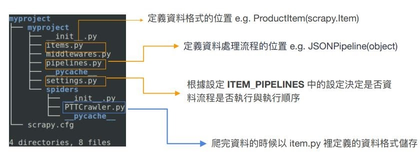

- 參考資料

  - [Srcapy Selector 官⽅⽂件](https://docs.scrapy.org/en/latest/topics/selectors.html)

  - [進階功能：Item Loader](https://docs.scrapy.org/en/latest/topics/loaders.html)
  - 在 Scrapy 中定義好如何定位元素，以及該元素應該如何存到 Item 格 式中，爬蟲過程框架可以幫你⾃動爬玩送到 pipeline 處理的功能 
    
  - [進階功能：Scrapy Feed exports](https://docs.scrapy.org/en/latest/topics/feed-exports.html#topics-feed-exports)
  - 我們在 pipline 中寫入 JSON 只是熟悉 pipeline 的操作，實際上如果要 把資料存成某種格式應該參考 feed exports 的⽅式

#### API

- 我們在前⾯介紹如何執⾏ Scrapy 的爬蟲都是透過命令列
- 但其實框架本⾝有提供 API 讓我們可以從外部去呼叫並執⾏爬蟲甚⾄是其他元件，這樣可以⽅便我們串聯 其他非框架本⾝或是沒有提供的功能

#### 多網頁爬蟲

- 我們⽬前的爬蟲功能是對「所有給予的 PTT ⽂章網址」進⾏爬蟲 實作 PTT 多網⾴爬蟲的實作有兩個⽅向
- 外部決定網址 + 框架對給予網址進⾏爬蟲
  - 在外部 (e.g. main.py) 對⽂章列表進⾏爬蟲取得所有⽂章網址
  - 把所有⽂章網址傳入 scrapy 爬蟲 
- 框架爬⽂章列表 + ⽂章內容
- 這兩種⽅式都可以，但是先從外部取得網址的⽅式會比較慢 這邊我們可以更深入了解框架送請求的過程為什麼會比較快

- 原本 requests 的⽅式，程式會送出第⼀個請求後會等到第⼀個 response 傳回 來才會送第⼆個請求
- ⽽框架內的請求⽅式 yield scrapy.Request
- 在送出第⼀個請求後會直接送第⼆個請求，並不會卡著等第⼀個 response，⽽ 是等第⼀個 response 送回來的時候再處理
- 這種⽅式可以縮短因為網路延遲造成的等待，加速整個爬蟲過程

- Ref
  - [【知乎】Scrapy中的scrapy.Spider.parse()如何被調⽤?](https://www.zhihu.com/question/30201428) 
    - 參考 Scrapy 的架構圖，再透過該篇⽂章可以更加了解 parse 的時 候 yield request 跟 yield item 的差別


#### 流程

1. 啟動專案

   ```prompt
   scrapy stratproject project_name
   # scrapy stratproject und
   ```


教學

1. [[Scrapy 爬蟲] 什麼是Scrapy以及為什麼要用Scrapy 爬取網頁?](https://www.youtube.com/watch?v=0pWJHy_fNWA)

   1. conda install scrapy

   2. cd 到工作的資料夾

   3. scrapy startproject projectname

      ex scrapy startproject undnews

2. [[Scrapy 爬蟲] 如何撰寫第一支Scrapy 爬蟲以抓取蘋果即時新聞?](https://www.youtube.com/watch?v=fnwvYAtCFko)

3. [[Scrapy 爬蟲] 如何從蘋果新聞的清單聯結抓取下一層的內容頁面?](https://www.youtube.com/watch?v=w4PPlkJFzCo&t=42s)

4. [[Scrapy 爬蟲] 如何使用items.py整理Scrapy 爬取下來的資料並輸出成JSON檔?](https://www.youtube.com/watch?v=Me9SpR0SE08)

5. [[Scrapy 爬蟲] 如何使用pipelines.py將Scrapy 爬取下來的資料儲存置資料庫之中?](https://www.youtube.com/watch?v=Xq4yRuePSdk)

6. [[Scrapy 爬蟲] 如何使用Scrapy 的CrawlSpider 實現多網頁爬取?](https://www.youtube.com/watch?v=KSA12AKDr_o&t=3s)

   1. from scrapy.spiders import CrawlSpider, Rule
   2. from scrapy.linkextractors import LinkExtractor

7. [[Scrapy 爬蟲] 如何設置 Job 以分段爬蟲任務?](https://www.youtube.com/watch?v=2xjAArPnOH8)

   1. 當網頁很大，可以將工作分段暫停
   2. 分段
      1. scrapy crawl udnnews -s JOBDIR=job1
      2. 按 Ctrl + C 是暫停
      3. 再輸入一次一下命令即可繼續
      4. scrapy crawl undnews -s JOBDIR=job1


### 進階爬蟲技術

- 在前⾯的課程中，我們討論了⼀個網⾴從該如何思考和撰寫。接下來我們要討論的是「爬蟲可以順利拉到資料，然後呢？」我們針對這三個⽅向來做優化：
  - 反爬
  - 加速
  - 自動化更新

- 反爬是什麼？常見的反爬蟲機制有哪些？
  - 許多網站為了保護資料，避免網頁上的公開資訊被網頁爬蟲給抓取，因此有了「反爬蟲」的機制出現。爬蟲工程師也發展了出⼀系列「反反爬蟲」的策略！
    - 檢查 HTTP 標頭檔
    - 驗證碼機制
    - 登入權限機制
    - IP 黑名單

- 如何為爬蟲程式加速？
  - 第⼆種實務爬蟲需要考慮的問題是加速，當資料量龐⼤或是更新速度較為頻繁的狀況下。依照正常的爬蟲程式，可以會因此受到應⽤上的限制。所以必須⽤程式的⽅法，來思考如何加速爬蟲的處理速度。
    - 多線程爬蟲加速
    - 非同步爬蟲

- 利⽤排程⾃動化更新
  - 真實世界中的資料是瞬息萬變的，也代表資料會有更新的需求。但爬蟲爬的資料只是⼀個片刻，所以必須要思考如何與資料源上的資料做同步或是更新，確保拿到的資料是最新的。常⾒的做法可以利⽤⼀個排程機制，週期性地重新抓取資料。
    - 在迴圈中加上 Sleep
    - 利⽤ threading 的 Timer
    - 第三⽅套件 schedule
  - 參考資料
    - [Python爬蟲系统學習⼗⼀：常⾒反爬蟲機制與應對⽅法](https://blog.csdn.net/guangyinglanshan/article/details/79043612)
    - [Python爬蟲筆記（六）— 應對反爬策略](https://blog.csdn.net/dhaiuda/article/details/81410535)

#### 編碼

```python
import requests
resp = requests.get('http://www.baidu.com')
resp.status_code
>>>200
resp.text
>>># 這裡會出現許多亂碼看不懂
# 修正編碼
r.encoding
>>> 'ISO-8859-1'
r.apparent_encoding
>>>'utf-8'
r.encoding = 'uf-8'
r.text
>>> # 正常顯示內容
```


#### 反爬

- 瀏覽器標頭與基本資訊
  - 檢查 HTTP 的發送請求⽅是否合法
    - 前⾯我們在提到網⾴的傳輸有講到 HTTP 協定，HTTP 會將網路的傳輸分為 「Request」和「Response」兩種⾓⾊。
    - 其中 Request ⼜可以分為幾個部分：
      - Header：瀏覽器⾃動產⽣，包含跟發送⽅有關的資訊。 
      - Body：網⾴服務真正要傳送的資料
    - Header 包含發送⽅的資訊
      - ⼀般來說，Header 可能會包含： 
        - 發送⽅的位址（Host）
        - 發送⽅的瀏覽器版本（User-Agent） 
        - 發送⽅的語⾔/格式 … 等等

  - 讓爬蟲程式也加上 Header
    - 因為 Header 是由瀏覽器⾃動產⽣，因此如果透過程式發出的請求預設是沒有 Header 的。透過檢查 Header 是最基本的反爬機制。
    - 解法：在爬蟲程式的 Request 加上 Header！

  ```python
  import requests
  headers = {'user-agent': 'my-app/0.0.1'}
  r = requests.get('https://www.zhihu.com/api/v4/questions/55493026/
  answers',headers=headers)
  response = r.text 
  ```

  - 怎麼檢查 Request 要帶哪些 Header？

    1. 右鍵點選檢查
    2. 下方點選 Network
    3. 找到網址對應的請求
    4. 切換到 Headers 項目
    5. 找到 Request 的 Headers

  - 在 Request 上加上 Headers

    - 實際上的 Headers 應該參考瀏覽器的。但範例為了⽅便，我們這邊是先⾃⼰定 義⼀的比較基本的。但不是每⼀個網站都可以通過，比較保險的⽅式建議模仿 瀏覽器所帶出的標頭且整理成 dict 的型態（如下）

    ```pythn
    headers = {
     'accept': '...',
     'accept-encoding': '...',
     'accept-language': '...',
     ...
     'user-agent': '...'
    } 
    ```

- Robots協議
  - Https://www.jd.com/robots.txt
  - 網頁允許/不允許的爬蟲權限與內容

- 驗證碼處理
  - 驗證碼機制是許多網站再傳送資料的檢查機制，對於非⼈類操作與⼤量頻繁操 作都有不錯的防範機制。

  - 驗證碼是⼀種圖靈測試

  - CAPTCHA 的全名是「Completely Automated Public Turing test to tell Computers and Humans Apart」，或「全⾃動區分電腦與⼈類的圖靈測試」， 實作的⽅式很簡單，就是問⼀個電腦答不出來，但⼈類答得出來的問題。

  - 爬蟲該怎麼辦？

  - 爬蟲在實作上遇到驗證碼的做法會是這樣，先把圖抓回來， 再搭配圖形識別⼯具找出圖中的內容。

  - 環境⼯具準備

    - Tesseract

      - Tesseract 是⼀個OCR庫(OCR是英⽂Optical Character Recognition的縮寫)，它⽤來對⽂ 字資料進⾏掃描，然後對影像檔案進⾏分析處理，獲取⽂字及版⾯資訊的過程 
      - 安裝⽅式：https://github.com/tesseract-ocr/tesseract/wiki

    - pytesseract

      - 在 Python 中呼叫 Tesseract 的套件

      - 安裝⽅式（利⽤ pip）：https://pypi.org/project/pytesseract/

      ```python
      import requests
      import pytesseract
      from io import BytesIO
      response = requests.get('https://i0.wp.com/www.embhack.com/wp-content/uploads/
      2018/06/hello-world.png')
      img = Image.open(BytesIO(response.content))
      code = pytesseract.image_to_string(img)
      print(code)
      ```

- 參考資料

  - [python識別驗證碼](https://www.cnblogs.com/benpao1314/p/9999283.html)
  - [Python 實現識別弱圖片驗證碼](https://cloud.tencent.com/developer/article/1187805)


#### 登入授權模擬

- 權限管理機制

  - ⼤部分網站都有權限管理機制，使⽤上也會有登入/登出的機制。但由於爬蟲多 半是基於 HTTP Request Response ⼀來⼀回的⽅式取資料。接下來我們將討 論在爬蟲中要如何加上登入的做法。

- 登入有兩種實作⽅法

  在開始講爬蟲登入之前，我們必須要知道現⾏的網站是如何做到登入這件事 的。主要有兩種做法：

  - cookie/ session

    cookie 是⼀種存放於瀏覽器的暫存空間，傳統的登入機制⽽會將驗證登入後的 結果存在這裡，後續透過瀏覽器資料將 cookie 跟著 request ⼀起傳出去。所 以 server 只要檢查 request 帶來的 cookie 是否存放正確的登入資訊，即可以 判斷是否已登入過。

  - tokenbased

    另外⼀種登入⽅式，是登入之後會得到⼀個 Token（令牌），由使⽤者⾃⾏保 管，之後再發 Request 的時候帶在 Header 當中。這個⽅法其實就是我們之前 講 FB API 的⽤法，這裡就不⽰範了。

- 利⽤ cookie/session 做登入

  - 第⼀種做法，可以先模仿⼀個「登入」的請求，把這個請求的狀態保存，再接 著發送第⼆次「取資料」的請求。

  ```python
  import requests
  rs = requests.session()
  payload={
   'from':'/bbs/Gossiping/index.html',
   'yes':'yes'
  }
  res = rs.post('https://www.ptt.cc/ask/over18',verify = False, data = payload)
  res = rs.get('https://www.ptt.cc/bbs/Gossiping/index.html',verify = False)
  soup = BeautifulSoup(res.text,'html.parser')
  print(soup.text) 
  ```

  - 第⼆種做法，直接觀察瀏覽器記錄的資訊是什麼，將 cookie 帶在請求當中。

  ```python
  import requests
  res = requests.get('https://www.ptt.cc/bbs/Gossiping/index.html',verify = False,
  cookies={'over18': '1'})
  soup = BeautifulSoup(res.text,'html.parser')
  print(soup.text) 
  ```

#### 代理 IP

- 當我們在對特定網站進行網路爬蟲的任務時，經常會遇到 鎖定IP 的反爬蟲機制，這時候透過代理伺服器來向網站請求資料就是對應的解決方式!

- 代理伺服器
  - 這邊的解法我們會採⽤「代理伺服器（Proxy）」的概念來處理，所謂的代理 伺服器即是透過⼀個第三⽅主機代為發送請求，因此對於網站⽅⽽⾔，他收到 的請求是來⾃於第三⽅的。

- 在 Python 中加上 proxy 參數

```python
proxy_ips = [...]
resp = requests.get('http://ip.filefab.com/index.php',
 proxies={'http': 'http://' + ip}) 
```

- Ref

  - [USProxy.ipynb](https://github.com/TLYu0419/DataScience/blob/master/WebCrawler/USProxy/USProxy.ipynb)
- 哪裡有第三⽅的代理伺服器可以⽤？

  - 國外：http://spys.one/en/ 、https://free-proxy-list.net/ 、https://www.us-proxy.org/
  - 中國：http://cn-proxy.com/


#### 加速

- 多線程爬蟲
  
  - 當資料量龐⼤或是更新速度較為頻繁的狀況下。依照正常的爬蟲程式，可以會因此受到應⽤上的限制。所以必須⽤程式的⽅法，來思考如何加速爬蟲的處理速度。
    
  - 簡單來說就是時間可貴!
    
  - 第⼀種加速的⽅法是「多線程爬蟲」，多線程爬蟲的意思是⼀次可以多個程式 重複執⾏，因此也可以稱為平⾏處理。
  
  ```python
  import _thread
  import time
  def print_time( threadName, data):
      for d in data:
          time.sleep(2)
          print(threadName, ' => ', d)
  _thread.start_new_thread( print_time, ("Thread-1", range(0, 5, 2), ) )
  _thread.start_new_thread( print_time, ("Thread-2", range(1, 5, 2), ) ) 
  ```
  
  - 簡單來說，可以想像成 _thread.start_new_thread 會開⼀個分⽀ 執⾏，不⽤等到結束就繼續執⾏下⼀⾏程式。
  
  - Ref
    - [Multi-threading vs. asyncio](https://www.reddit.com/r/learnpython/comments/5uc4us/multithreading_vs_asyncio/)
  
  
  
- 非同步爬蟲
  
  - 當資料量龐⼤或是更新速度較為頻繁的狀況下。依照正常的爬蟲程式，可以會因此受到應⽤上的限制。所以必須⽤程式的⽅法，來思考如何加速爬蟲的處理速度。
    
  - 第⼆種加速的⽅法是「非同步爬蟲」，⼀般程式都需要等前⼀⾏執⾏完畢之後 才會執⾏下⼀⾏，⽽非同步爬蟲的作法則是當某⼀⾏程式開始執⾏時（不⽤等 到結束）就繼續執⾏下⼀⾏。
    
  - Python 中實現非同步
  
  ```python
  import aiohttp
  import asyncio
  async def fetch(session, url):
      async with session.get(url) as response:
          return await response.text()
  async def main():
      async with aiohttp.ClientSession() as session:
          html = await fetch(session, 'http://python.org')
          print(html)
  loop = asyncio.get_event_loop()
  loop.run_until_complete(main()) 
  ```
- Ref
  
    - [加速爬蟲: 異步加載 Asyncio](https://morvanzhou.github.io/tutorials/data-manipulation/scraping/4-02-asyncio/)

#### 搜尋引擎

- 當我們在搜尋資料時，最常想到的就是Google，但是 Google 提供的API卻有時間限制。如果不想一直花時間等待，可以考慮使用其他的搜尋引擎，例如Yahoo，Bing...

  - Google
  - Yahoo
  - Bing

#### 自動化更新機制(排程)

- 真實世界中的資料是瞬息萬變的，也代表資料會有更新的需求。但爬蟲爬的資料只是⼀個片刻，所以必須要思考如何與資料源上的資料做同步或是更新，確保拿到的資料不會是錯誤或是假的。

- ⾃動化更新的做法

  - 在迴圈中加上 Sleep
  
  - 利⽤ threading 的 Timer
  - 第三⽅套件 schedule

```python
def timer(n):
    '''
  	每n秒執⾏⼀次
  	'''
  	while True:
  	print time.strftime('%Y-%m-%d %X',time.localtime())
  	yourTask() # 此處為要執⾏的任務
  	time.sleep(n) 
```

- 利⽤ threading 的 Timer

  ```python
  def printHello():
  	print "Hello World"
  	t = Timer(2, printHello)
  	t.start()
  	if __name__ == "__main__":
  		printHello() 
  ```

- 第三⽅套件 schedule

  ```python
  import schedule
  import time
  def job():
      print("I'm working...")
  	schedule.every(10).minutes.do(job)
  	schedule.every().hour.do(job)
  	schedule.every().day.at("10:30").do(job)
  	schedule.every(5).to(10).minutes.do(job)
  	schedule.every().monday.do(job)
  	schedule.every().wednesday.at("13:15").do(job)
  	schedule.every().minute.at(":17").do(job)
  	while True:
   		schedule.run_pending()
   		time.sleep(1) 
  ```


# Data Preprocessing

- 剛拿到手的資料會出現雜訊，缺失，髒亂等現象，我們需要對資料進行清洗與加工，從而方便進行後續的工作。

- 主要會分成以下幾個步驟
  1. Explore Data Analysis: 檢查欄位型態與資料內容，確認資料中是否存在離群值與遺漏值DA
  2. 資料清理: 遺漏值填補、離群資料處理。
  3. 特徵轉換: 離散化、常態化...等等
  4. 資料縮減: 挑選建模特徵、維度縮減...等等

## Explore Data Analysis

- 初步透過視覺化/統計⼯具進⾏分析，達到三個主要⽬的

  - 了解資料：獲取資料所包含的資訊、結構和特點
  - 發現 outliers 或異常數值：檢查資料是否有誤
  - 分析各變數間的關聯性：找出(對於預測目標變數有幫助的)重要變數

- 從 EDA 的過程中觀察現象，檢查資料是否符合分析前的假設

  - 可以在模型建立之前，先發現潛在的錯誤
  - 也可以根據 EDA 的結果來調整分析的⽅向


### 資料類型

- 實際上資料可以分為類別、順序、等距與等比這四種測量尺度，但實務上通常會將順序、等距與等比的資料都視為數值資料。

- 測量尺度
  - 類別變數(nominal): 如國家、縣市...等等。
  - 順序尺度(ordinal)：如滿意度分數
  - 等距尺度(interval):沒有絕對的0，如溫度
  - 等比尺度(ratio)：0 表示沒有，如收入、身高、體重。

- 其他類型特徵
  
  - **時間型特徵**
  
    - 時間型特徵最常⽤的是特徵分解 - 拆解成年/⽉/⽇/時/分/秒的分類值
  
    - 週期循環特徵是將時間"循環"特性改成特徵⽅式, 設計關鍵在於⾸尾相接, 因此我們需要使⽤ sin /cos 等週期函數轉換
  
    - 常⾒的週期循環特徵有 - 年週期(季節) / 周周期(例假⽇) / ⽇週期(⽇夜與⽣活作息), 要注意的是最⾼與最低點的設置
  
    - 雖然時間型特徵可當作數值型特徵或類別型特徵，但都不適合
  
      - 取總秒數雖可變為數值，但會失去週期性 (ex ⽉ / 星期)
      - 使⽤本⾝可以當作類別，但會失去排序資訊，類別數量也過⼤
  
    - 週期循環特徵
  
      - **年週期：**與春夏秋冬季節溫度相關（正：冷 / 負：熱）
  
        $cos((月/6 + 日/180) \pi)$
  
      - **月週期：**與薪⽔、繳費相關
  
      - **週週期：**與周休、消費習慣相關（正：精神飽滿 / 負：疲倦）
  
        $sin((星期幾/3.5 + 小時/84) \pi)$
  
      - **日週期：**與⽣理時鐘相關（正：精神飽滿 / 負：疲倦）
  
        $sin((小時/12 + 分/720 + 秒/43200) \pi)$
  
      - 前述的週期所需數值都可由時間欄位組成, 但還⾸尾相接
        因此週期特徵還需以正弦函數( sin )或餘弦函數( cos )加以組合
  
    - 時段特徵
  
      - 短暫時段內的事件計數，也可能影響事件發⽣的機率
        - 如 : 網站銷售預測，點擊網站前 10分鐘 / 1⼩時 / 1天 的累計點擊量
      - 以⼀筆 17:05 發⽣的網站瀏覽事件為例
        - 同樣是1⼩時的統計，基礎分解會統計當⽇ 17 時整個⼩時的點擊量
        - 時段特徵則是會統計 16:05-17:04 的點擊量
          兩者相比，後者較前者更為合理
  
    - [Python-基础-时间日期处理小结](http://www.wklken.me/posts/2015/03/03/python-base-datetime.html)
  
  - **文本特徵**
  
    - 斷詞
      - 字典法
      - 爬蟲法
      - 左右互信息法
      - NER?
  
    - 詞頻統計
      - 如果是文本類型的數據，比如詞袋，則可以在文本數據預處理後，去掉停用詞，剩下的詞使用Hash技巧做一些詞頻統計。
    - TD-IDF
      - 到TF-IDF这种统计方法。字词的重要性随着它在文件中 出现的次数成正比增加，但同时会随着它在语料库中出现的频率成 反比下降。
  
    - Bag-of-Words
      - 將一篇文檔看作是一個詞的集合，單純計算每個詞的出現次數，不考慮語法，甚至是詞序信息也都拋棄了。
  
    - word2vec(word embeddings)
      - 中文名“詞向量”，作用就是將自然語言中的字詞轉為計算機可以理解的稠密向量（Dense Vector）。在word2vec出現之前，自然語言處理經常把字詞轉為離散的單獨的符號，也就是One-Hot Encoder。
  
      - 但是使用One-Hot Encoder有以下問題。一方面，城市編碼是隨機的，向量之間相互獨立，看不出城市之間可能存在的關聯關係。其次，向量維度的大小取決於語料庫中字詞的多少。如果將世界所有城市名稱對應的向量合為一個矩陣的話，那這個矩陣過於稀疏，並且會造成維度災難。
  
      - **通過嵌入一個線性的投影矩陣（projection matrix），將原始的one-hot向量映射為一個稠密的連續向量，並通過一個語言模型的任務去學習這個向量的權重。**Word2Vec其實就是通過學習文本來用詞向量的方式表徵詞的語義信息，即通過一個嵌入空間使得語義上相似的單詞在該空間內距離很近。
  
    - 特徵雜湊(Feature Hash)
      - 類別型特徵最⿇煩的問題 : 相異類別的數量非常龐⼤, 該如何編碼?
        舉例 : 鐵達尼⽣存預測的旅客姓名
  
      - 特徵雜湊是⼀種折衷⽅案，將類別由雜湊函數定應到⼀組數字。調整雜湊函數對應值的數量，在計算空間/時間與鑑別度間取折衷，也提⾼了訊息密度, 減少無⽤的標籤
  
  - 影像特徵
  
  - 影片特徵
  
  - 聲音特徵
  
  
  
- Ref
  
  - [Data Types: A Better Way to Think about Data Types for Machine Learning](https://towardsdatascience.com/7-data-types-a-better-way-to-think-about-data-types-for-machine-learning-939fae99a689)

### 資料分佈

- 以單變量分析來說，量化的分析⽅式可包含

  - 計算集中趨勢
    - 平均值 Mean
    - 中位數 Median
    - 眾數 Mode 
  - 計算資料分散程度
    - 最⼩值 Min
    - 最⼤值 Max
    - 範圍 Range
    - 四分位差 Quartiles
    - 變異數 Variance
    - 標準差 Standard deviation

- 雙變數分析

  - Correlation Coefficient

    - 相關係數是其中⼀個常⽤來了解各個欄位與我們想要預測的⽬標之間的關係的指標。相關係數衡量兩個隨機變量之間線性關係的強度和⽅向。雖然不是表⽰變數之間關係的最好⽅法，但可以提供我們很直觀的了解。
      $$
      r = \frac {1}{n-1} \sum^n_{i=1} (\frac{x_i-\bar x}{S_x})(\frac{y_i-\bar y}{S_y})
      $$

    - 相關係數是⼀個介於 -1～1 之間的值，負值代表負相關，正值代表正相關，數值的⼤⼩代表相關性的強度

    - 在計算相關性是需要先將資料常態化，避免因不同計算單位影響計算的結果

    - 相關性(含正負號)

      - 非常弱相關：0.0~0.19
      - 弱相關：0.2~0.39
      - 中度相關：0.4~0.59
      - 強相關：0.6~0.79
      - 非常強相關：0.8~1.0

      

- 參考資料

  - [Standard Statistical Distributions (e.g. Normal, Poisson, Binomial) and their uses](https://www.healthknowledge.org.uk/public-health-textbook/research-methods/1b-statistical-methods/statistical-distributions)
  - [List of probability distributions](https://en.wikipedia.org/wiki/List_of_probability_distributions)
  - [Guess The Correlation](http://guessthecorrelation.com/)

### 視覺化

- 有句話「⼀畫勝千⾔」，除了數字，視覺化的⽅式也是⼀種很好觀察資料分佈的⽅式，可參考 python 中常⽤的視覺化套件

#### Correlation

> The plots under correlation is used to visualize the relationship between 2 or more variables. That is, how does one variable change with respect to another.

1. Scatter plot: 

   - Scatteplot is a classic and fundamental plot used to study the relationship between two variables. If you have multiple groups in your data you may want to visualise each group in a different color. In `matplotlib`, you can conveniently do this using `plt.scatterplot()`

     

2. Bubble plot with Encircling: 

   - Sometimes you want to show a group of points within a boundary to emphasize their importance. In this example, you get the records from the dataframe that should be encircled and pass it to the `encircle()` described in the code below.

     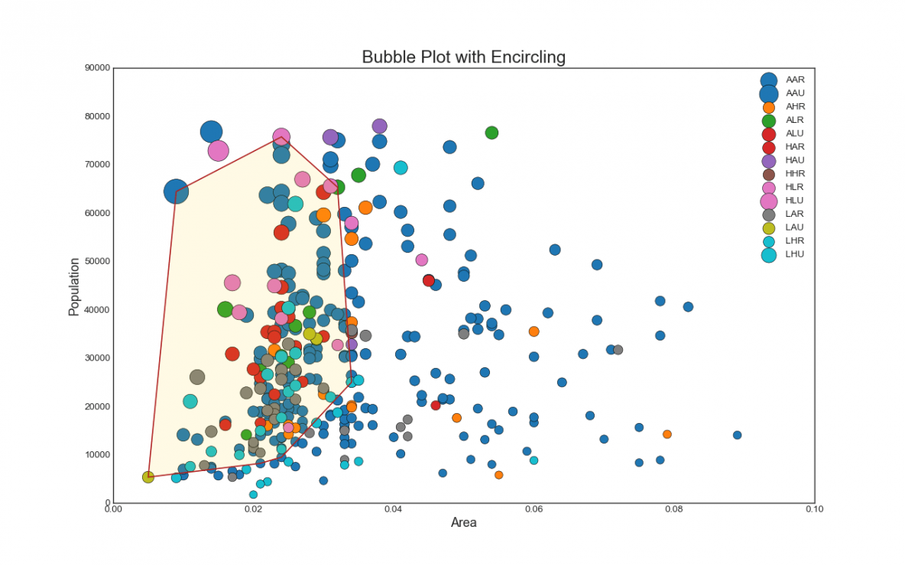

3. Scatter plot with line of best fit

   - If you want to understand how two variables change with respect to each other, the line of best fit is the way to go. The below plot shows how the line of best fit differs amongst various groups in the data. To disable the groupings and to just draw one line-of-best-fit for the entire dataset, remove the `hue='cyl'` parameter from the `sns.lmplot()` call below.

     

   - Alternately, you can show the best fit line for each group in its own column. You cando this by setting the `col=groupingcolumn` parameter inside the `sns.lmplot()`.

     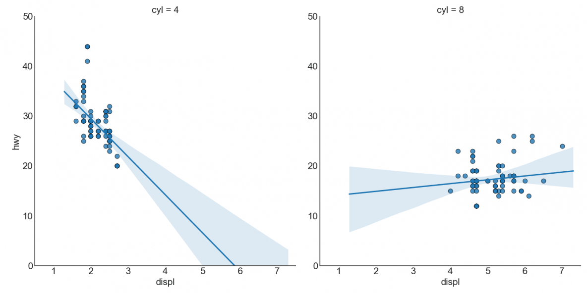

4. Jittering with stripplot

   - Often multiple datapoints have exactly the same X and Y values. As a result, multiple points get plotted over each other and hide. To avoid this, jitter the points slightly so you can visually see them. This is convenient to do using seaborn’s `stripplot()`.

     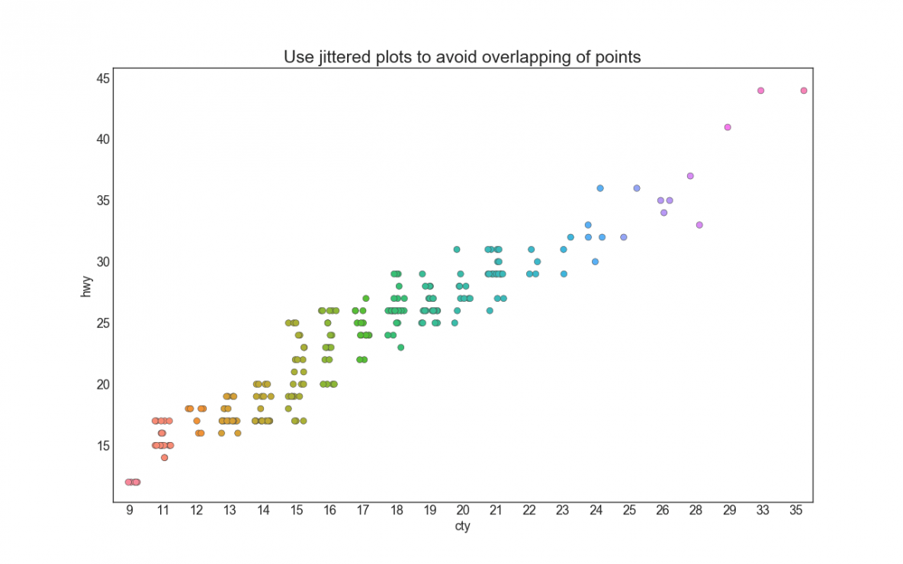

5. Counts Plot

   - Another option to avoid the problem of points overlap is the increase the size of the dot depending on how many points lie in that spot. So, larger the size of the point more is the concentration of points around that.

   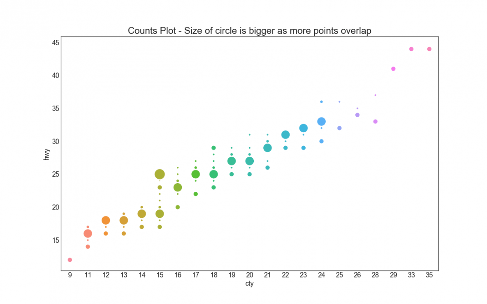

6. Marginal Histogram

   - Marginal histograms have a histogram along the X and Y axis variables. This is used to visualize the relationship between the X and Y along with the univariate distribution of the X and the Y individually. This plot if often used in exploratory data analysis (EDA).

   

7. Marginal Boxplot

   - Marginal boxplot serves a similar purpose as marginal histogram. However, the boxplot helps to pinpoint the median, 25th and 75th percentiles of the X and the Y.

   

8. Correlogram

   - Correlogram is used to visually see the correlation metric between all possible pairs of numeric variables in a given dataframe (or 2D array).

   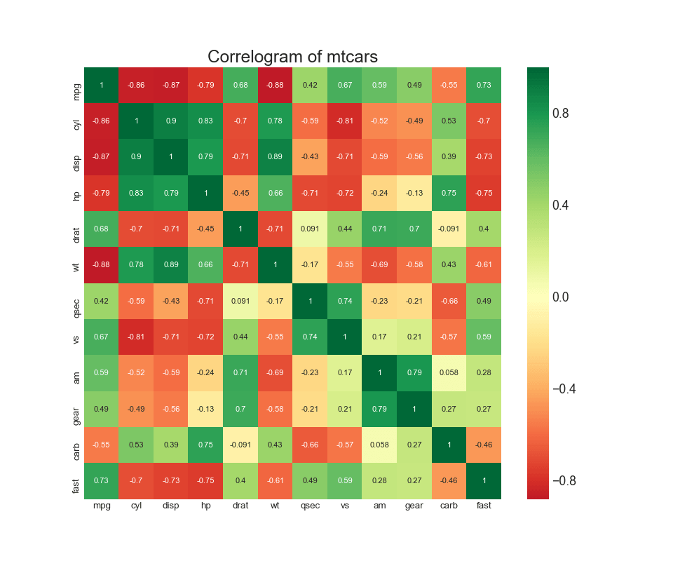

9. Pairwise Plot

   - Pairwise plot is a favorite in exploratory analysis to understand the relationship between all possible pairs of numeric variables. It is a must have tool for bivariate analysis.

   

#### Deviation

1. Diverging Bars

   - If you want to see how the items are varying based on a single metric and visualize the order and amount of this variance, the diverging bars is a great tool. It helps to quickly differentiate the performance of groups in your data and is quite intuitive and instantly conveys the point.

   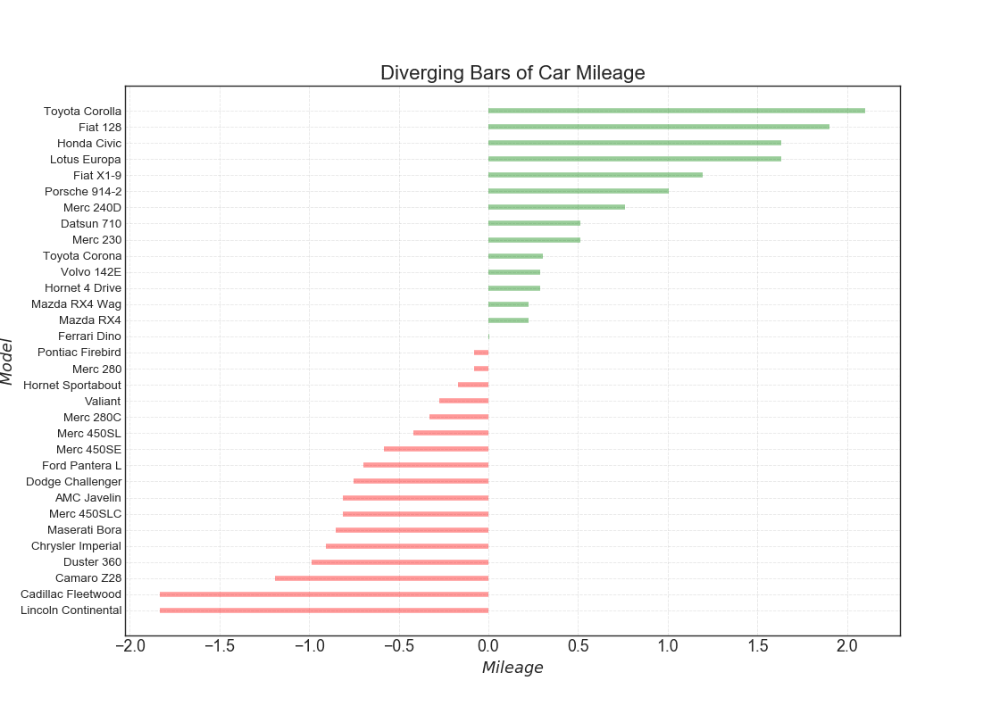

2. Diverging Texts

   - Diverging texts is similar to diverging bars and it preferred if you want to show the value of each items within the chart in a nice and presentable way.

   

3. Diverging Dot Plot

   - Divering dot plot is also similar to the diverging bars. However compared to diverging bars, the absence of bars reduces the amount of contrast and disparity between the groups.

   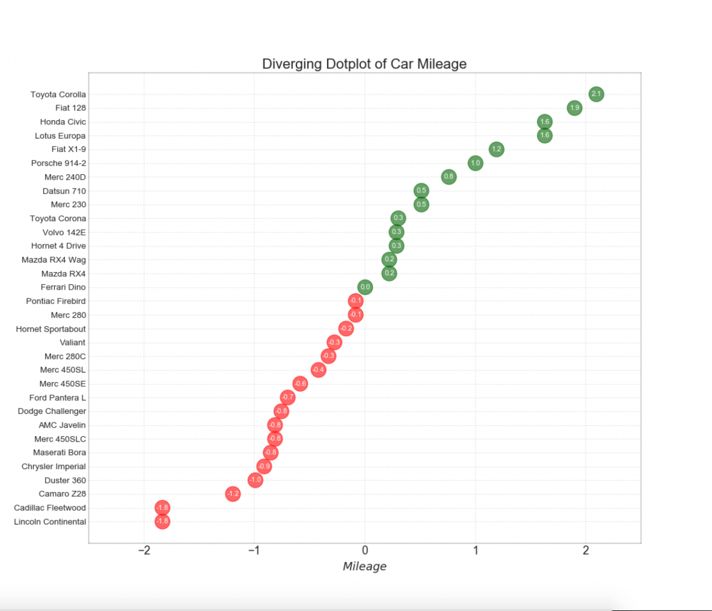

4. Diverging Lollipop Chart with Markers

   - Lollipop with markers provides a flexible way of visualizing the divergence by laying emphasis on any significant datapoints you want to bring attention to and give reasoning within the chart appropriately.

   

5. Area Chart

   - By coloring the area between the axis and the lines, the area chart throws more emphasis not just on the peaks and troughs but also the duration of the highs and lows. The longer the duration of the highs, the larger is the area under the line.

   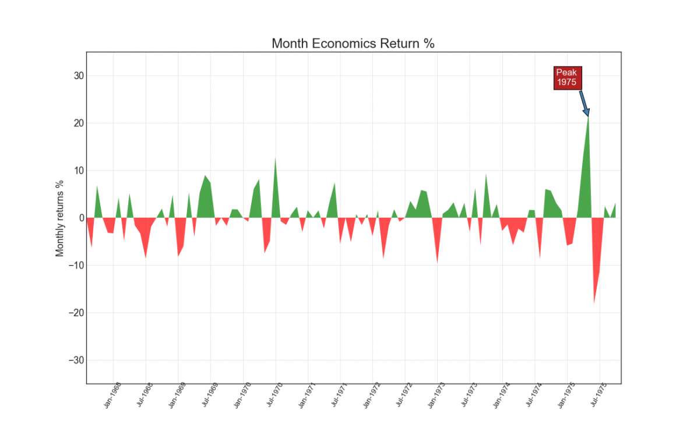

#### Ranking

1. Ordered Bar Chart

   - Ordered bar chart conveys the rank order of the items effectively. But adding the value of the metric above the chart, the user gets the precise information from the chart itself.

   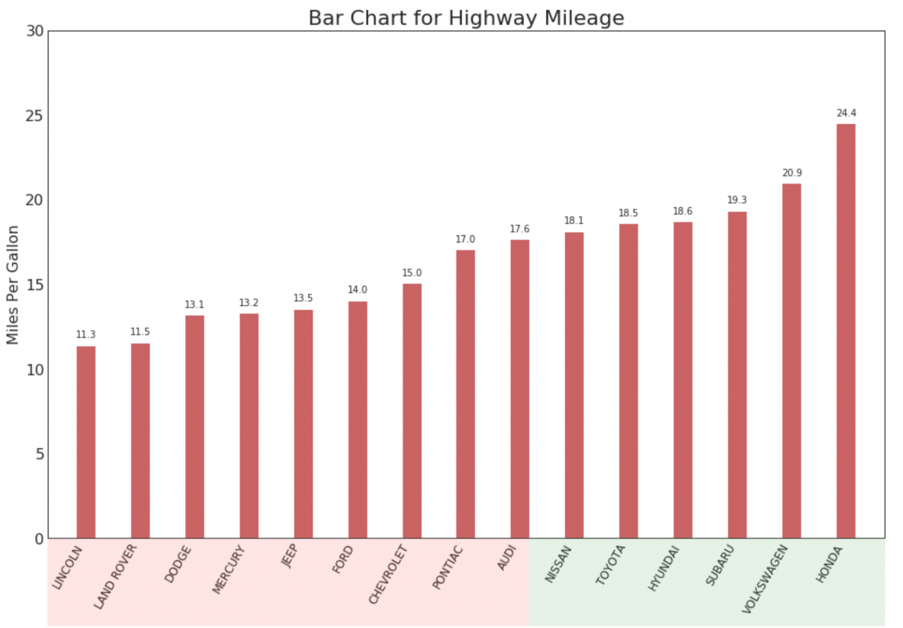

2. Lollipop Chart

   - Lollipop chart serves a similar purpose as a ordered bar chart in a visually pleasing way.

   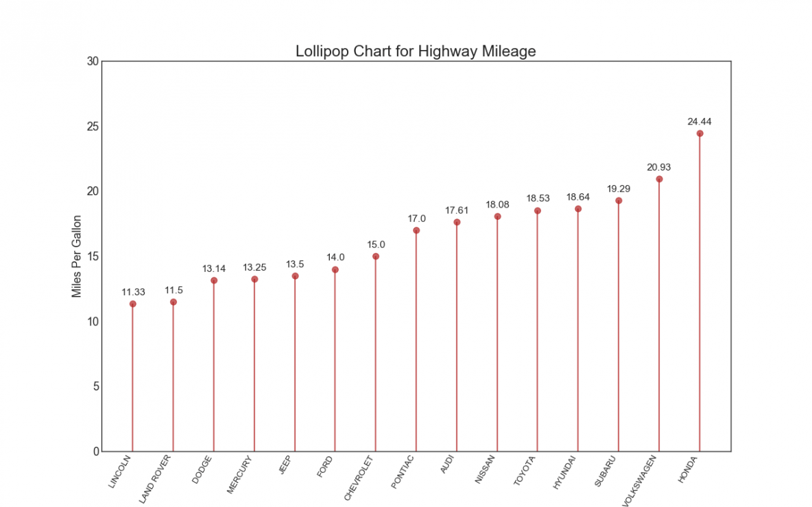

3. Dot Plot

   - The dot plot conveys the rank order of the items. And since it is aligned along the horizontal axis, you can visualize how far the points are from each other more easily.

   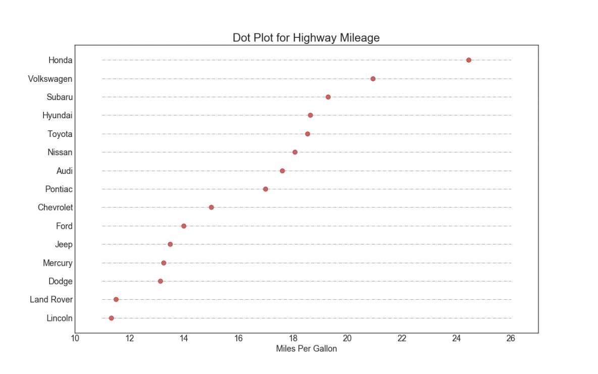

4. Slope Chart

   - Slope chart is most suitable for comparing the ‘Before’ and ‘After’ positions of a given person/item.

   

5. Dumbbell Plot

   - Dumbbell plot conveys the ‘before’ and ‘after’ positions of various items along with the rank ordering of the items. Its very useful if you want to visualize the effect of a particular project / initiative on different objects.

   

#### Distribution

1. Histogram for Continuous Variable

   - Histogram shows the frequency distribution of a given variable. The below representation groups the frequency bars based on a categorical variable giving a greater insight about the continuous variable and the categorical variable in tandem.

   

2. Histogram for Categorical Variable

   - The histogram of a categorical variable shows the frequency distribution of a that variable. By coloring the bars, you can visualize the distribution in connection with another categorical variable representing the colors.

   

3. Density Plot

   - Density plots are a commonly used tool visualise the distribution of a continuous variable. By grouping them by the ‘response’ variable, you can inspect the relationship between the X and the Y. The below case if for representational purpose to describe how the distribution of city mileage varies with respect the number of cylinders.

   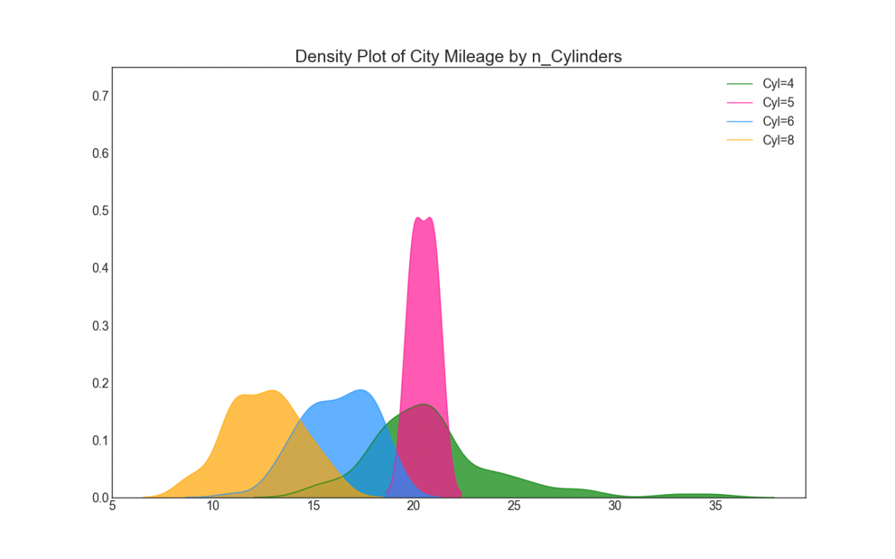

4. Density Curves with Histogram

   - Density curve with histogram brings together the collective information conveyed by the two plots so you can have them both in a single figure instead of two.

   

5. Joy Plot

   - Joy Plot allows the density curves of different groups to overlap, it is a great way to visualize the distribution of a larger number of groups in relation to each other. It looks pleasing to the eye and conveys just the right information clearly. It can be easily built using the `joypy` package which is based on `matplotlib`.

   

6. Distributed Dot Plot

   - Distributed dot plot shows the univariate distribution of points segmented by groups. The darker the points, more is the concentration of data points in that region. By coloring the median differently, the real positioning of the groups becomes apparent instantly.

   

7. Box Plot

   - Box plots are a great way to visualize the distribution, keeping the median, 25th 75th quartiles and the outliers in mind. However, you need to be careful about interpreting the size the boxes which can potentially distort the number of points contained within that group. So, manually providing the number of observations in each box can help overcome this drawback.
   - For example, the first two boxes on the left have boxes of the same size even though they have 5 and 47 obs respectively. So writing the number of observations in that group becomes necessary.

   

8. Dot + Box Plot

   - Dot + Box plot Conveys similar information as a boxplot split in groups. The dots, in addition, gives a sense of how many data points lie within each group.

   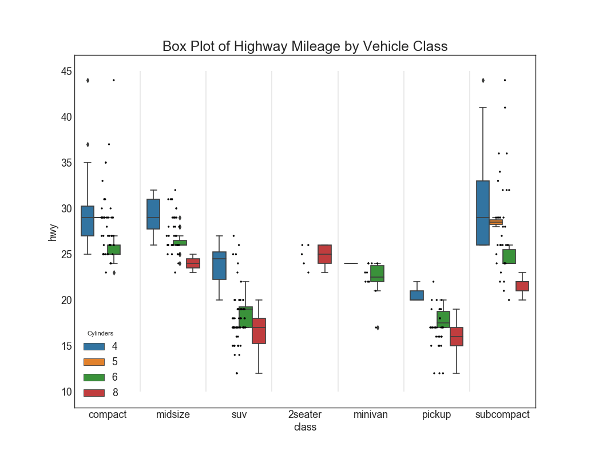

9. Violin Plot

   - Violin plot is a visually pleasing alternative to box plots. The shape or area of the violin depends on the number of observations it holds. However, the violin plots can be harder to read and it not commonly used in professional settings.

   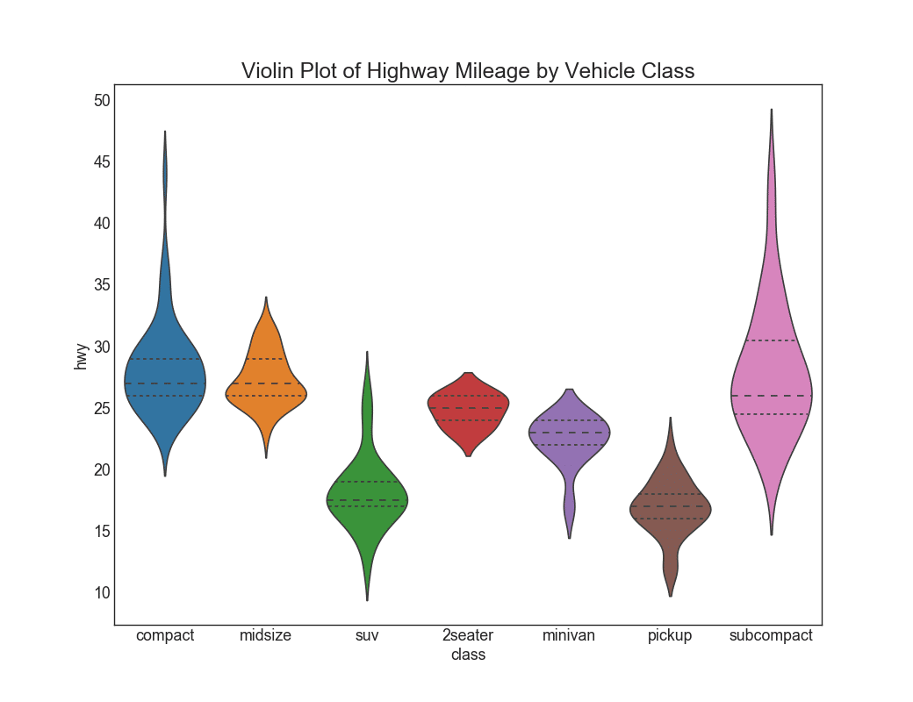

10. Population Pyramid

    - Population pyramid can be used to show either the distribution of the groups ordered by the volumne. Or it can also be used to show the stage-by-stage filtering of the population as it is used below to show how many people pass through each stage of a marketing funnel.

    

11. Categorical Plots

    - Categorical plots provided by the `seaborn` library can be used to visualize the counts distribution of 2 ore more categorical variables in relation to each other.

    

#### Composition

1. Waffle Chart

   - The `waffle` chart can be created using the `pywaffle` package and is used to show the compositions of groups in a larger population.

   

   

2. Pie Chart

   - Pie chart is a classic way to show the composition of groups. However, its not generally advisable to use nowadays because the area of the pie portions can sometimes become misleading. So, if you are to use pie chart, its highly recommended to explicitly write down the percentage or numbers for each portion of the pie.

   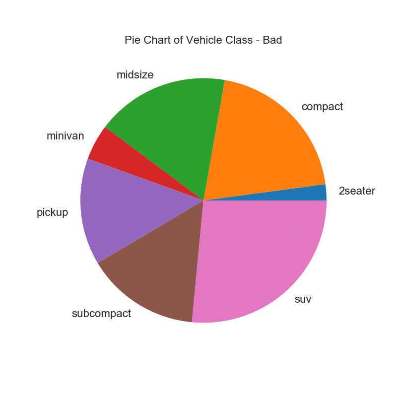

   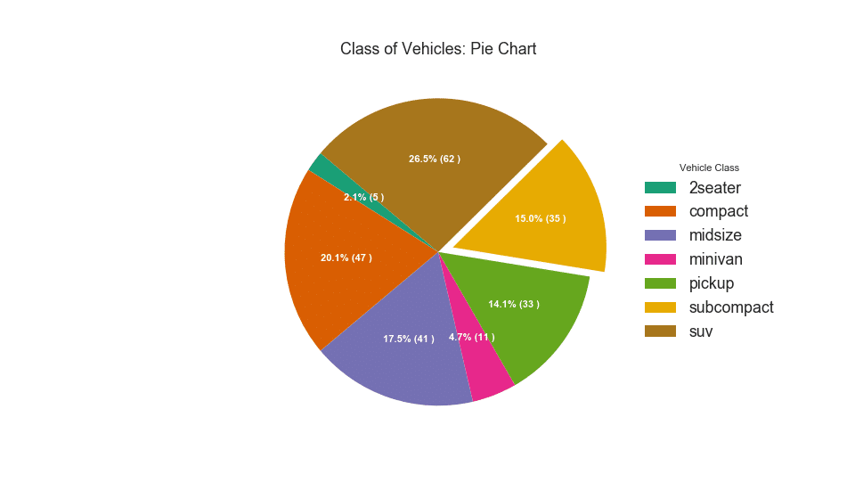

3. Treemap

   - Tree map is similar to a pie chart and it does a better work without misleading the contributions by each group.

   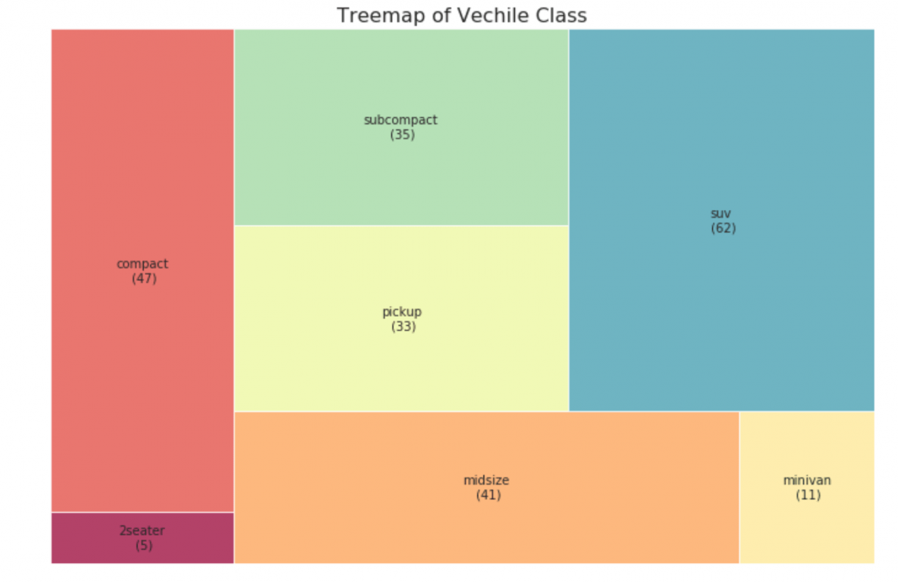

4. Bar Chart

   - Bar chart is a classic way of visualizing items based on counts or any given metric. In below chart, I have used a different color for each item, but you might typically want to pick one color for all items unless you to color them by groups. The color names get stored inside `all_colors` in the code below. You can change the color of the bars by setting the `color` parameter in `plt.plot()`.

   

#### Change

1. Time Series Plot

   - Time series plot is used to visualise how a given metric changes over time. Here you can see how the Air Passenger traffic changed between 1949 and 1969.

   

2. Time Series with Peaks and Troughs Annotated

   - The below time series plots all the the peaks and troughs and annotates the occurence of selected special events.

   

3. Autocorrelation (ACF) and Partial Autocorrelation (PACF) Plot

   - The ACF plot shows the correlation of the time series with its own lags. Each vertical line (on the autocorrelation plot) represents the correlation between the series and its lag starting from lag 0. The blue shaded region in the plot is the significance level. Those lags that lie above the blue line are the significant lags.
   - So how to interpret this?
   - For AirPassengers, we see upto 14 lags have crossed the blue line and so are significant. This means, the Air Passengers traffic seen upto 14 years back has an influence on the traffic seen today.
   - PACF on the other had shows the autocorrelation of any given lag (of time series) against the current series, but with the contributions of the lags-inbetween removed.

   

4. Cross Correlation Plot

   - Cross correlation plot shows the lags of two time series with each other.

   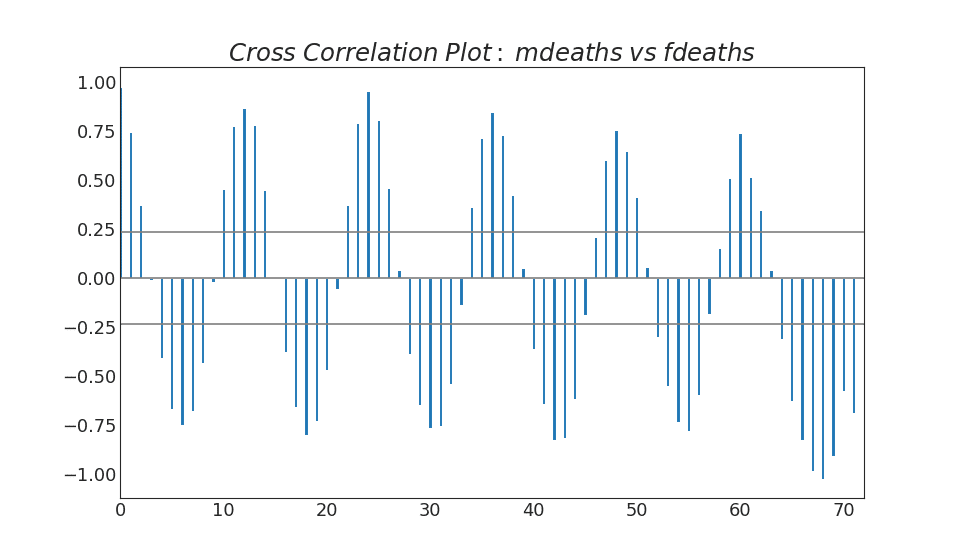

5. Time Series Decomposition Plot

   - Time series decomposition plot shows the break down of the time series into trend, seasonal and residual components.

   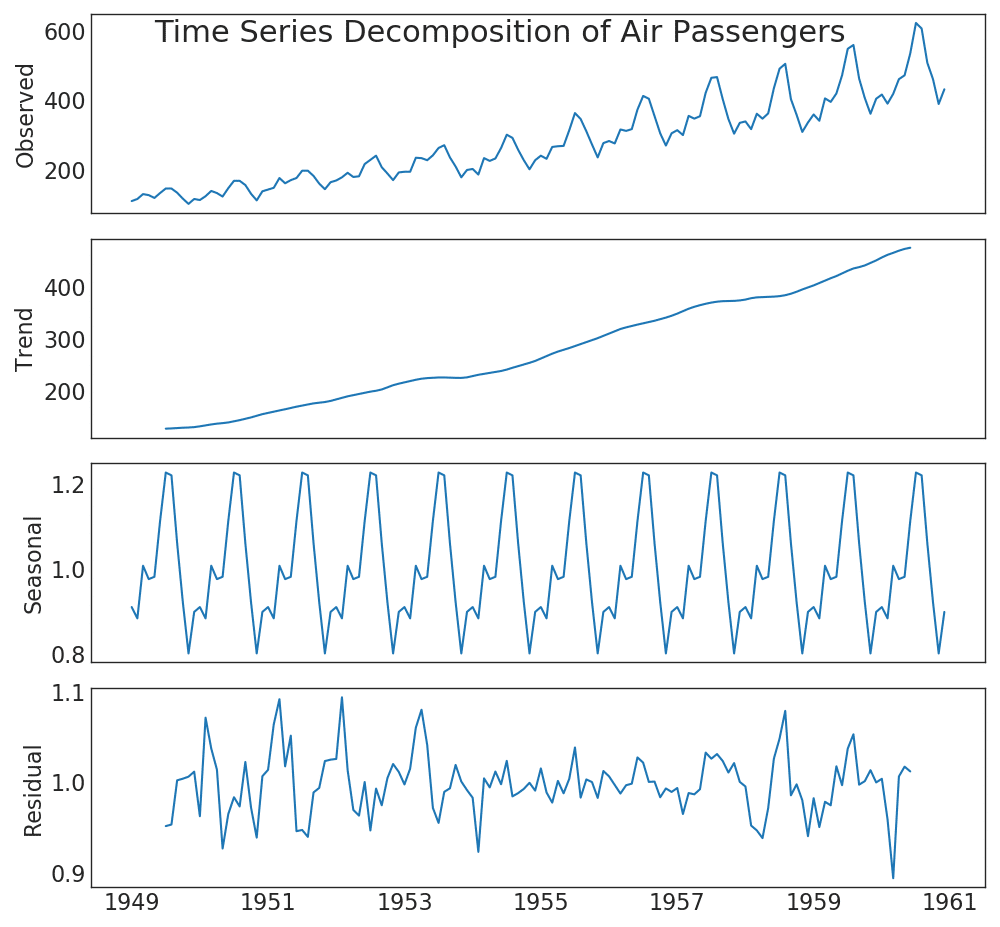

6. Multiple Time Series

   - You can plot multiple time series that measures the same value on the same chart as shown below.

   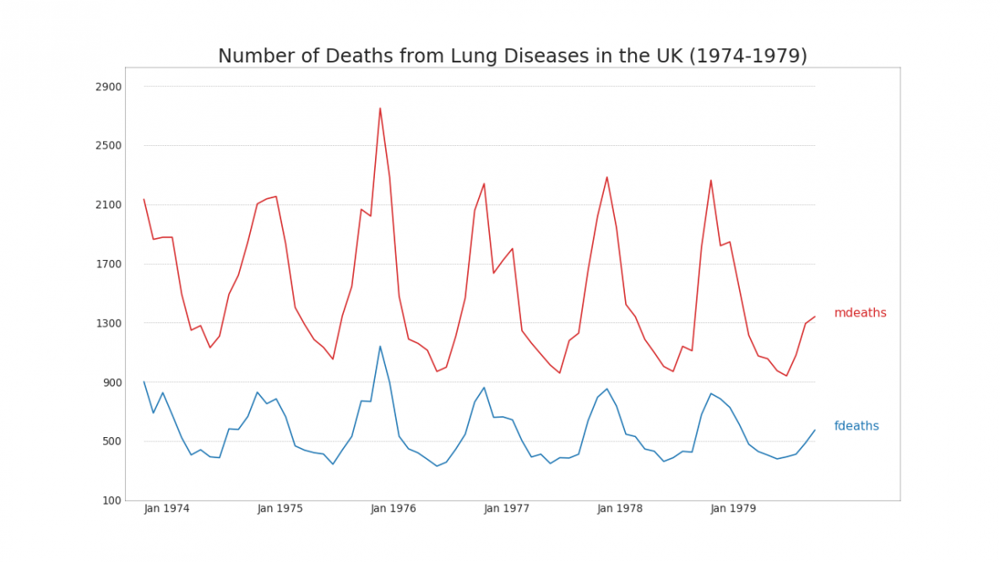

7. Plotting with different scales using secondary Y axis

   - If you want to show two time series that measures two different quantities at the same point in time, you can plot the second series againt the secondary Y axis on the right.

   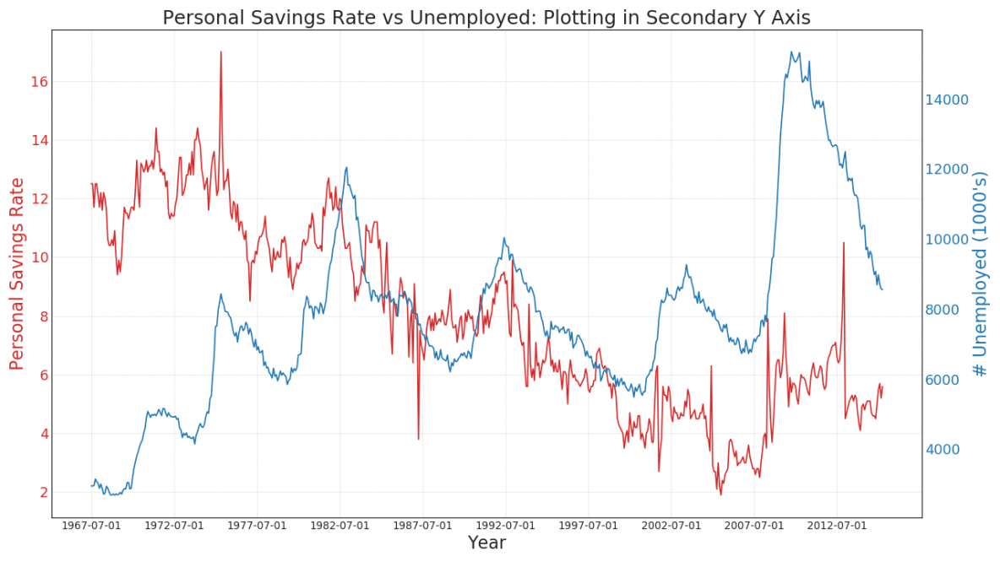

8. Time Series with Error Bands

   - Time series with error bands can be constructed if you have a time series dataset with multiple observations for each time point (date / timestamp). Below you can see a couple of examples based on the orders coming in at various times of the day. And another example on the number of orders arriving over a duration of 45 days.
   - In this approach, the mean of the number of orders is denoted by the white line. And a 95% confidence bands are computed and drawn around the mean.

   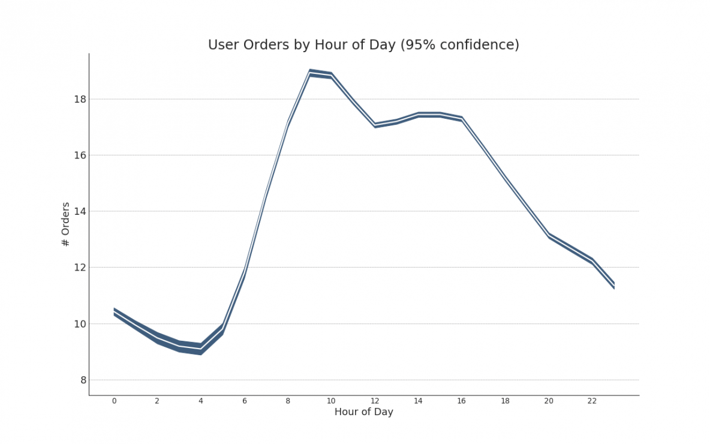

   

9. Stacked Area Chart

   - Stacked area chart gives an visual representation of the extent of contribution from multiple time series so that it is easy to compare against each other.

   

10. Area Chart Unstacked

    - An unstacked area chart is used to visualize the progress (ups and downs) of two or more series with respect to each other. In the chart below, you can clearly see how the personal savings rate comes down as the median duration of unemployment increases. The unstacked area chart brings out this phenomenon nicely.

    

11. Calendar Heat Map

    - Calendar map is an alternate and a less preferred option to visualise time based data compared to a time series. Though can be visually appealing, the numeric values are not quite evident. It is however effective in picturising the extreme values and holiday effects nicely.

    

12. Seasonal Plot

    - The seasonal plot can be used to compare how the time series performed at same day in the previous season (year / month / week etc).

    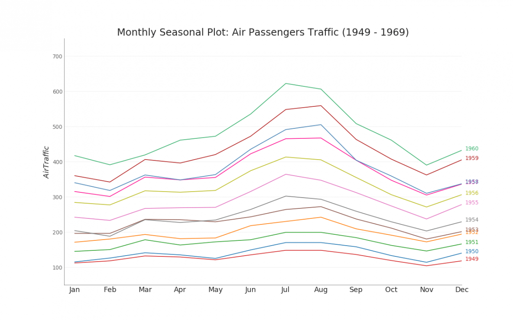

#### Groups

1. Dendrogram

   - A Dendrogram groups similar points together based on a given distance metric and organizes them in tree like links based on the point’s similarity.

   

2. Cluster Plot

   - Cluster Plot canbe used to demarcate points that belong to the same cluster. Below is a representational example to group the US states into 5 groups based on the USArrests dataset. This cluster plot uses the ‘murder’ and ‘assault’ columns as X and Y axis. Alternately you can use the first to principal components as rthe X and Y axis.

   

3. Andrews Curve

   - Andrews Curve helps visualize if there are inherent groupings of the numerical features based on a given grouping. If the features (columns in the dataset) doesn’t help discriminate the group (`cyl)`, then the lines will not be well segregated as you see below.

   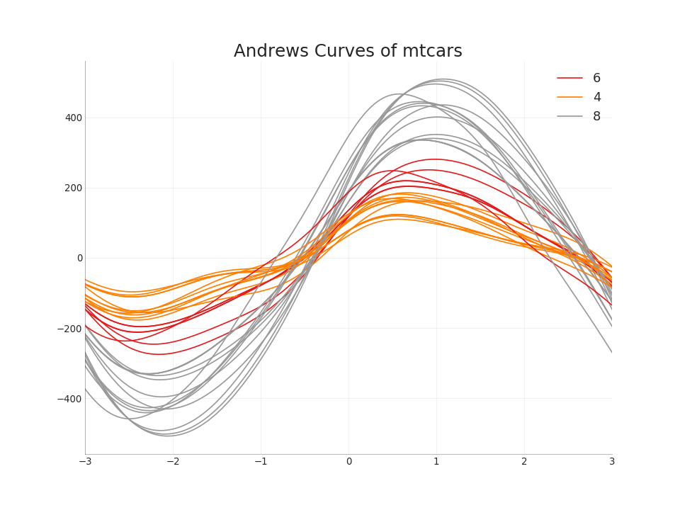

4. Parallel Coordinates

   - Parallel coordinates helps to visualize if a feature helps to segregate the groups effectively. If a segregation is effected, that feature is likely going to be very useful in predicting that group.

   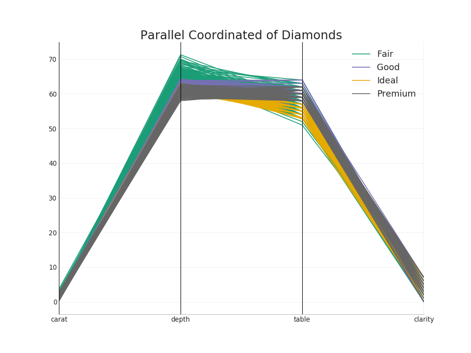

- Ref
  - [Top 50 matplotlib Visualizations – The Master Plots (with full python code)](https://www.machinelearningplus.com/plots/top-50-matplotlib-visualizations-the-master-plots-python/)
  - [Matplotlib可视化最有价值的 50 个图表](http://liyangbit.com/pythonvisualization/matplotlib-top-50-visualizations/)
  - [d3js](https://d3js.org/)
  - [解決Python 3 Matplotlib與Seaborn視覺化套件中文顯示問題](https://medium.com/marketingdatascience/解決python-3-matplotlib與seaborn視覺化套件中文顯示問題-f7b3773a889b)
    - 更簡單的方法：直接複製微軟正黑體的字體至以下路徑，更名並覆蓋掉 DejaVuSans.ttf 檔案即可
      - pythonX/lib/site-packages/matplotlib/mpl-data/matplotlibrc
      - https://www.itread01.com/p/438241.html


## 資料清理

針對不同類型的變數，會有不同的清洗和處理方法：

1. 對於數值型變數(Numerical Variable)，需要處理離群點，缺失值，異常值等情況。
2. 對於類別型變數(Categorical Variable)，可以轉化為one-hot編碼。
3. 文本資料是較難處理的資料類型，文本中會有垃圾字元，錯別字(詞)，數學公式，不統一單位和日期格式等。我們還需要處理標點符號，分詞，去停用詞，對於英文文本可能還要詞性還原(lemmatize)，抽取詞幹(stem)等等。


### 離群值處理

- 大多數的參數統計數值，如均值、標準差、相關係數等，以及基於這些參數的統計分析，均對離群值高度敏感。
- 因此，離群值的存在會對資料分析造成極大影響在對各欄位進行歸一化之前，需要先將各欄位中的離群值進行處理，否則在歸一化後「非離群值」之間的差距反而無法呈現，影響模型的精準度與穩定性。
- 離群值是與正常數值偏離較遠的數值群，如果不處理則特徵縮放(標準化 / 最⼩最⼤化)就會出現很⼤的問題
- 處理離群值之後，好處是剩餘資料中模型較為單純且準確，壞處是有可能刪除掉重要資訊，因此刪除前最好能先了解該數值會離群的可能原因

#### Outliers 出現的可能原因

- 所以未知值，隨意填補 (約定俗成的代入)，如年齡 = -1 或 999, 電話是 0900-123-456
- 可能的錯誤紀錄/⼿誤/系統性錯誤，如某本書在某筆訂單的銷售量 = 1000 本

#### Outliers 的檢查流程與方法

- 盡可能確認每⼀個欄位的意義 (但有些競賽資料不會提供欄位意義)
- 透過檢查數值範圍 (五值、平均數及標準差) 或繪製散點圖 (scatter)、分布圖 (histogram) 或其他圖檢查是否有異常。

- 類別型特徵

  - 發生次數：該類別事件小於設定的最小次數門檻
  - 發生比例：該類別事件的事件比率小於設定的最小次數百分比，常用5%作為門檻。

- 數值型特徵

  - **標準分數**：將資料轉為Z分數，並以±3個標準差作為作為臨界值，超過設定的臨界值即判定為離群值。

  - **百分位數**：將最低與最高5%的資料視為離群值。

  - **四分位距(Interquartile range, IQR)**：

    - 從分位數的角度來偵測，IQR=Q3 - Q1，將(Q1 - 1.5 * IQR)與 (Q3 + 1.5 * IQR)視為離群值
  - Box-plot
  
  - **平均絕對離差(Mean Absolute Deviation, MAD)**:
  $$MAD = \frac{\Sigma^n_1|x_i- \bar x|}{n}$$
  
    將mean ± 9 * MAD外的值視為離群值。


#### Outliers 的處理方法

- 新增欄位⽤以紀錄異常與否
- 填補 (取代)
- 視情況以中位數, Min, Max 或平均數填補(有時會⽤ NA)

- **刪除樣本**: 當離群值的數量相當少時，可以使用此方法
- **刪除欄位**: 若是題目設計的問題導致某欄位中存在許多離群值，可以考慮刪除該欄位。
- **整併至「其他」類別**: 適用於類別型變數
- **縮尾**: 將超出變數特定百分位元範圍的數值替換為其特定百分位數值的方法。    
- **截尾**: 將超出變數特定百分位元範圍的數值予以**刪除**的方法。
- **插值**: 應用原有資料資訊對離群值賦予一個相對合理的新值的方法
- 去除偏態

  - 當離群資料比例太⾼，或者平均值沒有代表性時，可以考慮去除偏態，
  - 對於左偏、右偏的資料型態都會減少平均數的代表性，因為會拉低/拉高整體的平均值(如台灣的平均薪資會被少數富翁拉高)。
  - 對存在離群值的變數作對數轉換可以克服其離群值問題，且對數轉換並不影響各觀察值之間在此變數上的相對大小。使資料更接近常態分佈，讓平均值更有代表性。
  - **對數去偏(log1p)** 
    - 對數去偏就是使⽤⾃然對數去除偏態，常⾒於計數 / 價格這類非負且可能為 0 的欄位
    - 因為需要將 0 對應到 0，所以先加1 (plus one) 再取對數 (log)，還原時使⽤ expm1，也就是先取指數 (exp) 後再減⼀ (minus one)
  - **⽅根去偏(sqrt)**
  - 就是將數值減去最⼩值後開根號，最⼤值有限時適⽤ (例 : 成績轉換) 
  - **分布去偏(boxcox)** 
    - 是採⽤boxcox轉換函數，函數的 lambda(λ) 參數為 0 時等於 log 函數，lambda(λ) 為 0.5 時等於開根號 (即sqrt)，因此可藉由參數的調整更靈活地轉換數值，但要特別注意 Y 的輸入數值必須要為正 (不可為0)
    - 使⽤ box-cox 分布去偏時，除了注意 λ 參數要介於 0 到 0.5 之間，並且要注意轉換前的數值不可⼩於等於 0

### 參考資料

- [Ways to Detect and Remove the Outliers](https://towardsdatascience.com/ways-to-detect-and-remove-the-outliers-404d16608dba)

### 遺漏值處理

#### 確認資料遺漏的原因

> 根據原因做相應的處理

- **無意的**：資訊被遺漏，比如由於工作人員的疏忽，忘記而缺失；或者由於資料獲取器等故障等原因造成的缺失，比如系統即時性要求較高的時候，機器來不及判斷和決策而造成缺失；
- **有意的**：有些資料集在特徵描述中會規定將缺失值也作為一種特徵值，這時候缺失值就可以看作是一種特殊的特徵值；
- **不存在**：有些特徵屬性根本就是不存在的，比如一個未婚者的配偶名字就沒法填寫，再如一個孩子的收入狀況也無法填寫；

#### 確認資料遺漏的類型

- 資料集中不含缺失值的變數稱為完全變數，資料集中含有缺失值的變數稱為不完全變數。而從缺失的分佈來將缺失可以分為完全隨機缺失，隨機缺失和完全非隨機缺失。
  - **完全隨機缺失（missing completely at random,MCAR）**：指的是資料的缺失是完全隨機的，不依賴於任何不完全變數或完全變數，不影響樣本的無偏性，如家庭地址缺失；
  - **隨機缺失(missing at random,MAR)**：指的是資料的缺失不是完全隨機的，即該類資料的缺失依賴于其他完全變數，如財務資料缺失情況與企業的大小有關；
  - **非隨機缺失(missing not at random,MNAR)**：指的是資料的缺失與不完全變數自身的取值有關，如高收入人群不原意提供家庭收入；
- 對於隨機缺失和非隨機缺失，直接刪除記錄是不合適的，原因上面已經給出。隨機缺失可以通過已知變數對缺失值進行估計，而非隨機缺失的非隨機性還沒有很好的解決辦法。

#### 遺漏值的處理方法

- **刪除樣本**
  - **優點**是最簡單粗暴
  - 缺點是會犧牲了大量的資料，通過減少歷史資料換取完整的資訊，這樣可能丟失了很多隱藏的重要資訊
  - 當缺失資料比例較大時，特別是缺失資料非隨機分佈時，直接刪除可能會導致資料發生偏離，比如原本的正態分佈變為非正太；
  - 這種方法在樣本資料量十分大且缺失值不多的情況下非常有效，但如果樣本量本身不大且缺失也不少，那麼不建議使用。

- **刪除特徵**
  - 設定閾值並計算每個「欄位」有幾個遺漏值，當超過閾值時將該「欄位」刪除
- **填補指定值**
  - 類別型特徵可以填補「其他」
  - 數值型特徵可以填補 0
    - 常見於 event類型的資料集，因為沒發生事件，所以最後在groupby 、 summarise 與join表格時會出現 na
- **填補統計值**
  - 類別型特徵可以填補「眾數」
  - 數值型特徵可以填補「平均值」或「中位數」
    - 填補平均值(Mean) : 數值型欄位，偏態不明顯
    - 填補中位數(Median) : 數值型欄位，偏態很明顯
- **填補預測值**
  - 藉由其他資料欄位來學習填補的內容，如knn， randomforest。
  - 本方式須留意overfitting : 可能退化成為其他特徵的組合
- **不處理**
  - 採用可以處理遺漏值的演算法，如XGBoost，LightGBM。

Ref

- [【Python数据分析基础】: 数据缺失值处理](https://juejin.im/post/5b5c4e6c6fb9a04f90791e0c)

## Feature Scaling

- 資料的標準化（normalization）是將資料按比例縮放，使之落入一個小的特定區間。在某些比較和評價的指標處理中經常會用到，去除數據的單位限制，將其轉化為無量綱的純數值，便於不同單位或量級的指標能夠進行比較和加權。

- Scaling 的好處

  - 提升模型的收斂速度

    - 如下圖，x1的取值為0-2000，而x2的取值為1-5，假如只有這兩個特徵，對其進行優化時，會得到一個窄長的橢圓形，導致在梯度下降時，梯度的方向為垂直等高線的方向而走之字形路線，這樣會使反覆運算很慢，相比之下，右圖的反覆運算就會很快（理解：也就是步長走多走少方向總是對的，不會走偏）

    

  - 提升模型的精度

    - 這在涉及到一些距離計算的演算法時效果顯著，比如演算法要計算歐氏距離，上圖中x2的取值範圍比較小，涉及到距離計算時其對結果的影響遠比x1帶來的小，所以這就會造成精度的損失。所以歸一化很有必要，他可以讓各個特徵對結果做出的貢獻相同。

  - 線性回歸模型中對於離群值非常敏感

- Scaling 的缺點

  - 降低解釋效果，如果對於變數的「單位」有特殊的解釋需求，不建議轉換

- 是否⼀定要做標準化?

  - Regression model：有差
  - Tree-based model：沒有太⼤關係


### 類別型特徵

#### 轉為指定值

- 依照 Domain knowledge 將離散資料轉為指定值，藉以賦予連續型資料的特征。如將教育程度轉為教育年數：小學為6年，國中9年，高中12年等等。

#### Count Encoding

- 頻數編碼使用頻次替換類別，頻次根據訓練集計算。這個方法對離群值很敏感
- 所以結果可以歸一化或者轉換一下（例如使用對數變換）。未知類別可以替換為1。

#### Label Encoding

- 類似於流⽔號，依序將新出現的類別依序編上新代碼，已出現的類別編上已使⽤的代碼

- 優點是能夠節省記憶體的使用量

  - 確實能轉成分數，但缺點是分數的⼤⼩順序沒有意義

  ```python
  # Encoding the Independent Variable
  from sklearn.compose import ColumnTransformer
  from sklearn.preprocessing import OneHotEncoder
  ct = ColumnTransformer(transformers=[('encoder', OneHotEncoder(), [0])], remainder='passthrough')
  X = np.array(ct.fit_transform(X))
  
  # Encoding the Dependent Variable
  from sklearn.preprocessing import LabelEncoder
  le = LabelEncoder()
  y = le.fit_transform(y)
  ```

#### One Hot Encoding

- 為了改良數字⼤⼩沒有意義的問題，將不同的類別分別獨立為⼀欄
- 缺點是需要較⼤的記憶空間與計算時間，且類別數量越多時越嚴重
- 在建置模型時，為了避免完全多重共線性造成的虛擬變數陷阱(Dummy Variable Trap)，需要把其中一個變數丟出模型外，否則無法估計出回歸參數。通常會丟數量最多的類別。

- 當特徵重要性⾼，且可能值較少時，才應該考慮獨熱編碼

#### Target encoding

- 如果某一個特徵是定性的（categorical），而這個特徵的可能值非常多（高基数），那麼平均數編碼是一種高效的編碼方式。我们可以嘗試使用平均数编碼的編碼方法，在貝葉斯的架構下，利用所要預測的應變量（target variable），有監督地確定最適合這個定性特徵的編碼方式。
- 均值編碼的缺點是容易過擬合（因為提供了大量數據），所以使用時要配合適當的正則化技術。
- 平滑化的⽅式能修正均值編碼容易 Overfitting 的問題，但效果有限，因此仍須經過檢驗後再決定是否該使⽤均值編碼


### 數值型特徵

#### 二值化

- 設定一個閾值，大於閾值的赋值為1，小於等於閾值的赋值為0

#### 等寬劃分

- 按照相同寬度將資料分成幾等份。缺點是受到異常值的影響比較⼤。

#### 等頻劃分

- 將資料分成幾等份，每等份資料裡⾯的個數是⼀樣的。

#### 聚類劃分

- 使⽤聚類演算法將資料聚成幾類，每⼀個類為⼀個劃分。

#### Standard Scaler

- 標準化的意義：平衡數值特徵間的影響⼒

- 假定數值為常態分佈，適合本⽅式平衡特徵。若資料不符合常態分佈，使用此方法進行Normalization的效果會變得很糟糕。

$$
\frac {(x-mean(x))}{sd(x)}
$$

#### MinMax Scaler

- 將資料按比例縮放，使之落入一個小的特定區間，例如[0, 1]等。在某些比較和評價的指標處理中經常會用到，去除數據的單位限制，將其轉化為無量綱的純數值，便於不同單位或量級的指標能夠進行比較和加權

- 因為最⼤最⼩化對極端數值較敏感，所以如果資料不會有極端值，或已經去極端值，就適合⽤最⼤最⼩化，否則請⽤標準化

- 空間壓縮
  - Y = 0 ~ 1
  - Y = -1 ~ 1

    - Y = 0 ~ 1(影像資料)

  - Y = 0 ~ 100

    用分位數來進行normalization

  - 歸一化公式如下：


$$
\frac {(x-min(x))}{max(x)-min(x)}
$$

### 參考資料

- [连续特征的离散化：在什么情况下将连续的特征离散化之后可以获得更好的效果？](https://www.zhihu.com/question/31989952)
- [Is it a good practice to always scale/normalize data for machine learning?](https://stats.stackexchange.com/questions/189652/is-it-a-good-practice-to-always-scale-normalize-data-for-machine-learning)


## Feature Construction

> - 「數據和特徵決定了機器學習的上限，而模型和算法只是逼近這個上限而已」
> - 特徵工程是針對數據進行加工處理，讓模型能最大限度的從原始數據中找出變數之間的關聯性，進而提升模型的效度。

- 使用統計或領域知識，以各種組合調整方式，生成新特徵以提升模型預測力

- 我們應該盡可能多地抽取特徵，只要你認為某個特徵對解決問題有説明，它就可以成為一個特徵。特徵抽取需要不斷反覆運算，是最為燒腦的環節，它會在整個比賽週期折磨你，但這是比賽取勝的關鍵，它值得你耗費大量的時間。

- 那問題來了，怎麼去發現特徵呢？光盯著資料集肯定是不行的。如果你是新手，可以先耗費一些時間在Forum上，看看別人是怎麼做Feature Extraction的，並且多思考。雖然Feature Extraction特別講究經驗，但其實還是有章可循的：
  1. 對於Numerical Variable，可以通過**線性組合、多項式組合**來發現新的Feature。
  2. 對於文本資料，有一些常規的Feature。比如，文本長度，Embeddings，TF-IDF，LDA，LSI等，你甚至可以用深度學習提取文本特徵（隱藏層）。
  3. 如果你想對資料有更深入的瞭解，可以通過思考資料集的構造過程來發現一些magic feature，這些特徵有可能會大大提升效果。
  4. 通過**錯誤分析**也可以發現新的特徵。


### Features Interaction

- 假設你有 `A` 和 `B` 兩個 continuous 特徵，你可以用 `A + B`、`A - B`、`A * B` 或 `A / B` 之類的方式建立新的特徵。
- 有些特徵需要一起考慮才有意義，如在分析計程車的運輸資料時，會有起點的經緯度與終點的經緯度等4個變項。
- 單獨各自使用「起點經度」、「起點緯度」、「終點經度」或「終點緯度」都是沒有意義的。必須要將這四個變數進行組合，並計算實際距離。或更細緻的處理每個緯度長度不一致的問題後計算實際距離，能夠再進一步提高預測的精準度。

### Feature Combination 

- 特徵組合主要是針對 categorical 特徵，特徵交互則是適用於 continuous 特徵。但是兩者的概念是差不多的，就是把兩個以上的特徵透過某種方式結合在一起，變成新的特徵。通常用來解決一般的線性模型沒辦法學到非線性特徵的問題。

- 群聚編碼(Group by Encoding)

  均值編碼是計算各個類別在目標變數的平均值，而群聚編碼則是針對其他數值變數計算類別平均值 (Mean)、中位數 (Median)，眾數(Mode)，最⼤值(Max)，最⼩值(Min)，次數(Count)...等。

- 群聚編碼的使用時機是，先以 領域知識 或 特徵重要性 挑選強⼒特徵後, 再將特徵組成更強的特徵

- 可以依照領域知識挑選,或亂槍打⿃後再以特徵重要性挑選

- 以前是以非樹狀模型為主, 為了避免共線性, 會很注意類似的特徵不要增加太多，但現在強⼒的模型都是樹狀模型, 所以只要有可能就通通可以做成特徵嘗試!

- 假設 C 是 categorical 特徵，N 是 continuous 特徵，以下有幾種有意義的組合：
  - `median(N) GROUP BY C` 中位數
  - `mean(N) GROUP BY C` 算術平均數
  - `mode(N) GROUP BY C` 眾數
  - `min(N) GROUP BY C` 最小值
  - `max(N) GROUP BY C` 最大值
  - `std(N) GROUP BY C` 標準差
  - `var(N) GROUP BY C` 方差
  - `N - median(N) GROUP BY C`

### Feature Extraction

通常就是指 dimensionality reduction。

- Principal Component Analysis (PCA)
- Latent Dirichlet Allocation (LDA)
- Latent Semantic Analysis (LSA)

### Feature Learning

- 葉編碼 (leaf encoding) 顧名思義，是採⽤決策樹的葉點作為編碼依據重新編碼
  
- 概念是將每棵樹都視為⼀個新特徵，樹下的 n 個節點則作為新特徵的 n 個類別值，由於每個葉節點的性質接近，因此可視為資料的⼀種分組⽅式。
  
- 雖然不適合直接沿⽤樹狀模型機率，但分組⽅式有代表性，因此按照葉點將資料離散化 ，會比之前提過的離散化⽅式跟有助於提升精確度
  
- 葉編碼的結果，是⼀組模型產⽣的新特徵，我們可以使⽤邏輯斯回歸，重新賦予機率 (如下葉圖)，也可以與其他算法結合 (例如 : 分解機 Factorization Machine )使資料獲得新⽣，最後再以邏輯斯迴歸合併預測
  
  
  
- 葉編碼需要先對樹狀模型擬合後才能⽣成，如果這步驟挑選了較佳的參數，後續處理效果也會較好，這點與特徵重要性類似
  
  - 實際結果也證明，在分類預測中使⽤樹狀模型，再對這些擬合完的樹狀模型進⾏
  葉編碼+邏輯斯迴歸，通常會將預測效果再進⼀步提升
  
  
  
  - 葉編碼編完後，因為特徵數量較多，通常搭配邏輯斯回歸或者分解機做預測，其他模型較不適合

### 參考資料

- [Practical Lessons from Predicting Clicks on Ads at Facebook](http://quinonero.net/Publications/predicting-clicks-facebook.pdf)
- [Feature transformations with ensembles of trees](https://scikit-learn.org/stable/auto_examples/ensemble/plot_feature_transformation.html#example-ensemble-plot-feature-transformation-py)
- [CTR预估: Algorithm-GBDT Encoder](https://zhuanlan.zhihu.com/p/31734283)
- [三分鐘了解推薦系統中的分解機方法](https://kknews.cc/code/62k4rml.html)


## Feature Selection

- 在做特徵抽取的時候，我們是盡可能地抽取更多的Feature，但過多的Feature會造成冗餘，雜訊，容易過擬合等問題，因此我們需要進行特徵篩選。特徵選擇能剔除不相關(irrelevant)或冗餘(redundant)的特徵，從而達到減少特徵個數，提高模型精確度，減少執行時間的目的。
  
- 另一方面，選取出真正相關的特徵簡化模型，協助理解資料產生的過程。
  
  - Garbage In Garbage Out
  - [奥卡姆剃刀原理](https://zhuanlan.zhihu.com/p/45321953)
- 讓後續解釋更簡單
  
- All-in
  
  基於 Domain Knowledge，或設計過的調查資料時會使用此方法。此外通常在建置模型是也會出於與其他模型做比較的考量，建置一個這類的模型，藉以檢視後續其他模型的效度。
  
- 特徵選擇有三⼤類⽅法
  
  - 過濾法 (Filter) : 選定統計數值與設定⾨檻，刪除低於⾨檻的特徵
  - 包裝法 (Wrapper) : 根據⽬標函數，逐步加入特徵或刪除特徵
- 嵌入法 (Embedded) : 使⽤機器學習模型，根據擬合後的係數，刪除係數低於⾨檻的特徵
  
  


### 過濾法(Filter)

按照發散性或者相關性對各個特徵進行評分，設定閾值或者待選擇閾值的個數選擇特徵。

#### 方差選擇

- 先要計算各個特徵的方差，然後根據閾值，選擇方差大於閾值的特徵

```python
from sklearn.feature_selection import VarianceThreshold

#方差选择法，返回值为特征选择后的数据
#参数threshold为方差的阈值
VarianceThreshold(threshold=3).fit_transform(iris.data)
```


#### 相關係數

- 皮爾森相關係數是一種最簡單的，能説明理解特徵和回應變數之間關係的方法，該方法衡量的是變數之間的線性相關性，結果的取值區間為 $-1$ 至 $1$  ， $-1$ 表示完全的負相關(這個變數下降，那個就會上升)，$+1$ 表示完全的正相關，$0$ 表示沒有線性相關。

- Pearson相關係數的一個明顯缺陷是，作為特徵排序機制，他只對線性關係敏感。如果關係是非線性的，即便兩個變數具有一一對應的關係，Pearson相關性也可能會接近 $0$

  ```python
  from sklearn.feature_selection import SelectKBest
  from scipy.stats import pearsonr
  
  #选择K个最好的特征，返回选择特征后的数据
  #第一个参数为计算评估特征是否好的函数，该函数输入特征矩阵和目标向量，输出二元组（评分，P值）的数组，数组第i项为第i个特征的评分和P值。在此定义为计算相关系数
  #参数k为选择的特征个数
  SelectKBest(lambda X, Y: array(map(lambda x:pearsonr(x, Y), X.T)).T, k=2).fit_transform(iris.data, iris.target)
  ```

  

#### 卡方檢驗(K-Best)

- 傳統的卡方檢驗是檢驗類別變數對類別目標變數的相關性。假設自變數有 $N$ 種取值，目標變數有 $M$ 種取值，考慮自變數等於 $i$ 且目標變數等於 $j$ 的樣本頻數的觀察值與期望的差距，構建統計量：

$$
\chi^2 = \sum \frac{(A-E)^2}{E}
$$

```python
from sklearn.datasets import load_iris
from sklearn.feature_selection import SelectKBest
from sklearn.feature_selection import chi2
iris = load_iris()
X, y = iris.data, iris.target
X.shape
# (150, 4)
# 迴歸：f_regression
# 分類：chi2, f_classif
X_new = SelectKBest(chi2, k=2).fit_transform(X, y)
X_new.shape
# (150, 2)
```


### 包装法(Wrapper)

包裹型是指把特徵選擇看做一個特徵子集搜索問題，根據目標函數（通常是預測效果評分），每次選擇/刪除若干特徵，藉以評估效果。

#### Forward Selection(向前搜索)

1. 先設定一個顯著水準/重要性
2. 逐一針對，每個 X 變數對 Y 建立模型，從中保留最顯著 / 重要性最高的變數
3. 逐一針對其餘的 X變數並加入保留下來的變數，對Y建立模型，從中保留最顯著/最重要的變數
4. 觀測模型的效果是否有提升，若有則重複第3個步驟
5. 最後只會留下最佳解釋效果的變數，並藉以建出的模型

#### Backwark Elimination(向後搜索)

最快速，而且看得到過程

1. 先設定一個顯著水準/重要性
2. 將全部變數投入到模型中
3. 找出最不顯著(p值最高)/重要性最低的變數，並移除該變數，並重新建模
4. 觀測移除後的模型表現是否有較移除前提升，若有，回到第3個步驟繼續執行
5. 最後只會留下最佳解釋效果的變數，並藉以建出的模型

#### Bidirectional Elimination(遞歸特徵消除法

結合前兩種方法，由於模型在新增變數時會影響到其他變數的顯著性/重要性，因此在新增變數後同步確認時候有變數變得不顯著，此時需要將這類變數從模型中移除。後只會留下最佳解釋效果的變數，並藉以建出的模型。

1. 設定要選入變數/移除變數的閾值(顯著水準/重要性)
2. 執行 Forward Selection 找出最重要的變數加入至模型中
3. 針對目前選入的變數執行 Backwark Elimination，確認所有變數的閾值都有符合設定的條件，執行完後回到步驟2，繼續找新變數。
4. 直到沒有變數可以新增/移除後才結束


#### Recursive feature elimination

- RFE

  ```python
  from sklearn.feature_selection import RFE
  ```

- REFCV

  ```python
   from sklearn.feature_selection import RFECV
  ```

  

### 嵌入法(Embedded)

- 先使用某些機器學習的演算法和模型進行訓練，得到各個特徵的權值係數，根據係數從大到小選擇特徵。

  - 類似於Filter方法，但是是通過訓練來確定特徵的優劣。

  ```python
  from sklearn.feature_selection import SelectFromModel
  ```

  

#### 基於懲罰項的特徵選擇法(Lasso)

- 通過L1正則項來選擇特徵：L1正則方法具有稀疏解的特性，因此天然具備特徵選擇的特性，但是要注意，L1沒有選到的特徵不代表不重要，原因是兩個具有高相關性的特徵可能只保留了一個，如果要確定哪個特徵重要應再通過L2正則方法交叉檢驗。

- 對於SVM和logistic回歸來說，參數C控制著稀疏性：C越小，選擇到的features就越少。而對於Lasso，alpha的值越大，則選擇到的features越少。

- L1懲罰項降維的原理在於保留多個對目標值具有同等相關性的特徵中的一個，所以沒選到的特徵不代表不重要。故可結合L2懲罰項來優化。
    - L1正則化是指權值向量w中各個元素的絕對值之和,L1正則化可以產生稀疏權值矩陣，即產生一個稀疏模型，可以用於特徵選擇
    - L2正則化是指權值向量w中各個元素的平方和然後再求平方根L2正則化可以防止模型過擬合（overfitting）。當然，一定程度上，L1也可以防止過擬合

```python
from sklearn.linear_model import LassoCV
```


#### 基於模型的特徵選擇法(Model based ranking)

- 直接使用機器學習演算法，針對每個單獨的特徵和目標變數建立預測模型。假如某個特徵和目標變數之間的關係是非線性的，可以用基於樹的方法（決策樹、隨機森林）、或者擴展的線性模型等。基於樹的方法比較易於使用，因為他們對非線性關係的建模比較好，並且不需要太多的調試。但要注意過擬合問題，因此樹的深度最好不要太大，再就是運用交叉驗證。通過這種訓練對特徵進行打分獲得相關性後再訓練最終模型。

- 使⽤梯度提升樹擬合後，以特徵在節點出現的頻率當作特徵重要性，以此刪除重要性低於⾨檻的特徵

- 特徵選擇中，計算時間較長，但是能排除共線性且比較穩定的⽅式是梯度提升樹嵌入法

  ```python
  from sklearn.feature_selection import SelectFromModel
  ```
  


#### 排列重要性 (permutation Importance)

- 特徵重要性計算方法
  - 在樹模型中特徵的分支次數：weight
  - 特徵覆蓋度：cover
  - 損失函數降低量：gain
- 雖然特徵重要性相當實⽤，然⽽計算原理必須基於樹狀模型，於是有了可延伸⾄非樹狀模型的排序重要性
- 排序重要性計算，是打散單⼀特徵的資料排序順序，再⽤原本模型重新預測，觀察打散前後誤差會變化多少

### 參考資料

- [谈谈 L1 与 L2-正则项](https://liam.page/2017/03/30/L1-and-L2-regularizer/)

- [Permutation Importances](https://www.kaggle.com/dansbecker/permutation-importance?utm_medium=email&utm_source=mailchimp&utm_campaign=ml4insights)
- [干货：结合Scikit-learn介绍几种常用的特征选择方法](https://www.zhihu.com/question/28641663)
- [特征工程到底是什么？](https://www.zhihu.com/question/29316149)
- [Kaggle競賽-鐵達尼號生存預測(前16%排名)]([https://medium.com/jameslearningnote/%E8%B3%87%E6%96%99%E5%88%86%E6%9E%90-%E6%A9%9F%E5%99%A8%E5%AD%B8%E7%BF%92-%E7%AC%AC4-1%E8%AC%9B-kaggle%E7%AB%B6%E8%B3%BD-%E9%90%B5%E9%81%94%E5%B0%BC%E8%99%9F%E7%94%9F%E5%AD%98%E9%A0%90%E6%B8%AC-%E5%89%8D16-%E6%8E%92%E5%90%8D-a8842fea7077](https://medium.com/jameslearningnote/資料分析-機器學習-第4-1講-kaggle競賽-鐵達尼號生存預測-前16-排名-a8842fea7077))

- [Stopping stepwise: Why stepwise selection is bad and what you should use instead](https://towardsdatascience.com/stopping-stepwise-why-stepwise-selection-is-bad-and-what-you-should-use-instead-90818b3f52df)
- [The 5 Feature Selection Algorithms every Data Scientist should know](https://towardsdatascience.com/the-5-feature-selection-algorithms-every-data-scientist-need-to-know-3a6b566efd2)

- [The Curse of Dimensionality in classification](https://www.visiondummy.com/2014/04/curse-dimensionality-affect-classification/)

# 建置模型(Modeling)

## 簡介

### 模型選擇

- 了解專案的⽬標是甚麼樣的分類問題並選⽤適當的模型訓練
- Supervised Learning
  - where we have inputs, and one (or more) response variable(s).
  - 如果我們的資料已經有明確的目標變數，我們可以直接讓模型專注在目標變數的變化
  - 找出讓訓練⽬標最佳的模型參數
    - 模型的參數組合可能有無限多組，我們可以⽤暴⼒法每個參數都試看看，從中找到讓損失函數最⼩的參數
    - 但是這樣非常沒有效率，有許多像是梯度下降 (Gradient Descent)、增量訓練 (Additive Training) 等⽅式，這些演算法可以幫我們找到可能的最佳模型參數

- Unsupervised Learning

  - where we have inputs, but not response variables.

  - 在不清楚資料特性、問題定義、沒有標記的情況下，非監督式學習技術可以幫助我們理清資料脈絡

  - 特徵數太龐⼤的情況下，非監督式學習可以幫助概念抽象化，⽤更簡潔的特徵描述資料

    - 客⼾分群

      在資料沒有任何標記，或是問題還沒定義清楚前，可⽤分群的⽅式幫助理清資料特性。

    - 特徵抽象化

      特徵數太多難於理解及呈現的情況下，藉由抽象化的技術幫助降低資料維度，同時不失去原有的資訊，組合成新的特徵。

    - 購物籃分析

      資料探勘的經典案例，適⽤於線下或線上零售的商品組合推薦。

    - 非結構化資料分析

      非結構化資料如⽂字、影像等，可以藉由⼀些非監督式學習的技術，幫助呈現及描述資料。


- 可以再依據目標變數屬於數值資料還是類別資料，將模型區分為
  
  - 分類模型
  - 回歸模型
  - 分群模型
  - 降維模型
  
  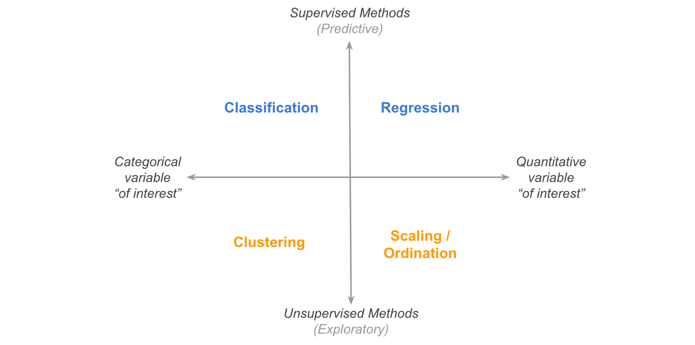


### 調參

- 之前接觸到的所有模型都有超參數需要設置
  - LASSO，Ridge: α 的⼤⼩
  - 決策樹：樹的深度、節點最⼩樣本數
  - 隨機森林：樹的數量
- 這些超參數都會影響模型訓練的結果，建議先使⽤預設值，再慢慢進⾏調整
- 超參數會影響結果，但提升的效果有限，資料清理與特徵⼯程才能最有效的提升準確率，調整參數只是⼀個加分的⼯具。


### Evaluation Method

https://www.analyticsvidhya.com/blog/2019/08/11-important-model-evaluation-error-metrics/

機器學習模型中的⽬標函數

- 機器學習模型的⽬標函數中有兩個非常重要的元素

  - 損失函數 (Loss function)

    損失函數衡量預測值與實際值的差異，讓模型能往正確的⽅向學習

  - 正則化 (Regularization)

    - 正則化是為了解決過擬合問題，分為 L1 和 L2 正則化。主要通過修正損失函數，加入模型複雜性評估

    - 正則化是符合**奧卡姆剃刀原理**：在所有可能的模型中，能夠很好的解釋已知數據並且十分簡單的才是最好的模型。

定義⼀個⽬標函數 (Objective function) 也可稱作損失函數 (Loss function)，來衡量模型的好壞，Loss 越⼤，代表這組參數的模型預測出的 ŷ 越不準，也代表不應該選這組參數的模型

- **分類模型**：觀察「預測值」 (prediction) 與「實際值」 (Ground truth) 的正確程度

  - Accuracy
   - AUC, Area Under Curve

  - Precision: 模型判定瑕疵，樣本確實為瑕疵的比例

  - Recall: 模型判定的瑕疵，佔樣本所有瑕疵的比例
  - F1 - Score (Precision, Recall), 範圍: [0, 1]

#### 回歸模型

- 觀察「預測值」 (Prediction) 與「實際值」 (Ground truth) 的差距
  - MAE, Mean Absolute Error, 範圍: [-∞, ∞]
  - MSE, Mean Square Error, 範圍: [-∞, ∞]
  - R-square, 範圍: [0, 1]

  - Adjust R-square
  
    - R^2會隨著變數數量的增加而提升，進而容易有Overfit的問題，而adjust R^2 則會針對變數數量進行懲罰，可以幫助我們找出最合適的變數數量
  
    $$
    AdjR^2 = 1 - (1-R^2)\frac{n-1}{n-p-1}
    $$
  
    - p: number of independent variable
    - n: sample size

#### 分類模型

- 觀察「預測值」 (prediction) 與「實際值」 (Ground truth) 的正確程度

  - 會透過混淆矩陣 (Confusion Matrix)來衡量模型的效度

  - 因應預測與實際結果的不一致，會產生TP，TN，FP，FN等4種情況

    (英文的命名可以從預測的角度來理解)

    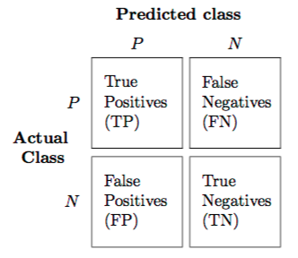

  

- 評估指標

  - Accuracy：

    - Accuracy in classification problems is the **number of correct predictions** made by the model divided by the **total number of predictions.**

      $\frac{(TP + TN)}{Total Sample}$
      
    - Accuracy Paradox
      - 樣本極度不平衡時，直接將所有樣本預測成多數的類別即可獲得高 Accuracy rate
      - 優點：直觀；缺點：沒有考量不同類型犯錯的成本差異

  - Precision： 則是針對某類別進⾏評估

    - Ability of a classification model to identify **only** the relevant data points.
    - Precision is defined as the number of **true positives divided by the number of true positives plus the number of false positives.** 
    - Precision: 模型判定瑕疵，樣本確實為瑕疵的比例
    
  - Recall

    - Ability of a model to find **all** the relevant cases within a dataset. 
    - The precise definition of recall is the **number of true positives divided by the number of true positives plus the number of false negatives.** 
    - Recall: 模型判定的瑕疵，佔樣本所有瑕疵的比例
      (以瑕疵檢測為例，若為 recall=1 則代表所有瑕疵都被找到)
    - Often you have a trade-off between Recall and Precision.
    - While recall expresses the ability to find all relevant instances in a dataset, precision expresses the proportion of the data points our model says was relevant actually were relevant.

  - F1 - Score (Precision, Recall), 範圍: [0, 1]

    - In cases where we want to find an optimal blend of precision and recall we can combine the two metrics using what is called the F1 score.

    - The F1 score is the harmonic mean of precision and recall taking both metrics into account in the following equation:

      $F_1=2*\frac{precision*recall}{precision+recall}$

    - We use the harmonic mean instead of a simple average because it punishes extreme values. 

    - A classifier with a precision of 1.0 and a recall of 0.0 has a simple average of 0.5 but an F1 score of 0. 

    - Precision and Recall typically make more sense in the context of a confusion matrix.

    - F1 是 Precision, Recall 的調和平均數

    - 分類問題中，我們有時會對某⼀類別的準確率特別有興趣。例如瑕疵/正常樣本分類，我們希望任何瑕疵樣本都不能被漏掉。

    - 衍生指標

      - F1-Score是指准确率和召回率一样重要；

      - F2-Score是指召回率比准确率重要一倍；

      - F0.5-Score是指准确率比召回率重要一倍。

  - AUC, Area Under Curve, 範圍: [0, 1]

    - AUC 指摽是分類問題常⽤的指標，通常分類問題都需要定⼀個閾值(threshold) 來決定分類的類別 (通常為機率 > 0.5 判定為 1, 機率 < 0.5 判定為 0)
    - AUC 是衡量曲線下的⾯積，因此可考量所有閾值下的準確性，因此 AUC 也廣泛地在分類問題的比賽中使⽤

  - CAP(Cumulative Accuracy Profile)

    - 衡量模型整體在抓多少的人時(X軸)，能抓到多少目標客戶(Y)
    - 隨機抓時抓多少%的客戶就會找到多少%的目標客戶，如果曲線越接近左上表示模型的效果越好

    - X軸放樣本的預測機率*-1

    - y軸放累積抓到的人數

    - 衡量指標(抓50%的樣本時，找到的目標百分比)

      - Rubbish：< 60%
      - Poor ： 60% ~ 70%
      - Good：70% ~ 80%
      - Very Good：80% ~ 90%
      - Too Good： 90% ~ 100%

  - ROC(Receiver Operating Characteristic)

  - [MAP](https://medium.com/@jonathan_hui/map-mean-average-precision-for-object-detection-45c121a31173)

  - 多分類問題，則可使⽤ top-k accuracy，k 代表模型預測前 k 個類別有包含正確類別即為正確 (ImageNet 競賽通常都是比 Top-5 Accuracy)

    - Type I error: False Positive
    - Type II error: false negative

- https://gombru.github.io/2018/05/23/cross_entropy_loss/

#### Cluster

- 輪廓分析(Silhouette analysis)
  - 歷史

    - 最早由 Peter J. Rousseeuw 於 1986 提出。它同時考慮了群內以及相鄰群的距離，除了可以評估資料點分群是否得當，也可以⽤來評估不同分群⽅式對於資料的分群效果

  - 設計精神

    - 同⼀群的資料點應該很近，不同群的資料點應該很遠，所以設計⼀種當 同群資料點越近 / 不同群資料點越遠 時越⼤的分數
    - 當資料點在兩群交界附近，希望分數接近 0

  - 分群模型的評估

    - 與監督模型不同，非監督因為沒有⽬標值，因此無法使⽤⽬標值的預估與實際差距，來評估模型的優劣

  - 輪廓分析

    - 輪廓分數是⼀種同群資料點越近 / 不同群資料點越遠時會越⼤的分數，除了可以評估資料點分群是否得當，也可以⽤來評估分群效果
    - 要以輪廓分析觀察 K -mean，除了可以將每個資料點分組觀察以評估資料點分群是否得當，也可⽤平均值觀察評估不同 K 值的分群效果
    
  - 評估⽅式類型

    - 有⽬標值的分群
      
      - 如果資料有⽬標值，只是先忽略⽬標值做非監督學習，則只要微調後，就可以使⽤原本監督的測量函數評估準確性
    - 無⽬標值的分群
  
    - 但通常沒有⽬標值/⽬標值非常少才會⽤非監督模型，這種情況下，只能使⽤資料本⾝的分布資訊，來做模型的評估
  
    - 單點輪廓值
    
      - 對任意單⼀資料點 i，「與 i 同⼀群」 的資料點，距離 i 的平均稱為 ai
      - 「與 i 不同群」 的資料點中，不同群距離 i 平均中，最⼤的稱為bi ( 其實就是要取第⼆靠近 i 的那⼀群平均，滿⾜交界上分數為0 的設計)
  - i 點的輪廓分數 si : (bi-ai) / max{bi, ai}
      - 其實只要不是刻意分錯，bi 通常會⼤於等於 ai，所以上述公式在此條件下可以化簡為 1 - ai / bi 

    - 整體的輪廓分析

      - 分組觀察 如下圖，左圖依照不同的類別，將同類別的輪廓分數排序後顯⽰，可以發現黃綠兩組的輪廓值⼤多在平均以下，且比例上接近 0的點也比較多，這些情況都表⽰這兩組似乎沒分得那麼開 (可對照下圖)

        
    
      - 平均值觀察 計算分群的輪廓分數總平均，分的群數越多應該分數越⼩，如果總平均值沒有隨著分群數增加⽽變⼩，就說明了那些分組數較不洽當

#### Dimension Reduction

- KMO球型檢定
- Compenent Loading


### 模型驗證(Validation)

- 出於理解的考量，我把模型驗證的順序放在選模型與衡量指標的後面，實際在建立模型時要先做這個步驟才開始建模。

- 機器學習模型需要資料才能訓練，若將⼿上所有資料都送進模型訓練，這樣就沒有額外資料來評估模型訓練情形！

- 機器學習模型可能會有過擬合 (Over-fitting) 的情形發⽣，需透過驗證/測試集評估模型是否過擬合

- 有些資料要特別注意!

  - 時間序列資料
  - 同⼀⼈有多筆資料

- 若僅做⼀次訓練/測試集切分，有些資料會沒有被拿來訓練過，因此後續就有 cross-validation 的⽅法，可以讓結果更為穩定，Ｋ為 fold 數量

- 每筆資料都曾經當過⼀次驗證集，再取平均得到最終結果。

- 在Test Data的標籤未知的情況下，我們需要自己構造測試資料來驗證模型的泛化能力，因此把Train Data分割成Train Set和Valid Set兩部分，Train Set用於訓練，Valid Set用於驗證。

  - 簡單切分

    - 將Train Data按一定方法分成兩份，比如隨機取其中70%的資料作為Train Set，剩下30%作為Valid Set，每次都固定地用這兩份資料分別訓練模型和驗證模型。這種做法的缺點很明顯，它沒有用到整個訓練資料，所以驗證效果會有偏差。通常只會在訓練資料很多，模型訓練速度較慢的時候使用。

    ```python
    from sklearn.model_selection import train_test_split
    X_train, X_test, y_train, y_test = train_test_split(X, y, test_size = 0.2, random_state = 0)
    ```

  - Cross-validation

    - 交叉驗證是將整個訓練資料隨機分成K份，訓練K個模型，每次取其中的K-1份作為Train Set，留出1份作為Valid Set，因此也叫做**K-fold**。至於這個K，你想取多少都可以，但一般選在3～10之間。我們可以用K個模型得分的mean和std，來評判模型得好壞（mean體現模型的能力，std體現模型是否容易過擬合），並且用K-fold的驗證結果通常會比較可靠。

      如果資料出現Label不均衡情況，可以使用Stratified K-fold，這樣得到的Train Set和Test Set的Label比例是大致相同。

       

    - 根據切分的方法不同，交叉驗證分為下面三種：　　　

      - 簡單交叉驗證，所謂的簡單，是和其他交叉驗證方法相對而言的。首先，我們隨機的將樣本資料分為兩部分（比如： 70%的訓練集，30%的測試集），然後用訓練集來訓練模型，在測試集上驗證模型及參數。接著，我們再把樣本打亂，重新選擇訓練集和測試集，繼續訓練資料和檢驗模型。最後我們選擇損失函數評估最優的模型和參數。　

      - 第二種是 S 折交叉驗證（ S-Folder Cross Validation），和第一種方法不同， S 折交叉驗證先將資料集 D 隨機劃分為 S 個大小相同的互斥子集，即

        $$D=D_1\cup D_2\cup ...\cup D_S,D_i\cap D_j=\varnothing(i\ne j)$$

        每次隨機的選擇 份作為訓練集，剩下的1份做測試集。當這一輪完成後，重新隨機選擇 份來訓練資料。若干輪（小於 ）之後，選擇損失函數評估最優的模型和參數。注意，交叉驗證法評估結果的穩定性和保真性在很大程度上取決於 取值。

      - 第三種是留一交叉驗證（Leave-one-out Cross Validation），它是第二種情況的特例，此時 S 等於樣本數 N ，這樣對於 N 個樣本，每次選擇 N-1 個樣本來訓練資料，留一個樣本來驗證模型預測的好壞。此方法主要用於樣本量非常少的情況，比如對於通適中問題， N 小於 50 時，一般採用留一交叉驗證。

      

      ```python
      sklearn.model_selection.KFold()
      ```

  - 驗證集 (validation set) 與測試集 (testing set)有甚麼差異？

    - 驗證集常⽤來評估不同超參數或不同模型的結果。⽽測試集則是在機器學習專案開始前先保留⼀⼩部分資料，專案進⾏中都不能使⽤，最終再拿來做測試。

  


### 參考資料

- [All Models Are Wrong: Concepts of Statistical Learning](https://allmodelsarewrong.github.io/index.html)
- [What is a good r square value in regression analysis?](https://www.researchgate.net/post/what_is_a_good_r_square_value_in_regression_analysis)
- [李宏毅⽼師線上課程/簡報](http://speech.ee.ntu.edu.tw/~tlkagk/courses_ML17_2.html])
- [Google 基礎機器學習線上課](https://developers.google.com/machine-learning/crash-course/)
- [AWS Machine Learning 線上課](https://aws.amazon.com/tw/training/learn-about/machine-learning/)

## 監督式模型

- 由於大多演算法同時支持分類與回歸的任務，在這裡將兩者合併在一起說明
- 機器學習模型有很多，當訓練成本很小的時候，建議均作嘗試，不僅可以測試效果，還可以學習各種模型的使用技巧。
- 幸運的是，這些模型都已經有現成的工具（如scikit-learn、XGBoost、LightGBM等）可以使用，不用自己重複造輪子。
- 但是我們應該要知道各個模型的原理，這樣在調參的時候才會遊刃有餘。

### Linear Regression

- 線性回歸通過使用最佳的擬合直線（又被稱為回歸線），建立因變數 Y 和一個或多個引數 X 之間的關係。
- 它的運算式為：$Y = a + bX + e$  ，其中 $a$ 為直線截距，$b$ 為直線斜率，$e$ 為誤差項。如果給出了自變量 $X$ ，就能通過這個線性回歸表達式計算出預測值，即因變數 $Y$。

- 透過最小平方法(Ordinal Least Square, OLS)期望將$\sum(Y-\hat{Y})^2$最小化

$$
  b = \frac{Cov_{XY}}{S_x^2} = \frac{\sum^n_{i=1}(x_i - \bar{x})(y_i - \bar{y})}{\sum^n_{i=1}(x_i - \bar{x})^2}
$$

$$
  a = \bar{Y} - b\bar{X}
$$

- 訓練速度非常快，但須注意資料共線性、資料標準化等限制。通常可作為 baseline 模型作為參考點

- Assumptions of a Linear 

  - Linearity：資料呈線性關係
  - HomoScedasticity：資料要有相同的方差
  - Multivariate normality：資料要呈現多元正態分佈
  - Independence of errors：各個維度上的誤差相互獨立
  - Lack of Multicollinearity：沒有一個自變數和另外的自變數存線上性關係

- 要特別注意的是Coefficients代表的是在**固定**其他變數後，每單位變數對依變數的影響程度，只有在變數同單位同級距時，才能比較哪一個對依變數造成的量較大。

- Scikit-learn 中的 linear regression

  ```python
  from sklearn.linear_model import LinearRegression
  reg = LinearRegression()
  reg.fit(X, y)
  y_pred = reg.predict(X_test)
  ```

- 雖然線性模型相較其他模型不容易有overfitinng的問題，但當參數一多時仍然會有overfit的問題

- Ref
  
  - [Linear Regression With Gradient Descent From Scratch.ipynb](https://github.com/TLYu0419/DataScience/blob/master/Machine_Learning/Linear Regression With Gradient Descent From Scratch.ipynb)

### Logistics Regression

- 雖然有回歸兩個字，但 Logsitics 是分類模型

- 將線性回歸的結果，加上 Sigmoid 函數，將預測值限制在 0 ~ 1之間，即為預測機率值。

- Scikit-learn 中的 Logistic Regression

  ```python
  from sklearn.linear_model import LogisticRegression
  clf = LogisticRegression(random_state = 0)
  clf.fit(X_train, y_train)
  ```

### KNN

- 流程：
  1. Choose the number K of neighbors(default=5)
  2. Take the K nearest neighbors of the new data point, according to the Euclidean distance.
  3. Among these K neghbors, count the number of data points in each category
  4. Assign the new data point to the category where you counted the most neighbors.

```python
from sklearn.neighbors import KNeighborsClassifier
clf = KNeighborsClassifier(n_neighbors = 5, metric = 'minkowski', p = 2)
clf.fit(X_train, y_train)
```

- 參數
  - n_neighbors：要用幾個點
  - wright：這些點的權重。全部等於1 or 距離越近越重要...

https://www.analyticsvidhya.com/blog/2017/09/30-questions-test-k-nearest-neighbors-algorithm/

https://towardsdatascience.com/k-nearest-neighbors-knn-algorithm-bd375d14eec7

缺點：每次predict時需要加載全部資料

### LASSO, Ridge Regression

- 回歸模型與正規化

  - 先前學習到的回歸模型，我們只有提到損失函數會⽤ MSE 或 MAE
  - 為了避免 Over-fitting，我們可以把正則化加入⽬標函數中，此時⽬標函數 = 損失函數 + 正則化
  - 正則化可以懲罰模型的複雜度，當模型越複雜時其值就會越⼤

- 正則化函數

  - ⽤來衡量模型的複雜度

  - 該怎麼衡量？有 L1 與 L2 兩種函數

    - L1： $\alpha \sum|weights|$

      向量中各元素絕對值之和。又叫做稀疏規則運算元（Lasso regularization）。關鍵在於能夠實現特徵的自動選擇，參數稀疏可以避免非必要的特徵引入的雜訊

    - L2： $\alpha \sum(weights)^2$

      L2 正則化。使得每個元素都盡可能的小，但是都不為零。在回歸裡面，有人把他的回歸叫做嶺回歸（Ridge Regression），也有人叫他 “權值衰減”（weight decay） 

  - 這兩種都是希望模型的參數數值不要太⼤，原因是參數的數值變⼩，噪⾳對最終輸出的結果影響越⼩，提升模型的泛化能⼒，但也讓模型的擬合能⼒下降

- LASSO, Ridge Regression

  - LASSO 為 Linear Regression 加上 L1
  - Ridge 為 Linear Regression 加上 L2
  - 其中有個超參數 α 可以調整正則化的強度
  - 簡單來說，LASSO 與 Ridge 就是回歸模型加上不同的正則化函數
    - L1 會趨向於產生少量的特徵，而其他的特徵都是 0(選較少參數，選出的參數影響力大)
    - L2 會選擇更多的特徵，這些特徵都會接近於 0(選較多參數，選出的參數影響力小)

- Sklearn 使⽤ Lasso Regression

  ```python
  from sklearn.linear_model import Lasso
  reg = Lasso(alpha=0.1)
  reg.fit(X, y)
  print(reg.coef_) # 印出訓練後的模型參數
  ```

- Sklearn 使⽤ Ridge Regression

  ```python
  from sklearn.linear_model import Ridge
  reg = Ridge (alpha=0.1)
  reg.fit(X, y)
  print(reg.coef_) # 印出訓練後的模型參數
  ```

### SVM_Support Vectot Machine

- 依據目標變數的不同可以再進一步分為SVC，SVR
- [Support Vector Regression](https://core.ac.uk/download/pdf/81523322.pdf)
- [R筆記 – (14)Support Vector Machine/Regression(支持向量機SVM)](https://rpubs.com/skydome20/R-Note14-SVM-SVR)
- [Support Vector Machines Tutorial – Learn to implement SVM in Python](https://data-flair.training/blogs/svm-support-vector-machine-tutorial/)
- Find Maximum Margin
- 為什麼要把資料投影到更高維度的平面(kernel)?
  - 因為複雜的資料沒辦法用線性來分割出乾淨的資料

- The Kernel Trick
  - sigma越大，有越多資料點會提升
  - 有這麼多種類的kernel，你要用什麼kernel函數在你的資料上?你挑到kernel了，kernel參數怎麼調整？
- Types of Kernel Functions
  - linear Kernel
    - 優點是模型較為簡單，也因此比較安全，不容易 overfit；可以算出確切的 W 及 Support Vectors，解釋性較好。
    - 缺點就是，限制會較多，如果資料點非線性可分就沒用。
  - Gaussian RBG Kernel
    - 最後是 Gaussian Kernel，優點就是無限多維的轉換，分類能力當然更好，而且需要選擇的參數的較少。但缺點就是無法計算出確切的 w 及 support vectors，預測時都要透過 kernel function 來計算，也因此比較沒有解釋性，而且也是會發生 overfit。比起 Polynomail SVM，Gaussian SVM 比較常用。
  - Sigmoid Kernel
  - Polynomial Kernel
    - 由於可以進行 Q 次轉換，分類能力會比 Linear Kernel 好。缺點就是高次轉換可能會有一些數字問題產生，造成計算結果怪異。然後太多參數要選，比較難使用。
  - [機器學習: Kernel 函數](https://medium.com/@chih.sheng.huang821/機器學習-kernel-函數-47c94095171)
  - [林軒田教授機器學習技法 Machine Learning Techniques 第 3 講學習筆記](https://blog.fukuball.com/lin-xuan-tian-jiao-shou-ji-qi-xue-xi-ji-fa-machine-learning-techniques-di-3-jiang-xue-xi-bi-ji/)

[https://medium.com/jameslearningnote/%E8%B3%87%E6%96%99%E5%88%86%E6%9E%90-%E6%A9%9F%E5%99%A8%E5%AD%B8%E7%BF%92-%E7%AC%AC3-4%E8%AC%9B-%E6%94%AF%E6%8F%B4%E5%90%91%E9%87%8F%E6%A9%9F-support-vector-machine-%E4%BB%8B%E7%B4%B9-9c6c6925856b](https://medium.com/jameslearningnote/資料分析-機器學習-第3-4講-支援向量機-support-vector-machine-介紹-9c6c6925856b)

https://wizardforcel.gitbooks.io/the-art-of-programming-by-july/content/07.02.svm.html

```python
# SVR
from sklearn.svm import SVR
regressor = SVR(kernel = 'rbf')
regressor.fit(X, y)

# SVM
from sklearn.svm import SVC
classifier = SVC(kernel = 'rbf', random_state = 0)
classifier.fit(X_train, y_train)
```

### Naive Bayes

- 定理：

  - $P(A|B)$: 

    Posterior Probability： The Probability of A being true given that B is true

  - $P(B|A)$: 

    Likelihood： The probability of B being true given that A is true

  - $P(A)$： 

    Prior Probability： The probability of A being true

  - $ P(B)$: 

    Marginal Likelihood： The probability of B Being true

$$
P(A|B) = \frac{P(B|A) * P(A)}{P(B)}
$$

- Question：

  - Why Naive?

    Independence assumption：在計算marginal的時候會用features來算樣本的相似度。如果樣本彼此間不獨立會影響到計算的結果(偏向單一維度但有許多類似特徵的維度)。

  - P(X)?

    Randomly select from dataset will exhibit the features similar to the datapoint
    $$
    P(X) = \frac{Number of Similar Observations}{ Total Observations}
    $$

- Python Code

  ```python
  from sklearn.naive_bayes import GaussianNB
  classifier = GaussianNB()
  classifier.fit(X_train, y_train)
  ```

  

### Decision Tree

- 可以分成分類樹(Classification Tree)和回歸樹(Regression Tree)

- 從訓練資料中找出規則，讓每⼀次決策能使訊息增益(Information Gain) 最⼤化

- 訊息增益越⼤代表切分後的兩群資料，群內相似程度越⾼

  - 訊息增益 (Information Gain): 決策樹模型會⽤ features 切分資料，該選⽤哪個 feature 來切分則是由訊息增益的⼤⼩決定的。希望切分後的資料相似程度很⾼，通常使⽤吉尼係數來衡量相似程度。

- 衡量資料相似: Gini vs. Entropy

  - 兩者都可以表示數據的不確定性，不純度

    - Gini 指數的計算不需要對數運算，更加高效；

    - Gini 指数更偏向於連續属性，Entropy 更偏向於離散屬性。

      $Gini = 1 - \sum_j p_j^2$

      $Entropy = - \sum_jp_j log_2 p_j$

- 決策樹的特徵重要性 (Feature importance)

  - 我們可以從構建樹的過程中，透過 feature 被⽤來切分的次數，來得知哪些features 是相對有⽤的
  - 所有 feature importance 的總和為 1
  - 實務上可以使⽤ feature importance 來了解模型如何進⾏分類

- 使⽤ Sklearn 建立決策樹模型

  ```python
  from sklearn.tree import DecisionTreeRegressor
  regressor = DecisionTreeRegressor(random_state = 0)
  regressor.fit(X, y)
  
  from sklearn.tree import DecisionTreeClassifier
    classifier = DecisionTreeClassifier(criterion = 'entropy', random_state = 0)
    classifier.fit(X_train, y_train)
  ```

  - Criterion: 衡量資料相似程度的 metric
    - clf：gini，entropy
  - Max_depth: 樹能⽣長的最深限制
  - Min_samples_split: ⾄少要多少樣本以上才進⾏切分
  - Min_samples_lear: 最終的葉⼦ (節點) 上⾄少要有多少樣本


### Random Forest

- Ensemble Learning

- 決策樹的缺點

  - 若不對決策樹進⾏限制 (樹深度、葉⼦上⾄少要有多少樣本等)，決策樹非常容易 Overfitting
  - 為了解決決策樹的缺點，後續發展出了隨機森林的概念，以決策樹為基底延伸出的模型

- 集成模型

  - 集成 (Ensemble) 是將多個模型的結果組合在⼀起，透過投票或是加權的⽅式得到最終結果
  - 透過多棵複雜的決策樹來投票得到結果，緩解原本決策樹容易過擬和的問題，實務上的結果通常都會比決策樹來得好

- 隨機森林 (Random Forest), 隨機在哪？

  - 訓練樣本選擇方面的 Bootstrap方法隨機選擇子樣本
  - 特徵選擇方面隨機選擇 k 個屬性，每個樹節點分裂時，從這隨機的 k 個屬性，選擇最優的。
  - 隨機森林是個集成模型，透過多棵複雜的決策樹來投票得到結果，緩解原本決策樹容易過擬和的問題。

- 訓練流程

  1. 從原始訓練集中使用bootstrap方法隨機有放回採樣選出 m 個樣本，與m2 個 column，共進行 n_tree 次採樣，生成 n_tree 個訓練集

  2. 對於 n_tree 個訓練集，我們分別訓練 n_tree 個決策樹模型

  3. 對於單個決策樹模型，假設訓練樣本特徵的個數為 n_tree，那麼每次分裂時根據資訊增益/資訊增益比/基尼指數選擇最好的特徵進行分裂

  4. 每棵樹都一直這樣分裂下去，直到該節點的所有訓練樣例都屬於同一類。在決策樹的分裂過程中不需要剪枝

  5. 將生成的多棵決策樹組成隨機森林。

     - 對於分類問題，按多棵樹分類器投票決定最終分類結果
     - 對於回歸問題，由多棵樹預測值的均值決定最終預測結果

- 使⽤ Sklearn 中的隨機森林

  ```python
from sklearn.ensemble import RandomForestRegressor
reg = RandomForestRegressor()
  from sklearn.ensemble import RandomForestClassifier
  clf = RandomForestClassifier(n_estimators = 500, criterion = 'entropy', random_state = 0)
  clf.fit(X_train, y_train)
  ```
  
  - n_estimators:決策樹的數量
    - max_features:如何選取 features
  
- Ref:

  - [隨機森林（Random forest,RF）的生成方法以及優缺點](https://www.itread01.com/content/1547100921.html)

### Gradient Boosting

- 隨機森林使⽤的集成⽅法稱為 Bagging (Bootstrap aggregating)，⽤抽樣的資料與 features ⽣成每⼀棵樹，最後再取平均

- 訓練流程

  1. 將訓練資料集中的每個樣本賦予一個權值，開始的時候，權重都初始化為相等值
  2. 在整個資料集上訓練一個弱分類器，並計算錯誤率
  3. 在同一個資料集上再次訓練一個弱分類器，在訓練的過程中，權值重新調整，其中在上一次分類中分對的樣本權值將會降低，分錯的樣本權值將會提高
  4. 重複上述過程，串列的生成多個分類器，為了從所有弱分類器中得到多個分類結果
  5. 反覆運算完成後，最後的分類器是由反覆運算過程中選擇的弱分類器線性加權得到的

- Boosting 則是另⼀種集成⽅法，希望能夠由後⾯⽣成的樹，來修正前⾯樹學不好的地⽅

- 要怎麼修正前⾯學錯的地⽅呢？計算 Gradient!

- 每次⽣成樹都是要修正前⾯樹預測的錯誤，並乘上 learning rate 讓後⾯的樹能有更多學習的空間，緩解原本決策樹容易過擬和的問題，實務上的結果通常也會比決策樹來得好
  
- Bagging 與 Boosting 的差別

  - 樣本選擇上
    - Bagging：訓練集是在原始集中有放回選取的，從原始集中選出的各輪訓練集之間是獨立的。
    - Boosting：每一輪的訓練集不變，只是訓練集中每個樣例在分類器中的權重發生變化。而權值是根據上一輪的分類結果進行調整。
  - 樣例權重
    - Bagging：使用均勻取樣，每個樣例的權重相等。 
    - Boosting：根據錯誤率不斷調整樣例的權值，錯誤率越大則權重越大。
  - 預測函數
    - Bagging：所有預測函數的權重相等。
    - Boosting：每個弱分類器都有相應的權重，對於分類誤差小的分類器會有更大的權重。
  - 使用時機
    - Bagging：模型本身已經很複雜，一下就Overfit了，需要降低複雜度時
    - Boosting:模型無法fit資料時，透過Boosting來增加模型的複雜度
  - 主要目標：
    - Bagging：降低Variance
    - Boosting：降低bias
  - 平行計算： Bagging：各個預測函數可以並行生成。 Boosting：各個預測函數只能順序生成，因為後一個模型參數需要前一輪模型的結果。

  - 使⽤ Sklearn 中的梯度提升機

    ```python
    from sklearn.ensemble import GradientBoostingClassifier
    from sklearn.ensemble import GradientBoostingRegressor
    clf = GradientBoostingClassifier()
    ```

  - 可決定要⽣成數的數量，越多越不容易過擬和，但是運算時間會變長

  - Loss 的選擇，若改為 exponential 則會變成Adaboosting 演算法，概念相同但實作稍微不同

  - learning_rate是每棵樹對最終結果的影響，應與，n_estimators 成反比

  - n_estimators: 決策樹的數量

[純乾貨｜機器學習中梯度下降法的分類及對比分析（附源碼）](https://kknews.cc/tech/mmr8kag.html)

- 參考資料
  - [機器/深度學習-基礎數學(二):梯度下降法(gradient descent)](https://medium.com/@chih.sheng.huang821/機器學習-基礎數學-二-梯度下降法-gradient-descent-406e1fd001f)

### XGBoost

https://zhuanlan.zhihu.com/p/31182879

- 簡介

  - XGB的建立在GBDT的基礎上,經過目標函數、模型演算法、運算架構等等的優化,使XGB成為速度快、效果好的Boosting模型

    - 目標函數的優化:

      模型的通則是追求目標函數的「極小化」,其中損失函數會隨模型複雜度增加而減少,而XGB將模型的目標函數加入正則化項,其將隨模型複雜度增加而增加,故XGB會在模型準確度和模型複雜度間取捨(trade-off),避免為了追求準確度導致模型過於複雜,造成overfitting

- 訓練流程

  ```python
  from xgboost import XGBClassifier
  classifier = XGBClassifier()
  classifier.fit(X_train, y_train)
  ```

  

- 調參順序

  1. 設置一些初始值。

     ```python
     - learning_rate: 0.1
     - n_estimators: 500
     - max_depth: 5
     - min_child_weight: 1
     - subsample: 0.8
     - colsample_bytree:0.8
     - gamma: 0
     - reg_alpha: 0
     - reg_lambda: 1
     ```

  2. estimdators

  3. min_child_weight 及 max_depth

  4. gamma

  5. subsample 及 colsample_bytree

  6. reg_alpha 及 reg_lambda

  7. learning_rate， 這時候要調小測試


### lightgbm

https://zhuanlan.zhihu.com/p/52583923

The LightGBM boosting algorithm is becoming more popular by the day due to its speed and efficiency. LightGBM is able to handle huge amounts of data with ease. But keep in mind that this algorithm does not perform well with a small number of data points.

### CatBoost

As the name suggests, CatBoost is a boosting algorithm that can handle categorical variables in the data. Most [machine learning algorithms](https://www.analyticsvidhya.com/blog/2017/09/common-machine-learning-algorithms/?utm_source=blog&utm_medium=4-boosting-algorithms-machine-learning) cannot work with strings or categories in the data. Thus, converting categorical variables into numerical values is an essential preprocessing step.

CatBoost can internally handle categorical variables in the data. These variables are transformed to numerical ones using various statistics on combinations of features.

If you want to understand the math behind how these categories are converted into numbers, you can go through this article:

- [Transforming categorical features to numerical features](https://catboost.ai/docs/concepts/algorithm-main-stages_cat-to-numberic.html#algorithm-main-stages_cat-to-numberic)

### Time Series


## 非監督式模型

### Dimension reduction

> - 降低維度的好處，及其應⽤領域
> - 主成分分析 (PCA) 概念簡介

#### CA

https://www.princexml.com/doc/troubleshooting/

#### PCA

- Feature Extraction technique

- 目的

  - Identify patterns in data
  - Detect the correlation between variables
  - Reduce the dimensions of a d-dimensional dataset by projecting into a (k)-dimensional subspace(where k < d) 
  - form the m independent variables of your dataset, PCA extracts p<= m new independent variables that explain the most the variance of the dataset.

- 流程

  - Standardize the data.
  - Obtain the Eigenvectors and Eigenvalues from the covariance matrix or correlation matrix, or perform Singular Vector Decomposition.
  - Sort eigenvalues in descending order and choose the $k$ eigenvectors that correspond to the $k$ largest eigenvalues where $k$ is the number of dimensions of the new feature subspace ($k<=d$).
  - Construct the projection matrix $W$ from the selected $k$ eigenvectors.
  - Transform the original dataset $X$ via $W$ to obtain a $k$-dimensional feature subspace $Y$.

- 參考資料

  - [Principal Component Analysis in Python/v3](https://plotly.com/python/v3/ipython-notebooks/principal-component-analysis/)

- 說明

  - 實務上我們經常遇到資料有非常多的 features, 有些 features 可能⾼度相關，有什麼⽅法能夠把⾼度相關的 features 去除？
  - PCA 透過計算 eigen value, eigen vector, 可以將原本的 features 降維⾄特定的維度
    - 原本資料有 100 個 features，透過 PCA，可以將這 100 個 features 降成 2 個features
    - 新 features 為舊 features 的線性組合
    - 新 features 之間彼此不相關

- 爲什麼需要降低維度 ? 

  降低維度可以幫助我們壓縮及丟棄無⽤資訊、抽象化及組合新特徵、視覺化⾼維數據。常⽤的算法爲主成分分析。

  - 壓縮資料

    - 有助於使⽤較少的 RAM 或 disk space，也有助於加速 learning algorithms

    - 影像壓縮

      - 原始影像維度爲 512, 在降低維度到 16 的情況下 , 圖片雖然有些許模糊 ,但依然保有明顯的輪廓和特徵

        

  - 特徵組合及抽象化

    - 壓縮資料可進⽽組合出新的、抽象化的特徵，減少冗餘的資訊。

    - 左下圖的 x1 和 x2 ⾼度相關 , 因此可以合併成 1 個特徵 (右下圖)。

      - 把 x(i) 投影到藍⾊線 , 從 2 維降低爲 1 維。

      

  - 資料視覺化

    - 特徵太多時，很難 visualize data, 不容易觀察資料。
    - 把資料維度 (特徵) 降到 2 到 3 個 , 則能夠⽤⼀般的 2D 或 3D 圖表呈現資料

- 應⽤

  - 組合出來的這些新的 features 可以進⽽⽤來做 supervised learning 預測模型
  - 以判斷⼈臉爲例 , 最重要的特徵是眼睛、⿐⼦、嘴巴，膚⾊和頭髮等都可捨棄，將這些不必要的資訊捨棄除了可以加速 learning , 也可以避免⼀點overfitting。

- 如何決定要選多少個主成分?

  - Elbow
  - 累積的解釋變異量達85%

- 降低維度可以幫助我們壓縮及丟棄無⽤資訊、抽象化及組合新特徵、呈現⾼維數據。常⽤的算法爲主成分分析。

- 在維度太⼤發⽣ overfitting 的情況下，可以嘗試⽤ PCA 組成的特徵來做監督式學習，但不建議⼀開始就做。

- 注意事項

  - 不建議在早期時做 , 否則可能會丟失重要的 features ⽽ underfitting。
  - 可以在 optimization 階段時 , 考慮 PCA, 並觀察運⽤了 PCA 後對準確度的影響
  - PCA是透過距離來進行運算，因此在跑PCA之前需要對資料做標準化。避免PCA的結果因為測量範圍的不一致，導致只反映其中範圍較大的變量。
  - [https://medium.com/@jimmywu0621/dimension-reduction-%E5%BF%AB%E9%80%9F%E4%BA%86%E8%A7%A3pca%E7%9A%84%E5%8E%9F%E7%90%86%E5%8F%8A%E4%BD%BF%E7%94%A8%E6%96%B9%E6%B3%95-f0ce2dd28660](https://medium.com/@jimmywu0621/dimension-reduction-快速了解pca的原理及使用方法-f0ce2dd28660)

```python
from sklearn.decomposition import PCA
pca = PCA(n_components = 2)
X_train = pca.fit_transform(X_train)
X_test = pca.transform(X_test)
explained_variance = pca.explained_variance_ratio_
```

##### Kernel PCA

```python
from sklearn.decomposition import KernelPCA
kpca = KernelPCA(n_components = 2, kernel = 'rbf')
X_train = kpca.fit_transform(X_train)
X_test = kpca.transform(X_test)
```


##### Linear Discriminant Analysis

- Used as a dimensionality reduction technique

- Used in the pre-processing step for pattern classification

- Has the goal to project a dataset onto a lower-dimensional space

- LDA differs because in addition to finding the component axises with LDA we are interested in the axes that maximize the separation between multiple aclsses.

- Breaking it down further:

  The goal of LDA is to project a feature space (a dataset n-dimensional

  samples) onto a small subspace subspace k(where ksn-1) while

  maintaining the class-discriminatory information.

  Both PCA and LDA are linear transformation techniques used for

  dimensional reduction. PCA is described as unsupervised but LDA is

  supervised because of the relation to the dependent variable.

- From the n independent variables of your dataset, LDA extracts p <= n new independent variables that separate the most the classes of the dependent variable.

  - The fact that the DV is considered makes LDA a supervised model.

- Difference with PCA

  - PCA: component axes that maximize the variance.
  - LDA: maximizing the component axes for class-separation.

- Step

  1. Compute the $d$-dimensional mean vectors for the different classes from the dataset.
  2. Compute the scatter matrices (in-between=class and within -class scatter matrix).
  3. Compute the eigenvectors($e_1$, $e_2$,...$e_d$) and corresponging eigenvalues($\lambda_1$, $\lambda_2$, ..., $\lambda_d$) for the scatter matrices.
  4. Sort the eigenvectors by decreasing eigrnvalues and choose $k$ eigenvectors with the largest eigenvalues to form a $d * k$ dimensional matrix $W$ (where every column represents an eigenvector).
  5. Use this $d*k$ eigenvector matrix to transform the samples onto the new subspace. This can be summarized by the matrix multiplication: $Y = X * W$(where $X$ is a $n*d$-dimensional matrix representing the $n$ samples, and $y$ are the transformed $n*k$-dimensional samples in the new subspace).  

  ```python
  from sklearn.discriminant_analysis import LinearDiscriminantAnalysis
  lda = LinearDiscriminantAnalysis(n_components = 2)
  X_train = lda.fit_transform(X_train, y_train)
  X_test = lda.transform(X_test)
  ```

  

##### t-SNE

t-Distributed Stochastic Neighbor Embedding

> - 瞭解 PCA 的限制
> - t-SNE 概念簡介，及其優劣

- PCA 的問題

  - 求共變異數矩陣進⾏奇異值分解，因此會被資料的差異性影響，無法很好的表現相似性及分佈。
  - PCA 是⼀種線性降維⽅式，因此若特徵間是非線性關係，會有
    underfitting 的問題。

- t-SNE

  - t-SNE 也是⼀種降維⽅式，但它⽤了更複雜的公式來表達⾼維和低維之間的關係。
  - 主要是將⾼維的資料⽤ gaussian distribution 的機率密度函數近似，⽽低維資料的部分⽤ t 分佈來近似，在⽤ KL divergence 計算相似度，再以梯度下降 (gradient descent) 求最佳解。

- t-SNE 優劣

  - 優點
    - 當特徵數量過多時，使⽤ PCA 可能會造成降維後的 underfitting，這時可以考慮使⽤t-SNE 來降維
  - 缺點
    - t-SNE 的需要比較多的時間執⾏

- 計算量太大了，通常不會直接對原始資料做TSNE,例如有100維的資料，通常會先用PCA降成50維，再用TSNE降成2維

- 如果有新的點加入，如果直接套用既有模型。因此TSNE不是用來做traing testing，而是用來做視覺化

- 流形還原

  - 流形還原就是將⾼維度上相近的點，對應到低維度上相近的點，沒有資料點的地⽅不列入考量範圍
  - 簡單的說，如果資料結構像瑞⼠捲⼀樣，那麼流形還原就是把它攤開鋪平 (流形還原資料集的其中⼀種，就是叫做瑞⼠捲-Swiss Roll)
  - 流形還原就是在⾼維度到低維度的對應中，盡量保持資料點之間的遠近關係，沒有資料點的地⽅，就不列入考量範圍
  - 除了 t-sne 外，較常⾒的流形還原還有 Isomap 與 LLE (Locally Linear Embedding) 等⼯具

- 特徵間爲非線性關係時 (e.g. ⽂字、影像資料)，PCA很容易 underfitting，t-SNE 對於特徵非線性資料有更好的降維呈現能⼒。

- Ref
  - [StatsLearning Lect12a](https://www.youtube.com/watch?v=ipyxSYXgzjQ)
  - [StatsLearning Lect12b](https://www.youtube.com/watch?v=dbuSGWCgdzw)
  - [StatsLearning Lect8k](https://www.youtube.com/watch?v=eYxwWGJcOfw)
  - [Principal Component Analysis Algorithm](https://www.youtube.com/watch?v=rng04VJxUt4)
  - [主成分分析（PCA）原理总结](https://www.cnblogs.com/pinard/p/6239403.html)

- [Visualizing Data Using t-SNE](https://www.youtube.com/watch?v=RJVL80Gg3lA)
- [ML Lecture 15: Unsupervised Learning - Neighbor Embedding](https://www.youtube.com/watch?v=GBUEjkpoxXc)


### Cluster

#### K-means

- 當問題不清楚或是資料未有標註的情況下，可以嘗試⽤分群算法幫助瞭解資料結構，⽽其中⼀個⽅法是運⽤ K-means 聚類算法幫助分群資料

- 分群算法需要事先定義群數，因此效果評估只能藉由⼈爲觀察。

- 把所有資料點分成 k 個 cluster，使得相同 cluster 中的所有資料點彼此儘量相似，⽽不同 cluster 的資料點儘量不同。

- 距離測量（e.g. 歐⽒距離）⽤於計算資料點的相似度和相異度。每個 cluster有⼀個中⼼點。中⼼點可理解為最能代表 cluster 的點。

- 算法流程
  1. Choose the number K of cluster
  
  2. Select at random K points, the centroids
  
  3. Assign each data point to the colsest centroid.

  4. Compute and place the new centroid of each cluster.
  
  5. Reassign each data point to the new closest centroid.
  
     If any reassignment took place, go to Step 4, otherwise go to Finish!
  
  
  
- 整體目標：K-means ⽬標是使總體群內平⽅誤差最⼩

$$
\sum^n_{i=0} \min_{\mu \epsilon C}(||X_i -  \mu_j||^2)
$$
- Random initialization Trap
  - initial 設定的不同，會導致得到不同 clustering 的結果，可能導致 local optima，⽽非 global optima。
  - Solution: Kmeans++
  
- Choosing the right number of cluster
  
  - 因爲沒有預先的標記，對於 cluster 數量多少才是最佳解，沒有標準答案，得靠⼿動測試觀察。
  
  - $$
    WCSS = \sum_{P_i inCluster1} distance(Pi,C1)^2 + \sum_{P_i inCluster2} distance(Pi,C2)^2 + \sum_{P_i inCluster3} distance(Pi,C3)^2 + ...
    $$
  
  - Elbow Method
  
    觀察 WCSS 的數值的降低趨勢，當 K+1 的 WCSS值沒有明顯降低時，K就是合適的分群組數(Optimal number of cluster)
  
- 
  
- 注意事項
  
  3. kmeans是透過距離來評估相似度，因此對於離群值會非常敏感。

- Kmeans in Python

  ```python
  from sklearn.cluster import KMeans
  # Find optimal number of cluster
  wcss = []
  for i in range(1, 11):
      kmeans = KMeans(n_clusters = i, init = 'k-means++', random_state = 42)
      kmeans.fit(X)
      wcss.append(kmeans.inertia_)
  plt.plot(range(1, 11), wcss)
  plt.title('The Elbow Method')
  plt.xlabel('Number of clusters')
  plt.ylabel('WCSS')
  plt.show()
  
  # Fit and predict
  kmeans = KMeans(n_clusters = 5, init = 'k-means++', random_state = 42)
  y_kmeans = kmeans.fit_predict(X)
  ```

#### PAM

#### Hierarchical Clustering

- ⼀種構建 cluster 的層次結構的算法。該算法從分配給⾃⼰ cluster 的所有資料點開始。然後，兩個距離最近的 cluster 合併為同⼀個 cluster。最後，當只剩下⼀個 cluster 時，該算法結束。
- K-means vs. 階層分群
  - K-mean 要預先定義群數(n of clusters)
  - 階層分群可根據定義距離來分群(bottom-up)，也可以決定羣數做分群 (top-down)
- 算法流程

  1. Make each data point a single point cluster
2. Take the two closest data points and make them one cluster
  3. Take the two closest clusters and make them one cluster
4. Repeat STEP3 until there is only one cluster
- 距離計算方式

  - Single-link：不同群聚中最接近兩點間的距離。
  - Complete-link：不同群聚中最遠兩點間的距離，這樣可以保證這兩個集合合併後, 任何⼀對的距離不會⼤於 d。
  - Average-link：不同群聚間各點與各點間距離總和的平均。
  - Centroid：計算不同群中心點的距離
- 最佳組數的選擇方式
  - Dendrograms：先將線的長度分割成不可分割的最小距離，再從中取最大距離的切分點作為最佳分割組數
- 階層分群優劣分析
- 優點：
    1. 概念簡單，易於呈現
    2. 不需指定群數
  
- 缺點：
    1. 只適⽤於少量資料，⼤量資料會很難處理

- 參考資料
  - [Hierarchical Clustering / Dendrograms](https://ncss-wpengine.netdna-ssl.com/wp-content/themes/ncss/pdf/Procedures/NCSS/Hierarchical_Clustering-Dendrograms.pdf)

### Other

#### Association Rule Learning

http://www.cc.ntu.edu.tw/chinese/epaper/0036/20160321_3606.html

- 應用

  - 超市：檢視哪些商品會一起購買
  - 客服：檢視哪些客戶服務會一起出現
    - 通過關聯服務與關聯的關聯服務，設計服務流程

- 評估指標

  - 支持度(support)：
    - 在所有的事務中同時出現A和B的機率，即P(AB)。支持度表示了A和B同時出現的頻率，如果A和B一起出現的頻率非常小，那麼就說明了A和B之間的聯繫並不大;如果一起出現的頻率非常頻繁
    - 「規則」在資料內具有普遍性，也就是這些 A 跟 B 同時出現的機率多少。

  $$
  Support = \frac{freq(A,B)}{N}
  $$

  - 信賴度(confidence)：
    - 置信度也稱為可靠度，置信度表示了這條規則有多大程度上值得可信。表示關聯規則A-->B中，發生A的前提下也出現了B，其實就是一種條件機率
    - 置信度揭示了B出現時，A是否一定會出現，如果出現則其大概有多大的可能出現。如果置信度為100%, 則說明了B出現時，A一定出現。那麼，對這種情況而言，假設A和B是市場上的兩種商品，就沒有理由不進行捆綁銷售了。如果置信度太低，那麼就會產生這樣的疑問，A和B關係並不大，也許與B關聯的並不是A。
    - 「規則」要有一定的信心水準，也就是當購買 A 狀態下，也會購買 B 的條件機率。

  $$
  Confidence(B|A)=\frac{Freq(A,B)}{Freq(A)}
  $$

  - 增益(Lift)：
    - 表示出現A的條件下同時出現B的可能性與沒有任何條件下出現B的可能性之比
    - 這個指標是置信度的補充，用來判斷A與B之間是不是獨立，不獨立的話關聯性有多強。一般提升度等於1時，表示A與B之間是獨立的，即A的出現對B的出現沒有派上仍然作用；提升度大於1，且值越大說明A對B的影響越大，關聯性也就越強。
    - 越接近1表示X與Y互相獨立，越高表示關聯性越強

  $$
  Lift(A->B) = \frac{support(A,B)}{support(A)*support(B)}
  $$

- 使用流程

  1. Set a minimum support and confidence.
  2. Take all the subsets in transactions having higher support than minimum support.
  3. Take all the rules of these subsets having higher confidence than minimum confidence.
  4. Sort the rules by decreasing lift.

- Python Code

  ```python
  # Training the Apriori model on the dataset
  from apyori import apriori
  rules = apriori(transactions = transactions, min_support = 0.003, min_confidence = 0.2, min_lift = 3, min_length = 2, max_length = 2)
  
  # Visualising the results
  results = list(rules)
  def inspect(results):
      lhs         = [tuple(result[2][0][0])[0] for result in results]
      rhs         = [tuple(result[2][0][1])[0] for result in results]
      supports    = [result[1] for result in results]
      confidences = [result[2][0][2] for result in results]
      lifts       = [result[2][0][3] for result in results]
      return list(zip(lhs, rhs, supports, confidences, lifts))
  resultsinDataFrame = pd.DataFrame(inspect(results), columns = ['Left Hand Side', 'Right Hand Side', 'Support', 'Confidence', 'Lift'])
  ```

  - 重要參數
    - min_support
    - min_confidence
    - min_lift
    - min_length
    - max_length

- 注意
  
- 要將資料處理成以訂單編號為base的DataFrame，column是每個商品，value是1,0
  
- 參考資料
  - https://www.itread01.com/content/1547127395.html
  - https://ithelp.ithome.com.tw/articles/10217912
  - https://kknews.cc/news/pvy9ke2.html 
  - https://www.twblogs.net/a/5c9a2e99bd9eee4250080ad1

#### Eclat

- Simplified Version of Aprior Rules, only care about support value
- 使用流程
  1. Set a minimum support
  2. Take all the subsets in transactions having higher support than minimum support
  3. Sort these subsets by decreasing supprt

#### Reinforcement Learning

- Train the dog walk

- The Multi-Armed Bandit Problem

  - We have $d$ arms. For example, arms are ads we display to users each time they connect to a web page.
  - Each time a user connects to this web page, that makes a round.
  - At each round $n$, we choose one ad to display to the user.
  - At each round $n$, ad $i$ gives reward $r_i(n) \in \{0,1\}$
    - $r_i(n)=1$ if the user clicked on the ad
    - $r_i(n)=0$ if the user didn't.
  - Our goal is to maximize the total reward we get over many rounds.
  - 多臂式吃角子老虎機的問題其實是在考量，目前有個吃角子老虎機，上面有 個手臂，一次只能拉一個臂，拉完之後會觀察到一個新的報酬，要採用什麼樣子的策略，能夠獲得最大的期望報酬？為了回答這個問題，「如何決定要去拉哪一個手臂」，以及「 該被如何刻劃」，將是多臂式吃角子老虎機的重要元素。
  - 我們當然能夠透過 A/B Test的方式找出答案，但A/B Test的成本(時間，金錢)太高了，而且當有多個 campain 時，A/B Test 會需要多輪的測試。

- Upper Confidence Bound Algorithm

  1. At each round $n$, we consider two numbers for each ad $i$:

     - $N_i(n)$ - the number of times the ad $i$ was selected up to round $n_i$
     - $R_i(n)$ - the sum of rewards of the ad $i$ up to eound n.

  2. From these two numbers we compute:

     - the average reward of ad $i$ up to round $n$
       $$
       \bar r_i(n) = \frac{R_i(n)}{N_i(n)}
       $$
  
- the confidence interval[$\bar r_i(n) - \Delta_i (n), \bar r_i(n) + \Delta_i(n)$] at round $n$ with 
       $$
       \Delta_i(n) = \sqrt \frac{3log(n)}{2N_i(n)}
       $$
       
   
3. We select the ad $i$ that has the maximum UCB $\bar r_i(n) + \Delta_i(n)$.

- 最終會自動找出Conversion Rate最高的campain，並推薦該campain

- Thompson Sampling Algorithm

  - At each round $n$, we consider two numbers for each ad $i$:

    - $N_i^1(n)$ - the number of times the ad $i$ got reward 1 up to round $n$
    - $N_i^0(n)$ - the number of times the ad $i$ got reward 0 up to round n.

  - For each ad $i$, we take a random draw from the distribution below:
    $$
    \theta_i(n) = \beta(N_i^1(n)+1, N_i^0(n)+1)
    $$

  - We select the ad that has the highest $\theta_i(n)$.

- Compare UCB and Thompson Sampling

  - UCB
    - Deterministic
    - Requires update at every round
  - Thompson Sampling
    - Probabilistic
    - Can accommodate delayed feedback
    - Better empirical evidence

- 參考資料

  - [Multi-Armed Bandit: epsilon-greedy](https://zhuanlan.zhihu.com/p/32335683)
  - [Multi-Armed Bandit: UCB (Upper Bound Confidence)](https://zhuanlan.zhihu.com/p/32356077)
  - [人工智慧與增強學習-2：多臂吃角子老虎機理論](https://taweihuang.hpd.io/2016/10/17/人工智慧與增強學習-2：多臂式吃角子老虎機理論/)
  - [什么是汤普森采样（Thompson sampling）？](https://www.zhihu.com/question/37212823)

- 

### 模型集成(Ensemble)

曾經聽過一句話，”Feature為主，Ensemble為後”。Feature決定了模型效果的上限，而Ensemble就是讓你更接近這個上限。Ensemble講究“好而不同”，不同是指模型的學習到的側重面不一樣。

常見的Ensemble方法有Bagging、Boosting、Stacking、Blending。

- Bagging

  - Bagging是將多個模型（**基學習器**）的預測結果簡單地**加權平均或者投票**。Bagging的好處在於可以並行地訓練基學習器，其中Random Forest就用到了Bagging的思想。
  - Bagging通常是沒有一個明確的優化目標的，但是有一種叫[Bagging Ensemble Selection](http://link.zhihu.com/?target=http%3A//www.cs.cornell.edu/~alexn/papers/shotgun.icml04.revised.rev2.pdf)的方法，它通過貪婪演算法來Bagging多個模型來優化目標值。

- Boosting

  - Boosting的思想有點像**知錯能改**，每訓練一個基學習器，是為了彌補上一個基學習器所犯的錯誤。其中著名的演算法有AdaBoost，Gradient Boost。Gradient Boost Tree就用到了這種思想。

    在前面的錯誤分析中提到Boosting，錯誤分析->抽取特徵->訓練模型->錯誤分析，這個過程就跟Boosting很相似。

- Stacking

  - Stacking是用新的模型（**次學習器**）去**學習怎麼組合**那些**基學習器**，它的思想源自於[Stacked Generalization](http://link.zhihu.com/?target=http%3A//www.machine-learning.martinsewell.com/ensembles/stacking/Wolpert1992.pdf)這篇論文。如果把Bagging看作是多個基分類器的線性組合，那麼Stacking就是多個基分類器的非線性組合。Stacking可以很靈活，它可以將學習器一層一層地堆砌起來，形成一個網狀的結構

- Blending

  - Blending與Stacking很類似，它們的區別可以參考[這裡](http://link.zhihu.com/?target=https%3A//mlwave.com/kaggle-ensembling-guide/)

### 後處理

有些時候在確認沒有過擬合的情況下，驗證集上做校驗時效果挺好，但是將測試結果提交後的分數卻不如人意，這時候就有可能是訓練集的分佈與測試集的分佈不一樣而導致的。這時候為了提高LeaderBoard的分數，還需要對測試結果進行分佈調整。

比如這次比賽，訓練資料中正類的占比為0.37，那麼預測結果中正類的比例也在0.37左右，然後Kernel上有人通過測試知道了測試資料中正類的占比為0.165，所以我們也對預測結果進行了調整，得到了更好的分數。具體可以看[這裡](http://link.zhihu.com/?target=https%3A//www.kaggle.com/davidthaler/how-many-1-s-are-in-the-public-lb)。

### 參考資料

- 切分訓練/測試資料

  - [How (dis)similar are my train and test data?](https://towardsdatascience.com/how-dis-similar-are-my-train-and-test-data-56af3923de9b)

- 選定評估指標

  - [精度评定中的准确率（Precision）和召回率（Recall）](https://www.jianshu.com/p/a4d3c393f9b5)
  - [ROC curves and Area Under the Curve explained (video)](https://www.dataschool.io/roc-curves-and-auc-explained/)
  - [机器学习模型评估](https://zhuanlan.zhihu.com/p/30721429)

- 模型選擇

  - [Logistic Regression — Detailed Overview](https://towardsdatascience.com/logistic-regression-detailed-overview-46c4da4303bc)
  - [線性迴歸的運作原理](https://brohrer.mcknote.com/zh-Hant/how_machine_learning_works/how_linear_regression_works.html)
  - [邏輯斯回歸(Logistic Regression) 介紹]([https://medium.com/jameslearningnote/%E8%B3%87%E6%96%99%E5%88%86%E6%9E%90-%E6%A9%9F%E5%99%A8%E5%AD%B8%E7%BF%92-%E7%AC%AC3-3%E8%AC%9B-%E7%B7%9A%E6%80%A7%E5%88%86%E9%A1%9E-%E9%82%8F%E8%BC%AF%E6%96%AF%E5%9B%9E%E6%AD%B8-logistic-regression-%E4%BB%8B%E7%B4%B9-a1a5f47017e5](https://medium.com/jameslearningnote/資料分析-機器學習-第3-3講-線性分類-邏輯斯回歸-logistic-regression-介紹-a1a5f47017e5))
  - [你可能不知道的邏輯迴歸 (Logistic Regression)](https://taweihuang.hpd.io/2017/12/22/logreg101/)
  - [Linear regression with one variable](https://www.coursera.org/lecture/machine-learning/model-representation-db3jS)
  - [逻辑回归常见面试题总结](https://www.cnblogs.com/ModifyRong/p/7739955.html)
  - [Homemade Machine Learning](https://github.com/trekhleb/homemade-machine-learning)
  - [2 WAYS TO IMPLEMENT MULTINOMIAL LOGISTIC REGRESSION IN PYTHON](http://dataaspirant.com/2017/05/15/implement-multinomial-logistic-regression-python/)
  - [脊回归（Ridge Regression）](https://blog.csdn.net/daunxx/article/details/51578787)
  - [Linear least squares, Lasso,ridge regression有何本质区别？](https://www.zhihu.com/question/38121173)
  - https://towardsdatascience.com/ridge-and-lasso-regression-a-complete-guide-with-python-scikit-learn-e20e34bcbf0b
  - [決策樹(Decision Tree)以及隨機森林(Random Forest)介紹](https://medium.com/jameslearningnote/%E8%B3%87%E6%96%99%E5%88%86%E6%9E%90-%E6%A9%9F%E5%99%A8%E5%AD%B8%E7%BF%92-%E7%AC%AC3-5%E8%AC%9B-%E6%B1%BA%E7%AD%96%E6%A8%B9-decision-tree-%E4%BB%A5%E5%8F%8A%E9%9A%A8%E6%A9%9F%E6%A3%AE%E6%9E%97-random-forest-%E4%BB%8B%E7%B4%B9-7079b0ddfbda)
  - [Let’s Write a Decision Tree Classifier from Scratch - Machine Learning Recipes](https://www.youtube.com/watch?v=LDRbO9a6XPU)
  - [HOW DECISION TREE ALGORITHM WORKS](http://dataaspirant.com/2017/01/30/how-decision-tree-algorithm-works/)
  - [Creating and Visualizing Decision Trees with Python](https://medium.com/@rnbrown/creating-and-visualizing-decision-trees-with-python-f8e8fa394176)
  - [[ML] Random Forest](http://hhtucode.blogspot.com/2013/06/ml-random-forest.html)
  - [How Random Forest Algorithm Works in Machine Learning](https://medium.com/@Synced/how-random-forest-algorithm-works-in-machine-learning-3c0fe15b6674)
  - [Random Forests - The Math of Intelligence (Week 6)](https://www.youtube.com/watch?v=QHOazyP-YlM)
  - [A Kaggle Master Explains Gradient Boosting](http://blog.kaggle.com/2017/01/23/a-kaggle-master-explains-gradient-boosting/)
  - [ML Lecture 22: Ensemble](https://www.youtube.com/watch?v=tH9FH1DH5n0)
  - [How to explain gradient boosting](https://explained.ai/gradient-boosting/index.html)
  - [GBDT︰梯度提升決策樹](https://ifun01.com/84A3FW7.html)
  - [Kaggle Winning Solution Xgboost Algorithm - Learn from Its Author, Tong He](https://www.youtube.com/watch?v=ufHo8vbk6g4)
  - [Introduction to Boosted Trees](https://homes.cs.washington.edu/~tqchen/pdf/BoostedTree.pdf)
  - [Complete Machine Learning Guide to Parameter Tuning in Gradient Boosting (GBM) in Python](https://www.analyticsvidhya.com/blog/2016/02/complete-guide-parameter-tuning-gradient-boosting-gbm-python/)
  - [bootstrap自采样再理解](https://blog.csdn.net/iterate7/article/details/79740136)
  - [Boosting 算法介绍](https://zhuanlan.zhihu.com/p/75330932)
  - [xgboost参数调节](https://zhuanlan.zhihu.com/p/28672955)
  - [一文读懂机器学习大杀器XGBoost原理](https://zhuanlan.zhihu.com/p/40129825)
  - [Complete Guide to Parameter Tuning in XGBoost with codes in Python](https://www.analyticsvidhya.com/blog/2016/03/complete-guide-parameter-tuning-xgboost-with-codes-python/)
  - [XGboost数据比赛实战之调参篇(完整流程)](https://segmentfault.com/a/1190000014040317)
  - [UnSupervised Learning by Andrew Ng](https://www.youtube.com/watch?v=hhvL-U9_bLQ)
  - [Unsupervised learning：PCA ](http://speech.ee.ntu.edu.tw/~tlkagk/courses/ML_2017/Lecture/PCA.mp4)

  - [Scikit-learn unsupervised learning](http://scikit-learn.org/stable/unsupervised_learning.html)

- **超參數調整與步驟**
- [Scanning hyperspace: how to tune machine learning models](https://cambridgecoding.wordpress.com/2016/04/03/scanning-hyperspace-how-to-tune-machine-learning-models/)
  - [Hyperparameter Tuning the Random Forest in Python](https://towardsdatascience.com/hyperparameter-tuning-the-random-forest-in-python-using-scikit-learn-28d2aa77dd74)
  
- [機器學習老中醫：利用學習曲線診斷模型的偏差和方差](http://www.sohu.com/a/218382300_465975)

- [谈谈 Bias-Variance Tradeoff](https://liam.page/2017/03/25/bias-variance-tradeoff/)

- [ML Lecture 1: Regression - Case Study](https://www.youtube.com/watch?v=fegAeph9UaA)

- [ML Lecture 2: Where does the error come from?](https://www.youtube.com/watch?v=D_S6y0Jm6dQ&feature=youtu.be)

- [Awesome Gradient Boosting Papers](https://awesomeopensource.com/project/benedekrozemberczki/awesome-gradient-boosting-papers)

### 模型選擇與評估

- Type of parameter
  - parameter：The model learns that is the parameters that were changed and found optimal values by running the model 
  - Hyperparameter: We chose ourselves,nor learned by the modelWe need to figure out by gridsearch or randomsearch. For example the kernel parameter in the kernel as we model and these parameters.
- There is still room to improve the model because we can still choose some optimal values for these hyperparameters.

```python
from sklearn.model_selection import cross_val_score
accuracies = cross_val_score(estimator = classifier, X = X_train, y = y_train, cv = 10)
print("Accuracy: {:.2f} %".format(accuracies.mean()*100))
print("Standard Deviation: {:.2f} %".format(accuracies.std()*100))
```


### 超參數調整方法與步驟

- 超參數調整方法
  - 窮舉法 (Grid Search)：直接指定超參數的組合範圍，每⼀組參數都訓練完成，再根據驗證集 (validation) 的結果選擇最佳參數
  - 隨機搜尋 (Random Search)：指定超參數的範圍，用均勻分布進⾏參數抽樣，用抽到的參數進⾏訓練，再根據驗證集的結果選擇最佳參數
  - 隨機搜尋通常都能獲得更佳的結果，詳⾒[Smarter Parameter Sweeps (or Why Grid Search Is Plain Stupid)](https://medium.com/rants-on-machine-learning/smarter-parameter-sweeps-or-why-grid-search-is-plain-stupid-c17d97a0e881)

- 超參數調整步驟
  - 若持續使⽤同⼀份驗證集 (validation) 來調參，可能讓模型的參數過於擬合該驗證集，正確的步驟是使⽤ Cross-validation 確保模型泛化性

    - 先將資料切分為訓練/測試集，測試集保留不使⽤

    - 將剛切分好的訓練集，再使⽤Cross-validation 切分 K 份訓練/驗證集

      ,藉由 grid/random search 的超參數進⾏訓練與評估

    - 選出最佳的參數，⽤該參數與全部訓練集建模

    - 最後使⽤測試集評估結果

    

```python
from sklearn.model_selection import GridSearchCV
parameters = [{'C': [1, 10, 100, 1000], 'kernel': ['linear']},
              {'C': [1, 10, 100, 1000], 'kernel': ['rbf'], 'gamma': [0.1, 0.2, 0.3, 0.4, 0.5, 0.6, 0.7, 0.8, 0.9]}]
grid_search = GridSearchCV(estimator = classifier,
                           param_grid = parameters,
                           scoring = 'accuracy',
                           cv = 10,
                           n_jobs = -1)
grid_search = grid_search.fit(X_train, y_train)
best_accuracy = grid_search.best_score_
best_parameters = grid_search.best_params_
print("Best Accuracy: {:.2f} %".format(best_accuracy*100))
print("Best Parameters:", best_parameters)
```


- 常見問題
  - 導致 Overfitting 的問題主要有兩種，一種是模型，一種是參數數量
    - 雖然線性模型相較非線性模型較不容易有overfitting的問題，但當參數一多時仍然會有這個狀況發生!
  - 這些模型的數學式⼦都很多，⼀定要完全看懂才繼續往下嗎? 不會推導可以嗎?
    - 回歸模型是機器學習模型中的基礎，雖然實務上應⽤的機會不多 (因為模型過於簡單)，但是之後更複雜的模型都是基於回歸模型做加強，所以對基本原理有⼀定的了解會比較好。畢竟 Python 使⽤線性回歸只要⼀⾏程式碼，但是不了解原理，就會陷入當遇到錯誤不知如何修正的情況。
  - Lasso 跟 Ridge 都是回歸問題的模型，那麼在使⽤時應該先⽤哪個模型跑呢？
    - 從模型的特性來看，Lasso 使⽤的是 L1 regularization，這個正則化的特性會讓模型變得較為稀疏，除了能做特徵選取外，也會讓模型變得更輕量，速度較快。
    - 實務上因為訓練回歸模型非常容易，可以兩者都跑跑看，在比較準確率，應該不會有太⼤的差異！


https://www.analyticsvidhya.com/blog/2020/02/underfitting-overfitting-best-fitting-machine-learning/

- 

### 調參

在訓練模型前，我們需要預設一些參數來確定**模型結構**（比如樹的深度）和**優化過程**（比如學習率），這種參數被稱為超參（Hyper-parameter），不同的參數會得到的模型效果也會不同。總是說調參就像是在“煉丹”，像一門“玄學”，但是根據經驗，還是可以找到一些章法的：

1. 根據經驗，選出對模型效果**影響較大的超參**。

2. 按照經驗設置超參的**搜索空間**，比如學習率的搜索空間為[0.001，0.1]。

3. 選擇**搜索演算法**，比如Random Search、Grid Search和一些啟發式搜索的方法。

4. **驗證模型**的泛化能力

### 建立 pipeline

## 模型組合

- 把不同模型的預測結果當成解釋變數，藉此預測 Y 的結果，

## 模型診斷

- 我們通常會為了提升模型的準確度，會盡可能的增加模型的複雜度。但是當模型的複雜度提升時伴隨而來的就是可解釋性就隨之降低。
- 當模型很準確且無需解釋時，固然可以直接使用複雜的模型，但在商業環境中則往往會需要解釋模型發現了什麼，因為除了預測的準確度之外，公司也會希望模型協助管理，如營運績效、服務流程等等。
- 又或者當模型的準確度不夠時會需要對模型進行診斷，找出模型犯錯的原因，來改善模型的預測結果。 

### Imbalance Data

### OverFit

- 過擬合 (Over-fitting)

  - 模型的訓練⽬標是將損失函數的損失降⾄最低

  - 過擬合代表模型可能學習到資料中的噪⾳，導致在實際應⽤時預測失準

- 如何知道模型已經過擬合了?

  - 保留⼀些測試資料，觀察模型對於訓練資料的誤差與測試資料的誤差，是否有改變的趨勢(學習曲線 Learning curve)

- 如何解決過擬合或欠擬合**

  - 過擬合
  - 增加資料量
    - 降低模型複雜度
  - 使⽤正規化 (Regularization)
  - ⽋擬合
  - 增加模型複雜度
    - 減輕或不使⽤正規化

  

- 切分完訓練測試資料需要比較兩者是否有差異

  - 將切出的訓練/測試資料作為 Y 標籤來建置 RandomForest模型，看模型能不能準確區分出兩者
  - 如果能就將該模型的重要變數丟掉，並在後續的建模流程中排除

### Underfit

- 如果經過調整模型參數還是無法擬合模型，還可以嘗試 錯誤分析來提升模型效度

- 人無完人，每個模型不可能都是完美的，它總會犯一些錯誤。為瞭解某個模型在犯什麼錯誤，我們可以觀察被模型誤判的樣本，總結它們的共同特徵，我們就可以再訓練一個效果更好的模型。這種做法有點像後面Ensemble時提到的Boosting，但是我們是人為地觀察錯誤樣本，而Boosting是交給了機器。通過錯誤分析->發現新特徵->訓練新模型->錯誤分析，可以不斷地反覆運算出更好的效果，並且這種方式還可以培養我們對資料的嗅覺。
- 舉個例子，這次比賽中，我們在錯誤分析時發現，某些樣本的兩個問句表面上很相似，但是句子最後提到的地點不一樣，所以其實它們是語義不相似的，但我們的模型卻把它誤判為相似的。比如這個樣本：
  - Question1: Which is the best digital marketing institution in banglore?
  - Question2: Which is the best digital marketing institute in Pune?
- 為了讓模型可以處理這種樣本，我們將兩個問句的最長公共子串(Longest Common Sequence)去掉，用剩餘部分訓練一個新的深度學習模型，相當於告訴模型看到這種情況的時候就不要判斷為相似的了。因此，在加入這個特徵後，我們的效果得到了一些提升。

### DataLeak

- 本來不應該出現在X裡的、和目標y有關的資料，出現在了X中。如此一來，機器學習演算法就會有好到不真實的表現。

#### 資料洩露的種類以及影響分析

- 測試集資料被洩露到訓練集：過擬合，模型在現實中的表現遠不如test accuracy；測試集失去意義。

- 正確的預測（y）被洩露到測試集：嚴重過擬合，訓練出的模型毫無用處，比賽組織者的極大失敗

- 未來的資訊被洩露到過去：時間序列相關，現實中模型將無法有效根據過去情況預測未來。

- 模型可以獲得一些不該獲得的資訊，比如和目標變數有較大關係的變數、現實裡接觸不到的變數。例子：y是“病人是否患有癌症”，但是X包括了“病人是否接受腫瘤切除手術”。

- 反向工程，去匿名化，去除資料集中的隨機打亂操作，社會工程學。這種行為是資料比賽明令禁止的，而且在現實中也涉嫌侵犯隱私。例子：反向工程“隨機的”使用者編碼，得出使用者的真名。

- 第三方信息。例子：已知座標，利用geocoder類型的服務推出所在城市；在預測金融市場時加入協力廠商的政策新聞的特徵。

 

#### 有效發現和利用資料洩露

資料洩露可以分為兩大類：

- 由於自己的疏忽，在交叉驗證、訓練過程中，產生的資料洩露。這種情況屬於失誤，應當儘量避免。

- 在資料競賽中，找到了理論上不能使用（但是也沒有明令禁止）的額外資料，從而提升分數。

- 避免第一種資料洩露的方法，可以參考kaggle的各類比賽。假設有大量資料，我們可以把未處理的資料分為訓練集和測試集，其中，測試集包括Public LB和Private LB兩部分。
  - 在模型的訓練、選擇和交叉驗證時，我們只能接觸訓練集。
  - 在對自己的模型非常自信時，可以偶爾在Public LB上驗證。
  - 只有模型即將被用於正式商業用途時，才能看模型在Private LB上的表現。

- 交叉驗證誤差、public LB誤差、private LB誤差：如果後者的誤差值顯著高於前者，那麼需要考慮過擬合或第一類資料洩露。

- 第二類的資料洩露，屬於旁門左道。本質上，這相當於在模型訓練階段，幹了資料收集階段的工作。搜集原始資料，或是自己提供資料舉辦競賽（試圖避免他人利用資料洩露）時，可以參考這種思路。
  - 資料夾的創造時間。
  - 看似亂碼的字串（如各類id）可能有統計分佈的規律。
  - 地理位置資訊：如果提供了座標，則可反向地理編碼，得出相關地理資訊。

這類資料可能會導致過擬合。


- Ref
  - [DALEX: Explainers for Complex Predictive Models in R](https://www.jmlr.org/papers/volume19/18-416/18-416.pdf)


## 模型儲存

```python
from sklearn import svm
from sklearn import datasets
from sklearn.externals import joblib
clf = svm.SVC()
iris = datasets.load_iris()
X,y = iris.data , iris.target
clf.fit(X,y)

# 保存建好的模型
joblib.dump(clf,'clf.pkl')
# 讀取建好的模型
clf2 = joblib.load('clf.pkl')
# 預測
print(clf2.predict(X[0:1]))

```


## 推薦書單與公開課

**网络公开课：**

- [麻省理工公开课 线性代数](http://link.zhihu.com/?target=http%3A//open.163.com/special/opencourse/daishu.html)——学习矩阵理论及线性代数的基本知识，推荐笔记[MIT线性代数课程精细笔记by忆瑧](https://zhuanlan.zhihu.com/p/28277072)。
- [台大机器学习公开课](http://link.zhihu.com/?target=https%3A//www.csie.ntu.edu.tw/%7Ehtlin/mooc/)——授课人林轩田，课程分为机器学习基石和机器学习技法两部分。
- [华盛顿大学机器学习公开课](http://link.zhihu.com/?target=https%3A//www.coursera.org/specializations/machine-learning)——华盛顿大学在Coursera开的机器学习专项课，共有四个部分，这个课直接从应用案例开始讲起，对于回归，分类，协同过滤和情感分析等都会具体去讲怎么实现应用，并且会告诉你如何在Python中利用网上一些现有的库来实现特定的功能，也就是说基本上在课程的第一部分你就可以全面的知道机器学习能够在现实生活中的应用，以及简单方式去实现一些功能。
- [斯坦福大学公开课 机器学习](http://link.zhihu.com/?target=http%3A//open.163.com/special/opencourse/machinelearning.html)——Andrew Ng（吴恩达）在斯坦福开设的CS229，难度远高于Coursera上面的课程。
- [Google線上課程](https://developers.google.cn/machine-learning/crash-course/)

**书单：**

- [《机器学习》](http://link.zhihu.com/?target=https%3A//book.douban.com/subject/26708119/)by 周志华，这是一本中国无数Machine Learning热爱者的启蒙教材，它非常合适没有任何背景的初学者看，每一个概念的来龙去脉讲的都很细致，是一本大而全的教材。
- [《统计学习方法》](http://link.zhihu.com/?target=https%3A//book.douban.com/subject/10590856/)by 李航，这本书主要偏优化和推倒，推倒相应算法的时候可以参考这本书。虽然只是薄薄的一本，但全是精华内容。
- [《机器学习实战](http://link.zhihu.com/?target=https%3A//book.douban.com/subject/24703171/)》by Peter Harrington，可以对应《统计学习方法》进行实现代码。
- [《Pattern Recognition And Machine Learning》](http://link.zhihu.com/?target=http%3A//www.rmki.kfki.hu/%7Ebanmi/elte/Bishop%2520-%2520Pattern%2520Recognition%2520and%2520Machine%2520Learning.pdf) by Christopher Bishop，属于机器学习进阶书籍，内容全，建议首先完成以上三本书籍，再看这本。
- [《利用Python进行数据分析》](http://link.zhihu.com/?target=https%3A//book.douban.com/subject/25779298/)——Python常用的库学习（numpy，pandas）
- [《剑指offer》](http://link.zhihu.com/?target=https%3A//book.douban.com/subject/25910559/)——常见面试题，面试必备。

最后推荐一个网站，收集了进阶的机器学习各种资源[Github机器学习Machine-Learning](http://link.zhihu.com/?target=https%3A//github.com/JustFollowUs/Machine-Learning%23learning_route)


### 參考資料

- Kmeans
  - [StatsLearning Lect12c 111113](https://www.youtube.com/watch?v=aIybuNt9ps4)
  - [KMeans Algorithm](https://www.youtube.com/watch?v=hDmNF9JG3lo)
  - [Unsupervised Machine Learning: Flat Clustering](https://pythonprogramming.net/flat-clustering-machine-learning-python-scikit-learn/)
- Hierarchical Clustering
  - [StatsLearning Lect12d](https://www.youtube.com/watch?v=Tuuc9Y06tAc)
  - [StatsLearning Lect12e](https://www.youtube.com/watch?v=yUJcTpWNY_o)

### 常見問題與處理

- Overfiting
  - 模型捕捉到太細節的特徵，導致在訓練資料的預測效果很好，但在測試資料就完全壞掉
  - 處理方式
    - 將解釋變數與目標變數的分佈畫出來，逐一檢視解釋變數對於目標變數的區辨效度
    - 確認目標變數的資料是否存在離群值
    - 將複雜模型替換為簡單的模型，降低模型的複雜度


# 模型部署


## 模型案

- 維運
  - 批次訓練的模型/online train
  - 時間的有效性
  - 怎麼監測上線的成效和異常狀況
  - 異常狀況發生時要怎麼處理?
  - 需要多少Engineer來做這個operation?
- 成本
  - ML的解決方案可以帶來多少效益?需要花多少成本?
  - 要開多少機器/規格
- 溝通
  - 如何解釋給客戶
  - 如何讓客戶願意把資料給你
  - 管理階層與協作單位
    - 解決的問題與預計帶來的效益
    - 成本
    - 上線時程
    - 風險與不確定性
    - 變動與影響
    - 需要的協助

## 分析案

- 考驗說故事的能力
- 三分鐘版
  - 第一個問題：主人翁的「目標」是什麼？ 
  - 第二個問題：他的「阻礙」是什麼？ 
  - 第三個問題：他如何「努力」？ 
  - 第四個問題：「結果」如何？（通常是不好的結果。） 
  - 第五個問題：如果結果不理想，代表努力無效，那麼，有超越努力的「意外」可以改變這一切嗎？ 
  - 第六個問題：意外發生，情節會如何「轉彎」？ 
  - 第七個問題：最後的「結局」是什麼？
- 一分鐘版
  - 努力人公式：目標→阻礙→努力→結果 
    - 「努力人」偏向垂直思考
    - 因為一次又一次的跌倒再站起來，而令人感動。
  - 意外人公式：目標→意外→轉彎→結局 
    - 「意外人」傾向水平思考。 
    - 因為無法預料的意外，帶給人們驚喜。
- [【絕地求生】—— AI挖掘百萬‘雞王’的遊戲數據，讓你把把喫雞](https://www.twblogs.net/a/5edf442473095c4566934679)

### 參考資料

- **3分鐘說18萬個故事，打造影響力** – 許榮哲


# 多元統計分析

## 時間序列模型

- 重視資料的先後順序

- 觀測值之間彼此不獨立

- 不關注變量間的因果關係，而是變量在時間上的發展變化規律

- 重要視角

  - 長期趨勢(Trend)

    - 長期的變化趨勢，採全局視角，不考慮局部的變動

  - 循環(Cyclic)

    - 較長時間的週期變化，一般來說循環時間為2-15年。循環變化一般會出現波峰和波谷，呈現一種循環往復的現象

  - 季節變化(Season)

    - 也是一種週期性變化，但和循環不同，季節變化的週期比較短，一般在一年中完成。雖然稱稱為季節變化，但是週期並不局限季度，也可以是月、周等其他能在一年內完成的週期

  - 不規則變化(Error)

    - 指時間序列中無法預計的部分。他有兩種情況，一種是序列的隨機波動，可以認為是隨機誤差，另一種是有突發事件引起的

      - 對於隨機誤差，可以合理地假定他服從一定的分佈，從而進行分析
      - 突發事件則是時間序列中一個極難的問題，也許不是統計學家可以妥善解決的

  

  
  
- Ref
  
  - [Classical Time Series Forecasting Methods in Python (Cheat Sheet)](https://machinelearningmastery.com/time-series-forecasting-methods-in-python-cheat-sheet/)

# 深度學習

[深度学习调参有哪些技巧？](https://www.zhihu.com/question/25097993/answer/934100939)

https://keras-cn.readthedocs.io/en/latest/legacy/blog/word_embedding/

https://cvdl.cupoy.com/

## 摘要

- 類神經網絡 (Neural Network)
  - 在1956年的達特茅斯會議中誕⽣，以數學模擬神經傳導輸出預測，在初期⼈⼯智慧領域中就是重要分⽀
  - 因層數⼀多計算量就⼤幅增加等問題，過去無法解決，雖不斷有學者試圖改善，在歷史中仍不免⼤起⼤落
  - 直到近幾年在算法、硬體能⼒與巨量資料的改善下，多層的類神經網路才重新成為當前⼈⼯智慧的應⽤主流
  - 類神經的應⽤曾沉寂⼆三⼗年，直到 2012 年 AlexNet 在 ImageNet 圖像分類競賽獲得驚艷表現後，才重回主流舞台

- 類神經網路(NN)與深度學習的比較
  
  - 就基礎要素⽽⾔，深度學習是比較多層的類神經網路，但就實務應⽤的層次上，因著設計思路與連結架構的不同，兩者有了很⼤的差異性。
  - 算法改良
      - 網路結構：CNN 與 RNN 等結構在神經連結上做有意義的精省，使得計算⼒得以⽤在刀口上
    - 細節改良：DropOut (隨機移除) 同時有節省連結與集成的效果，BatchNormalization (批次正規化) 讓神經層間有更好的傳導⼒
    - 計算機硬體能⼒提升
    - 圖形處理器 (GPU) 的誕⽣，持續了晶片摩爾定律，讓計算成為可⾏
  - 巨量資料
    
    - 個⼈⾏動裝置的普及及網路速度的持續提升，帶來巨量的資料量，使得深度學習有了可以學習的素材
  - 解決問題
    - NN: 基礎回歸問題
    - DL:影像、⾃然語⾔處理等多樣問題
  
- 深度學習

  - **CNN**

    - 設計⽬標：影像處理

    - 結構改進：CNN 參考像素遠近省略神經元，並且⽤影像特徵的平移不變性來共⽤權重，⼤幅減少了影像計算的負擔

    - 衍伸應⽤：只要符合上述兩種特性的應⽤，都可以使⽤ CNN 來計算，例如AlphaGo 的 v18 版的兩個主網路都是 CNN

      

  - **RNN**

    - 設計⽬標：時序資料處理，自然語言處理

    - 結構改進：RNN 雖然看似在 NN 外增加了時序間的橫向傳遞，但實際上還是依照時間遠近省略了部分連結

    - 衍伸應⽤：只要資料是有順序性的應⽤，都可以使⽤ RNN 來計算，近年在⾃然語⾔處理 (NLP) 上的應⽤反⽽成為⼤宗

      


- 深度學習-巨觀結構
  - 輸入層：
    - 輸入資料進入的位置，即我們的解釋變數。
  - 輸出層：
    - 輸出預測值的最後⼀層，可以是連續資料，二分類資料或多分類資料。當資料是多分類的資料時，需要轉換成虛擬變數
  - 隱藏層：
    - 除了上述兩層外，其他層都稱為隱藏層
    - 隱藏層的流程
      1. 將 input 的 neuron * 權重 後加總
      2. 將加總後的資料透過activate function 進行線性與非線性的轉換，藉以放大有用的資料，或過濾掉雜訊。
    - 透過在 input 與 output 層之間加入Hidden Layer，每層Hidden Layer中的許多neuron，我們可以對input layer的資料做許多線性與非線性的轉換，自動做出許多特徵工程。藉以提升模型的解釋效度。
    - 但我們仍然需要對資料做特徵工程，藉以幫助模型更好的擬合模型。


- 深度學習-微觀結構

  由啟動函數轉換輸出，藉由預測與實際值差距的損失函數，⽤倒傳遞⽅式反覆更新權重，不斷縮小預測與實際結果間的落差，最終達成各種應⽤的學習⽬標。

  - **啟動函數(Activation Function)**

    位於神經元內部，將上⼀層神經元的輸入總和，轉換成這⼀個神經元輸出值的函數

  - **損失函數(Loss Function)**

    定義預測值與實際值的誤差⼤⼩

  - **倒傳遞Back-Propagation)**

    將損失值倒傳遞回，轉換成類神經權重更新的⽅法


- 參考資料
  - [神经网络的Python实现（一）了解神经网络](https://www.jianshu.com/p/a2bc960ee325)
  - [神经网络的Python实现（二）全连接网络](https://www.jianshu.com/p/51c92cd4eb67)
  - [神经网络的Python实现（三）卷积神经网络](https://www.jianshu.com/p/b6b9a1b0aabf)
  - [Understanding Neural Networks](https://towardsdatascience.com/understanding-neural-networks-19020b758230)

## 深度學習體驗平台

- TensorFlow PlayGround 是 Google 精⼼開發的體驗網⾴，提供學習者在接觸語⾔之前，就可以對深度學習能概略了解
  - 體驗平台網址 : https://playground.tensorflow.org
- 平台上⽬前有 4 個分類問題與 2 個迴歸問題，要先切換右上問題種類後，再選擇左上的資料集


- 練習項目
  - **練習1：按下啟動，觀察指標變化**

    - 全部使⽤預設值，按下啟動按鈕，看看發⽣了什麼變化?
      - 遞迴次數（Epoch，左上）：逐漸增加
      - 神經元（中央）：⽅框圖案逐漸明顯，權重逐漸加粗，滑鼠移⾄上⽅會顯⽰權重
      - 訓練/測試誤差：開始時明顯下降，幅度漸漸趨緩
      - 學習曲線：訓練/測試誤差
      - 結果圖像化：圖像逐漸穩定

     - 後續討論觀察，如果沒有特別註明，均以訓練/測試誤差是否趨近 0 為主，這種情況我們常稱為收斂

  - **練習2：增減隱藏層數**

    - 練習項目

      - 資料集切換：分類資料集(左下)-2 群，調整層數後啟動學習
      - 資料集切換：分類資料集(左上)-同⼼圓，調整層數後啟動學習
      - 資料集切換：迴歸資料集(左)-對⾓線，調整層數後啟動學習

      

    - 實驗結果

      - 2 群與對⾓線：因資料集結構簡單，即使沒有隱藏層也會收斂
      - 同⼼圓：資料及稍微複雜 (無法線性分割)，因此最少要⼀層隱藏層才會收斂

  - **練習3：增減神經元數**

    - 練習項目

      - 資料集切換：分類資料集(左上)-同⼼圓，隱藏層設為 1 後啟動學習
      - 切換不同隱藏層神經元數量後，看看學習效果有何不同？

    - 實驗結果

      - 當神經元少於等於兩個以下時，將無法收斂(如下圖)

        

  - **練習4：切換不同特徵**

    - 練習項目

      - 資料集切換：分類資料集(左上)-同⼼圓，隱藏層 1 層，隱藏神經元 2 個
      - 切換 任選不同的 2 個特徵 後啟動，看看學習效果有何不同?

    - 實驗結果

      - 當特徵選到兩個特徵的平⽅時，即使中間只有 2 個神經元也會收斂

        

  - **練習 5：切換批次⼤⼩**

    - 練習項目

      - 資料集切換:分類資料集(右下)-螺旋雙臂，特徵全選，隱藏層1層/8神經元
      - 調整 不同的批次⼤⼩後執⾏500次遞迴，看看學習效果有何不同?

    - 實驗結果

      - 批次⼤⼩很⼩時，雖然收斂過程非常不穩定，但平均⽽⾔會收斂到較好的結果

      - 實務上，批次⼤⼩如果極⼩的效果確實比較好，但計算時間會相當久，因此通常會依照時間需要⽽折衷

        

  - **練習 6：切換學習速率**

    - 練習項目

      - 資料集切換：分類資料集(右下)-螺旋雙臂，特徵全選，隱藏層 1 層 /8 神經元，批次⼤⼩固定 10
      - 調整 不同的學習速率 後執⾏ 500 次遞迴，看看學習效果有何不同?

    - 實驗結果

      - 學習速率較⼤時，收斂過程會越不穩定，但會收斂到較好的結果

      - ⼤於 1 時 因為過度不穩定⽽導致無法收斂

        

  - **練習 7：切換啟動函數**

    - 練習項目
      - 資料集切換 : 分類資料集(右下)-螺旋雙臂，特徵全選，隱藏層 1層 /8 神經元，批次⼤⼩固定 10，學習速率固定 1
      - 調整不同的啟動函數 後執⾏500次遞迴，看看學習效果有何不同?
    - 實驗結果
      - 在這種極端的情形下，Tanh會無法收斂，Relu很快就穩定在很糟糕的分類狀態，惟有Sigmoid還可以收斂到不錯的結果
      - 但實務上，Sigmoid需要⼤量計算時間，⽽Relu則相對快得很多，這也是需要取捨的，在本例中因位只有⼀層，所以狀況不太明顯

  - **練習 8：切換正規化選項與參數**

    - 練習項目
      - 資料集切換:分類資料集(右下)-螺旋雙臂，特徵全選，隱藏層1層/8神經元，批次⼤⼩固定 10，學習速率固定 0.3，啟動函數設為 Tanh
      - 調整不同的正規化選項與參數後執⾏500次遞迴，看看學習效果有何不同?

    - 實驗結果
      - 我們已經知道上述設定本來就會收斂，只是在較⼩的 L1 / L2 正規劃參數下收斂比較穩定⼀點
      - 但正規化參數只要略⼤，反⽽會讓本來能收斂的設定變得無法收斂，這點 L1 比 L2情況略嚴重，因此本例中最適合的正規化參數是 L2 + 參數 0.001
      - 實務上：L1 / L2 較常使⽤在非深度學習上，深度學習上效果有限

- **重點摘錄**
  - 雖然圖像化更直覺，但是並非量化指標且可視化不容易，故深度學習的觀察指標仍以損失函數/誤差為主
  - 對於不同資料類型，適合加深與加寬的問題都有，但加深適合的問題類型較多
  - 輸入特徵的選擇影響結果甚鉅，因此深度學習也需要考慮特徵⼯程
  - 批次⼤⼩越⼩ : 學習曲線越不穩定、但收斂越快
  - 學習速率越⼤ : 學習曲線越不穩定、但收斂越快，但是與批次⼤⼩不同的是，學習速率⼤於⼀定以上時，有可能不穩定到無法收斂
  - 當類神經網路層數不多時，啟動函數 Sigmoid / Tanh 的效果比 Relu 更好
  - L1 / L2 正規化在非深度學習上效果較明顯，⽽正規化參數較⼩才有效果

- **參考資料**
  
  - [深度学习网络调参技巧](https://zhuanlan.zhihu.com/p/24720954)


## Keras 簡介與安裝

- Keras 是易學易懂的深度學習套件
  - Keras 設計出發點在於容易上⼿，因此隱藏了很多實作細節，雖然⾃由度稍嫌不夠，但很適合教學
  - Keras 實作並優化了各式經典組件，因此即使是同時熟悉TensorFlow 與Keras 的老⼿，開發時也會兩者並⽤互補

- Keras包含的組件有哪些?

  - Keras 的組件很貼近直覺，因此我們可以⽤ TensorFlow PlayGround 體驗所學到的概念，分為兩⼤類來理解 ( 非⼀⼀對應 )
  - 模型形狀類
    - 直覺概念：神經元數 / 隱藏層數 / 啟動函數
    - Keras組件 : Sequential Model / Functional Model / Layers
  - 配置參數類
    - 直覺概念：學習速率 / 批次⼤⼩ / 正規化
    - Keras組件 : Optimier / Reguliarizes / Callbacks

- 深度學習寫法封裝

  - TensorFlow 將深度學習中的 GPU/CPU指令封裝起來，減少語法差異，Keras 則是將前者更進⼀步封裝成單⼀套件，⽤少量的程式便能實現經典模型

- Keras的後端

  - Keras 的實現，實際上完全依賴 TensorFlow 的語法完成，這種情形我們稱 TensorFlow 是 Keras 的⼀種後端(Backend)

- Keras/TensorFlow的比較

  |          | Keras        | Tensorflow                     |
  | -------- | ------------ | ------------------------------ |
  | 學習難度 | 低           | 高                             |
  | 模型彈性 | 中           | 高                             |
  | 主要差異 | 處理神經層   | 處理資料流                     |
  | 代表組件 | Layers/Model | Tensor / Session / Placeholder |

- 安裝方法
  - 由於 Anaconda 已經會自動幫忙安裝 CUDA / cuDNN 因此我們只需要創造一個 tensorflow 的虛擬環境，啟動 jupyter 後輸入直接安裝 gpu 版的 tensorflow 即可!
  
  - 安裝完後，建議重新啟動電腦 / restart kernel 後再跑相關語法!
  
    ```python
    conda create --name tensorflow
    activate tensorflow
    jupyter lab
    conda install tensorflow-gpu
    conda install keras
    ```
- Ref
  - [Keras: The Python Deep Learning library](https://keras.io/)
  - [别再使用pip安装TensorFlow了！用conda吧](https://zhuanlan.zhihu.com/p/46579831)


## Dataset 介紹與應⽤

- **CIFAR10**
  
  - CIFAR10 small image classification
- Dataset of 50,000 32x32 color training images, labeled over 10 categories, and 10,000 test images.
	
```python
from keras.datasets import cifar10
  (x_train, y_train), (x_test, y_test) = cifar10.load_data()
```
- **CIFAR100**

  - CIFAR100 small image classification

  - Dataset of 50,000 32x32 color training images, labeled over 100 categories, and 10,000 test images.

    ```python
    from keras.datasets import cifar100
    (x_train, y_train), (x_test, y_test) = cifar100.load_data(label_mode='fine')
    ```

- **MNIST database**

  - MNIST database of handwritten digits

  - Dataset of 60,000 28x28 grayscale images of the 10 digits, along with a test set of 10,000 images.

    ```python
    from keras.datasets import mnist
    (x_train, y_train), (x_test, y_test) = mnsit.load_data() 
    ```

- **Fashion-MNIST**

  - Fashion-MNIST database of fashion articles

  - Dataset of 60,000 28x28 grayscale images of 10 fashion categories, along with a test set of 10,000 images. This dataset can be used as a drop-in replacement for MNIST. 

    ```python
    from keras.datasets import fashion_mnsit
    (x_train, y_train), (x_test, y_test) = fashion_mnsit.load_data()
    ```

- **Boston housing price**

  - Boston housing price regression dataset
  - Dataset taken from the StatLib library which is maintained at Carnegie Mellon University.
  - Samples contain 13 attributes of houses at different locations around the Boston suburbs in the late 1970s. Targets are the median values of the houses at a location (in k$).

  ```python
  from keras.datasets import boston_housing
  (x_train, y_train), (x_test, y_test) = boston_housing.load_data()
  ```

- **IMDB電影評論情緒分類**

  - 來⾃ IMDB 的 25,000 部電影評論的數據集，標有情緒（正⾯/負⾯）。評論已經過預處理，每個評論都被編碼為⼀系列單詞索引（整數）。

  - 單詞由數據集中的整體頻率索引

    - 整數“3”編碼數據中第 3 個最頻繁的單詞。
    - “0”不代表特定單詞，⽽是⽤於編碼任何未知單詞

  - 說明

    - path：如果您沒有本地數據（at '~/.keras/datasets/' + path），它將被下載到此位置。
    - num_words：整數或無。最常⾒的詞彙需要考慮。任何不太頻繁的單詞將oov_char在序列數據中顯⽰為值。
    - skip_top：整數。最常被忽略的詞（它們將 oov_char 在序列數據中顯⽰為值）。
    - maxlen：int。最⼤序列長度。任何更長的序列都將被截斷。
    - 種⼦：int。⽤於可重複數據改組的種⼦。
    - start_char：int。序列的開頭將標有此字符。設置為 1，因為 0 通常是填充字符。
    - oov_char：int。這是因為切出字 num_words 或 skip_top 限制將這個字符替換。
    - index_from：int。使⽤此索引和更⾼的索引實際單詞。

    ```python
    from keras.datasets import imdb
    (x_train, y_train), (x_test, y_test) = imdb.load_data(path='imdb.npz', 
                                                          num_words=None,
                                                          skip_top=0, 
                                                          maxlen=None, 
                                                          seed=113, 
                                                          start_char=1, 
                                                          oov_char=2, 
                                                          index_from=3)
    ```

- 路透社新聞專題主題分類
  - 來⾃路透社的 11,228 條新聞專線的數據集，標註了 46 個主題。與 IMDB 數據集⼀樣，每條線都被編碼為⼀系列字索引

  ```python
  from keras.datasets import reuters
  (x_train, y_train), (x_test, y_test) = reuters.load_data(path='reuters npz', 
                                                           num_words=None,
                                                           skip_top=0,
                                                           maxlen=None,
                                                           test_split=0.2,
                                                           seed=113,
                                                           start_char=1,
                                                           oov_char=2,
                                                           index_from=3)
  ```

- [Imagenet](http://www.image-net.org/about-stats)

  Imagenet數據集有1400多萬幅圖片，涵蓋2萬多個類別；其中有超過百萬的圖片有明確的類別標註和圖像中物體位置的標註。

  Imagenet數據集是目前深度學習圖像領域應用得非常多的一個領域，關於圖像分類、定位、檢測等研究工作大多基於此數據集展開。Imagenet數據集文檔詳細，有專門的團隊維護，使用非常方便，在計算機視覺領域研究論文中應用非常廣，幾乎成為了目前深度學習圖像領域算法性能檢驗的“標準”數據集。數據集大小：~1TB（ILSVRC2016比賽全部數據）

- [COCO](http://mscoco.org/)

  COCO(Common Objects in Context)是一個新的圖像識別、分割和圖像語義數據集。

  COCO數據集由微軟贊助，其對於圖像的標註信息不僅有類別、位置信息，還有對圖像的語義文本描述，COCO數據集的開源使得近兩三年來圖像分割語義理解取得了巨大的進展，也幾乎成為了圖像語義理解算法性能評價的“標準”數據集。

- 資料集應用

  - 適⽤於⽂本分析與情緒分類
    - IMDB 電影評論情緒分類
    - 路透社新聞專題主題分類
  - 適⽤於 Data/Numerical 學習
    - Boston housing price regression dataset
  - 適⽤於影像分類與識別學習
    - CIFAR10/CIFAR100
    - MNIST/ Fashion-MNIST
  - 針對⼩數據集的深度學習
    - 數據預處理與數據提升

- 參考資料
  1. [Keras: The Python Deep Learning library](https://github.com/keras-team/keras/)
  2. [Keras dataset](https://keras.io/datasets/)
  3. [Predicting Boston House Prices](https://www.kaggle.com/sagarnildass/predicting-boston-house-prices)


## Keras Sequential API

- 序列模型
  - 序列模型是多個網路層的線性堆疊。
  - Sequential 是⼀系列模型的簡單線性疊加，可以在構造函數中傳入⼀些列的網路層：

  ```python
  from keras.models import Sequential
  from keras.layers import Dense, Activation
  model = Sequential([Dense(32, _input_shap=(784,)), Activation(“relu”)
  ```

  - 也可以透過 .add 疊加

  ```python
  model = Sequential()
  model.add(Dense(32, _input_dim=784))
  model.add(Activation(“relu”))
  ```

- Keras 框架回顧

  

- 指定模型的輸入維度
  - Sequential 的第⼀層(只有第⼀層，後⾯的層會⾃動匹配)需要知道輸入的shape
    - 在第⼀層加入⼀個 input_shape 參數，input_shape 應該是⼀個 shape 的 tuple 資料類型。
    - input_shape 是⼀系列整數的 tuple，某些位置可為 None
    - input_shape 中不⽤指明 batch_size 的數⽬。

  - 2D 的網路層，如 Dense，允許在層的構造函數的 input_dim 中指定輸入的維度。
  - 對於某些 3D 時間層，可以在構造函數中指定 input_dim 和 input_length 來實現。
  - 對於某些 RNN，可以指定 batch_size。這樣後⾯的輸入必須是(batch_size, input_shape)的輸入

- 常用參數

  - Dense：實現全連接層

    ```python
    Dense(units,activation,use_bias=True, kernel_initializer='glorot_uniform', bias_initializer='zeros')
    ```

  - Activation：對上層輸出應⽤激活函數

    ```python
    Activation(activation)
    ```

  - Dropout：對上層輸出應⽤ dropout 以防⽌過擬合

    ```python
    Dropout(ratio)
    ```

  - Flatten:對上層輸出⼀維化

    ```python
    Flatten()
    ```

  - Reahape:對上層輸出 reshape  

    ```python
    Reshape(target_shape)
    ```

- 前述流程 / python程式 對照

  ```python
  
  ```
  
- Sequential 模型

  - Sequential 序列模型為最簡單的線性、從頭到尾的結構順序，⼀路到底
  - Sequential 模型的基本元件⼀般需要：
    1. Model 宣告
    2. model.add，添加層
    3. model.compile,模型訓練
    4. model.fit，模型訓練參數設置 + 訓練
    5. 模型評估
    6. 模型預測

  ```python
  model = Sequential()
  model.add(Conv2D(64, 3,3), padding='same', input_shape=x_train.shape[1:]))
  model.add(Activation('relu'))
  model.add(Conv2D(128, (3,3)))
  model.add(Activation('relu'))
  model.add(MaxPooling2D(pool_size=(2,2)))
  model.add(Dropout(0.25))
  
  model.add(Flatten())
  model.add(Dense(512))
  model.add(Activation('relu'))
  model.add(Dropout(0.5))
  model.add(Dense(num_classes))
  model.add(Activation('softmax'))
  ```

- 參考資料

  [Getting started with the Keras Sequential model](https://keras.io/getting-started/sequential-model-guide/)


## Keras Functional API

- Keras 函數式模型接⼝是⽤⼾定義多輸出模型、非循環有向模型或具有共享層的模型等複雜模型的途徑
- 定義復雜模型（如多輸出模型、有向無環圖，或具有共享層的模型）的⽅法。
- 所有的模型都可調⽤，就像網絡層⼀樣
  - 利⽤函數式API，可以輕易地重⽤訓練好的模型：可以將任何模型看作是⼀個層，然後通過傳遞⼀個張量來調⽤它。注意，在調⽤模型時，您不僅重⽤模型的結構，還重⽤了它的權重。
  - 具有多個輸入和輸出的模型。函數式 API 使處理⼤量交織的數據流變得容易。
    - 試圖預測 Twitter 上的⼀條新聞標題有多少轉發和點贊數
    - 模型的主要輸入將是新聞標題本⾝，即⼀系列詞語。
    - 但是為了增添趣味，我們的模型還添加了其他的輔助輸入來接收額外的數據，例如新聞標題的發布的時間等。
    - 該模型也將通過兩個損失函數進⾏監督學習。較早地在模型中使⽤主損失函數，是深度學習模型的⼀個良好正則⽅法。
  - 函數式API 的另⼀個⽤途是使⽤共享網絡層的模型。
    - 來考慮推特推⽂數據集。我們想要建立⼀個模型來分辨兩條推⽂是否來⾃同⼀個⼈（例如，通過推⽂的相似性來對⽤⼾進⾏比較）。
    - 實現這個⽬標的⼀種⽅法是建立⼀個模型，將兩條推⽂編碼成兩個向量，連接向量，然後添加邏輯回歸層；這將輸出兩條推⽂來⾃同⼀作者的概率。模型將接收⼀對對正負表⽰的推特數據。
    - 由於這個問題是對稱的，編碼第⼀條推⽂的機制應該被完全重⽤來編碼第⼆條推⽂（權重及其他全部）。
- 函數式API 與 順序模型
  - 模型需要多於⼀個的輸出，那麼你總應該選擇函數式模型。
    - 函數式模型是最廣泛的⼀類模型，序貫模型（Sequential）只是它的⼀種特殊情況。
  - 延伸說明
    - 層對象接受張量為參數，返回⼀個張量。
    - 輸入是張量，輸出也是張量的⼀個框架就是⼀個模型，通過 Model 定義。
    - 這樣的模型可以被像 Keras 的 Sequential ⼀樣被訓練

- Keras 函數式模型接⼝是⽤⼾定義多輸出模型、非循環有向模型或具有共享層的模型等複雜模型的途徑

- 延伸說明

  - 層對象接受張量為參數，返回⼀個張量。
  - 輸入是張量，輸出也是張量的⼀個框架就是⼀個模型，通過 Model 定義。
  - 這樣的模型可以被像 Keras 的 Sequential ⼀樣被訓練

- 如何設定

  使⽤函數式模型的⼀個典型場景是搭建多輸入、多輸出的模型

  ```python
  from keras.layers import Input
  from keras.models import Model
  main_input = Input(shape=(100,), dtype='int32', name='main_input')
  ```

- 參考資料

  [Getting started with the Keras functional API](https://keras.io/getting-started/functional-api-guide/)


## Multi-layer Perception

- Multi-layer Perceptron (MLP)：MLP 為⼀種監督式學習的演算法，可以使⽤非線性近似將資料分類或進⾏迴歸運算

- 多層感知機其實就是可以⽤多層和多個 perception 來達到最後⽬的

- 在機器學習領域像是我們稱為 multiple classification system 或是 ensemble learning

- 深度神經網路(deep neural network, DNN)，神似⼈⼯神經網路的 MLP

- 若每個神經元的激活函數都是線性函數，那麼，任意層數的 MLP 都可被約簡成⼀個等價的單層感知器

- 多層感知機是⼀種前向傳遞類神經網路，⾄少包含三層結構(輸入層、隱藏層和輸出層)，並且利⽤到「倒傳遞」的技術達到學習(model learning)的監督式學習，以上是傳統的定義。

- 現在深度學習的發展，其實MLP是深度神經網路(deep neural network, DNN)的⼀種special case，概念基本上⼀樣，DNN只是在學習過程中多了⼀些⼿法和層數會更多更深。

  - 以NN的組成為例
  
    
  
  - Multi-layer Perceptron(多層感知器): NN 的結合
  
    
  
- **MLP優缺點**
  - **優點**
    - 有能⼒建立非線性的模型
    - 可以使⽤ partial_fit​ 建立 realtime模型
  - **缺點**
    - 擁有⼤於⼀個區域最⼩值，使⽤不同的初始權重，會讓驗證時的準確率浮動
    - MLP 模型需要調整每層神經元數、層數、疊代次數
    - 對於特徵的預先處理很敏感

- 參考資料
  - [機器學習-神經網路(多層感知機 Multilayer perceptron, MLP)運作方式](https://medium.com/@chih.sheng.huang821/機器學習-神經網路-多層感知機-multilayer-perceptron-mlp-運作方式-f0e108e8b9af)

  - [多層感知機](https://zh.wikipedia.org/wiki/多层感知器)


## 損失函數

- 機器學習中所有的算法都需要最⼤化或最⼩化⼀個函數，這個函數被稱為「⽬標函數」。其中，我們⼀般把最⼩化的⼀類函數，稱為「損失函數」。它能根據預測結果，衡量出模型預測能⼒的好壞
- 損失函數中的損失就是「實際值和預測值的落差」，根據不同任務會需要使用不同的損失函數，並將損失降到最低
- 損失函數⼤致可分為：分類問題的損失函數和回歸問題的損失函數

- 損失函數為什麼是最小化?
  - 期望：希望模型預測出來的東⻄可以跟實際的值⼀樣
  - 預測出來的東⻄基本上跟實際值都會有落差
    - 在回歸問題稱為「殘差(residual)」
    - 在分類問題稱為「錯誤率(errorrate)」

  - 損失函數中的損失就是「實際值和預測值的落差」
  - 在以下的說明中，y 表⽰實際值，ŷ 表⽰預測值


- 損失函數的分類介紹
  - **mean_squared_error**

    - 就是最⼩平⽅法(Least Square) 的⽬標函數-- 預測值與實際值的差距之平方值。
    - 另外還有其他變形的函數, 如 mean_absolute_error, mean_absolute_percentage_error, mean_squared_logarithmic_error.

    $$
    \sum (\hat y - y)^2/N
    $$

      - 使⽤時機為處理 y 為數值資料的迴歸問題

      - Keras 上的調⽤⽅式：

        ```python
        from keras import losses
        model.compile(loss= 'mean_squared_error', optimizer='sgd')
        # 其中，包含 y_true， y_pred 的傳遞，函數式表達如下：
        keras.losses.mean_squared_error(y_true, y_ped)
        ```

        

  - **Cross Entropy**

    - 當預測值與實際值愈相近，損失函數就愈⼩，反之差距很⼤，就會更影響損失函數的值要⽤ Cross Entropy 取代 MSE，因為，在梯度下時，Cross Entropy 計算速度較快。

    - 使⽤時機：

      - 整數⽬標：Sparse categorical_crossentropy
      - 分類⽬標：categorical_crossentropy
      - ⼆分類⽬標：binary_crossentropy

    - Keras 上的調⽤⽅式：

      ```python
      from keras import losses
      model.compile(loss= 'categorical_crossentropy', optimizer='sgd’)
      # 其中, 包含 y_true， y_pred 的傳遞, 函數是表達如下：
      keras.losses.categorical_crossentropy(y_true, y_pred)
      ```

  - **Hinge Error (hinge)**

    - 是⼀種單邊誤差，不考慮負值，同樣也有多種變形，squared_hinge, categorical_hinge

    - 適⽤於『⽀援向量機』(SVM)的最⼤間隔分類法(maximum-margin classification)

    - Keras 上的調⽤⽅式：

      ```python
      from keras import losses
      model.compile(loss= 'hinge', optimizer='sgd’)
      # 其中，包含 y_true，y_pred 的傳遞, 函數是表達如下:
      keras.losses.hinge(y_true, y_pred) 
      ```

    

  - **⾃定義損失函數**

    - 根據問題的實際情況，定制合理的損失函數

    - 舉例：預測果汁⽇銷量問題，如果預測銷量⼤於實際銷量則會損失成本；如果預測銷量⼩於實際銷量則會損失利潤。

      - 考慮重點：製造⼀盒果汁的成本和銷售⼀盒果汁的利潤不是等價的

      - 需要使⽤符合該問題的⾃定義損失函數⾃定義損失函數為：
        $$
        loss = \sum nf(y_, y)
        $$
  
- 損失函數表⽰若預測結果 y ⼩於標準答案 y_ ，損失函數為利潤乘以預測結果 y 與標準答案之差
  
- 若預測結果 y ⼤於標準答案 y_，損失函數為成本乘以預測結果 y 與標準答案之差⽤
  
- Tensorflow 函數表⽰為：
      
  ```python
        loss = tf.reduce_sum(tf.where(tf.greater(y, y_), COST*(y-y_), PROFIT*(y_-y)))
  ```
  
- 參考資料
  1. [TensorFlow筆記-06-神經網絡優化-損失函數，自定義損失函數，交叉熵](https://blog.csdn.net/qq_40147863/article/details/82015360)
  2. [Hinge_loss](https://en.wikipedia.org/wiki/Hinge_loss)
  3. [使用損失函數](https://keras.io/losses/)


## 激活函數

- 激活函數定義了每個節點（神經元）的輸出和輸入關係的函數為神經元提供規模化非線性化能⼒，讓神經網絡具備強⼤的擬合能⼒

  

- 輸出值的範圍

  - 當激活函數輸出值是有限的時候，基於梯度的優化⽅法會更加穩定，因為特徵的表⽰受有限權值的影響更顯著
  - 當激活函數的輸出是無限的時候，模型的訓練會更加⾼效

- 激活函數的作用
  - 深度學習的基本原理是基於⼈⼯神經網絡，信號從⼀個神經元進入，經過非線性的 activation function
  - 如此循環往復，直到輸出層。正是由於這些非線性函數的反复疊加，才使得神經網絡有⾜夠的 capacity 來抓取複雜的 pattern
  - 激活函數的最⼤作⽤就是非線性化，如果不⽤激活函數的話，無論神經網絡有多少層，輸出都是輸入的線性組合

  - 激活函數的另⼀個重要特徵是：它應該是可以區分，以便在網絡中向後推進以計算相對於權重的誤差（丟失）梯度時執⾏反向優化策略，然後相應地使⽤梯度下降或任何其他優化技術優化權重以減少誤差

- 常用激活函數介紹
  - Threshold Function
    $$
    \begin{cases}1, \quad if \quad x >= 0 \\0, \quad if \quad x <  0\end{cases}
    $$
  
- **Sigmoid**
  
  - 特點是會把輸出限定在 0~1 之間，在 x<0 ，輸出就是 0，在 x>0，輸出就是 1，這樣使得數據在傳遞過程中不容易發散
    - 兩個主要缺點
      1. Sigmoid 容易過飽和，丟失梯度。這樣在反向傳播時，很容易出現梯度消失的情況，導致訓練無法完整
      2. Sigmoid 的輸出均值不是 0
  
  - Sigmoid 將⼀個 real value 映射到（0,1）的區間，⽤來做⼆分類。
    - 用於二分類的輸出層
  
  $$
    f(z) = \frac{1}{1+exp(-z)}
  $$
  
- **Softmax**
  
  - Softmax 把⼀個 k 維的 real value 向量（a1,a2,a3,a4….）映射成⼀個（b1,b2,b3,b4….）其中 bi 是⼀個 0～1 的常數，輸出神經元之和為 1.0，所以可以拿來做多分類的機率預測
    - 為什麼要取指數
      1. 第⼀個原因是要模擬 max 的⾏為，所以要讓⼤的更⼤。
      2. 第⼆個原因是需要⼀個可導的函數
    - ⼆分類問題時 sigmoid 和 softmax 是⼀樣的，求的都是 cross entropy loss
  
  $$
    \sigma (z)_j = \frac {e^{zj}}{\Sigma^K_{k=1}e^{ek}}
  $$
  
- **Tanh(Hyperbolic Tangent)**
  
  - 也稱為雙切正切函數，取值範圍為 [-1,1]。
    - 在特徵相差明顯時的效果會很好，在循環過程中會不斷擴⼤特徵效果
    - 將輸入值壓縮到 -1~1 的範圍，因此它是 0 均值的，解決了 Sigmoid 函數的非 zero-centered 問題，但是它也存在梯度消失和冪運算的問題。
    - 幾乎所有場合都可以使用
  
  $$
    tanh(x)=2sigmoid(2x)-1
  $$
  
- **ReLU**
  
  - 修正線性單元（Rectified linear unit，ReLU）
  
    - 在 x>0 時導數恆為1
      - 對於 x<0，其梯度恆為 0，這時候它也會出現飽和的現象，甚⾄使神經元直接無效，從⽽其權重無法得到更新（在這種情況下通常稱為 dying ReLU）
      - Leaky ReLU 和 PReLU 的提出正是為了解決這⼀問題
      - 使用時機：二分類的問題選擇sigmoid，其餘預設選ReLU
  
    $$
      f(x) = max(0, x)
    $$
  
- **ELU**
  
  - ELU 函數是針對 ReLU 函數的⼀個改進型，相比於 ReLU 函數，在輸入為負數的情況下，是有⼀定的輸出的
    - 這樣可以消除 ReLU 死掉的問題
    - 還是有梯度飽和和指數運算的問題
  
  $$
    f(x) =\begin{cases}x\quad \quad \quad, x > 0 \\a(e^x-1),\quad x \leq  0\end{cases}
  $$
  
- **PReLU**
  
  - 參數化修正線性單元（Parameteric Rectified Linear Unit，PReLU）屬於 ReLU 修正類激活函數的⼀員。
  
- **Leaky ReLU**
  
  - 當 α=0.1 時，我們叫 PReLU 為Leaky ReLU，算是 PReLU 的⼀種特殊情況
  
  > PReLU 以及 Leaky ReLU 有⼀些共同點，即爲負值輸入添加了⼀個線性項。
  
- **Maxout**
  
  - 是深度學習網絡中的⼀層網絡，就像池化層、卷積層⼀樣，可以看成是網絡的激活函數層
    - 神經元的激活函數是取得所有這些「函數層」中的最⼤值
    - 擬合能⼒是非常強的，優點是計算簡單，不會過飽和，同時⼜沒有 ReLU 的缺點
    - 缺點是過程參數相當於多了⼀倍
  
  $$
    f(x) = max(wT1x+b1, wT2x+b2)
  $$


- 如何選擇正確的激活函數
  - 根據各個函數的優缺點來配置

    - 如果使⽤ ReLU，要⼩⼼設置 learning rate，注意不要讓網絡出現很多「dead」 神經元，如果不好解決，可以試試 Leaky ReLU、PReLU 或者Maxout

  - 根據問題的性質

    - ⽤於分類器時，Sigmoid 函數及其組合通常效果更好
    - 由於梯度消失問題，有時要避免使⽤ sigmoid 和 tanh 函數。ReLU 函數是⼀個通⽤的激活函數，⽬前在⼤多數情況下使⽤
    - 如果神經網絡中出現死神經元，那麼 PReLU 函數就是最好的選擇
    - ReLU 函數建議只能在隱藏層中使⽤

  - 考慮 DNN 損失函數和激活函數

    - 如果使⽤ sigmoid 激活函數，則交叉熵損失函數⼀般肯定比均⽅差損失函數好；
    - 如果是 DNN ⽤於分類，則⼀般在輸出層使⽤ softmax 激活函數
    - ReLU 激活函數對梯度消失問題有⼀定程度的解決，尤其是在CNN模型中。

  - 梯度消失 Vanishing gradient problem

    - 原因：前⾯的層比後⾯的層梯度變化更⼩，故變化更慢
    - 結果：Output 變化慢 -> Gradient⼩ -> 學得慢
    - Sigmoid，Tanh 都有這樣特性
    - 不適合⽤在 Layers 多的DNN 架構

    

- 前述流程 / python程式對照
  - 激活函數可以通過設置單獨的激活層實現，也可以在構造層對象時通過傳遞 activation 參數實現：

    ```python
    from keras.layers import Activation,Dense
    model.add(Dense(64,activation=‘tanh’))
    ```

  - 考慮不同Backend support，通過傳遞⼀個元素運算的Theano / TensorFlow / CNTK函數來作為激活函數：

    ```python
    from keras import backend as k
    model.add(Dense(64,activation=k.tanh))
    model.add( Activation(k.tanh))
    ```

- 參考資料
  1. [神經網絡常用激活函數總結](https://zhuanlan.zhihu.com/p/39673127)
  2. [Reference 激活函數的圖示及其一階導數](https://dashee87.github.io/data science/deep learning/visualising-activation-functions-in-neural-networks/)
  3. [Maxout Network](https://arxiv.org/pdf/1302.4389v4.pdf)
  4. [Activation function](https://en.wikipedia.org/wiki/Activation_function)


## Learning rate


- η ⼜稱學習率，是⼀個挪動步長的基數，df(x)/dx是導函數，當離得遠的時候導數⼤，移動的就快，當接近極值時，導數非常⼩，移動的就非常⼩，防⽌跨過極值點

- Learning rate 選擇，實際上取值取決於數據樣本，如果損失函數在變⼩，說明取值有效，否則要增⼤ Learning rate

- 機器學習算法當中，優化算法的功能，是通過改善訓練⽅式，來最⼩化(或最⼤化)損失函數，當中最常用的優化算法就是梯度下降

  - 通過尋找最⼩值，控制⽅差，更新模型參數，最終使模型收斂

    - 梯度下降法的過程

      - ⾸先需要設定⼀個初始參數值，通常情況下將初值設為零(w=0)，接下來需要計算成本函數 cost
      - 然後計算函數的導數-某個點處的斜率值，並設定學習效率參數(lr)的值。
      - 重複執⾏上述過程，直到參數值收斂，這樣我們就能獲得函數的最優解

      

  - ⽬的：沿著⽬標函數梯度下降的⽅向搜索極⼩值（也可以沿著梯度上升的⽅向搜索極⼤值）

  - 要計算 Gradient Descent，考慮

    - Loss = 實際 ydata – 預測 ydata 

      ​     = w* 實際 xdata – w*預測 xdata (bias 為 init value，被消除)

    - Gradient =  ▽f($\theta$) (Gradient = $\partial$L/$\partial$w)

    - 調整後的權重 = 原權重 – $\eta$(Learning rate) * Gradient
      $$
      w ←w- η  ∂L/∂w
      $$
      

- 梯度下降法的缺點包括：

  - 靠近極⼩值時速度減慢

  - 直線搜索可能會產⽣⼀些問題

  - 可能會「之字型」地下降

- 避免局部最佳解(Avoid local minima)

  - Gradient descent never guarantee global minima
  - Different initial point will be caused reach different minima, so different results

- 在訓練神經網絡的時候，通常在訓練剛開始的時候使⽤較⼤的 learning rate，隨著訓練的進⾏，我們會慢慢的減⼩ learning rate ，具體就是每次迭代的時候減少學習率的⼤⼩，更新公式

  - 學習率較⼩時，收斂到極值的速度較慢。
  - 學習率較⼤時，容易在搜索過程中發⽣震盪
  - 相關參數:
    - decayed_learning_rate 哀減後的學習率
    - learning_rate 初始學習率
    - decay_rate 哀減率
    - global_step 當前的 step
    - decay_steps 哀減週期

- η ⼜稱學習率，是⼀個挪動步長的基數，df(x)/dx是導函數，當離得遠的時候導數⼤，移動的就快，當接近極值時，導數非常⼩，移動的就非常⼩，防⽌跨過極值點

- 學習率對梯度下降的影響

  - 學習率定義了每次疊代中應該更改的參數量。換句話說，它控制我們應該收斂到最低的速度或速度。

  - ⼩學習率可以使疊代收斂，⼤學習率可能超過最⼩值

    

- ⾃動更新 Learning rate - 衰減因⼦ decay

  - 算法參數的初始值選擇。初始值不同，獲得的最⼩值也有可能不同，因此梯度下降求得的只是局部最⼩值；當然如果損失函數是凸函數則⼀定是最優解。

  - 學習率衰減公式

    - lr_i = lr_start * 1.0 / (1.0 + decay * i)

    - 其中 lr_i 為第⼀迭代 i 時的學習率，lr_start 為初始值，decay 為⼀個介於[0.0, 1.0]的⼩數。從公式上可看出：

      > decay 越⼩，學習率衰減地越慢，當 decay = 0時，學習率保持不變
      >
      > decay 越⼤，學習率衰減地越快，當 decay = 1時，學習率衰減最快
    
  - 使⽤ momentum 是梯度下降法中⼀種常⽤的加速技術。Gradient Descent 的實現：SGD, 對於⼀般的SGD，其表達式為
    
    - 隨著 iteration 改變 Learning
      - 衰減越⼤，學習率衰減地越快。 衰減確實能夠對震盪起到減緩的作⽤
  - momentum
      - 如果上⼀次的 momentum 與這⼀次的負梯度⽅向是相同的，那這次下降的幅度就會加⼤，所以這樣做能夠達到加速收斂的過程
      - 如果上⼀次的 momentum 與這⼀次的負梯度⽅向是相反的，那這次下降的幅度就會縮減，所以這樣做能夠達到減速收斂的過程

  $$
  X ← x -a * dx
  $$

  - ⽽帶 momentum 項的 SGD 則寫⽣如下形式：

  $$
  v = \beta * v -a*dx 
  $$

  $$
  X ← x + v
  $$

  

  - 其中 ß 即 momentum 係數，通俗的理解上⾯式⼦就是，如果上⼀次的 momentum（即ß ）與這⼀次的負梯度⽅向是相同的，那這次下降的幅度就會加⼤，所以這樣做能夠達到加速收斂的過程


- 要使⽤梯度下降法找到⼀個函數的局部極⼩值，必須向函數上當前點對應梯度（或者是近似梯度）的反⽅向的規定步長距離點進⾏疊代搜索。
  - avoid local minima
    - Item-1：在訓練神經網絡的時候，通常在訓練剛開始的時候使⽤較⼤的learning rate，隨著訓練的進⾏，我們會慢慢的減⼩ learning rate
      - 學習率較⼩時，收斂到極值的速度較慢。
      - 學習率較⼤時，容易在搜索過程中發⽣震盪
    - Item-2：隨著 iteration 改變 Learning
      - 衰減越⼤，學習率衰減地越快。 衰減確實能夠對震盪起到減緩的作⽤
    - Item-3：momentum
      - 如果上⼀次的 momentum 與這⼀次的負梯度⽅向是相同的，那這次下降的幅度就會加⼤，所以這樣做能夠達到加速收斂的過程
      - 如果上⼀次的 momentum 與這⼀次的負梯度⽅向是相反的，那這次下降的幅度就會縮減，所以這樣做能夠達到減速收斂的過程

- 參考資料
  - [知乎 - Tensorflow中learning rate decay](https://zhuanlan.zhihu.com/p/32923584)
  - [機器/深度學習-基礎數學篇(一):純量、向量、矩陣、矩陣運算、逆矩陣、矩陣轉置介紹](https://medium.com/@chih.sheng.huang821/機器學習-基礎數學篇-一-1c8337179ad6?source=post_page---------------------------)
  - [機器/深度學習-基礎數學(二):梯度下降法(gradient descent)](https://medium.com/@chih.sheng.huang821/機器學習-基礎數學-二-梯度下降法-gradient-descent-406e1fd001f?source=post_page---------------------------)
  - [機器/深度學習-基礎數學(三):梯度最佳解相關算法(gradient descent optimization algorithms)](https://medium.com/@chih.sheng.huang821/機器學習-基礎數學-三-梯度最佳解相關算法-gradient-descent-optimization-algorithms-b61ed1478bd7?source=post_page---------------------------)
  - [五步解析机器学习难点—梯度下降](https://zhuanlan.zhihu.com/p/27297638)
  - [機器學習-梯度下降法](https://www.jianshu.com/p/31740cd2ca48)
  - [gradient descent using python and numpy](https://stackoverflow.com/questions/17784587/gradient-descent-using-python-and-numpy)
  - [梯度下降算法的參數更新公式](https://blog.csdn.net/hrkxhll/article/details/80395033)


## BackPropagation

- 反向傳播（BP：Backpropagation）是「誤差反向傳播」的簡稱，是⼀種與最優化⽅法（如梯度下降法）結合使⽤的該⽅法對網路中所有權重計算損失函數的梯度。這個梯度會反饋給最優化⽅法，⽤來更新權值以最⼩化損失函數。
- 反向傳播要求有對每個輸入值想得到的已知輸出，來計算損失函數梯度。因此，它通常被認為是⼀種監督式學習⽅法，可以對每層疊代計算梯度。反向傳播要求⼈⼯神經元（或「節點」）的啟動函數可微
- BP 神經網路是⼀種按照逆向傳播算法訓練的多層前饋神經網路
  - 優點：具有任意複雜的模式分類能⼒和優良的多維函數映射能⼒，解決了簡單感知器
    不能解決的異或或者⼀些其他的問題。
    - 從結構上講，BP 神經網路具有輸入層、隱含層和輸出層。
    - 從本質上講，BP 算法就是以網路誤差平⽅⽬標函數、採⽤梯度下降法來計算⽬標函數的最⼩值。

  - 缺點：
    - 學習速度慢，即使是⼀個簡單的過程，也需要幾百次甚⾄上千次的學習才能收斂。
    - 容易陷入局部極⼩值。
    - 網路層數、神經元個數的選擇沒有相應的理論指導。
    - 網路推廣能⼒有限。

  - 應⽤：
    - 函數逼近。
    - 模式識別。
    - 分類。
    - 數據壓縮
  - 流程
    - 第1階段：解函數微分
    - 每次疊代中的傳播環節包含兩步：
      - （前向傳播階段）將訓練輸入送入網路以獲得啟動響應；
      - （反向傳播階段）將啟動響應同訓練輸入對應的⽬標輸出求差，從⽽獲得輸出層和隱藏層的響應誤差。
    - 第2階段：權重更新
      - Follow Gradient Descent
      - 第 1 和第 2 階段可以反覆循環疊代，直到網路對輸入的響應達到滿意的預定的⽬標範圍為⽌。


- 參考資料

1. [Backpropagation](https://en.wikipedia.org/wiki/Backpropagation)
2. [BP神經網絡的原理及Python實現](https://blog.csdn.net/conggova/article/details/77799464)
3. [完整的結構化代碼見於](https://github.com/conggova/SimpleBPNetwork.git)
4. [深度學習-BP神經網絡(python3代碼實現)](https://blog.csdn.net/weixin_41090915/article/details/79521161)


## Optimizers

- 什麼是Optimizer
  - 機器學習算法當中，⼤部分算法的本質就是建立優化模型，通過最優化⽅法對⽬標函數進⾏優化從⽽訓練出最好的模型
  - 優化算法的功能，是通過改善訓練⽅式，來最⼩化(或最⼤化)損失函數 E(x)
  - 優化策略和算法，是⽤來更新和計算影響模型訓練和模型輸出的網絡參數，使其逼近或達到最優值

- 常用的優化算法
  - Gradient Descent

    - 最常⽤的優化算法是梯度下降

      - 這種算法使⽤各參數的梯度值來最⼩化或最⼤化損失函數E(x)。

    - 通過尋找最⼩值，控制⽅差，更新模型參數，最終使模型收斂

    - 複習⼀下，前面提到的 Gradient Descent

      > wi+1 = wi - di·ηi, i=0,1,…
      >
      > - 參數 η 是學習率。這個參數既可以設置為固定值，也可以⽤⼀維優化⽅法沿著訓練的⽅向逐步更新計算
      > - 參數的更新分為兩步：第⼀步計算梯度下降的⽅向，第⼆步計算合適的學習

  - Momentum

    > ⼀顆球從⼭上滾下來，在下坡的時候速度越來越快，遇到上坡，⽅向改變，速度下降

    $$
    V_t ← \beta V_{t-1}-\eta \frac{\partial L}{\partial w}
    $$

    - $V_t$:方向速度，會跟上一次的更新相關
    - 如果上⼀次的梯度跟這次同⽅向的話，|Vt|(速度)會越來越⼤(代表梯度增強)，W參數的更新梯度便會越來越快，
    - 如果⽅向不同，|Vt|便會比上次更⼩(梯度減弱)，W參數的更新梯度便會變⼩

    $$
    w ← w + V_t
    $$
    - 加入 $V_t$ 這⼀項，可以使得梯度⽅向不變的維度上速度變快，梯度⽅向有所改變的維度上的更新速度變慢，這樣就可以加快收斂並減⼩震盪

  - SGD

    - SGD-隨機梯度下降法(stochastic gradient decent)
    - 找出參數的梯度(利⽤微分的⽅法)，往梯度的⽅向去更新參數(weight)

    $$
    w ← w - \eta \frac{\partial L}{\partial w}
    $$

    - w 為權重(weight)參數，
    - L 為損失函數(loss function)， 
    - η 是學習率(learning rate)， 
    - ∂L/∂W 是損失函數對參數的梯度(微分)
    - 優點：SGD 每次更新時對每個樣本進⾏梯度更新， 對於很⼤的數據集來說，可能會有相似的樣本，⽽ SGD ⼀次只進⾏⼀次更新，就沒有冗餘，⽽且比較快
    - 缺點： 但是 SGD 因為更新比較頻繁，會造成 cost function 有嚴重的震盪。

    ```python
    keras.optimizers.SGD(lr=0.01, momentum=0.0, decay=0.0, nesterov=False)
    ```

    - lr：學習率
    - Momentum 動量：⽤於加速 SGD 在相關⽅向上前進，並抑制震盪。
    - Decay(衰變)： 每次參數更新後學習率衰減值。
    - nesterov：布爾值。是否使⽤ Nesterov 動量

    ```python
    from keras import optimizers
    model = Sequential()
    model.add(Dense(64, kernel_initializer='uniform', input_shape=(10,)))
    model.add(Activation('softmax’))
    
    # 實例化⼀個優化器對象，然後將它傳入model.compile()，可以修改參數
    sgd = optimizers.SGD(lr=0.01, decay=1e-6, momentum=0.9, nesterov=True)
    model.compile(loss='mean_squared_error', optimizer=sgd)
                         
    # 通過名稱來調⽤優化器，將使⽤優化器的默認參數。
    model.compile(loss='mean_squared_error', optimizer='sgd')
    ```

    - Train the ANN with Stochastic Gradient Descent
      1. Randomly initialise the weights to small numbers close to 0(but not 0).
      2. Input the first observation of your dataset in the input layer, each feature in one input node.
      3. forward-Propagation: from left to right, the neurons are activated in a way that the impact of each neurons activation is limited by the weights. Propagate the activations until getting the predicted result y.
      4. Compare the predicted result to the actual result. Measure the generated error.
      5. Back-Propagation: from right to left, the error is back-propagated.Update the weights according to how much they are responsible for the error. The learning rate decides by how much we update the weights.
      6. Repeat Step 1 to 5 and update the weights after each observation(Reinforcement Learning).
         Or: ReapeatStep 1 to 5 but update the weights only after a batch of observations(Batch Learning).
      7. When the whole training set set pass through the ANN, that makes an epoch.Redo more epochs.
  
      ```python
      
      ```
    # splitting the dataset into the Training set and Test set
      from sklearn.model_selection import train_test_split
      X_train, X_test, y_train, y_test = train_test_split(X, y. test_size=0.2, random_state=42)
  
      # Feature Scaling
      from sklearning.preprocessing import StandardScaler
      sc = StandardScaler()
    X_train = sc.fit_transform(X_train)
      X_test = sc.transform(X_test)
  
      # importing the Keras libraries and packages
    import keras
      from keras.comdels import Sequential
      from keras.layers import Dense
  
      # Initialising the ANN
      clf = Sequential()
  
    # Adding the input layer and the first hidden layer
      clf.add(Dense(units=X_train.shape[1], # 第一層的units數為變數的數量
                   kernel_initializer = 'glorot_uniform')
              
             )
      ```
  
      
      ```
  
  - mini-batch gradient descent
  
    - batch-gradient，其實就是普通的梯度下降算法但是採⽤批量處理。
      - 當數據集很⼤（比如有100000個左右時），每次 iteration 都要將1000000 個數據跑⼀遍，機器帶不動。於是有了 mini-batch-gradient——將 1000000 個樣本分成 1000 份，每份 1000 個，都看成⼀組獨立的數據集，進⾏ forward_propagation 和 backward_propagation。
  
  - 在整個算法的流程中，cost function 是局部的，但是W和b是全局的。
    - 批量梯度下降對訓練集上每⼀個數據都計算誤差，但只在所有訓練數據計算完成後才更新模型。
    - 對訓練集上的⼀次訓練過程稱為⼀代（epoch）。因此，批量梯度下降是在每⼀個訓練 epoch 之後更新模型。
  
  
  
    - 參數說明
  
      - batchsize：批量⼤⼩，即每次訓練在訓練集中取batchsize個樣本訓練；
      - batchsize=1;
        - batchsize = mini-batch;
        - batchsize = whole training set
      - iteration：1個 iteration 等於使⽤ batchsize 個樣本訓練⼀次；
    - epoch：1個 epoch 等於使⽤訓練集中的全部樣本訓練⼀次；
  
      > Example:
      > features is (50000, 400)
    > labels is (50000, 10)
      > batch_size is 128
    > Iteration = 50000/128+1 = 391
  
  - 怎麼配置mini-batch梯度下降
  
    - Mini-batch sizes，簡稱為「batch sizes」，是算法設計中需要調節的參數。
      - 較⼩的值讓學習過程收斂更快，但是產⽣更多噪聲。
      - 較⼤的值讓學習過程收斂較慢，但是準確的估計誤差梯度。
      - batch size 的默認值最好是 32 盡量選擇 2 的冪次⽅，有利於 GPU 的加速
    - 調節 batch size 時，最好觀察模型在不同 batch size 下的訓練時間和驗證誤差的學習曲線
    - 調整其他所有超參數之後再調整 batch size 和學習率
  
  - Adagrad
  
    - 對於常⾒的數據給予比較⼩的學習率去調整參數，對於不常⾒的數據給予比較⼤的學習率調整參數
  
      - 每個參數都有不同的 learning rate,
  
      - 根據之前所有 gradient 的 root mean square 修改
  
      $$
      \theta^{t+1} = \theta - \frac{\eta}{\sigma^t}g^t
      $$
  
    $$
      \sigma^t = \sqrt{\frac{(g^0)^2+...+(g^t)^2}{t+1}}
    $$
  
    > Root mean square (RMS) of all Gradient 
  
  - 優點：Adagrad 的優點是減少了學習率的⼿動調節
  
    - 缺點：它的缺點是分⺟會不斷積累，這樣學習率就會收縮並最終會變得非常⼩。
  
  ```python
    keras.optimizers.Adagrad(lr=0.01, epsilon=None, decay=0.0)
  ```
  
  - lr：float >= 0. 學習率.⼀般 η 就取 0.01
    
    - epsilon： float >= 0. 若為 None，默認為 K.epsilon().
  - decay：float >= 0. 每次參數更新後學習率衰減值
  
    ```python
    from keras import optimizers
    model = Sequential()
  model.add(Dense(64, kernel_initializer='uniform', input_shape=(10,)))
    model.add(Activation('softmax’))
                         
    #實例化⼀個優化器對象，然後將它傳入model.compile() , 可以修改參數
    opt = optimizers. Adagrad(lr=0.01, epsilon=None, decay=0.0)
    model.compile(loss='mean_squared_error', optimizer=opt)
    ```
  ```
  
  - RMSprop
  
    - RMSProp 算法也旨在抑制梯度的鋸⿒下降，但與動量相比， RMSProp 不需要⼿動配置學習率超參數，由算法⾃動完成。更重要的是，RMSProp 可以為每個參數選擇不同的學習率。
  
    - RMSprop 是為了解決 Adagrad 學習率急劇下降問題的，所以
  
    $$
    \theta^{t+1} = \theta ^t - \frac{\eta} {\sqrt{r^t}}g^t
  $$
  
  $$
    r^t = (1-p)(g^t)^2+pr^{t-1}
  $$
  
    - 比對Adagrad的梯度更新規則：分⺟換成了過去的梯度平⽅的衰減平均值

  ​```python
    keras.optimizers.RMSprop(lr=0.001, rho=0.9, epsilon=None, decay=0.0) 
    This optimizer is usually a good choice for recurrent neural networks.
  ```
  
  - lr：float >= 0. Learning rate.
  - rho：float >= 0.
    
    - epsilon：float >= 0. Fuzz factor. If None, 
  - defaults to K.epsilon().
    - decay：float >= 0. Learning rate decay over each update
  
    ```python
  from keras import optimizers
    model = Sequential()
  model.add(Dense(64, kernel_initializer='uniform', input_shape=(10,)))
    model.add(Activation('softmax’))
  #實例化⼀個優化器對象，然後將它傳入model.compile() , 可以修改參數
    opt = optimizers.RMSprop(lr=0.001, epsilon=None, decay=0.0)
model.compile(loss='mean_squared_error', optimizer=opt) 
    ```
  
  - Adam
  
    - 除了像 RMSprop ⼀樣存儲了過去梯度的平⽅ vt 的指數衰減平均值，也像momentum ⼀樣保持了過去梯度 mt 的指數衰減平均值,「 t 」：
  
    $$
  m_t=\beta_1m_t + (1-\beta_1)g_t
    $$
  
    $$
  v_t=\beta_2m_t + (1-\beta_2)g^2_t
    $$
  
    - 計算梯度的指數移動平均數，m0 初始化為 0。綜合考慮之前時間步的梯度動量。
  
    - β1 係數為指數衰減率，控制權重分配（動量與當前梯度），通常取接近於1的值。默認為 0.9
  
    - 其次，計算梯度平⽅的指數移動平均數，v0 初始化為 0。β2 係數為指數衰減率，控制之前的梯度平⽅的影響情況。類似於 RMSProp 算法，對梯度平⽅進⾏加權均值。默認為 0.999 
  
    - 由於 m0 初始化為 0，會導致 mt 偏向於 0，尤其在訓練初期階段。所以，此處需要對梯度均值 mt 進⾏偏差糾正，降低偏差對訓練初期的影響。
  
    - 與 m0 類似，因為 v0 初始化為 0 導致訓練初始階段 vt 偏向 0，對其進⾏糾正
  
    $$
    \hat m_t = \frac{m_t}{1-\beta_1^t}
    $$
  
    $$
    \hat v_t = \frac{v_t}{1-\beta_2^t}
    $$
  
    - 更新參數，初始的學習率 lr 乘以梯度均值與梯度⽅差的平⽅根之比。其中默認學習率lr =0.001, eplison (ε=10^-8)，避免除數變為 0。
  
    - 對更新的步長計算，能夠從梯度均值及梯度平⽅兩個⾓度進⾏⾃適應地調節，⽽不是直接由當前梯度決定
  
    ```python
    from keras import optimizers
    model = Sequential()
    model.add(Dense(64, kernel_initializer='uniform', input_shape=(10,)))
    model.add(Activation('softmax’))
    #實例化⼀個優化器對象，然後將它傳入 model.compile() , 可以修改參數
    opt = optimizers.Adam(lr=0.001, epsilon=None, decay=0.0)
    model.compile(loss='mean_squared_error', optimizer=opt) 
    ```
  
    - lr：float >= 0. 學習率。
    - beta_1：float, 0 < beta < 1. 通常接近於 1。
    - beta_2：float, 0 < beta < 1. 通常接近於 1。
    - epsilon：float >= 0. 模糊因數. 若為 None, 默認為 K.epsilon()。
    - amsgrad：boolean. 是否應⽤此演算法的 AMSGrad 變種，來⾃論⽂ 「On the Convergence of Adam and Beyond」
    - decay：float >= 0. 每次參數更新後學習率衰減值


- 如何選擇優化器
  - 隨機梯度下降（Stochastic Gradient Descent）

    SGD 指的是 mini batch gradient descent 優點：針對⼤數據集，訓練速度很快。從訓練集樣本中隨機選取⼀個 batch 計算⼀次梯度，更新⼀次模型參數。

    - 缺點：
      - 對所有參數使⽤相同的學習率。對於稀疏數據或特徵，希望盡快更新⼀些不經常出現的特徵，慢⼀些更新常出現的特徵。所以選擇合適的學習率比較困難。
      - 容易收斂到局部最優 Adam：利⽤梯度的⼀階矩估計和⼆階矩估計動態調節每個參數的學習率。
    - 優點：
      - 經過偏置校正後，每⼀次迭代都有確定的範圍，使得參數比較平穩。善於處理稀疏梯度和非平穩⽬標。
      - 對內存需求⼩
      - 對不同內存計算不同的學習率

  - AdaGrad 採⽤改變學習率的⽅式

  - RMSProp：這種⽅法是將 Momentum 與 AdaGrad 部分相結合，⾃適應調節學習率。對學習率進⾏了約束，適合處理非平穩⽬標和 RNN。

    - 如果數據是稀疏的，就⽤⾃適⽤⽅法，如：Adagrad, RMSprop, Adam。

  - Adam 

    結合 AdaGrad 和 RMSProp 兩種優化算法的優點，在 RMSprop 的基礎上加了 bias-correction 和momentum，隨著梯度變的稀疏，Adam 比 RMSprop 效果會好。

    對梯度的⼀階矩估計（First Moment Estimation，即梯度的均值）和⼆階矩估計（SecondMoment Estimation，即梯度的未中⼼化的⽅差）進⾏綜合考慮，計算出更新步長。

- 參考資料

  - [An overview of gradient descent optimization algorithms](http://ruder.io/optimizing-gradient-descent/index.html)
  - [An overview of gradient descent optimization algorithms](https://arxiv.org/pdf/1609.04747.pdf)
  - [A Neural Network in 13 lines of Python (Part 2 - Gradient Descent)](https://iamtrask.github.io/2015/07/27/python-network-part2/)
- [How the backpropagation algorithm works](http://neuralnetworksanddeeplearning.com/chap2.html)
  
  - [TensorFlow中的優化器](https://www.tensorflow.org/api_guides/python/train)
- [keras中的優化器](https://keras.io/optimizers/)
  
  - [Adam优化器如何选择](https://blog.csdn.net/qq_35860352/article/details/80772142)

## 訓練神經網路的細節與技巧

- Validation and overfit

  - Overfitting：訓練⼀個模型時，使⽤過多參數，導致在訓練集上表現極佳，但⾯對驗證/測試集時，會有更⾼的錯誤率。

    

  - 過度擬合 (overfitting) 代表

  - 訓練集的損失下降的遠比驗證集的損失還來的快

  - 驗證集的損失隨訓練時間增長，反⽽上升

    

  - 在 Keras 的 model.fit 中，加入 validation split 以檢視模型是否出現過擬合現象。

    ```python
    model.fit(x_train, y_train, # 訓練資料
              epochs=EPOCHS, # EPOCHS
              batch_size=BATCH_SIZE, #BATCH_SIZE
              validation_data=(x_valid, y_valid), # 驗證資料
              shuffle=True) # 每epoch後，將資料順序打亂
    
    model.fit(x_train, y_train, # 訓練資料
              epochs=EPOCHS, # EPOCHS
              batch_size=BATCH_SIZE, #BATCH_SIZE
              validation_split=0.9, # 驗證資料
              shuffle=True) # 每epoch後，將資料順序打亂
    ```

    > 注意：使⽤ validation_split 與 shuffle 時，Keras 是先⾃ x_train/y_train 取最後 (1-x)% 做為驗證集使⽤，再⾏ shuffle

  - 在訓練完成後，將 training loss 與 validation loss 取出並繪圖

    ```python
    train_loss = model.history.history['loss']
    valid_loss = model.history.history['val_loss']
    
    train_acc = model.history.history['acc']
    valid_acc = model.history.history['val_acc']
    ```

    

  - 參考資料

    - [Overfitting – Coursera 日誌](https://medium.com/@ken90242/machine-learning學習日記-coursera篇-week-3-4-the-c05b8ba3b36f)
    - [EliteDataScience – Overfitting](https://elitedatascience.com/overfitting-in-machine-learning#signal-vs-noise)
    - [Overfitting vs. Underfitting](https://towardsdatascience.com/overfitting-vs-underfitting-a-complete-example-d05dd7e19765)


- 訓練模型前的檢查
  - 訓練模型的時間跟成本都很⼤ (如 GPU quota & 你/妳的⼈⽣)

  - 要做哪些檢查

    1. 使⽤的裝置：是使⽤ CPU or GPU / 想要使⽤的 GPU 是否已經被別⼈佔⽤?

       - nvidia-smi 可以看到⽬前可以取得的GPU 裝置使⽤狀態

         > windows作業系統的nvidia-smi在以下路徑，進入該路徑後輸入nvidia-smi即可使用
         >
         > 

    2. Input preprocessing：資料 (Xs) 是否有進⾏過適當的標準化?

       透過 Function 進⾏處理，⽽非在 Cell 中單獨進⾏避免遺漏、錯置

    3. Output preprocessing：⽬標 (Ys) 是否經過適當的處理?(如 onehotencoded)

       透過 Function 進⾏處理，⽽非在 Cell 中單獨進⾏避免遺漏、錯置

    4. Model Graph：模型的架構是否如預期所想?

       model.summary() 可以看到模型堆疊的架構

    5. 超參數設定(Hyperparameters)：訓練模型的相關參數是否設定得當?

       將模型/程式所使⽤到的相關參數集中管理，避免散落在各處

  - 參考資料

    - [選擇 GPU 裝置與僅使用部分 GPU 的設定方式](https://github.com/vashineyu/slides_and_others/blob/master/tutorial/gpu_usage.pdf)
    - [養成良好 Coding Style: Python Coding Style – PEP8](https://www.python.org/dev/peps/pep-0008/)
    - [Troubleshooting Deep Neural Network – A Field Guide to Fix your Model](http://josh-tobin.com/assets/pdf/troubleshooting-deep-neural-networks-01-19.pdf)

- Learning rate effect

  - 學習率過⼤：每次模型參數改變過⼤，無法有效收斂到更低的損失平⾯

  - 學習率過⼩：每次參數的改變量⼩，導致

    1. 損失改變的幅度⼩
    2. 平原區域無法找到正確的⽅向

    

  - Options in SGD optimizer 

    - Momentum：動量 – 在更新⽅向以外，加上⼀個固定向量，使得真實移動⽅向會介於算出來的 gradient step 與 momentum 間。

      - Actual step = momentum step + gradient step

    - Nesterov Momentum：拔草測風向

      - 將 momentum 納入 gradient 的計算

      - Gradient step computation is based on x + momentum

      

  - 在 SGD 中的動量⽅法

    - 在損失⽅向上，加上⼀定比率的動量協助擺脫平原或是⼩⼭⾕

  - 參考資料

    - [優化器總結 by Joe-Han](https://blog.csdn.net/u010089444/article/details/76725843)

- Regularization
  - Cost function = Loss + Regularization
  - 透過 regularization，可以使的模型的weights 變得比較⼩
  - Regularizer 的效果：讓模型參數的數值較⼩ – 使得 Inputs 的改變不會讓 Outputs 有⼤幅的改變。
  - wi 較⼩ 
    ➔ Δxi 對 ŷ 造成的影響(Δ̂ y)較⼩ 
    ➔ 對 input 變化比較不敏感
    ➔ better generalization

  ```python
  from keras.regularizers import l1
  input_layer = keras.layers.Input(...)
  keras.layers.Dense(units=n_units,
                     activation='relu',
                     kernel_regularizer=l1(0.001))(input_layer)
  ```

  
  - 參考資料
    - [Regularization in Machine Learning](https://towardsdatascience.com/regularization-in-machine-learning-76441ddcf99a)
    - [Machine Learning Explained：Regularization](http://enhancedatascience.com/2017/07/04/machine-learning-explained-regularization/)
    - [機器學習：正規化 by Murphy](https://murphymind.blogspot.com/2017/05/machine.learning.regularization.html)

- Dropout
  - Dropout：在訓練時隨機將某些參數暫時設為 0(刻意讓訓練難度提升)，強迫模型的每個參數有更強的泛化能⼒，也讓網路能在更多參數組合的狀態下習得表徵。
  - 在訓練過程中，在原本全連結的前後兩層 layers ，隨機拿掉⼀些連結(weights 設為 0)
    - 解釋1：增加訓練的難度 – 當你知道你的同伴中有豬隊友時，你會變得要更努⼒學習
    - 解釋2：被視為⼀種 model ⾃⾝的ensemble ⽅法，因為 model 可以有 2^n 種 weights combination

  

  ```python
  from keras.layers import Dropout
  x = keras.layers.Dense(units=n_units,
                         activation='relu')(x)
  x = Dropout(0.2)(x)
  # 隨機在一次 update 中，忽略 20% 的neurons間的connenction
  ```
  - 參考資料
    - [理解 Dropout – CSDN](https://blog.csdn.net/stdcoutzyx/article/details/49022443) 
    - [Dropout in Deep Learning](https://medium.com/@amarbudhiraja/https-medium-com-amarbudhiraja-learning-less-to-learn-better-dropout-in-deep-machine-learning-74334da4bfc5)
    - [Dropout: A Simple Way to Prevent Neural Networks from Overfitting](https://www.cs.toronto.edu/~hinton/absps/JMLRdropout.pdf)


- Regularizatioan
  - 對於 Input 的數值，前⾯提到建議要 re-scale
    - Weights 修正的路徑比較會在同⼼圓⼭⾕中往下滑

  

  - 只加在輸入層 re-scale 不夠，你可以每⼀層都 re-scale !

- Batch Normalization

  - Batch normalization：除了在 Inputs 做正規化以外，批次正規層讓我們能夠將每⼀層的輸入/輸出做正規化
  - 各層的正規化使得 Gradient 消失 (gradient vanish)或爆炸 (explode) 的狀況得以減輕 (但最近有 paper對於這項論點有些不同意)
  - 每個 input feature 獨立做 normalization
  - 利⽤ batch statistics 做 normalization ⽽非整份資料
  - 同⼀筆資料在不同的 batch 中會有些微不同
  - BN：將輸入經過 t 轉換後輸出
    - 訓練時：使⽤ Batch 的平均值
    - 推論時：使⽤ Moving Average
  - 可以解決 Gradient vanishing 的問題
  - 可以⽤比較⼤的 learning rate加速訓練
  - 取代 dropout & regularizes
    - ⽬前⼤多數的 Deep neural network 都會加

  ```python
  from keras.layers import BatchNormalization
  x = keras.layers.Dense(units=n_units,
                         activation='relu')(x)
  x = BatchNormalization()(x)
  ```

  - 參考資料
    - [為何要使用 Batch Normalization – 莫凡 python](https://morvanzhou.github.io/tutorials/machine-learning/ML-intro/3-08-batch-normalization/)
    - [Batch normalization 原理與實戰 – 知乎](https://zhuanlan.zhihu.com/p/34879333)
    - [Batch Normalization： Accelerating Deep Network Training by Reducing Internal Covariate Shift](https://arxiv.org/pdf/1502.03167.pdf)
    - [深度學習基礎系列（九）| Dropout VS Batch Normalization? 是時候放棄Dropout了 深度學習基礎系列（七）| Batch Normalization](https://www.itread01.com/content/1542171910.html)

- EarlyStopping
  - Callbacks function：在訓練過程中，我們可以透過⼀些函式來監控/介入訓練

  - Earlystopping：如果⼀個模型會overfitting，那 training 與 validation 的表現只會越差越遠，不如在開始變糟之前就先停下

  - 在 Overfitting 前停下，避免 model weights 被搞爛

  - 注意：Earlystop 不會使模型得到更好的結果，僅是避免更糟

    

    ```python
    from keras.callbacks import EarlyStopping
    earlystop = EarlyStopping(monitor='val_loss', # waht to monitor
                              patience=5, # epochs to wait
                              verbose=1) # print information
    
    model.fit(x_train, y_train,
             epochs=EPOCHS,
             batch_size=BATCHIZES,
             validation_data=(x_test, y_test),
             shuffle=Ture,
             callbacks=[earlystop])
    ```

    

- 參考資料
  
- [Keras 的 EarlyStopping callbacks的使用與技巧 – CSND blog](https://blog.csdn.net/silent56_th/article/details/72845912)
  
- ModelCheckPoint
  - 為何要使⽤ Model Check Point?
    - ModelCheckPoint：⾃動將⽬前最佳的模型權重存下
  - Model checkpoint：根據狀況隨時將模型存下來，如此可以保證
    - 假如不幸訓練意外中斷，前⾯的功夫不會⽩費。我們可以從最近的⼀次繼續重新開始。
    - 我們可以透過監控 validation loss 來保證所存下來的模型是在 validation set表現最好的⼀個
  - 假如電腦突然斷線、當機該怎麼辦? 難道我只能重新開始?
    - 假如不幸斷線 : 可以重新⾃最佳的權重開始
    - 假如要做 Inference :可以保證使⽤的是對 monitor metric 最佳的權重

  ```python
  from keras.callbacks import ModelCheckpoint
  checkpoint = ModelCheckpoint('model.h5', # path to save
                               monitor = 'val_loss', # target to monitor
                               verbose = 1, # print information
                               save_best_only = True # save best checkpoint)
                               
  model.fit(x_train, y_train,
           epochs=EPOCHS,
           batch_size=BATCH_SIZE,
           validation_data=(x_test, y_test),
           shuffle=True,
           callbacks=[checkpoint])
  ```
  - 參考資料
    - [How to Check-Point Deep Learning Models in Keras](https://machinelearningmastery.com/check-point-deep-learning-models-keras/)
    - [ModelCheckpoint – Keras github](https://github.com/keras-team/keras/blob/master/keras/callbacks.py#L633)

- Reduce Learning Rate
  - Reduce learning rate on plateau：模型沒辦法進步的可能是因為學習率太⼤導致每次改變量太⼤⽽無法落入較低的損失平⾯，透過適度的降低，就有機會得到更好的結果
  - 因為我們可以透過這樣的監控機制，初始的 Learning rate 可以調得比較⾼，讓訓練過程與 callback 來做適當的 learning rate 調降。
  - Reduce Learning Rate: 隨訓練更新次數，將 Learning rate 逐步減⼩
    - 因為通常損失函數越接近⾕底的位置，開⼝越⼩ – 需要較⼩的Learning rate 才可以再次下降
  - 可⾏的調降⽅式
    - 每更新 n 次後，將 Learning rate 做⼀次調降 – schedule decay
    - 當經過幾個 epoch 後，發現 performance 沒有進步 – Reduce on plateau

  
  ```python
  from keras.callbacks import ReduceLROnPlateau
  reduce_lr = ReduceLROnPlateau(factor=0.5,
                                min_lr=1e-12,
                                monitor='val_loss',
                                patience=5,
                                verbose=1)
  
  model.fit(x_train, y_train,
            epochs=EPOCHS,
            batch_size=BATCH_SIZE,
            validation_data=(x_test, y_test),
            shuffle=True,
            callbacks=[reduce_lr])
  ```
  - 參考資料
    - [Learning Rate Schedules and Adaptive Learning Rate Methods for Deep Learning](https://towardsdatascience.com/learning-rate-schedules-and-adaptive-learning-rate-methods-for-deep-learning-2c8f433990d1) 
    - [Why Reduce Learning Rate so quickly WILL fail](https://stats.stackexchange.com/questions/282544/why-does-reducing-the-learning-rate-quickly-reduce-the-error)
    - [Keras source code of reduce-learning-rate](https://github.com/keras-team/keras/blob/master/keras/callbacks.py#L906) 

- 撰寫自己的callbacks 函數
  - Callbacks 可以在模型訓練的過程中，進⾏監控或介入。Callbacks 的時機包含
    - on_train_begin：在訓練最開始時
    - on_train_end：在訓練結束時
    - on_batch_begin：在每個 batch 開始時
    - on_batch_end：在每個 batch 結束時
    - on_epoch_begin：在每個 epoch 開始時
    - on_epoch_end：在每個 epoch 結束時

  - 通常都是在 epoch end 時啟動


  ```python
  from keras.callbacks import Callback
  class My_Callback(Callback):
      def on_train_begin(self, logs={}):
          return
      
      def on_train_end(self, logs={}):
          return
      
      def on_epoch_begin(self, log={}):
          return
      
      def on_epoch_end(self, log={}):
          return
      
      def on_batch_begin(self, batch, logs{}):
          return
      
      def on_batch_end(self, batch, logs={}):
          return
  ```

  

  - 參考資料
    - [Keras 中保留 f1-score 最高的模型 – 知乎](https://zhuanlan.zhihu.com/p/51356820)
    - [How easy is making custom Keras Callbacks](https://medium.com/@upu1994/how-easy-is-making-custom-keras-callbacks-c771091602da)
    - [Keras Callbacks — Monitor and Improve Your Deep Learning](https://medium.com/singlestone/keras-callbacks-monitor-and-improve-your-deep-learning-205a8a27e91c)

- Loss function
  - 在 Keras 中，除了使⽤官⽅提供的 Loss function 外，亦可以⾃⾏定義/修改 loss function
  - 在 Keras 中，我們可以⾃⾏定義函式來進⾏損失的運算。⼀個損失函數必須
    - 有 y_true 與 y_pred 兩個輸入
    - 必須可以微分
    - 必須使⽤ tensor operation，也就是在 tensor 的狀態下，進⾏運算。如K.sum …
  - 所定義的函數
    - 最內層函式的參數輸入須根據 output tensor ⽽定，舉例來說，在分類模型中需要有 y_true, y_pred
    - 需要使⽤ tensor operations – 即在 tensor 上運算⽽非在 numpy array上進⾏運算
    - 回傳的結果是⼀個 tensor

  ```python
  import keras.backend as K
  def dice_coef(y_true, y_pred, smooth):
      # 皆須使⽤ tensor operations
      y_pred = y_pred >= 0.5
      y_true_f = K.flatten(y_true)
      y_pred_f = K.flatten(y_pred)
      intersection = K.sum(y_true_f * y_pred_f)
      
      # 最內層的函式 – 在分類問題中，只能有y_true 與 y_pred，其他調控參數應⾄於外層函式
      return (2. * intersection + smooth) / (K.sum(y_true_f) = K.sum(y_pred_f) + smooth)
  
  # 輸出為 Tensor
  def dice_loss(smooth, thresh):
      def dice(y_true, y_pred):
          return -dice_coef(t_true, y_pred, smooth, thresh)
      return dice
  ```

  - 參考資料
    - [如何自定義損失函數 – CSDN blog](https://blog.csdn.net/A_a_ron/article/details/79050204)
    - [How to use a custom objective function for a model – keras github](https://github.com/keras-team/keras/issues/369)
    - [Issue for load model if using custom loss function – keras issue](https://github.com/keras-team/keras/issues/3977)

## 傳統電腦視覺與影像辨識

> - 了解⽤傳統電腦來做影像辨識的過程
> - 如何⽤顏⾊直⽅圖提取圖片的顏⾊特徵

- 影像辨識的傳統⽅法是特徵描述及檢測，需要辦法把影像像素量化為特徵（特徵⼯程），然後把特徵丟給我們之前學過的機器學習算法來做分類或回歸。


### 傳統電腦視覺提取特徵的⽅法

- 為了有更直觀的理解，這裡介紹⼀種最簡單提取特徵的⽅法

  - 如何描述顏⾊？
  - 顏⾊直⽅圖

- 顏⾊直⽅圖是將顏⾊信息轉化為特徵⼀種⽅法，將顏⾊值 RGB 轉為直⽅圖值，來描述⾊彩和強度的分佈情況。舉例來說，⼀張彩⾊圖有 3 個channel， RGB，顏⾊值都介於 0-255 之間，最⼩可以去統計每個像素值出現在圖片的數量，也可以是⼀個區間如 (0 - 15)、(16 - 31)、...、(240 -255)。可表⽰如下圖

  

### 重要知識點複習

- 傳統影像視覺描述特徵的⽅法是⼀個非常「⼿⼯」的過程， 可以想像本⽇知識點提到的顏⾊直⽅圖在要辨認顏⾊的場景就會非常有⽤
- 但可能就不適合⽤來做邊緣檢測的任務，因為從顏⾊的分佈沒有考量到空間上的信息。
- 不同的任務，我們就要想辦法針對性地設計特徵來進⾏後續影像辨識的任務。

### 參考資料

1. [圖像分類 | 深度學習PK傳統機器學習](https://cloud.tencent.com/developer/article/1111702)
2. [OpenCV - 直方圖](https://chtseng.wordpress.com/2016/12/05/opencv-histograms直方圖/)
3. [OpenCV 教學文檔](https://docs.opencv.org/3.0-beta/doc/py_tutorials/py_tutorials.html)
4. [Udacity free course: Introduction To Computer Vision](https://www.udacity.com/course/introduction-to-computer-vision--ud810)

## 傳統電腦視覺與影像辨識_HOG

> - 體驗使⽤不同特徵來做機器學習分類問題的差別
> - 知道 hog 的調⽤⽅式
> - 知道 svm 在 opencv 的調⽤⽅式

- 嘗試比較⽤ color histogram 和 HOG 特徵分類 cifar10 準確度各在 training 和 testing data 的差別

### 重要知識點複習

- 靠⼈⼯設計的特徵在簡單的任務上也許是堪⽤，但複雜的情況，比如說分類的類別多起來，就能明顯感覺到這些特徵的不⾜之處
- 體會這⼀點能更幫助理解接下來的卷積神經網路的意義。

### 參考資料

1. [Sobel 運算子 wiki](https://zh.wikipedia.org/wiki/索貝爾算子)
2. [基於傳統圖像處理的目標檢測與識別(HOG+SVM附代碼)](https://www.cnblogs.com/zyly/p/9651261.html)
3. [知乎 - 什麼是 SVM](https://www.zhihu.com/question/21094489)
4. 程式碼範例的來源，裡面用的是 mnist 來跑[https://github.com/opencv/opencv/blob/master/samples/python/tutorial_code/ml/py_svm_opencv/hogsvm.py]
   - [範例來源裡使用的 digit.png 檔案位置](https://raw.githubusercontent.com/opencv/opencv/master/samples/data/digits.png)
5. [支持向量机(SVM)是什么意思？](https://www.zhihu.com/question/21094489)

6. [第十八节、基于传统图像处理的目标检测与识别(HOG+SVM附代码)](https://www.cnblogs.com/zyly/p/9651261.html)


# 深度學習應用卷積神經網路

卷積神經網路(CNN)常用於影像辨識的各種應用，譬如醫療影像與晶片瑕疵檢測

## 卷積神經網路 (Convolution Neural Network, CNN) 簡介

> - 了解甚麼是卷積神經網路 (Convolution Neural Network)
> - 了解甚麼是卷積 (Convolution) 的原理

### 卷積神經網路的強大

CNN 模型能夠輕易辨別這兩隻狗的品種


### CNN 在圖像辨識競賽中超越⼈類表現

ImageNet Challenge 是電腦視覺的競賽，需要對影像進⾏ 1000 個類別的預測，在 CNN 出現後⾸次有超越⼈類準確率的模型


### 卷積是甚麼？

- The primary propose of Convolution is to find features in image using the feature detector put them into a feature map.
- 卷積其實只是簡單的數學乘法與加法
- 利⽤濾波器 (filter) 對圖像做卷積來找尋規則
- 下圖的濾波器是⼀個斜直線，可⽤來搜尋圖像上具有斜直線的區域


- 紅⾊的數字就是濾波器 (filter)，可以看到是⼀個 2x2 的矩陣(值為 [[0, 1], [1, 2]])

- 卷積是將影像與 filter 的值相乘後再進⾏加總，即可得到特徵圖(Feature Map)

  

- 透過卷積，我們可以找出圖像上與濾波器具有相同特徵的區域

- 下圖可以看出，兩個不同濾波器(filter) 得到的特徵圖 (Feature map) 也不相同

  

- 由於我們不會只用一個濾鏡，所以最後會得到多張卷積後的資料，稱為卷積層

  


### 濾波器 (filter)

- 我們已經了解濾波器是⽤來找圖像上是否有同樣特徵
- 那濾波器 (filter) 中的數字是怎麼得來的呢?
- 其實是透過資料學習⽽來的! 這也就是 CNN 模型中的參數 (或叫權重weights)
- CNN 會⾃動從訓練資料中學習出適合的濾波器來完成你的任務 (分類、偵測等)

- 透過⼀層⼜⼀層的神經網路疊加，可以看到底層的濾波器再找線條與顏⾊的特徵，中層則是輪廓與形狀 (輪胎)，⾼層的則是相對完整的特徵 (如⾞窗、後照鏡等)

  

### 重要知識點複習

- 卷積神經網路⽬前在多數電腦視覺的任務中，都有優於⼈類的表現
- 卷積是透過濾波器尋找圖型中特徵的⼀種數學運算
- 卷積神經網路中的濾波器數值是從資料中⾃動學習出來的
- 卷積後由於資料量的減少，對於模型在學習特徵時會有幫助，而且也能夠加速訓練的時間

### 參考資料

- [ILSVRC 歷屆的深度學習模型]([https://chtseng.wordpress.com/2017/11/20/ilsvrc-%E6%AD%B7%E5%B1%86%E7%9A%84%E6%B7%B1%E5%BA%A6%E5%AD%B8%E7%BF%92%E6%A8%A1%E5%9E%8B/](https://chtseng.wordpress.com/2017/11/20/ilsvrc-歷屆的深度學習模型/))
- [卷積神經網路原理 - 中文](https://brohrer.mcknote.com/zh-Hant/how_machine_learning_works/how_convolutional_neural_networks_work.html)
- [CNN for beginner’s guide](https://adeshpande3.github.io/A-Beginner's-Guide-To-Understanding-Convolutional-Neural-Networks/)


## 卷積神經網路架構細節

> - 介紹 CNN
> - 說明 CNN 為何適⽤於 Image 處理
> - 卷積層中的捲積過程是如何計算的？為什麼卷積核是有效的？

### 深度神經網路的特例–CNN（卷積網路）

- 傳統的DNN（即Deep neural network）最⼤問題在於它會忽略資料的形狀。
  - 例如，輸入影像的資料時，該 data 通常包含了⽔平、垂直、color channel 等三維資訊，但傳統 DNN 的輸入處理必須是平⾯的、也就是須⼀維的資料。
  - ⼀些重要的空間資料，只有在三維形狀中才能保留下來。
    - RGB 不同的 channel 之間也可能具有某些關連性、⽽遠近不同的像素彼此也應具有不同的關聯性
- Deep learning 中的 CNN 較傳統的 DNN 多了 Convolutional（卷積）及池化（Pooling） 兩層 layer，⽤以維持形狀資訊並且避免參數⼤幅增加。
- Convolution 原理是透過⼀個指定尺⼨的 window，由上⽽下依序滑動取得圖像中各局部特徵作為下⼀層的輸入，這個 sliding window 在 CNN 中稱為稱為 Convolution kernel (卷積內核)
- 利⽤此⽅式來取得圖像中各局部的區域加總計算後，透過 ReLU activation function 輸出為特徵值再提供給下⼀層使⽤

### Convolution卷積網路的組成

- Convolution Layer 卷積層

  由於我們會用許多個 filter 來掃描原始資料，因此會產生出許多張 convolution的結果

- Pooling Layer 池化層

- Flatten Layer 平坦層

- Fully connection Layer 全連接層

  

### 卷積如何做


### Pooling Layer_池化層

- Pooling layer 的功能很單純，就是將輸入的圖片尺⼨縮⼩（⼤部份為縮⼩⼀半）以減少每張 feature map 維度並保留重要的特徵，其好處有：

  - 特徵降維，減少後續 layer 需要參數。
  - 具有抗⼲擾的作⽤：圖像中某些像素在鄰近區域有微⼩偏移或差異時，對Pooling layer 的輸出影響不⼤，結果仍是不變的。
  - 減少過度擬合 over-fitting 的情況。
  
- Pooling的方法
  - Max Pooling
  - Min Pooling
  - Sum Pooling
  - average Pooling


- 參考資料
  - [Evaluation of Pooling Operations in Convolutional Architectures for Object Recognition](http://ais.uni-bonn.de/papers/icann2010_maxpool.pdf)

### Flatten_平坦層

Flatten：將特徵資訊丟到 Full connected layer 來進⾏分類，其神經元只與上⼀層 kernel 的像素連結，⽽且各連結的權重在同層中是相同且共享的


### Fully connected layers_全連接層

- 卷積和池化層，其最主要的⽬的分別是提取特徵及減少圖像參數，然後將特徵資訊丟到 Full connected layer 來進⾏分類，其神經元只與上⼀層 kernel的像素連結，⽽且各連結的權重在同層中是相同且共享的

  

### CNN in Keras

```python
# 卷積層
## 建立一個序列模型
model = models.Sequential()
## 建立一個卷積層，32個內核，內核大小3x3，輸入影像大小28x28x1
model.add(layers.Conv2D(32, (3,3), input_shape=(28, 28,1)))

# 池化層
model.add(MaxPooling2D(2,2)) ## 池化引數：劃分的尺寸
## 建立第二個卷積層，池化層，注意，這裡不需要再輸入input_shape
model.add(layers.Conv2D(25, (3,3)))

# 平坦層
model.add(Flatten())
# 投入全連線網路與輸出
model.add(Dense(output_dim=100))
model.add(Activation='relu')
model.add(Dense(output_dim=10))
model.add(Activation('softmax'))
```


### 重要知識點複習：What is Convolution

- 卷積是圖像的通⽤濾鏡效果。
  - 將矩陣應⽤於圖像和數學運算，由整數組成
  - 卷積是通過相乘來完成的
  - 像素及其相鄰像素 矩陣的顏⾊值
  - 輸出是新修改的過濾圖像
- Kernel 內核 (or 過濾器 filter)
  - 內核（通常）很⼩ ⽤於的數字矩陣 圖像卷積。
  - 「不同⼤⼩的內核」包含不同的模式 數字產⽣不同的結果
  - 在卷積下。 「內核的⼤⼩是任意的」但經常使⽤ 3x3 
- input 上的變化
  - 單⾊圖片的 input，是 2D， Width x Height
  - 彩⾊圖片的 input，是 3D， Width x Height x Channels
- filter 上的變化
  - 單⾊圖片的 filter，是 2D, Width x Height
  - 彩⾊圖片的 filter，是 3D, Width x Height x Channels 但2個 filter 的數值是⼀樣的
- feature map 上的變化
  - 單⾊圖片，⼀個 filter，是 2D, Width x Height 多個 filters，Width x Height x filter 數量彩⾊圖片，也是如此

## 卷積神經網路_卷積(Convolution)層與參數調整

>- 了解卷積神經網路(CNN )中的 卷積 (Convolution)
>- 卷積 (Convolution) 的 超參數(Hyper parameter )設定與應⽤

### 卷積 (Convolution) 的超參數(Hyper parameter)

- 卷積 (Convolution) 的 超參數(Hyper parameter )
  - 內核⼤⼩ (Kernel size )
  - 深度(Depth, Kernel的總數)
  - 填充(Padding)
  - 選框每次移動的步數(Stride)

### 填充或移動步數(Padding/Stride )的用途

- RUN 過 CNN，兩個問題

  - 是不是卷積計算後，卷積後的圖是不是就⼀定只能變⼩?

    - 可以選擇維持⼀樣⼤

  - 卷積計算是不是⼀次只能移動⼀格?

- 控制卷積計算的圖⼤⼩ - Valid and Same convolutions
  - padding = ‘VALID’ 等於最⼀開始敘述的卷積計算，圖根據 filter ⼤⼩和 stride ⼤⼩⽽變⼩
    - new_height = new_width = (W—F + 1) / S 
  - padding = ‘ Same’的意思是就是要讓輸入和輸出的⼤⼩是⼀樣的
    - pad=1，表⽰圖外圈額外加 1 圈 0，假設 pad=2，圖外圈額外加 2 圈 0，以此類推

## 卷積神經網路_池化(Pooling)層與參數調整

> - 了解 CNN Flow
> - 池化層超參數的調適


### 池化層(Pooling Layer) 超參數

- 前端輸入feature map 維度：W1×H1×D1
- 有兩個hyperparameters：
  - Pooling filter 的維度- F,
  - 移動的步數 S,
- 所以預計⽣成的輸出是 W2×H2×D2:
  - W2=(W1−F)/S+1W2=(W1−F)/S+1
  - H2=(H1−F)/S+1H2=(H1−F)/S+1
  - D2=D1


### 池化層(Pooling Layer ) 常用的類型

- Pooling Layer 常⽤的類型:
  - Max pooling (最⼤池化)
  - Average pooling (平均池化)


### 池化層(Pooling Layer) 如何調用

```python
keras.layers.MaxPooling2D(pool_size=(2, 2), strides=None,
padding='valid', data_format=None)
```

> - pool_size：整數，沿（垂直，⽔平）⽅向縮⼩比例的因數。
>   - (2，2)會把輸入張量的兩個維度都縮⼩⼀半。
> - strides：整數，2 個整數表⽰的元組，或者是”None”。表⽰步長值。
>   - 如果是 None，那麼默認值是 pool_size。
> - padding："valid"或者"same"（區分⼤⼩寫）。
> - data_format：channels_last(默認)或 channels_first 之⼀。表⽰輸入各維度的順序
>   - channels_last 代表尺⼨是(batch, height, width, channels)的輸入張量，
>   - channels_first 代表尺⼨是(batch, channels, height, width)的輸入張量。

### 重要知識點複習：Convolution 跟 Pooling

- 卷積神經網路(CNN)特性
  - 適合⽤在影像上
    - 因為 fully-connected networking (全連接層) 如果⽤在影像辨識上，會導致參數過多(因為像素很多)，導致 over-fitting(過度擬合)
    - CNN 針對影像辨識的特性，特別設計過，來減少參數
    - Convolution(卷積) : 學出 filter 比對原始圖片，產⽣出 feature map (特徵圖, 也當成image)
    - Max Pooling (最⼤池化)：將 feature map 縮⼩
    - Flatten (平坦層)：將每個像素的 channels (有多少個filters) 展開成 fully connected feedforward network (全連接的前⾏網路)
  - AlphaGo 也⽤了 CNN，但是沒有⽤ Max Pooling (所以不同問題需要不同model)
- Pooling Layer (池化層) 適⽤的場景
  - 特徵提取的誤差主要來⾃兩個⽅⾯：
    1. 鄰域⼤⼩受限造成的估計值⽅差增⼤；
    2. 卷積層超參數與內核造成估計均值的偏移。
  - ⼀般來說，
  - average-pooling 能減⼩第⼀種誤差，更多的保留圖像的背景信息
  - max-pooling 能減⼩第⼆種誤差，更多的保留紋理信息


### 參考資料

- [Convolutional Neural Networks (CNNs / ConvNets)](http://cs231n.github.io/convolutional-networks/)
- [3D Visualization of a Convolutional Neural Network](http://scs.ryerson.ca/~aharley/vis/conv/?source=post_page---------------------------)

## Keras 中的 CNN layers

### 卷積層 Convolution layer

- 卷積神經網路就是透過疊起⼀層⼜⼀層的卷積層、池化層產⽣的。

- 影像經過卷積後稱作特徵圖 (feature map)，經過多次卷積層後，特徵圖的尺⼨ (width, height) 會越來越⼩，但是通道數 (Channel) 則會越來越⼤

  

### Keras 中的 CNN layers- Conv2D

```python
from keras.layers import Conv2D
feature_maps = Conv2D(filters=128,
                      kernel_size=(3,3),
                      input_shape=input_image.shape)input_image)
```

上⽅的程式碼先 import Keras 中的 Conv2D，接下來對 input_image 進⾏2D 卷積，即可得到我們的特徵圖 feature maps

> - filters：濾波器的數量。此數字會等於做完卷積後特徵圖的通道數，通常設定為 2 的 n 次⽅
>
> - kernel_size：濾波器的⼤⼩。通常都是使⽤ 3x3 或是 5x5
>
> - input_shape：只有對影像做第⼀次卷積時要指定，之後 Keras 會⾃動計算input_shape
>
> - strides：做卷積時，濾波器移動的步長。此處的 stirides 就是 1 (⼀次移動⼀格)
>
> 
>
>   - padding：是否要對輸入影像的邊緣補值。此處的 padding=same (邊緣補⼀層 0)，稱為 same 的原因是因為做完 padding 再卷積後，輸出的特徵圖尺⼨與輸入影像的尺⼨不會改變
>
> 

### Keras 中的 CNN layers- SeparableConv2D

- 全名稱做 Depthwise Separable Convolution，與常⽤的 Conv2D 效果類似，但是參數量可以⼤幅減少，減輕對硬體的需求
- 對影像做兩次卷積，第⼀次稱為 DetphWise Conv，對影像的三個通道獨立做卷積，
  得到三張特徵圖；第⼆次稱為 PointWise Conv，使⽤ 1x1 的 filter 尺⼨做卷積。兩次卷積結合起來可以跟常⽤的卷積達到接近的效果，但參數量卻遠少於常⾒的卷積
  更多資訊可參考[Xception](https://www.icode9.com/content-4-93052.html)


- 以下說明 SeparableConv2D 中的參數意義
  - filters, kernel_size, strides, padding 都與 Conv2D 相同
  - depth_multiplier : 在做 DepthWise Conv 時，輸出的特徵圖 Channel 數
    量會是 filters * depth_multiplier，預設為 1，上⾴的簡報即為 1 的DepthWise Conv 

### 參考教材

[ML Lecture 10: Convolutional Neural Network](https://www.youtube.com/watch?v=FrKWiRv254g)

- [Introduction to Convolutional Neural Networks](https://cs.nju.edu.cn/wujx/paper/CNN.pdf)

- [The 9 Deep Learning Papers You Need To Know About (Understanding CNNs Part 3)](https://adeshpande3.github.io/The-9-Deep-Learning-Papers-You-Need-To-Know-About.html)
- [A Friendly Introduction to Cross-Entropy Loss](https://rdipietro.github.io/friendly-intro-to-cross-entropy-loss/)

## 使用 CNN 完成 CIFAR-10 資料集

> Coding 練習⽇

### Cifar-10

- 如同先前課程中的 Scikit-learn.datasets，深度學習的影像資料集以 MNIST(⼿寫數字辨識) 與 Cifar-10 (⾃然影像分類) 作為常⾒

- Cifar-10 是 10 個類別，影像⼤⼩為 32x32 的⼀個輕量資料集，非常適合拿來做深度學習的練習

  

## 訓練卷積神經網路的細節與技巧_處理大量數據

### 處理大量數據

- Cifar-10 資料集相對於常⽤到的影像來說是非常⼩，所以可以先把資料集全部讀進記憶體裡⾯，要使⽤時直接從記憶體中存取，速度會相當快
- 但是如果我們要處理的資料集超過電腦記憶體的容量呢？桌上電腦的記憶體多為 32, 64, 128 GB，當處理超⼤圖片、3D 影像或影片時，就可能遇到 Out of Memory error

### 批次 (batch) 讀取

- 如同訓練神經網路時，Batch (批次) 的概念⼀樣。我們可以將資料⼀批⼀批的讀進記憶體，當從 GPU/CPU 訓練完後，將這批資料從記憶體釋出，在讀取下⼀批資料
- 使⽤ Python 的 generator 來幫你完成這個任務！
- Generator 可以使⽤ next(your_generator) 來執⾏下⼀次循環假設有⼀個 list，其中有 5 個數字，我們可以撰寫⼀個 generator，⽤next(generator) 會⾃動吐出 list 的第⼀個數字，再⽤第⼆次 next 則會吐出第⼆個數字，以此類推
- 將原本 Python function 中的 return 改為yield，這樣 Python 就知道這是⼀個Generator 囉

## 訓練卷積神經網路的細節與技巧_處理小量數據

### 處理小量數據

- 實務上進⾏各種機器學習專案時，我們經常會遇到資料量不⾜的情形，常⾒原因：
  - 資料搜集困難或是成本極⾼
  - 資料標註不易
  - 資料品質不佳
- 除了繼續搜集資料以外，資料增強 (Data augmentation) 是很常⾒的⽅法之⼀

### 資料增強_Data augmentation

- 其實就是對影像進⾏⼀些隨機的處理如翻轉、平移、旋轉、改變亮度等各樣的影像操作，藉此將⼀張影像增加到多張

  

- 資料增強並非萬靈丹！

- 適度的資料增強通常都可以提升準確率。選⽤的增強⽅法則須視資料集⽽定

  - 例如⼈臉辨識就不太適合⽤上下翻轉，因為實際使⽤時不會有上下顛倒的臉部

- 另外需特別注意要先對資料做 train/test split 後再做資料增強！否則其實都是同樣的影像，誤以為模型訓練得非常好

### Data augmentation in Keras

- Keras 提供許多常⽤的資料增強函數⽅便使⽤

  ```python
  from keras.preprocessing.image import ImageDataGenerator
  
  Aug_generator = ImageGenerator(rotation_range=30,
                                width_shift_range=0.1,
                                height_shift_range=0.1)
  ```

  > 以上的 Generator 會對圖片做隨機的旋轉正負 30 度，垂直&⽔平 平移 10% pixels 

- 如同名稱顯⽰的，這是⼀個 Generator，要使⽤next(generator) 來取出做完資料增強的影像

  ```python
  Augmented_image = next(Aug_generator)
  ```

### 補充資料

- [Keras ImageDataGenerator 範例與介紹](https://zhuanlan.zhihu.com/p/30197320)

- 若你覺得 Keras 官⽅的資料增強函數太少，也可以使⽤這個非常紅的套件: imgaug，有非常多實作好的影像增強函數，使⽤⽅法也與 Keras ⼀樣，⼗分⽅便

  

## 訓練卷積神經網路的細節與技巧_遷移學習 transfer learning

### 遷移學習, Transfer Learning

- 資料量不⾜時，遷移學習也是很常⾒的⽅法
- 神經網路訓練前的初始參數是隨機產⽣的，不具備任何意義
- 透過在其他龐⼤資料集上訓練好的模型參數，我們使⽤這個參數當成起始點，改⽤在⾃⼰的資料集上訓練！

### 為何可以用遷移學習？

- 記得前⾯ CNN 的課程有提到，CNN 淺層的過濾器 (filter) 是⽤來偵測線條與顏⾊等簡單的元素。因此不管圖像是什麼類型，基本的組成應該要是⼀樣的
- ⼤型資料集訓練好的參數具有完整的顏⾊、線條 filters，從此參數開始，我們訓練在⾃⼰的資料集中，逐步把 filters 修正為適合⾃⼰資料集的結果。

### 參考大神們的網路架構

- 同學們對於要疊幾層 CNN，filters 數量要選擇多少？Stride, Pooling 等參數要設定多少？這些應該都很疑惑。
- 許多學者們研究了許多架構與多次調整超參數，並在⼤型資料集如ImageNet 上進⾏測試得到準確性⾼並容易泛化的網路架構，我們也可以從這樣的架構開始！

### 注意

- 以下的程式碼提供給有 GPU 且具有較⼤影像尺⼨資料集的同學參考，若沒有 GPU 的同學可以直接看本⽇的 jupyter notebook 程式碼學習即可
- Cifar-10 並不適合直接使⽤ transfer learning 原因是多數模型都是在ImageNet 上預訓練好的，⽽ ImageNet 影像⼤⼩為 (224,224,3)，圖像差異極⼤，硬套⽤的結果反⽽不好

### Transfer learning in Keras: ResNet-50

```python
from keras.application.resnet50 import ResNet50
resnet_model = ResNet50(input_shape=(224, 224, 3),
                       weights='imagenet', pooling='avg',
                       include_top=False)
```

- 我們使⽤了 ResNet50 網路結構，其中可以看到 weights='imagenet'，代表我們使⽤從 imagenet 訓練好的參數來初始化，並指定輸入的影像⼤⼩為 (224,224,3)
- pooling=avg 代表最後⼀層使⽤ [Global Average pooling](https://blog.csdn.net/Losteng/article/details/51520555)，把 featuremaps 變成⼀維的向量
- include_top=False 代表將原本的 Dense layer 拔掉，因為原本這個網路是⽤來做 1000 個分類的模型，我們必須替換成⾃⼰的 Dense layer 來符合我們⾃⼰資料集的類別數量

```python
last_featuremaps = resnet_model.output
flatten_featuremap = Flatten()(last_featuremaps)
output = Dense(num_classes)(flatten_featuremap)

New_resnet_model = Model(inputs=resnet_model.input, outputs=output)
```

- 上⼀⾴的模型我們已經設定成沒有 Dense layers，且最後⼀層做 GAP，使⽤resnet_model.output 我們就可以取出最後⼀層的 featuremaps

- 將其使⽤ Flatten 攤平後，再接上我們的 Dense layer，神經元數量與資料集的類別數量⼀致，重建立模型，就可以得到⼀個新的 ResNet-50 模型，且參數是根據 ImageNet ⼤型資料集預訓練好的

- 整體流程如下圖，我們保留 Trained convolutional base，並新建 New classifier(Dense 的部分)，最後 convolutional base 是否要 frozen (不訓練) 則是要看資料集與預訓練的 ImageNet 是否相似，如果差異很⼤則建議訓練時不要 frozen，讓 CNN的參數可以繼續更新

  

### 參考資料

1. [Keras 以 ResNet-50 預訓練模型建立狗與貓辨識程式](https://blog.gtwang.org/programming/keras-resnet-50-pre-trained-model-build-dogs-cats-image-classification-system/)
2. [Img feature extraction with pretrained Resnet](https://www.kaggle.com/insaff/img-feature-extraction-with-pretrained-resnet)
3. [Deep Learning Specialization by Andrew Ng — 21 Lessons Learned](https://towardsdatascience.com/deep-learning-specialization-by-andrew-ng-21-lessons-learned-15ffaaef627c)

## RNN_Recurrent Neural Network

具有記憶力的神經網絡模型

- Elman Network
  - 把 hidden layer的值，作為下一個的輸入
- Jordan Network
  - 把 output 的值，作為下一個的輸入
  - 通常這個會有較好的表象，因為下一個的輸入是有目標的
- Bidirectional RNN
  - 訓練正反向的兩個NN，作為下一個的輸入
- LSTM
  - input
    - Input Gate
    - Memory Cell
    - Output Gate
    - Forget Gate
  - output gate

# Natural Language Precessing

- 分类、生成、序列标注、句子对标注


- [Python 文本数据分析初学指南](https://datartisan.gitbooks.io/begining-text-mining-with-python/content/)

- Often when performing analysis, lot of data is numerical, such as sales numbers, physical measuremets, quantifiable categories.Computers are very good at handling direct numerical information.
- As humans we can tell there is a plethora of information inside of text documents.But a computer needs specialized processing techniques in order to "understand" raw text data.
  - email / message / website...
- Text data is highly unstructured and can be in multiple languages!
- Use Cases
  - Calssifying Emails as Spam vs Legitimate
  - Sentiment Analysis of text Movie Reviews: Positive/Negitive
  - Analyzing Trends from written customer feedback forms.
  - Understanding text commands, 'Hey Google, play this song'

> https://www.wisers.ai/zh-hk/browse/event-detection-tracking/specifications/
>
> https://zhuanlan.zhihu.com/p/36736328

https://zhuanlan.zhihu.com/p/25928551

[【干货】文本分类算法集锦，从小白到大牛，附代码注释和训练语料](https://zhuanlan.zhihu.com/p/64602471)

## 應用

- 偵測詐騙郵件
- 情感分析
- 搜尋建議更正
- 詞類標識
- 機器翻譯
- 語音辨識
- 人名識別辨識
- 文本摘要
- 文本生成
- 句法分析
- [https://codertw.com/%E7%A8%8B%E5%BC%8F%E8%AA%9E%E8%A8%80/671246/](https://codertw.com/程式語言/671246/)
- https://oosga.com/nlp/
- https://zhuanlan.zhihu.com/p/100985227
- https://zhuanlan.zhihu.com/p/38318074

## 流程

1. 獲取語料
   - 語料，NLP任務研究的內容
   - 通常用一個文本集合作為語料庫(Corpus)
   - 來源，如小說、文本、或可以自行開發爬蟲程式在網路上抓取資料
2. 預料預處理
   - 語料清洗
     - 留下有用的，刪除噪音數據
     - 常見的數據清洗方式有人工去除重複、對齊、刪除和標註等、或者規則提取內容、正則表達式匹配、根據詞性或命名實體識別提取、邊寫腳本或者代碼批處理等。
   - 分詞
     - 將文本分成詞語
     - 常見的分詞方法有基於字符串匹配的分詞方法、基於理解的分詞方法、基於統計分詞方法和基於規則的分詞方法
   - 詞性標註
     - 給詞語打詞類標籤，如動詞、形容詞、名詞等等。通常用在情感分析、知識推理等任務中
     - 常見的詞性標註方法有基於規則、基於統計等方式，如基於最大熵的詞性標註、基於統計最大機率輸出詞性和基於HMM的詞性標註。
   - 去除停用詞
     - 去掉對文本特徵沒有任何貢獻作用的詞性，比如標點符號、語氣、人稱等等。
3. 特徵工程
   - 把分詞表示成電腦能夠計算的類型，一般為向量
   - 常用的表示模型有詞袋模型(Bag of Word)、TF-IDF；詞向量則是wordvec
4. 特征選擇
   - 選擇合適、表達能力強的特徵
   - 常見的特徵選擇方式有DF，MI，IG，CHI，WLLR， WFO
5. 模型訓練
   - 機器學習模型有KNN、SVM、Naive Bayes、決策樹、GBDT、K-means等
   - 深度學習模型有CNN、RNN、LSTM、SeqSeq、FastText、TextCNN
   - 需注意欠擬合、過擬合的問題
     - 過擬合為在訓練資料表現很好，但是在測試集上表現很差
       - 解決方式有增大數據的訓練量
       - 增加正則化想，如L1正則和L2正則
       - 特徵選取不合理，人工篩選特徵和使用特徵選擇算法
       - 採用DropOut方式
     - 欠擬合是模型不能夠很好的擬合數據，解決方式有
       - 增加其他特徵項
       - 增加模型複雜度，比如神經網絡加更多層、線性模型通過添加多項式使模型的泛化能力更強
       - 減少正則化參數，正則化的目的是用來防止過擬合的，但是當模型出現欠擬合的情形時，可以適度減少正則化參數
6. 評價指標
   - 錯誤率、精度、準確度、精確度、召回率、F1-Score
   - ROC曲線、AUC曲線
7. 模型上線應用
   - 第一就是線下訓練模型，然後將模型做線上部署
   - 第二種就是在線上訓練，在線訓練完成後把模型pickle持久化

## Libraries

### NLTK

- NLTK- Natural Language Toolkit is a very popular open source.
- Initially released in 2001, it is much older than Spacy(released 2015).
- It also provides many functionalities, but includes less efficient implementations.

### Spacy 

- Open Source Natural Language Processing Library

- Designed to effectively handle NLP tasks with the most efficient implementation of common algorithms.

- For many common NLP tasks, Spacy is much faster and more efficient, at the cost of the user not being able to choose a specific algorithmic implementations.

- However, Spacy does not include pre-created models for some applications, such as sentiment analysis, which is typically easier to perform with NLTK.

- install

  ```python
  conda install -c conda-forge spacy 
  
  python -m spacy download en
  ```

- Ref

  - [Spacy-Basics.ipynb](https://github.com/TLYu0419/DataScience/blob/master/Natural_Language_Processing/Natural_Language_Processing_with_Python/01-NLP-Python-Basics/00-Spacy-Basics.ipynb)

  - [Chinese_models_for_SpaCy](https://github.com/howl-anderson/Chinese_models_for_SpaCy)

## Process

### Tokenizations

- Tokenization is the process of breaking up the original text into component pieces(tokens).

  - Prefix: Character(s) at the beginning
    - ex: $ / ( / "
  - Suffix: Character(s) at the end
    - ex: km / ) / . / , / !
  - Infix：Character(s) in between
    - ex: - / -- / ...
  - Exception: Special-case rule to split a string into serveral tokens or prevent a token from being split when punctuation rules are applied
    - ex: let's / U.S.

  

- Named Entities
  
  - The language model recognizes that certain words are organizational names while others are locations, and still other combinations relate to money, dates, etc. Named entities are accessible through the ents property of a Doc object.
- Ref
  
  - [Tokenization.ipynb](https://github.com/TLYu0419/DataScience/blob/master/Natural_Language_Processing/Natural_Language_Processing_with_Python/01-NLP-Python-Basics/01-Tokenization.ipynb)

### Stemming

- Often when we searching text for a certain keyword, it help if the search returns variations of the word.
- For instance, searching for "boat" might also return "boats" and "boating". Here, "boat" would be the stem for [boat, boater, boating, boats].
- Stemming is a somewhat crude method for cataloging related words; it essentially chops off letters from the end until the stem is reach.
- This works fairly well in most cases, but unfortunately English has many exceptions where a more sophisticated process is required.
- Ref
  - [Stemming.ipynb](https://github.com/TLYu0419/DataScience/blob/master/Natural_Language_Processing/Natural_Language_Processing_with_Python/01-NLP-Python-Basics/02-Stemming.ipynb)


### Lemmatizations

- In contrast stemming, lemmatization looks beyong word reduction, and considers a language's full vocabulary to apply a morphological analysis to words.
- The lemma of 'was' is 'be' and the lemma of 'mice' is 'mouse'. Further, the lemma of 'meeting' might be 'meet' or 'meeting' depending on its use in a sentence.
- Lemmatization is typically seen as much more informative than simple stemming, which is whySpacy has opted to only have Lemmatization avaliable instead of stemming.

- Lemmatization looks at surrounding text to determine a given word's part of speech, it does not categorize phrases.
- Ref
  - [Lemmatization.ipynb](https://github.com/TLYu0419/DataScience/blob/master/Natural_Language_Processing/Natural_Language_Processing_with_Python/01-NLP-Python-Basics/03-Lemmatization.ipynb)

### StopWords

- Words like 'a' and 'the' appear so frequently that they don't require tagging as thoroughly as nouns, verbs and modifiers.
- We call these stop words and they can be filtered from the text to be processed.
- Spacy holds a built-in list of smoe 305 English stop words.
- Sample Code
  - [Stop-Words.ipynb](https://github.com/TLYu0419/DataScience/blob/master/Natural_Language_Processing/Natural_Language_Processing_with_Python/01-NLP-Python-Basics/04-Stop-Words.ipynb)

### Vocubulary and Phrase Matching

Identify and label specific phrases that match patterns we can define ourselves.

We can think of this as a powerful version of Regular Expression where we actually take parts of speech into account for our pattern search.

- Rule-based Matching

- PhraseMatcher

- Ref
  
- [Vocabulary-and-Matching.ipynb](https://github.com/TLYu0419/DataScience/blob/master/Natural_Language_Processing/Natural_Language_Processing_with_Python/01-NLP-Python-Basics/05-Vocabulary-and-Matching.ipynb)
  
  - https://spacy.io/usage/linguistic-features#section-rule-based-matching
  

### Speech Tagging

- Parts-of-Speech(POS)
  - Most words are rare, and it's common for words that look completely different to mean almost the same thing. 
  - The same words in a different order can mean something completely different. 
  - Even splitting text into useful word-like units can be difficult in many languages.
  - While it's possible to solve some problems starting from only the raw characters, it's usually better to use linguistic knowledge to add useful information.
  - That's exactly what spaCy is designed to do: you put in raw text, and get back a **Doc** object, that comes with a variety of annotations.
  - In this lecture we'll take a closer look at coarse POS tags (noun, verb, adjective) and fine-grained tags (plural noun, past-tense verb, superlative adjective).
- Ref
  - [POS-Basics.ipynb](https://github.com/TLYu0419/DataScience/blob/master/Natural_Language_Processing/Natural_Language_Processing_with_Python/02-Parts-of-Speech-Tagging/00-POS-Basics.ipynb)

### Named Entity Recognition

- Named-entity recognition (NER) seeks to locate and classify named entity mentions in unstructured text into pre-defined categories such as the person names, organizations, locations, medical codes, time expressions, quantities, monetary values, percentages, etc.
- what if we have several terms to add as possible NERs?
- In this continued lecture, we will go over how to add in multiple phrases as NERs.
- For example, if we are working with a vacuum company, we might want to add both **vacuum cleaner** and **vacuum-cleaner** as PROD (product) NERs.
- 無需提前設定關鍵字，利用人工智能技術自動識別文本中出現的公司名/機構名、人名、職位、時間、地點、品牌、產品及各種自定義實體資訊。
- 應用場景：信息提取，關係抽取，句法分析，機器翻譯，語義理解，知識圖譜，輿情分析，問答系統Chatbot等。
- Ref
  - [Named-Entity-Recognition.ipynb](https://github.com/TLYu0419/DataScience/blob/master/Natural_Language_Processing/Natural_Language_Processing_with_Python/02-Parts-of-Speech-Tagging/02-NER-Named-Entity-Recognition.ipynb)

### Sentence Segmentation

- In Spacy Basics we saw briefly how Doc objects are divided into sentences.
- In this lecture we'll learn how sentence segmentation works, and how to set our own segmentation rules to break up docs into sentences based on our own rules.

- Ref
  - [Sentence-Segmentation.ipynb](https://github.com/TLYu0419/DataScience/blob/master/Natural_Language_Processing/Natural_Language_Processing_with_Python/02-Parts-of-Speech-Tagging/04-Sentence-Segmentation.ipynb)
  - [POS-Assessment-Solutions.ipynb](https://github.com/TLYu0419/DataScience/blob/master/Natural_Language_Processing/Natural_Language_Processing_with_Python/02-Parts-of-Speech-Tagging/06-POS-Assessment-Solutions.ipynb)
  - [POS-Challenge.ipynb](https://github.com/TLYu0419/DataScience/blob/master/Natural_Language_Processing/Natural_Language_Processing_with_Python/02-Parts-of-Speech-Tagging/07-POS-Challenge%20(optional).ipynbb)

## Text Classification

- Ref:
  - [An Introduction to Statistical Learning](https://faculty.marshall.usc.edu/gareth-james/ISL/ISLR Seventh Printing.pdf)

- Modeling process and evaluation method are equal to the Normal Machine Learning  project.
- The difference is the Feature Extraction method.

### Text Feature Extraction

- Most classic machine learning algorithms can’t take in raw text. 
- Instead we need to perform a feature “extraction” from the raw text in order to pass numerical features to the machine learning algorithm.

- Count Vectorization
  - count the occurence of each word to map text to a number.
- TF-IDF Vectorizations
  - calculates term frequency-inverse document frequency value for each word(TF-IDF). 
  - Term frequency **tf(t,d)**: is the raw count of a term in a document, i.e. the number of times that term t occurs in document d.
  - However, Term Frequency alone isn’t enough for a thorough feature analysis of the text!Let’s imagine very common terms, like “a” or “the”...
  - Because the term "the" is so common, term frequency will tend to incorrectly emphasize documents which happen to use the word "the" more frequently, without giving enough weight to the more meaningful terms "red" and "dogs". 
  - An inverse document frequency factor is incorporated which diminishes the weight of terms that occur very frequently in the document set and increases the weight of terms that occur rarely.
  -  It is the logarithmically scaled inverse fraction of the documents that contain the word (obtained by dividing the total number of documents by the number of documents containing the term, and then taking the logarithm of that quotient)
  - TF-IDF allows us to understand the context of words across an entire corpus of documents, instead of just its relative importance in a single document.

- Ref
  - [SciKit-Learn-Primer.ipynb](https://github.com/TLYu0419/DataScience/blob/master/Natural_Language_Processing/Natural_Language_Processing_with_Python/03-Text-Classification/00-SciKit-Learn-Primer.ipynb)
  - [Feature-Extraction-from-Text.ipynb](https://github.com/TLYu0419/DataScience/blob/master/Natural_Language_Processing/Natural_Language_Processing_with_Python/03-Text-Classification/01-Feature-Extraction-from-Text.ipynb)
  - [Text-Classification-Assessment-Solution.ipynb](https://github.com/TLYu0419/DataScience/blob/master/Natural_Language_Processing/Natural_Language_Processing_with_Python/03-Text-Classification/04-Text-Classification-Assessment-Solution.ipynb)

## Sentiment Analysis

- In order to use Spacy’s embedded word vectors, we must download the **larger** spacy english models.
- Full details can be found at:**https://spacy.io/usage/models**
- At the command line download the medium or large spacy english models:
  - **python -m spacy download en_core_web_md**
  - **python -m spacy download en_core_web_lg**
- Now that you have the larger models that contain the word vectors, let’s discuss how word vectors are created.
- Many of the reviews had positive things to say about a movie reserving final judgment to just the very last sentence. So even a negative review can highlight positive things.
- Maybe saying oh the actors were really good in this movie but the script was horrible leading to a bad movie.
- That sort of dichotomy within a single review can be really hard for something like Vader to the text.
- And sometimes it takes something more robust like TFA IDF in order to create your own sort of classification

- 通過機器學習、深度學習、和自然語言處理等技術自動識別文本所表達的情緒，幫助用戶即時獲取預警情報和洞悉重要資訊。
- 應用場景：
  - 口碑分析、營銷評估與市場調查：自動分析海量媒體數據中用戶所表達的情感傾向，洞察客戶相關品牌、產品或競品的運營效果與口碑優劣，了解用戶偏好及行業趨勢，為市場推廣、產品研發、商業分析和決策提供指導。

  - 全媒體監測與危機公關服務：可結合慧科的熱點話題及事件檢測與追蹤技術檢測負面情緒與事件，進行近乎實時的情報監測、突發事件預警、品牌危機跟蹤，幫助用戶及時發現並了解所關注話題/事件的發展動態，為下一步決策提供有效的指引。

  - 金融市場洞察與風險管控：自動偵探全媒體負面財經報導，結合社交媒體分析大眾投資心理，第一時間掌握金融市場動態、發掘投資良機、或偵測信貸風險。

### word Vectors

- Word2vec is a two-layer neural net that processes text. 
- Its input is a text corpus and its output is a set of vectors: feature vectors for words in that corpus.
- The purpose and usefulness of Word2vec is to group the vectors of similar words together in vectorspace. 
- That is, it detects similarities mathematically. 
- Word2vec creates vectors that are distributed numerical representations of word features, features such as the context of individual words. 
- It does so without human intervention.

- Given enough data, usage and contexts, Word2vec can make highly accurate guesses about a word’s meaning based on past appearances. 
- Those guesses can be used to establish a word’s association with other words (e.g. “man” is to “boy” what “woman” is to “girl”)

- Word2vec trains words against other words that neighbor them in the input corpus.

- It does so in one of two ways, either using context to predict a target word (a method known as continuous bag of words, or CBOW), or using a word to predict a target context, which is called skip-gram

  

- Recall that each word is now represented by a **vector.**
- In spacy each of these vectors has 300 dimensions. 
- This means we can use Cosine Similarity to measure how similar word vectors are to each other.
- This means we can also perform vector arithmetic with the word vectors.
  
  - **new_vector = king - man + woman**
- This creates new vectors (not directly associated with a word) that we can then attempt to find most similar vectors to.
  
- **new_vector closest to vector for queen**
  
- Interesting relationships can also be established between the word vectors

- Ref
  
  - [Semantics-and-Word-Vectors.ipynb](https://github.com/TLYu0419/NLP_Natural_Language_Processing_with_Python/blob/master/04-Semantics-and-Sentiment-Analysis/00-Semantics-and-Word-Vectors.ipynb)

### Sentiment Analysis

- We’ve already explored text classification and using it to predict sentiment labels on pre-labeled movie reviews.
- But what if we don’t already have those labels?
- Are there methods of attempting to discern sentiment on raw unlabeled text?
- VADER (Valence Aware Dictionary for sEntiment Reasoning) is a model used for text sentiment analysis that is sensitive to both polarity (positive/negative) and intensity (strength) of emotion.
- It is available in the NLTK package and can be applied directly to unlabeled text data.
- Primarily, VADER sentiment analysis relies on a dictionary which maps lexical features to emotion intensities called sentiment scores. 
- The sentiment score of a text can be obtained by summing up the intensity of each word in the text.
- For example, words like “love”, “like”, “enjoy”, “happy” all convey a **positive** sentiment.
- VADER is intelligent enough to understand basic context of these words, such as “**did not love**” as a negative sentiment.
- It also understands capitalization and punctuation, such as “**LOVE!!!!**”
- Sentiment Analysis on raw text is always challenging however, due to a variety of possible factors:
  - Positive and Negative sentiment in the same text data.
  - Sarcasm using positive words in a negative way.

- Let’s explore using VADER sentiment analysis with NLTK and Python!

- Ref
  - [Sentiment-Analysis.ipynb](https://github.com/TLYu0419/DataScience/blob/master/Natural_Language_Processing/Natural_Language_Processing_with_Python/04-Semantics-and-Sentiment-Analysis/01-Sentiment-Analysis.ipynb)
  - [Sentiment-Analysis-Project.ipynb](https://github.com/TLYu0419/DataScience/blob/master/Natural_Language_Processing/Natural_Language_Processing_with_Python/04-Semantics-and-Sentiment-Analysis/02-Sentiment-Analysis-Project.ipynb)
  - [Sentiment-Analysis-Assessment-Solutions.ipynb](https://github.com/TLYu0419/DataScience/blob/master/Natural_Language_Processing/Natural_Language_Processing_with_Python/04-Semantics-and-Sentiment-Analysis/04-Sentiment-Analysis-Assessment-Solutions.ipynb)

## Topic Modeling

- Understand Topic Modeling
- Learn Latent Dirichlet Allocation
- Implement LDA
- Understand Non-Negative Matrix Factorization
- Implement NMF
- Apply LDA and NMF with a project

### Overview

- Topic Modeling allows for us to efficiently analyze large volumes of text by clustering documents into topics.
- A large amount of text data is **unlabeled** meaning we won’t be able to apply our previous supervised learning approaches to create machine learning models for the data!
- If we have **unlabeled** data, then we can attempt to “discover” labels.
- In the case of text data, this means attempting to discover clusters of documents, grouped together by topic.
- A very important idea to keep in mind here is that we don’t know the “correct” topic or “right answer”!
- All we know is that the documents clustered together share similar topic ideas.
- It is up to the user to identify what these topics represent.
- We will begin by examining how Latent Dirichlet Allocation can attempt to discover topics for a corpus of documents!

### Latent Dirichlet Allocation

- Johann Peter Gustav Lejeune Dirichlet was a German mathmatician in the 1800s who contributed widely to the field of modern mathematics.
- There is a probability distribution named after him “Dirichlet Distribution”.
- Latent Dirichlet Allocation is based off this probability distribution.
- In 2003 LDA was first published as a graphical model for topic discovery in *Journal of Machine Learning Research* by David Blei, Andrew Ng and Michael I. Jordan.
  - [Latent Dirichlet Allocation](http://www.jmlr.org/papers/volume3/blei03a/blei03a.pdf)
- Assumptions of LDA for Topic Modeling
  - Documents with similar topics use similar groups of words
  - Latent topics can then be found by searching for groups of words that frequently occur together in documents across the corpus.
  - Documents are probability distributions over latent topics.
  - Topics themselves are probability distributions over words.
- LDA represents documents as mixtures of topics that split out words with certain probabilities. 
- It assumes that documents are produced in the following fashion:
  - Decide on the number of words N the document will have.
  - Choose a topic mixture for the document (according to a Dirichlet distribution over a fixed set of K topics). 
  - e.g. 60% business, 20% politics, 10% food
- Generate each word in the document by:
  - First picking a topic according to the multinomial distribution that you sampled previously (60% business, 20% politics, 10% food)
  - Using the topic to generate the word itself (according to the topic’s multinomial distribution). 
  - For example, if we selected the food topic, we might generate the word “apple” with 60% probability, “home” with 30% probability, and so on.
- Assuming this generative model for a collection of documents, LDA then tries to backtrack from the documents to find a set of topics that are likely to have generated the collection.
- Now imagine we have a set of documents. 
- We’ve chosen some fixed number of K topics to discover, and want to use LDA to learn the topic representation of each document and the words associated to each topic. 
- Go through each document, and randomly assign each word in the document to one of the K topics.
- This random assignment already gives you both topic representations of all the documents and word distributions of all the topics (note, these initial random topics won’t make sense).
- Now we iterate over every word in every document to improve these topics.
- For every word in every document and for each topic **t** we calculate:
  - p(topic **t** | document **d**) = the proportion of words in document **d** that are currently assigned to topic **t**
  - p(word **w** | topic **t**) = the proportion of assignments to topic **t** over all documents that come from this word **w**
- Reassign w a new topic, where we choose topic t with probability **p(topic t | document d)** * **p(word w | topic t)** 
- This is essentially the probability that topic t generated word w
- After repeating the previous step a large number of times, we eventually reach a roughly steady state where the assignments are acceptable.
- At the end we have each document assigned to a topic.
- We also can search for the words that have the highest probability of being assigned to a topic
- We end up with an output such as:
  - Document assigned to Topic #4
  - Most common words (highest probability) for Topic #4:
    - [‘cat’,’vet’,’birds’,’dog’,...,’food’,’home’]
  - It is up to the user to interpret these topics.
- Two important notes:
  - The user must decide on the amount of topics present in the document.
  - The user must interpret what the topics are.

- Ref
  - [Latent-Dirichlet-Allocation.ipynb](https://github.com/TLYu0419/DataScience/blob/master/Natural_Language_Processing/Natural_Language_Processing_with_Python/05-Topic-Modeling/00-Latent-Dirichlet-Allocation.ipynb)
  - [怎么确定LDA的topic个数？](https://www.zhihu.com/question/32286630)
  - [一文详解LDA主题模型](https://zhuanlan.zhihu.com/p/31470216)
  - [LDA主题模型详解（面试的问题都在里面）](https://zhuanlan.zhihu.com/p/105937136)
  - [文本挖掘从小白到精通（五）---主题模型的主题数确定和可视化](https://zhuanlan.zhihu.com/p/75484791)
  - [LDA(Latent Dirichlet Allocation)主题模型](https://zhuanlan.zhihu.com/p/36394491)
  - [20181012 lda explanation-allen-lee](https://www.slideshare.net/ssuser7414b2/20181012-lda-explanationallenlee)
  - [LDA in Python – How to grid search best topic models?](https://www.machinelearningplus.com/nlp/topic-modeling-python-sklearn-examples/)

### Non-negative Matrix Factorization

- Non-negative Matrix Factorization is an unsupervised algorithm that simultaneously performs dimensionality reduction and clustering.
- We can use it in conjunction with TF-IDF to model topics across documents.
- Given a non-negative matrix A, find k-dimension approximation in terms of non-negative factors W and H 
- Approximate each object (i.e. column of A) by a linear combination of k reduced dimensions or “basis vectors” in W.
- Each basis vector can be interpreted as a cluster. The memberships of objects in these clusters encoded by H.
- Input: Non-negative data matrix (**A**), number of basis vectors (**k**), initial values for factors W and H (e.g. random matrices).
- Objective Function: Some measure of reconstruction error between A and the approximation WH
- Expectation–maximization optimisation to refine W and H in order to minimise the objective function. Common approach is to iterate between two multiplicative update rules until convergence
- Step
  1. Construct vector space model for documents (after stopword filtering), resulting in a term-document matrix A.
  2. Apply TF-IDF term weight normalisation to A
  3. Normalize TF-IDF vectors to unit length.
  4. Initialise factors using NNDSVD on A.
  5. Apply Projected Gradient NMF to A.
- Basis vectors: the topics (clusters) in the data.Coefficient matrix: the membership weights for documents relative to each topic (cluster).
- Just like LDA, we will need to select the number of expected topics beforehand (the value of **k**)!
- Also just like with LDA, we will have to interpret the topics based off the coefficient values of the words per topic.
- 應用
  - 新聞文本聚類
    - 背景
      - 單一事件的裁罰造成業者全年獲利縮水20%以上(美國裁罰兆豐)
      - 雖然有KYC的甄審流程，但即時性不如外部的新聞資訊
      - 雖然新聞能夠更及時偵測風險，但是資料量太大，沒辦法逐條新聞瀏覽，因此需要針對新聞做文本聚類
    - 目標
      - 透過新聞文本聚類，降低甄審人員的工作量
      - 協助做姓名檢核，降低67%新聞閱讀量
    - Package
      - spacy：處理英文
      - ckiptagger：處理繁中
      - nltk：詞幹提取
    - 由平均側影係數找出最佳分群組數，中信的專案約 0.62
    - 將新聞依照風險類型做文本聚類，讓甄審人員進一步瀏覽新聞確認是不是自己的客戶
      - 還可以在系統中將關鍵字標註顏色，方便找出風險詞彙
    - 中信有投稿IJCAI，獲得許多獎項
- Ref
  - [Non-Negative-Matrix-Factorization.ipynb](https://github.com/TLYu0419/DataScience/blob/master/Natural_Language_Processing/Natural_Language_Processing_with_Python/05-Topic-Modeling/01-Non-Negative-Matrix-Factorization.ipynb)
  - [LDA-NMF-Assessment-Project-Solutions.ipynb](https://github.com/TLYu0419/DataScience/blob/master/Natural_Language_Processing/Natural_Language_Processing_with_Python/05-Topic-Modeling/03-LDA-NMF-Assessment-Project-Solutions.ipynb)

## Deep Learning for NLP

- Understand basic overview of Deep Learning
- Understand basics of LSTM and RNN
- Use LSTM to generate text from source corpus
- Create QA Chat Bots with Python

### Introduction to Neural Networks

- We’ve seen how a single perceptron behaves, now let’s expand this concept to the idea of a neural network!
- Let’s see how to connect many perceptrons together and then how to represent this mathematically!

- Multiple Perceptrons Network
  - Input Layers
    - Real values from the data
  - Hidden Layers
    - Layers in between input and output3 or more layers is “deep network”
  - Output Layer
    - Final estimate of the output
- As you go forwards through more layers, the level of abstraction increases.
- Let’s now discuss the activation function in a little more detail!
  - sigmoid 
  - tanh
  - ReLU: ReLu tends to have the best performance in many situations.
- Deep Learning libraries have these built in for us, so we don’t need to worry about having to implement them manually!
- Now that we understand the basics of neural network theory, let’s move on to implementing and building our own neural network models with Keras!

### Keras Basics

- Let’s learn how to create a very simple neural network for classifying the famous Iris data set!
- The iris data set contains measurements of flower petals and sepals and has corresponding labels to one of three classes (3 flower species).
- Ref
  - [Keras-Basics.ipynb](https://github.com/TLYu0419/DataScience/blob/master/Natural_Language_Processing/Natural_Language_Processing_with_Python/06-Deep-Learning/00-Keras-Basics.ipynb)

### Recurrent Neural Networks Theory

- Examples of Sequences
  - Time Series Data (Sales)
  - Sentences
  - Audio
  - Car Trajectories
  - Music
  
- Cells that are a function of inputs from previous time steps are also known as *memory cells.*

- RNN are also flexible in their inputs and outputs, for both sequences and single vector values.

  

- We can also create entire layers of Recurrent Neurons...

- RNN are also very flexible in their inputs and outputs.
  - Sequence to Sequence
  - Sequence to Vector
  - Vector to Sequence
  
- Now that we understand basic RNNs we’ll move on to understanding a particular cell structure known as LSTM (Long Short Term Memory Units).

### LSTM and GRU

- An issue RNN face is that after a while the network will begin to “forget” the first inputs, as information is lost at each step going through the RNN.

- We need some sort of “long-term memory” for our networks.

- The LSTM (Long Short-Term Memory) cell was created to help address these RNN issues.

- Let’s go through how an LSTM cell works!

- Keep in mind, there will be a lot of Math here! Check out the resource link for a full breakdown!

- Fortunately Keras has a really nice API that makes LSTM and RNN easy to work with.

- Coming up next, we’ll learn how to format data for RNNs and then how to use LSTM for text generation.

  

### Text Generation With Python and Keras

- Process Text
- Clean Text
- Tokenize the Text and create Sequences with Keras
- Create the LSTM Based Model
- Split the Data into Features and Labels
  - X Features (First n words of Sequence)
  - Y Label (Next Word after the sequence)
- Fit the Model
- Generate New Text Based off a Seed
- Ref：
  - [Text-Generation-with-Neural-Networks.ipynb](https://github.com/TLYu0419/DataScience/blob/master/Natural_Language_Processing/Natural_Language_Processing_with_Python/06-Deep-Learning/01-Text-Generation-with-Neural-Networks.ipynb)

### QA Bot

- We will be implementing a chat bot that can answer questions based on a “story” given to the bot.

- We will use the BaBi dataset released by Facebook research.
  
- https://research.fb.com/downloads/babi/
  
- Story

  - Jane went to the store. Mike ran to the bedroom.

- Question

  - Is Mike in the store?

- Answer

  - No

- End-to-End Memory Networks

  - Sainbayar Sukhbaatar
  - Arthur Szlam
  - Jason Weston
  - Rob Fergus

- **You must read the paper to understand this network!**

- How the QA Bot Network Works

  - Model takes a discrete set of inputs **x1, ..., xn** that are to be stored in the memory, a query **q**, and outputs an answer **a**
  - Each of the **x** , **q**, and **a** contains symbols coming from a dictionary with **V** words.
  - The model writes all **x** to the memory up to a fixed buffer size, and then finds a continuous representation for the **x** and **q**.
  - End to End Network:
    - Input Memory Representation
    - Output Memory Representation
    - Generating Final Prediction
  - Create a full model with RNN and Multiple Layers
    - Input Memory Representation of stories.
    - Use Keras for Embedding to convert sentences **x**
    - **Encoders C and M**
    - **Question Encoder**
    - Output Memory Representation
    - Each **x** has a corresponding output vector **c**
    - In the single layer case, the sum of the output vector **o** and the input embedding u is then passed through a final weight matrix W (of size V × d) and a softmax to produce the predicted label:

- Understand the steps on how to Vectorize the DataCreate a function that can vectorize data for us.

- Make sure to read the paper before continuing to this lecture!

- Build the Neural Network

  - Input Encoder M
  - Input Encoder C
  - Question Encoder

- Complete the Network

- Fit/Train the network

  - (We will load a pre-trained network)

- Plot out Training History

- Evaluate on Test Set

- Create our Own Stories and Questions

- Ref

  - [End-To-End Memory Networks](https://arxiv.org/pdf/1503.08895.pdf)
  - [Chat-Bots.ipynb](https://github.com/TLYu0419/DataScience/blob/master/Natural_Language_Processing/Natural_Language_Processing_with_Python/06-Deep-Learning/02-Chat-Bots.ipynb)

- [HarvestText](https://github.com/blmoistawinde/HarvestText)

  > 文本挖掘和预处理工具（文本清洗、新词发现、情感分析、实体识别链接、句法分析等），无监督或弱监督（种子词）方法

- 資料讀取/保存時需要留意切分的欄位，因為文本資料本身很容易就會有逗號出現，因此讀取時要留意。

- 同義詞的處理

  - love/ loved
  - 武漢肺炎/新冠肺炎

  ```python
  from nltk.stem.porter import PorterStemmer
  ps = PorterStemmer()
  ps.stem(word)
  ```

  

- 只保留特定文字

  - ```python
    import re
    re.sub('[^a-zA-Z]',' ', sentence)
    ```

- 大小寫轉換

  ```python
  sentence.lower()
  ```

- stop words

  - the / that / a / in / at ...等無助於預測的資料

    ```python
    import nltk
    from nltk.corpus import stopwords
    nltk.download('stopwords')
    [word for word in sentence.split(' ') if not word in  stopwords.words('english')]
    ```

- 用空白串接list中的資料

  ```python
  ' '.join(['Hello', 'word'])
  ```

- ngram

- bagsofword

  - 把語料庫中出現的所有字詞各自當成一個column，計算每個語料中各個詞的出現次數

  ```python
  from sklearn.feature_extraction.text import CountVectorizer
  cv = CountVectorizer()
  X = cv.fit_transform(corpus).to_array()
  ```

  - 重要參數
    - stop_words
    - lower_case
    - min_df
    - max_features

- tf-idf

  - 

應用：

- 分析社交媒体中的大众情感
- 鉴别垃圾邮件和非垃圾邮件
- 自动标注客户问询
- 将新闻文章按主题分类


### 關係抽取

> 利用自然語言處理與機器學習技術，自動抽取中文文本中實體間的關係信息。

#### **特色與優勢**

- 同時支持繁簡中文關係抽取
- 海量數據輔助挖掘算法與規則學習
- 開放式關係抽取，不限定關係種類
- 可精確判斷兩實體間的關係方向

#### **應用場景**

- 客戶背景調查 (Know Your Customer)：通常的客戶背景調查解決方案缺乏從海量非結構化全媒體數據中提取目標客戶資料構建關係圖的手段。通過開放式關係抽取技術可以自動分析媒體報道，提取目標客戶的相關資訊，探尋關聯關係。
- 知識圖譜構建與擴充：透過開放式關係抽取可從各式非結構化文本來源（如新聞、社群、年報等）找出更多結構化數據庫中缺乏的實體關係三元組，以最快的速度及豐富的資料更新知識圖譜。


## 多篇文本處理

> 針對海量全媒體數據流及時發掘與識別最相關、最負面、最重要及最有價值的資訊情報

### 評論歸納

評論歸納 Review Summary 基於信息抽取及語義分析對用戶評論數據進行自動意見抽取與聚類，並從聚類結果中歸納出最具代表性的評論。

#### **特色與優勢**

- 同時支持繁簡體中文分析
- 海量數據輔助規則學習與優化
- 精準抽取、靈活定制
- 基於語義的評論歸納聚類

#### **應用場景**

- 產品口碑分析：分析旗下產品之用戶反饋與評論，全面歸納了解用戶關注的主要維度及相關意見。
- 競爭者分析：分析競爭者相關產品之用戶評論，快速了解對手優缺點，以進一步做出應對策略。
- 潛在用戶開發：根據用戶反饋評論對用戶進行歸類畫像，並針對潛在用戶製定應對策略。

### 相似文章聚類

> 相似文章聚類 (Document Clustering) 自動把標題或內容相似的文章分群組合，方便用戶對海量文章進行有效的組織、瀏覽和摘要。

#### 特色與優勢

- 基於大數據流處理架構。單日處理能力近千萬級，單篇處理速度數毫秒以內，處理能力可靈活擴展。
- 支持基於標題、內容或兩者結合的多維度相似度計算；支持自定義相似度條件。
- 自主研發的增量式聚類算法，可持續將新文章與長時間跨度的歷史文章進行聚類。
- 提供快速和靈活的聚類結果查詢API，根據需求返回不同維度的聚類結果。
- 聚類準確率達到行業內領先水平。

#### 應用場景

相似文章聚類是一個應對信息量爆炸的底層大數據技術，通過自動聚合重複或相似內容，提供更便捷的信息閱讀與檢索。除了可用於文章抄襲檢測、新聞轉載侵權檢測等直接應用外，對提升後續自然語言處理或機器學習分析的準確性與處理速度也有重要意義。

### 熱點話題發現

> 熱門話題發現 (Hot Topic Discovery) 旨在從目標媒體數據中自動識別、快速聚合出在固定時間範圍內熱度較高的話題，幫助用戶迅速了解熱點議題。

#### **特色與優勢**

- 算法全自動無監督: 無需人工投入提供標註語料。
- 數據多樣性: 可對微博、論壇、新聞等不同類型的數據統一進行處理，實現全媒體熱點話題發現。
- 話題表示更形象化: 每個話題由標題、關鍵詞圖、相關文章列表、趨勢分析圖四部分組成，話題內容展示全面。
- 話題準確性高: 採用語義特征，運用圖算法的優勢，相比其它話題發現算法準確性更高。
- 優於主題模型算法Topic Modelling: 無需提前設定熱門話題個數，算法自動聚合。

#### **應用場景**

熱點話題與追踪屬於數據挖掘的範疇，可應用於信息安全、輿情監測、突發預警等領域。

- 企業決策: 有效挖掘海量資訊，幫助企業及時了解所關注話題發展動態，為未來決策提供有效的指引。
- 輿情監控: 幫助政府或企業發現并了解大眾關注議題，特別是重大負面話題的影響，為做出正確輿論引導，提供分析依據。
- 金融動態: 金融專業人士或理財用戶可以根據金融相關議題了解金融投資市場變化，儘早發現有差異信息，以獲得更好的投資良機。

### 事件檢測與追蹤

> 事件檢測與追蹤 (Event Detection and Tracking) 旨在幫助用戶應對日益嚴重的互聯網信息爆炸問題，近乎實時地從新聞媒體、社交平台等數據流中自動挖掘及持續追蹤具體事件，並可根據用戶自定義條件，在事件檢測到的第一時間發送預警。

#### **特色與優勢**

- 基於大數據流處理框架，近乎實時的事件檢測技術
- 跨媒體、跨平台、跨語言多樣性數據統一通用化處理技術
- 多維度事件聚類，基於語義相關事件追蹤
- 多角度事件評測指標（影響力、滲透度、負面性、可信度、綜合指數）
- 自定義事件實時監測及預警
- 借助知識圖譜，深入挖掘事件關聯情報

#### **應用場景**

事件檢測與追蹤主要針對流式互聯網大數據進行實時處理與挖掘，提供數據情報服務：

- 市場監測與危機公關：進行實時情報監測、品牌危機跟蹤，幫助企業用戶實時了解所關注事件的發展動態，為企業下一步決策提供有效指引。

- 輿情監控與危機管理：幫助政府或企業等用戶第一時間發現事件，特別是重大負面事件，以便及時決策，進行危機應對管理。

- 金融情報分析：幫助金融從業人士或投資者第一時間了解金融相關事件，洞察金融投資市場變化，及時發掘投資良機，快速決策。

- 口碑分析與營銷評估：結合話題分類與情感分析，深入了解相關品牌、產品的運營效果，口碑優劣，為進一步分析決策提供指導。


# 影像辨識

- 從D1開始
- https://cvdl.cupoy.com/mission/D1


# Graph Algorithms

> Graphs are mathematical structures used to model pairwise relations between objects. 

## Introduction

What Are Graphs? 

What Are Graph Analytics and Algorithms? 

Graph Processing, Databases, Queries, and Algorithms 

- OLTP and OLAP

Why Should We Care About Graph Algorithms? 

Graph Analytics Use Cases

Conclusion

## Graph Theory and Concepts

Terminology

Graph Types and Structures

- Random, Small-World, Scale-Free Structures 

Flavors of Graphs

- Connected Versus Disconnected Graphs
- Unweighted Graphs Versus Weighted Graphs 
- Undirected Graphs Versus Directed Graphs 
- Acyclic Graphs Versus Cyclic Graphs 
- Sparse Graphs Versus Dense Graphs
- Monopartite, Bipartite, and k-Partite Graphs

Types of Graph Algorithms

- Pathfinding
- Centrality
- Community Detection

Summary

## Graph Platforms and Processing

Graph Platform and Processing Considerations

- Platform Considerations
- Processing Considerations

Representative Platforms

- Selecting Our Platform
- Apache Spark
- Neo4j Graph Platform

Summary

## Path€nding and Graph Search Algorithms

Example Data: The Transport Graph

- Importing the Data into Apache Spark

- Importing the Data into Neo4j

Breadth First Search

- Breadth First Search with Apache Spark

Depth First Search

Shortest Path

- When Should I Use Shortest Path?

- Shortest Path with Neo4j

- Shortest Path (Weighted) with Neo4j

- Shortest Path (Weighted) with Apache Spark

- Shortest Path Variation: A*

- Shortest Path Variation: Yen’s k-Shortest Paths

All Pairs Shortest Path

- A Closer Look at All Pairs Shortest Path

- When Should I Use All Pairs Shortest Path?

- All Pairs Shortest Path with Apache Spark

- All Pairs Shortest Path with Neo4j

Single Source Shortest Path

- When Should I Use Single Source Shortest Path?

- Single Source Shortest Path with Apache Spark

- Single Source Shortest Path with Neo4j

Minimum Spanning Tree

- When Should I Use Minimum Spanning Tree?

- Minimum Spanning Tree with Neo4j

Random Walk

- When Should I Use Random Walk?

- Random Walk with Neo4j

Summary

## Centrality Algorithms

Example Graph Data: The Social Graph

- Importing the Data into Apache Spark

- Importing the Data into Neo4j

Degree Centrality

- Reach

- When Should I Use Degree Centrality?

- Degree Centrality with Apache Spark

Closeness Centrality

- When Should I Use Closeness Centrality?

- Closeness Centrality with Apache Spark

- Closeness Centrality with Neo4j

- Closeness Centrality Variation: Wasserman and Faust

- Closeness Centrality Variation: Harmonic Centrality

Betweenness Centrality

- When Should I Use Betweenness Centrality?

- Betweenness Centrality with Neo4j

- Betweenness Centrality Variation: Randomized-Approximate Brandes

PageRank

- Influence

- The PageRank Formula

- Iteration, Random Surfers, and Rank Sinks

- When Should I Use PageRank?

- PageRank with Apache Spark

- PageRank with Neo4j

- PageRank Variation: Personalized PageRank

Summary


## Community Detection Algorithms

Example Graph Data: The Software Dependency Graph

- Importing the Data into Apache Spark 

- Importing the Data into Neo4j

Triangle Count and Clustering Coefficient

- Local Clustering Coefficient

- Global Clustering Coefficient

- When Should I Use Triangle Count and Clustering Coefficient?

- Triangle Count with Apache Spark

- Triangles with Neo4j

- Local Clustering Coefficient with Neo4j

Strongly Connected Components

- When Should I Use Strongly Connected Components?

- Strongly Connected Components with Apache Spark

- Strongly Connected Components with Neo4j 

Connected Components

- When Should I Use Connected Components?

- Connected Components with Apache Spark

- Connected Components with Neo4j

Label Propagation

- Semi-Supervised Learning and Seed Labels 

- When Should I Use Label Propagation?

- Label Propagation with Apache Spark

- Label Propagation with Neo4j

Louvain Modularity

- When Should I Use Louvain?

- Louvain with Neo4j

Validating Communities

Summary


## Graph Algorithms in Practice

Analyzing Yelp Data with Neo4j

- Yelp Social Network

- Data Import

- Graph Model

- A Quick Overview of the Yelp Data

- Trip Planning App

- Travel Business Consulting

- Finding Similar Categories

Analyzing Airline Flight Data with Apache Spark

- Exploratory Analysis

- Popular Airports

- Delays from ORD

- Bad Day at SFO

- Interconnected Airports by Airline

Summary

## Using Graph Algorithms to Enhance Machine Learning.

Machine Learning and the Importance of Context

- Graphs, Context, and Accuracy

Connected Feature Engineering

- Graphy Features

- Graph Algorithm Features

Graphs and Machine Learning in Practice: Link Prediction

- Tools and Data

- Importing the Data into Neo4j

- The Coauthorship Graph

- Creating Balanced Training and Testing Datasets

- How We Predict Missing Links

- Creating a Machine Learning Pipeline

- Predicting Links: Basic Graph Features

- Predicting Links: Triangles and the Clustering Coefficient

- Predicting Links: Community Detection

Summary

Wrapping Things Up


### Graphs

- Graphs

  - Verticles / Nodes

    Vertex is a fundamental unit of graphs, usually labeled and denoted by a circle

  - Edge

    Edge is the connecting link between two vertces

  - Degree

    Degree is the number of edges connected to that vertex

  - Graph Order 

    Graph Order is the number of vertices

  - Graph Size

    Graph Size is the number of edges

  - Degree Sequence is the degree sequence written in an increasing order

- Subgraphs

  - Vertex Set

    Vertex Set is the set of all vertices

  - Edge Set

    Edge Set is the set of all edges

  - Subgraph G of graph P, is a graph that is constructed from the subset of the vertices and edges

- Graph Isomorphism

- Graphs Isomorphism occurs when two graphs contain the same amount of vertices connected in the same way(being alike)

- Complement Graph

  - The Complement of Graph G is Graph P such that two vertices that weren't adjacent in G are adjacent in P.
  - adjacent: Two verices are adjacent if they are connected by an edge
  - Self Complementary Graphs are graphs that are isomorphic to their complemrnt graphs

- Multigraphs

  - Multigraph is a graph with vertices connected with more than one edge.
  - ex. More than one way connected two cities.

- Matrix Representation

  - Two vertices are adjacent if they are connected by an edge
  - Two edges are incident if they share a vertex
  - Matrix Type
    - Adjacency Matrix (Edge table)
    - Incidence Matrix ( node and edge relation in matrix，but it not intuition! )

- Walks, Trails and Paths

  - Walk is a way of getting from one vertex to another and it consists of an alternating sequence of vertices and edges.
  - A walk is said to be open if the starting and ending vertices are different, and is called closed if the starting and ending vertices are the same
  - Trail is a walk such that all the edges are distinct
  - a trail that is closed is called a tour
  - Path is a walk such that all the edges and vertices are distinct
  - We can have Path such that it starts and ends at the same vertices and it is called a cycle
  - Self Avoiding Walk (SAW) is a sequence of moves that doesn't visit the same point twice
  - Length of a Walk, Trail or a Path is the number of edges of the Walk, Trail or the Path.

- Distance

  - Distance between one vertex and another is the number of edges in the shortest path.
  - Diameter is the greatest distance(path) between any pair of vertices.

- Connectedness

  - A graph is said to be connected if there is a path between every pair of vertices, otherwise, it is disconnected.
  - Cut is partition of the vertices into two disjoint sets.
    - Cut-Edge is the edge(s) whose removal results in disconnection
    - Cut-vertex is the vertex(s) whose removal results in disconnection
  - For any two vertices U&V, U-V Separating Set is the set of verices, whose removal results in disconnection between U & V.
  - Minimum U-V Separating Sets is a separating set with minimum cardinality.

- Menger's theorem

  - the minimum separating set is a subset of the separating set of the separating set
  - Internally Disjoint Paths are that have the same starting and ending vertices, and don't share any vertices in between
  - Menger'sTheorem the minimum number of vertices in a u-v separating set quuals the maximum number of internally disjoint u-v paths in G.
  - Basically says the minimum of vertices in a separate thing set equals the maximum number of internally distrain pass. And it can be used as a tool in order for us to find maximum number of intelli disjoint paths for a minimum separating set or to find a minimum separating set from maximum number of internally disjoint path for grads that are coplicated.

- Sum of Degrees of Vertices Theorem

  - Sum of Degrees of Vertices Theorem states that for any graph, the sum of the degrees of the vertices equals twice the number of edges.
  - the degree of a vertex is how many edges connected to that particular vertex.

### Graph Types

- Trivial, Null and Simple Graphs
  - Null Graph is a graph with no edges.
  - Trivial Graph is a graph with only one vertex.
  - Simple Graph is a graph with no loops and no parallel edges.
    - loop is a an edge that connects a vertex to itself.
    - Parallel Edges are two or more edges that connect two vertices.
    - In a Simple Graph with n vertices, the degree of every vertex is at most n-1

- Regular, Complete and Weighted Graphs
  - Regular Graph is a graph in which each vertex have the same degree.
  - Complete Graph is a graph in whichvertices have edges with all the other vertices(except themselves)
  - Weighted Graph is a graph such that its edges and vertices are given numerical value

- Directed, Undirected and Mixed Graphs
  - Directed Graph(digraph) is a graph with edges having directions.
    - Indegree(deg-) is the number of head(s) adjacent to a vertex
    - Outdegree(deg+) is the number of tails adjacent to a vertex
    - A vertex with deg- = 0 is called a source
    - A vertex with deg+ = 0 is called a Sink
    - If for every vertex deg+ = deg- then the graph is called a balanced graph
  - Undirected Graph is a graph with edges having no directions.
  - Mixed Graph is a graph with directed and undirected edges.

- Cycle, Path, Wheel and Lolipop Graphs
  - Cycle Graph($C_n$) is a graph such that each vertex is degree two.
  - Cycle in a Graph is a closed path
  - Girth of a graph is the length of a shortest cycle
  - Path Graph is a graph with two vertices having drgree 1, and the rest having degree 2.
  - Wheel Graph is a graph formed by connecting a single vertex to all the vertices of a cycle graph.
  - The number of the cycles in a wheel graphs is given by $n^2 - 3n + 3$
  - Lollipop Graph is graph constructed form joining a complete graph with a path graph
- Planar, Cubic and Random Graphs
  - 

- Ladder and Prism Graphs

- Web and Signed Graphs

- Peterson Graphs

- Bipartile Graphs

- Platonic Graphs

### Graph Operations

Introduction

Vertex Addition and Deletion

Edge Addittion and Deletion

Vertex Contraction and Edge Contraction

Graph Minor and Graph Transpose

Line Graphs

Dual Graphs

Graph Power

Y - $\Delta$Transform

Graph Join and Graph Product

Hajos Construction

Graph Union and Graph Intersection

Series - Parallel Composition

### Graph Coloring

Introduction

Vertex Coloring

Edge Coloring

Chromatic Polynomial

Total and List Coloring

Rainbow Coloring

Vizing's Theorem

Four Color Theorem


### Paths

Introduction

The Konigsberg Bridge Problem

Euler Paths and Circuits

Flwury's Algorithm

Hamiltoniann Paths and Circuits

Hamitonian Decomposition

Ore's Theorem

Dirac's Theorem

Shortest Path Problem

Five Room Puzzle

Knight's Tour

### Trees

Introduction

Trees

Tree Types

Rooted Trees

Tree Structures

Binary Trees

Spanning Trees

Binary Expression Trees

Tree Traversal

Forests

### Graph Match

Introduction

Graph Match

Hosoya Index

Berge's Lemma

Vertex and Edge Cover

Konig Theorem

### Networks

### Centrality

A large volume of research on networks has been devoted to the concept of **centrality**. This research addresses the question: *Which are the most important or central vertices in a network?* There are of course many possible definitions of importance, and correspondingly many centrality measures for nodes in a network.

Once the centrality of nodes have been determined, it is possible to make a ranking of the nodes according to their centrality scores. For instance, one might want to obtain the most important Web pages about a certain topic or the most important academic papers covering a given issue. Moreover, one might be interested to know which are the nodes whose removal from the networks would have the most important consequences in the network structure. A network property that is directly influenced by the removal of nodes is connectivity. For instance, which are the Internet routers whose failure would mostly damage the network connectivity?

#### Degree

- Degree is a simple centrality measure that counts how many neighbors a node has. If the network is directed, we have two versions of the measure: in-degree is the number of in-coming links, or the number of predecessor nodes; out-degree is the number of out-going links, or the number of successor nodes. 

- Typically, we are interested in in-degree, since in-links are given by other nodes in the network, while out-links are determined by the node itself. Degree centrality thesis reads as follows:

  > *A node is important if it has many neighbors, or, in the directed case, if there are many other nodes that link to it, or if it links to many other nodes.*

#### Eigenvector

- A natural extension of degree centrality is **eigenvector centrality**. In-degree centrality awards one centrality point for every link a node receives. But not all vertices are equivalent: some are more relevant than others, and, reasonably, endorsements from important nodes count more. The eigenvector centrality thesis reads:

  > *A node is important if it is linked to by other important nodes.*

- Eigenvector centrality differs from in-degree centrality: a node receiving many links does not necessarily have a high eigenvector centrality (it might be that all linkers have low or null eigenvector centrality). Moreover, a node with high eigenvector centrality is not necessarily highly linked (the node might have few but important linkers).

- Eigenvector centrality, regarded as a ranking measure, is a remarkably old method. Early pioneers of this technique are Wassily W. Leontief (The Structure of American Economy, 1919-1929. Harvard University Press, 1941) and John R. Seeley (The net of reciprocal influence: A problem in treating sociometric data. The Canadian Journal of Psychology, 1949).

- **Methodology**

  - A top down approach that seeks to maximize modularity. It concerns decomposing a modularity matrix.

- **Evaluation**

  - More accurate than fast greedy
  - Slower than fast greedy
  - Limitation: not stable on degenerated graphs (might not work!)

#### Katz

- A practical problem with eigenvector centrality is that it works well only if the graph is (strongly) connected. Real undirected networks typically have a large connected component, of size proportional to the network size. However, real directed networks do not. If a directed network is not strongly connected, only vertices that are in strongly connected components or in the out-component of such components can have non-zero eigenvector centrality. The other vertices, such as those in the in-components of strongly connected components, all have, with little justification, null centrality. This happens because nodes with no incoming edges have, by definition, a null eigenvector centrality score, and so have nodes that are pointed to by only nodes with a null centrality score.

- A way to work around this problem is to give each node a small amount of centrality for free, regardless of the position of the vertex in the network. Hence, each node has a minimum, positive amount of centrality that it can transfer to other nodes by referring to them. In particular, the centrality of nodes that are never referred to is exactly this minimum positive amount, while linked nodes have higher centrality. It follows that highly linked nodes have high centrality, regardless of the centrality of the linkers. However, nodes that receive few links may still have high centrality if the linkers have large centrality. This method has been proposed by Leo Katz (A new status index derived from sociometric analysis. Psychometrika, 1953) and later refined by Charles H. Hubbell (An input-output approach to clique identification. Sociometry, 1965). The Katz centrality thesis is then:

  > *A node is important if it is linked from other important nodes or if it is highly linked.*

#### PageRank

- A potential problem with Katz centrality is the following: if a node with high centrality links many others then all those others get high centrality. In many cases, however, it means less if a node is only one among many to be linked. The centrality gained by virtue of receiving a link from an important node should be diluted if the important vertex is very magnanimous with endorsements.

- PageRank is an adjustment of Katz centrality that takes into consideration this issue. There are three distinct factors that determine the PageRank of a node: 

- (i) the number of links it receives, 

  - (ii) the link propensity of the linkers, and 
  - (iii) the centrality of the linkers. 

- The first factor is not surprising: the more links a node attracts, the more important it is perceived. Reasonably, the value of the endorsement depreciates proportionally to the number of links given out by the endorsing node: links coming from parsimonious nodes are worthier than those emanated by spendthrift ones. 

- Finally, not all nodes are created equal: links from important vertices are more valuable than those from obscure ones. This method has been coined (and patented) by Sergey Brin and Larry Page (The anatomy of a large-scale hypertextual web search engine. Computer networks and ISDN systems, 1998). The PageRank thesis might be summarized as follows:

  > *A node is important if it linked from other important and link parsimonious nodes or if it is highly linked.*

#### Kleinberg

- So far, a node is important if it contains valuable content and hence receives many links from other important sources. Nodes with no incoming links cumulate, in the best case, only a minimum amount of centrality, regardless of how many other useful information sources they reference. One can argue that a node is important also because it links to other important vertices. For instance, a review paper may refer to other authoritative sources: it is important because it tells us where to find trustworthy information. Thus, there are now two types of central nodes: authorities, that contain reliable information on the topic of interest, and hubs, that tell us where to find authoritative information. A node may be both an authority and a hub: for instance, a review paper may be highly cited because it contains useful content and it may as well cite other useful sources. This method has been conceived by Jon M. Kleinberg (Authoritative sources in a hyperlinked environment. In ACM-SIAM Symposium on Discrete Algorithms, 1998). The Kleinberg centrality thesis reads:

  > *A node is an authority if it is linked to by hubs; it is a hub if it links to authorities.*

- Kleinberg centrality is an elegant way to avoid the problem of ordinary eigenvector centrality on directed networks, that nodes outside strongly connected components or their out-components get null centrality. However, we can still add to Kleinberg centrality an exogenous, possibly personalized, factor (as in the Katz method) or normalize vertex centralities by the out-degrees of vertices that point to them (as in the PageRank method).

#### Closeness

- The average distance from a given starting node to all other nodes in the network.

- Closeness centrality differs from either degree or eigenvector centrality. For instance, consider a node A connected to a single other node B. Imagine that node B is very close to the other nodes in the graph, hence it has a large closeness score. It follows that node A has a relatively large closeness as well, since A can reach all the nodes that B reaches in only one additional step with respect to B. However, A has degree only 1, and its eigenvector score might not be impressive.

- The largest possible value for the mean geodesic distance occurs for a root of a **chain graph**, a graph where the $n$ nodes form a linear sequence or chain, where the roots are the two ends of the chain. Using $n-1$ at the denominator of the mean, the mean distance from one root to the other vertices is

  > $\displaystyle{\frac{1}{n-1} \sum_{i=1}^{n-1} i = \frac{(n-1) n}{2 (n-1)} = \frac{n}{2}}$

- The minimum possible value for the mean geodesic distance occurs for the central node of a **star graph**, a network composed of a vertex attached to $n-1$ other vertices, whose only connection is with the central node. The central node reaches all other nodes in one step and it reaches itself in zero steps, hence the mean distance is $(n-1)/ (n-1) = 1$.

- There are some issue that deserve to be discussed about closeness centrality. One issue is that its values tend to span a rather **small dynamic range** from smallest to largest. Indeed, geodesic distances between vertices in most networks tend to be small, the typical and largest geodesic distances increasing only **logarithmically** with the size of the network. Hence the dynamic range of values of $l_i$ (and hence of $C_i$) is small.

- This means that in practice it is difficult to distinguish between central and less central vertices using this measure. Moreover, even small fluctuations in the structure of the network can change the order of the values substantially. For instance, for the actor network, the network of who has appeared in films with who else, constructed from the [Internet Movie Database](http://www.imdb.com/), we find that in the largest component of the network, which includes 98% of all actors, the smallest mean distance $l_i$ of any actor is 2.4138 for the actor Christopher Lee (*The Lord of the Rings*), while the largest is 8.6681 for an Iranian actress named Leia Zanganeh. The ratio of the two is just 3.6 and about half a million actors lie in between. The second best centrality score belongs to Donald Pleasence, who scores 2.4164, very close to the winner. Other centrality measures typically don't suffer from this problem because they have a wider dynamic range and the centrality values, in particular those of the leaders, are widely separated.

- A second issue about closeness centrality is that geodesic distance between two vertices is infinite if the vertices are not reachable through a path, hence $l_i$ is **infinite** and $C_i$ is zero for all vertices $i$ that do not reach all other vertices in the graph. The most common solution is to average the distance over only the reachable nodes. This gives us a finite measure, but distances tend to be smaller, hence closeness centrality scores tend to be larger, for nodes in small components. This is usually undesirable, since in most cases vertices in small components are considered less important than those in large components.

- A second solution is to assign a distance equal to the number of nodes of the graph to pairs of vertices that are not connected by a path. This again will give a finite value for the closeness formula. Notice that the longest path in a graph with $n$ nodes has length $n-1$ edges, hence the assigned distance to unreachable nodes is one plus the maximum possible distance in the network.

- A third solution is to compute closeness centrality only for those vertices in the largest connected component of the network. This is a good solution when the largest component is a giant one that covers the majority of the nodes.

- A fourth (and last) solution is to redefine closeness centrality in terms of the **harmonic mean distance** between vertices, that is the average of the inverse distances:

  > $\displaystyle{C_i = \frac{1}{n-1} \sum_{j \neq i} \frac{1}{d_{i,j}}}$

- Notice that we excluded from the sum the case $j = i$ since $d_{i,i} = 0$ and this would make the sum infinite. Moreover, if $d_{i,j} = \infty$ because $i$ and $j$ are not reachable, then the corresponding term of the sum is simply zero and drops out.
  $$
  C(x) = -\frac{N}{\sum_y d(x,y)}
  $$

- 定義：該節點到所有節點之最短距離總和之倒數，值越大代表越容易觸及其他節點

  - 強調點在網絡的價值，值越大表示越位在中心

- 意涵：該節點觸及網絡內所有節點的程度

  - 如人際關係，接近中心性越高，個性越合群

  - 病毒傳播，接近中心性越高，越容易感染

#### Betweeness

- Measure how often a node appears on shortest paths between nodes in the network.

- 在節點對之間的最短途徑通過單一節點的頻率，即多數節點須通過該節點以觸及其他節點

- $$
  C_B(i) = \sum_{j<k}g_{jk}(i)/g_{jk}
  $$

  - $g_{jk}(i)$ = jk兩節點之間通過$i$的最短捷徑次數
  - $g_{jk}$ = 連結 j k兩節點的最短捷徑個數

- 意涵：節點的中心程度或在網絡的重要性+該節點與其他節點的關係

  - 掌握較多的資源
  - 掌握較大的權力，可以過濾資訊
  - 控制網絡流動，影響節點彼此的連結，或阻礙網絡運作
  - 表明这个节点在网络中的重要程度，他是不是一个交流枢纽，例如紧密中心性里面。7和8就具有很高的介数中心性。如果把7或者8从图中拿走，会造成图的分裂。
  - 強調點在其他點之間的調節能力，控制能力指數

#### Harmonic Centrality

- 整體概念與接近中心性相同
- 節點不相連，距離無限大->接近中心性=0
- 故先取倒數再相加

#### Prestige

- measure the direction is important property of the relation

- for directed network only

- prestigious actor is the object of extensive ties as a recipient(has input degrees)

- 如很多人會想跟女神成為朋友，但女神不一定想和每個人都成為朋友

- 凸顯actor本身的重要性而非中心性

  - Indegree prestige

    - number of directly connected neighbours considering indegrees

    - $$
      P_{ID}(i) = \frac{d_I(i)}{n-1}
      $$

    - 其他節點指向i節點的次數 

  - Domain Prestige

    - Share of total nodes which can reach a node.

    - $$
      P_D(i)=\frac{ \mid I_i \mid}{(n-1)}
      $$

      網絡內哪一些節點可以直接或間接地指到v節點

  - Proximity Prestige

    - Considers directly and indirectly linked nodes and path-lengths
    - 路徑長度用來加權，越短路徑越有價值

  - Rank Prestige

    - Considers specified prominesce value from in-degree nodes.


#### Average Cluster Coefficient(AvgCC)

- the tendency for who share connection in a social network to become connected
- How can we measure the prevalence of triadic closure in a network?
  - Local Clustering coefficient of a node
  - Global Cluster Coefficient

#### Eccentricity

- The distance from a given starting node to the farthest node from it in the network.
- 離網絡中最遠的點的距離，數字越小表示越處在網絡中心

### Similarity

### Communties

- For directed graph: go with **Info Map**. Else, pls continue to read.
- If compuational resources is not a big problem, and the graph is < 700 vertices & 3500 edges, go with **Edge Betweenness**; it yields the best result.
- If cares about modularity, any of the remaining algorithms will apply;
  - If the graph is particularly small: < 100 vertices, then go with **optimal modularity**;
  - If you want a first try-on algorithm, go with **fast greedy** or **walktrap**
  - If the graph is bigger than 100 vertices and not a de-generated graph, and you want something more accurate than fast greedy or walktrap, go with **leading eigenvectors**
  - If you are looking for a solution that is similar to K-means clustering, then go for **Spinglass**

#### Edge betweenness

- **Definition of edge betweenness**:

  > Number of shortest path that passes the edge.

  - It’s not difficult to imagin that, if there is an edge that connects two different groups, then that edge will has to be passed through multiple times when we count the shortest path. Therefore, by removing the edge that contains with the highest number of shortest path, we are disconnecting two groups.

- **Methodology**

  - Top down hierarchical decomposition process.

- **Evalution**

  - Generally this approach gives the most satisfying results from my experience.
  - Pretty slow method. The computation for edge betweenness is pretty complex, and it will have to be computed again after removing each edge. Suitable for graph with less than 700 vertices and 3500 edges.
  - It produces a dendrogram with no reminder to choose the appropriate number of communities. (But for IGraph it does a function that output the optimal count for a dendrogram).

- 是一种层次分解过程，其中边缘以其边缘中介度分数（即通过给定边缘的最短路径的数量）的递减顺序被移除。这是因为连接不同组的边缘更可能包含在多个最短路径中，这仅仅是因为在许多情况下它们是从一个组到另一个组的唯一选择。这种方法产生了良好的结果，但由于边缘中介性计算的计算复杂性，并且因为在每次去除边缘之后必须重新计算中间性得分，所以该方法非常慢。具有~700个顶点和~3500个边缘的图形大约是可以使用此方法分析的图形的上限大小。另一个缺点是`Edge.betweenness.community`构建了一个完整的树形图，并没有给出任何关于在何处削减树形图以获得最终组的指导，因此您将不得不使用其他一些措施来决定（例如，分区的模块化分数）在树形图的每个级别）

- The edge betweenness score of an edge measures the number of shortest paths through it, see edge_betweenness for details. The idea of the edge betweenness based community structure detection is that it is likely that edges connecting separate modules have high edge betweenness as all the shortest paths from one module to another must traverse through them. So if we gradually remove the edge with the highest edge betweenness score we will get a hierarchical map, a rooted tree, called a dendrogram of the graph. The leafs of the tree are the individual vertices and the root of the tree represents the whole graph. 

- cluster_edge_betweenness performs this algorithm by calculating the edge betweenness of the graph, removing the edge with the highest edge betweenness score, then recalculating edge betweenness of the edges and again removing the one with the highest score, etc. 

- edge.betweeness.community returns various information collected throught the run of the algorithm. See the return value down here.

#### Fastgreedy

- **Methodology**:
  - Bottom up hierarchical decomposition process. It will merge two current communities iteratively, with the goal to achieve the maximum modularity gain at local optimal.
- **Evaluation**:
  - Pretty fast, can merge a sparse graph at linear time.
  - Resolution limit: when the network is large enough, small communities tend to be combined even if they are well-shaped.
- This function tries to find dense subgraph, also called communities in graphs via directly optimizing a modularity score.
- This function implements the fast greedy modularity optimization algorithm for finding community structure, see A Clauset, MEJ Newman, C Moore: Finding community structure in very large networks.

是另一种分层方法，但它是自下而上而不是自上而下。它试图以贪婪的方式优化称为模块化的质量功能。最初，每个顶点属于一个单独的社区，并且迭代地合并社区，使得每个合并是局部最优的（即，产生模块化的当前值的最大增加）。当不可能再增加模块性时，算法停止，因此它为您提供分组和树形图。该方法很快，并且它通常作为第一近似尝试的方法，因为它没有要调整的参数。然而，已知具有分辨率限制，即低于给定大小阈值的社区（取决于节点和边缘的数量，如果我没记错的话）将始终与邻近社区合并。

#### Infomap

- **Methodology**:

  > It is based on information theoretic principles; it tries to build a grouping which provides the shortest description length for a random walk on the graph, where the description length is measured by the expected number of bits per vertex required to encode the path of a random walk.

- **Evaluation**:

  - Used for directed graph analytics

- Find community structure that minimizes the expected description length of a random walker trajectory

- The original paper: M. Rosvall and C. T. Bergstrom, Maps of information flow reveal community structure in complex networks, PNAS 105, 1118 (2008) http://dx.doi.org/10.1073/pnas. 0706851105, http://arxiv.org/abs/0707.0609 A more detailed paper: M. Rosvall, D. Axelsson, and C. T. Bergstrom, The map equation, Eur. Phys. J. Special Topics 178, 13 (2009). http://dx.doi.org/10.1140/epjst/e2010-01179-1, http://arxiv.org/abs/0906.1405.

#### Label propagation

- **Methodology**
  - A bit like k-clustering, with initialization k different points. It uses an iterative method (again just like k-means): the target label will be assigned with the most “vote” of the lables from its neighbors; until the current label is the most frequent label.
- **Evaluation**
  - Very fast
  - Like K-Means, random initialization yields different results. Therefore have to run multiple times (suggested 1000+) to achieve a consensus clustering.
- This is a fast, nearly linear time algorithm for detecting community structure in networks. In works by labeling the vertices with unique labels and then updating the labels by majority voting in the neighborhood of the vertex.
- This function implements the community detection method described in: Raghavan, U.N. and Albert, R. and Kumara, S.: Near linear time algorithm to detect community structures in large-scale networks. Phys Rev E 76, 036106. (2007). This version extends the original method by the ability to take edge weights into consideration and also by allowing some labels to be fixed. 
- From the abstract of the paper: “In our algorithm every node is initialized with a unique label and at every step each node adopts the label that most of its neighbors currently have. In this iterative process densely connected groups of nodes form a consensus on a unique label to form communities.”
- 是一种简单的方法，其中每个节点都分配了一个 *k* labels。该方法然后迭代地进行并且以每个节点以同步方式获取其邻居的最频繁标签的方式将标签重新分配给节点。当每个节点的标签是其邻域中最频繁的标签之一时，该方法停止。它非常快，但根据初始配置（随机决定）产生不同的结果，因此应该多次运行该方法（例如，图表的1000次），然后建立共识标签，这可能是乏味。

#### Leading eigenvector

- This function tries to find densely connected subgraphs in a graph by calculating the leading nonnegative eigenvector of the modularity matrix of the graph.
- The function documented in these section implements the ‘leading eigenvector’ method developed by Mark Newman, see the reference below. The heart of the method is the definition of the modularity matrix, B, which is B=A-P, A being the adjacency matrix of the (undirected) network, and P contains the probability that certain edges are present according to the ‘configuration model’. In other words, a P[i,j] element of P is the probability that there is an edge between vertices i and j in a random network in which the degrees of all vertices are the same as in the input graph. 
- The leading eigenvector method works by calculating the eigenvector of the modularity matrix for the largest positive eigenvalue and then separating vertices into two community based on the sign of the corresponding element in the eigenvector. If all elements in the eigenvector are of the same sign that means that the network has no underlying comuunity structure. Check Newman’s paper to understand why this is a good method for detecting community structure.

#### Multi-level(Louvain)

- **Methodology**
  - Similar to fast greedy, just that nodes are not combined, they move around communities to make dicision if they will contribute to the modularity score if they stay.
- This function implements the multi-level modularity optimization algorithm for finding community structure, see references below. It is based on the modularity measure and a hierarchial approach.
- This function implements the multi-level modularity optimization algorithm for finding community structure, see VD Blondel, J-L Guillaume, R Lambiotte and E Lefebvre: Fast unfolding of community hierarchies in large networks, http://arxiv.org/abs/arXiv:0803.0476 for the details. 
- It is based on the modularity measure and a hierarchial approach. Initially, each vertex is assigned to a community on its own. In every step, vertices are re-assigned to communities in a local, greedy way: each vertex is moved to the community with which it achieves the highest contribution to modularity. When no vertices can be reassigned, each community is considered a vertex on its own, and the process starts again with the merged communities. The process stops when there is only a single vertex left or when the modularity cannot be increased any more in a step.

#### Optimal

- **Definition of modularity**
  - Modularity compares the number of edges inside a cluster with the expected number of edges that one would find in the cluster if the network were a random network with the same number of nodes and where each node keeps its degree, but edges are otherwise randomly attached.
  - Modularity is a measure of the segmentation of a network into partitions. The higher the modularity, the denser in-group connections are and the sparser the inter-group connections are.
- **Methodology**
  - GNU linear programming kit.
- **Evaluation**:
  - Better for smaller communities with less than 100 vertices for the reasons of implementation choice.
  - Resolution limit: when the network is large enough, small communities tend to be combined even if they are well-shaped.
- This function calculates the optimal community structure of a graph, by maximizing the modularity measure over all possible partitions.
- This function calculates the optimal community structure for a graph, in terms of maximal modularity score. 
- The calculation is done by transforming the modularity maximization into an integer programming problem, and then calling the GLPK library to solve that. Please the reference below for details. Note that modularity optimization is an NP-complete problem, and all known algorithms for it have exponential time complexity. This means that you probably don’t want to run this function on larger graphs. Graphs with up to fifty vertices should be fine, graphs with a couple of hundred vertices might be possible.

#### Spinglass

- This function tries to find communities in graphs via a spin-glass model and simulated annealing.
- This function tries to find communities in a graph. A community is a set of nodes with many edges inside the community and few edges between outside it (i.e. between the community itself and the rest of the graph.) 
- This idea is reversed for edges having a negative weight, ie. few negative edges inside a community and many negative edges between communities. Note that only the ‘neg’ implementation supports negative edge weights. 
- The spinglass.cummunity function can solve two problems related to community detection. If the vertex argument is not given (or it is NULL), then the regular community detection problem is solved (approximately), i.e. partitioning the vertices into communities, by optimizing the an energy function. 
- If the vertex argument is given and it is not NULL, then it must be a vertex id, and the same energy function is used to find the community of the the given vertex. 


#### Walktrap

- **Methodology**
  - Similar to fast greedy. It is believed that when we walk some random steps, it is large likely that we are still in the same community as where we were before. This method firstly performs a random walk 3-4-5, and merge using modularity with methods similar to fast greedy.
- **Evaluation**:
  - A bit slower than fast greedy;
  - A bit more accurate than fast greedy.
- This function tries to find densely connected subgraphs, also called communities in a graph via random walks. The idea is that short random walks tend to stay in the same community.
- This function is the implementation of the Walktrap community finding algorithm, see Pascal Pons, Matthieu Latapy: Computing communities in large networks using random walks, http://arxiv.org/abs/physics/0512106

是一种基于随机游走的方法。一般的想法是，如果您在图表上执行随机游走，那么步行更有可能保持在同一社区内，因为在给定社区之外只有少数边缘。 Walktrap运行3-4-5步骤的短随机游走（取决于其中一个参数），并使用这些随机游走的结果以自下而上的方式合并单独的社区，如`fastgreedy.community`。同样，您可以使用模块化分数来选择剪切树形图的位置。它比快速贪婪方法慢一点，但也更准确一些（根据原始出版物）。


### Layout

#### bipartite

- Minimize edge-crossings in a simple two-row (or column) layout for bipartite graphs
- The layout is created by first placing the vertices in two rows, according to their types. Then the positions within the rows are optimized to minimize edge crossings, using the Sugiyama algorithm (see layout_with_sugiyama).

#### star

- A simple layout generator, that places one vertex in the center of a circle and the rest of the vertices equidistantly on the perimeter.
- It is possible to choose the vertex that will be in the center, and the order of the vertices can be also given.

#### tree

- A tree-like layout, it is perfect for trees, acceptable for graphs with not too many cycles.
- Arranges the nodes in a tree where the given node is used as the root. The tree is directed downwards and the parents are centered above its children. For the exact algorithm, the refernce below. If the given graph is not a tree, a breadth-first search is executed first to obtain a possible spanning tree.

#### circle

- Place vertices on a circle, in the order of their vertex ids.
- If you want to order the vertices differently, then permute them using the permute function.

#### nicely

- This function tries to choose an appropriate graph layout algorithm for the graph, automatically, based on a simple algorithm. See details below.
- layout_nicely tries to choose an appropriate layout function for the supplied graph, and uses that to generate the layout. The current implementation works like this: 
  1. If the graph has a graph attribute called ‘layout’, then this is used. If this attribute is an R function, then it is called, with the graph and any other extra arguments. 
  2. Otherwise, if the graph has vertex attributes called ‘x’ and ‘y’, then these are used as coordinates. If the graph has an additional ‘z’ vertex attribute, that is also used. 
  3. Otherwise, if the graph is connected and has less than 1000 vertices, the Fruchterman-Reingold layout is used, by calling layout_with_fr. 
  4. Otherwise the DrL layout is used, layout_with_drl is called.

#### grid

- This layout places vertices on a rectangulat grid, in two or three dimensions.
- The function places the vertices on a simple rectangular grid, one after the other. If you want to change the order of the vertices, then see the permute function.

#### sphere

- Place vertices on a sphere, approximately uniformly, in the order of their vertex id.
- layout_on_sphere places the vertices (approximately) uniformly on the surface of a sphere, this is thus a 3d layout. It is not clear however what “uniformly on a sphere” means. If you want to order the vertices differently, then permute them using the permute function

#### randomly

- This function uniformly randomly places the vertices of the graph in two or three dimensions.
- Randomly places vertices on a [-1,1] square (in 2d) or in a cube (in 3d). It is probably a useless layout, but it can use as a starting point for other layout generators.

#### Davidson-Harel layout

- Place vertices of a graph on the plane, according to the simulated annealing algorithm by Davidson and Harel.

#### DrL

- DrL is a force-directed graph layout toolbox focused on real-world large-scale graphs, developed by Shawn Martin and colleagues at Sandia National Laboratories.

#### Fruchterman-Reingold layout

- Place vertices on the plane using the force-directed layout algorithm by Fruchterman and Reingold.
- See the referenced paper below for the details of the algorithm. 
- Ref
  - Fruchterman, T.M.J. and Reingold, E.M. (1991). Graph Drawing by Force-directed Placement. Software - Practice and Experience, 21(11):1129-1164.

#### GEM

- Place vertices on the plane using the GEM force-directed layout algorithm
- Ref
  - Arne Frick, Andreas Ludwig, Heiko Mehldau: A Fast Adaptive Layout Algorithm for Undirected Graphs, Proc. Graph Drawing 1994, LNCS 894, pp. 388-403, 1995.

#### graphopt

- A force-directed layout algorithm, that scales relatively well to large graphs.
- layout_with_graphopt is a port of the graphopt layout algorithm by Michael Schmuhl. graphopt version 0.4.1 was rewritten in C and the support for layers was removed (might be added later) and a code was a bit reorganized to avoid some unneccessary steps is the node charge (see below) is zero. 
- graphopt uses physical analogies for defining attracting and repelling forces among the vertices and then the physical system is simulated until it reaches an equilibrium. (There is no simulated annealing or anything like that, so a stable fixed point is not guaranteed.) 
- See also http://www.schmuhl.org/graphopt/ for the original graphopt

#### Kamada-Kawai

- Place the vertices on the plane, or in the 3d space, based on a phyisical model of springs.
- Ref
  - Kamada, T. and Kawai, S.: An Algorithm for Drawing General Undirected Graphs. Information Processing Letters, 31/1, 7–15, 1989.

#### Large Graph

- A layout generator for larger graphs.

#### multidimensional scaling

- Multidimensional scaling of some distance matrix defined on the vertices of a graph.
- layout_with_mds uses metric multidimensional scaling for generating the coordinates. Multidimensional scaling aims to place points from a higher dimensional space in a (typically) 2 dimensional plane, so that the distance between the points are kept as much as this is possible. 
- By default igraph uses the shortest path matrix as the distances between the nodes, but the user can override this via the dist argument. 
- This function generates the layout separately for each graph component and then merges them via merge_coords.

#### Sugiyama graph

- Sugiyama layout algorithm for layered directed acyclic graphs. The algorithm minimized edge crossings.
- This layout algorithm is designed for directed acyclic graphs where each vertex is assigned to a layer. Layers are indexed from zero, and vertices of the same layer will be placed on the same horizontal line. The X coordinates of vertices within each layer are decided by the heuristic proposed by Sugiyama et al. to minimize edge crossings. 
- You can also try to lay out undirected graphs, graphs containing cycles, or graphs without an a priori layered assignment with this algorithm. igraph will try to eliminate cycles and assign vertices to layers, but there is no guarantee on the quality of the layout in such cases. 
- The Sugiyama layout may introduce “bends” on the edges in order to obtain a visually more pleasing layout. This is achieved by adding dummy nodes to edges spanning more than one layer. The resulting layout assigns coordinates not only to the nodes of the original graph but also to the dummy nodes. The layout algorithm will also return the extended graph with the dummy nodes.

- Ref
  - K. Sugiyama, S. Tagawa and M. Toda, "Methods for Visual Understanding of Hierarchical Systems". IEEE Transactions on Systems, Man and Cybernetics 11(2):109-125, 1981.


## Packages

- NetworkX
- igraph
- [graph-tool](https://graph-tool.skewed.de/performance)

- Ref
  - [用python分析《三国演义》中的社交网络.ipynb](https://github.com/blmoistawinde/hello_world/blob/master/sanguo_network/用python分析《三国演义》中的社交网络.ipynb)
  - [PageRank 簡介](http://jpndbs.lib.ntu.edu.tw/DB/PageRank.pdf)
  - [python与图论的桥梁——igraph](https://zhuanlan.zhihu.com/p/97135627)
  - [社区网络分析学习笔记 —— 算法实现及 igraph 介绍](https://zhuanlan.zhihu.com/p/40227203)
  - [PageRank算法原理与实现](https://zhuanlan.zhihu.com/p/86004363)
  - [基于社交网络分析算法（SNA）的反欺诈（一）](https://zhuanlan.zhihu.com/p/34405766)
  - [基于社交网络分析算法（SNA）的反欺诈（二）](https://zhuanlan.zhihu.com/p/34433105)
  - [基于社交网络分析算法（SNA）的反欺诈（三）](https://zhuanlan.zhihu.com/p/34436303)
  - [扒完社交网络关系才明白，《权力的游戏》凭什么是神作](https://zhuanlan.zhihu.com/p/28880958)
  - [谁是社会网络中最重要的人？](https://zhuanlan.zhihu.com/p/31198752)
  - [如何简单地理解中心度，什么是closeness、betweenness和degree？](https://www.zhihu.com/question/22610633/answer/493452601)
  - [Network Science](https://www.sci.unich.it/~francesc/teaching/network/)
  - [Why Social Network Analysis Is Important](https://blog.f-secure.com/why-social-network-analysis-is-important/)

In SNA， We focus on relations and structures.

- 緣起：從圖形理論(Graph Theory)發展的量化技巧

  - 量化演算法
  - 圖形視覺化

- SNA與傳統研究方法的比較

  - 傳統：收集解釋變數對於目標變數是否有影響與影響程度
  - SNA：研究節點與節點之間的關係，找出位在網絡核心的人。

- 應用

  - 了解整體社會網絡的全貌
    - 班級內的社交網絡，可以看到核心與邊陲的人物。
  - 節點與節點彼此的連結，來定義節點屬性。
    - 透過學術研究者彼此間的合作狀況、引用情形找出權威人物、著作
  - 依據節點屬性分群其子群代表的意義
    EX學術領域分析
  - 子群之間彼此的關係
    EX交流密切與否
  - 子群內節點的情形分析
    EX子群凝聚力，各子群內使用者特性
  - 子群結構的對應
    EX使用者相關推薦

- 基本概念

  - 社會網絡 = 節點(node) + 連結(edge)
  - node
    - 或稱 Actor/ Vertex，可以是個人、產品、事件或國家
  - edge
    - 或稱 Link / Arc，可以是喜歡、訊問、著作、父母
    - 可以依據有無方向性分為directed / unidirected
    - 可以依據連結的強度設定 Weigtht
  - 圖像基本定義
    - Graph G
      - a finite set of nodes， N(each node is unique)
      - a finite set of edges， E(each edge is unique)
    - Each edge is a pair (n1, n2) where n1, n2 $\in$ N
    - 無向圖
      - All edges are two-way.
      - Edges are unordered pairs.
      - 在matrix中的資料會對稱
    - 有向圖
      - All edges are one-way as indicated by the arrows.
      - Edges are orderes pairs.
      - 在matrix中的資料不會對稱
  - 名詞解釋
    - walk
      - 節點與連結皆可無限計算，如金錢流向
    - path
      - 節點與連結僅能計算一次，如病毒感染(感染過後就會產生抗體不會再次感染)
    - Trial
      - 每一條連結僅能計算一次(節點可重複計算)，如八卦訊息
    - Geodesics Distance
      - 任兩節點之間最短的 path，如包裹快遞
    - Main Component
      - The largest pair of nodes
    - Isolate
      - single node
    - Socail Network One Mode
      - 圖上的節點屬性單一
    - Social Network Two Mode
      - 圖上節點有多個屬性，如同時有老師、文章等等
    - Ego-Centered Network egonet
      - 以單一節點為中心去看周遭的節點

- 視覺化

  - 節點：大小/顏色
  - 邊：顏色深淺
  - Layout

- 常見問題

  - For a set N with n elements, how many possible edges there?
    - For undirected graphs, the number of pairs in N = $N = n \times (n-1)/2$ 
    - For directed graphs, the number of ordered pairs in N: $N = n^2 - n = n \times (n-1)$

- 網絡概觀

  - Average degree = edges / nodes

    - degree = indegree + outdegree
    - weugthed degree： edge*weight

  - - - 

    - Radius 半徑

      - minimum of eccentricity
  - eccentricity = radius -> central vertex

- Diameter 直徑

      - maximum of eccentricity
      - eccentricity = diameter -> periphery vertex

  - weigthed graph diameter the hops of a vertex to the farthest vertex 
    - if the network is disconnected-> the diameter is infinite(無限大)

- Average path length

  - the average number of steps along the shortest paths for all possible pairs of nodes.

        網絡内所有可能連結最短路徑加總的平均步數(連結最短路徑長度總和/連結數)

  It is a measure of the efficiency of information or mass transport on a network.

- Graph Density

  the total number of edges present in graph/the total numberof edges possible the graph

    

  

- 網絡與分群

  - Modularity(Louvain Modularity Detection)
    - Measure the fraction of the links that connect codes of the same type(with the same community) minus the excepted value of the same quantity with the same community divisions but random connection between nodes.
    - 坐落與group1或group2的連結數量減掉在隨機狀況坐落於group1或group2的期望連結數
    - 用來測量網絡的結構，分成幾群
    - A value of Q = 0 indicates that the community structure is no stronger than would be excepted by random chance and value other than zero represent deviations from randomness.
    - hagh modularity 代表同社群內節點有強烈關係，最大值為1，通常介於0.3-0.7之間
    - 限制：採用最佳化的方法來偵測網絡架構，當網絡大到一定程度時，無法偵測相對小的社群(即一般社群)
  - Girvan-Newman Clustering
    - 算法流程
      1. Compute betweenness centrality for each edge
      2. Remove edge with highest score
      3. Recalculate betweennesses for all edges affected by the removal
      4. Repeat from step 2 until no edges remain
  - Multi-Dimensional-Scaling
  - Lineage
    - 在分群裡面找出節點的關係

- filter

  透過篩選功能將整體網絡區分成子群或個人網絡，進一步觀察小網絡的特性

  - Attribute
    - Equal
    - Inter Edges：著重在分群後單一子群的內部鏈接
    - Intra Edges：用來找出各分群之間跨群的連接路徑
    - Non-null：隱藏圖像的缺值的節點與連結
    - Partion：選擇節點屬性以利觀察網絡內的子集
    - Partion Count：利用節點的次數來篩選要分析的子群體
    - Range：選擇連結的屬性範圍以利觀察網絡特定節點群
  - Edge
    - Edge Type:用來篩選不同種類的連結
    - Edge Weigth：利用連結權重篩選需要的連結
    - Mutual Edge：篩選單向連結，僅保留雙向連結
    - Self-Loop：移除節點的自我連結
  - operator
    - Intersection:篩選交叉節點
    - Mask(Edges)：篩選特定範圍連結
    - Not(Edges)：不顯示特定連結
    - Not(Nodes)不顯示特定節點
    - UNION：聯合設定多個篩選條件
  - Topology
    - Degree Range
    - In Degree Range
    - Out Degree Range
    - Ego Network:了解單一網絡與其他不同階層節點相連的可能途徑
      可以看1度、2度連結關係
    - Giant Component：顯示網絡內的最大的連通圖
    - Has Self-loop：找出有自換循環的節點和保留有相關的節點
    - K-brace(Only for undirected)
      - repreatedly deleting all edges of embeddedness less than k
      - deleting all single-node connected components
    - K-core
      - 子群體內每一個節點直接連結至少K個節點
      - K-core=1，消除網絡圖內的單一節點
      - K-core=2， 篩選後的網絡圖，任意節點至少與2個節點相連結
    - Mutual Degree Range
    - Neighbor Network：功能類似於Ego network
  - Dynamic& Saved queries
    - 針對動態圖做篩選

- Layout

  - Divisions_分類

    - Open Ord
      - 適用：無向+權重
      - 用途：用於分群
      - 運算方式：力引導+模擬退火法
      - 使用連結權重：否

  - Complementarities_互補

    - ForceAtlas

      - 適用：

        - 解讀真實資料，以最少偏誤地角度明確解讀網絡圖像
        - Random network models
          - a fixed number of nodes
          - an edge between any pair of vertices with a uniform probability p
        - Real networks are not exactly like thes
          - Nodes added to the network with time, it's evolving, instead of static
          - Tend to have a relatively few nodes of high connectivity(the "Hub" nodes)
          - Thanks to the hub nodes, the scale-free model has a shorter average path length than a random
          - No single node can be seen as "typical", no intrinsic "scale"

      - 用途：

        - 小世界網絡(Small-World)

        - 無尺度網絡圖(Scale-free networks)

          小的程度中心性的節點很多，大的程度中心性的節點很少，冪次法則

        - 使用連結權重：是

    - YiFanHu

      - 與 Force Atlas Layout 概念相同，透過優化整體網絡內交叉節點的互斥程度來運算網絡新圖像
      - 兩者差異
        - YiFan Hu Layout：只計算與節點相鄰的節點對(pair)
        - Force Atlas Layout：計算網絡內所有的節點對(pair)來運算
      - 使用連結權重：否
      - Barnes-Hut演算法：將距離夠近的物體整合在一起，一棵四叉樹是通過將平面不斷遞歸地劃分成4個小區域來構建的
      - YiFan Hu Proportional 的圖形節點的配置是以比例置換(proportional displacement)的方式進行，可以處理較大的網絡圖

    - Fruntchman-Reingold

      - 運算方式：彈簧模型+靜電力
        - 兩節點受彈力作用，過近的點會被彈開而過遠的點被拉近；通過不斷的反復運算，整個佈局達到動態平衡，趨於穩定。
        - 兩點之間加入靜電力的無力模型，通過計算系統的總能量並使得能量最小化，從而達到佈局的目的
      - 可運算節點範圍：1-1000
      - 使用連結權重：否

  - Ranking_排序

    - Circular
      - 將資料根據設定的屬性(ID，Degree)排列成圓形，觀察節點與節點之間的分佈
    - Dual Circle
      - 兩層的Circle，指定的節點顯示在外圈
    - Circle Pack
      - 可以指定用分群結果的變數來視覺化
    - Radial Axis
      - 計算方式：將節點依屬性分組，相似的節點分為一組並將其繪製成向外放射的軸線，以此類推
      - 適用目的：用於觀察各組之間的節點與連結的分佈，進而比較各組之間的同質性(homophily)

  - Geo Layout 地理佈局

    - 使用經緯度來定位節點

  - Multi-Dimensional Scaling 

    - 計算圖像節點的路徑距離來表示相似度結構分析，二維向量重疊程度來代表相似程度

  - Isometric ayout

    - 等軸測投影
    - 在二維平面呈現三維物體的方法，三條坐標軸的投影縮放比例相同，並且任意兩條坐標軸投影之間的角度都是120度

  - Network Splitter3D

    - 先用其他的layout方式佈局，再用 Newwork Splitter3D的layout視覺化

  - 

  - Others

- 場景

  - 犯罪嫌疑人資料梳理
  - 銀行異常金流
  - 擔保品分析
  - 上網行為異常
  - 商品推薦
  - 社交關係
  - 廣告推播
  - MOMO把折價券當廣告再發，aroung

- note: 拿到資料本身就是結構化的資料了

- 233萬的node，是請人

- 底層資料是文本還是用NER的技術從文本抽取

https://snap.stanford.edu/data/egonets-Facebook.html

http://www.csie.ntnu.edu.tw/~u91029/Graph.html

https://kknews.cc/news/eokvl6n.html

http://alrightchiu.github.io/SecondRound/graph-introjian-jie.html

[【Graph Embedding】LINE：算法原理，实现和应用](https://zhuanlan.zhihu.com/p/56478167)

[【Graph Embedding】Struc2Vec：算法原理，实现和应用](https://zhuanlan.zhihu.com/p/56733145)

- Louvain 算法流程

  1. 將每個節點視為一個獨立群集

  2. 將單個節點重新分配最改善模組性的集群中，否則維持原樣，直到所有節點都不再需要重新分配
  3. 將第一階段的群集以獨立節點呈現，並將前一個群集的邊合併，以成為連結新節點的加權邊
  4. 重複2跟3，直到不再出現重新分配或合併的需求

  - 缺點是重要但小的群集可能被吸收了(如意見領袖、有錢人?)


# Python 常見問題

### 中文編碼

```python
>>> print(df.loc[:, 'country'][0])
台北市

>>> df.loc[:, 'country'][0]
u'\u53f0\u5317\u5e02      '

>>> '台北市'.decode('utf-8')
u'\u53f0\u5317\u5e02'

>>> bool(re.search('台北市'.decode('utf-8'), df.loc[:,'country'][0]))
True
```


# To-Do

- [ ] Auto-DataPreprocess
  - 檢測資料品質
- [ ] 